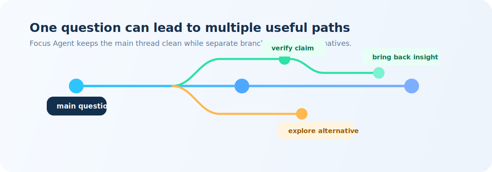
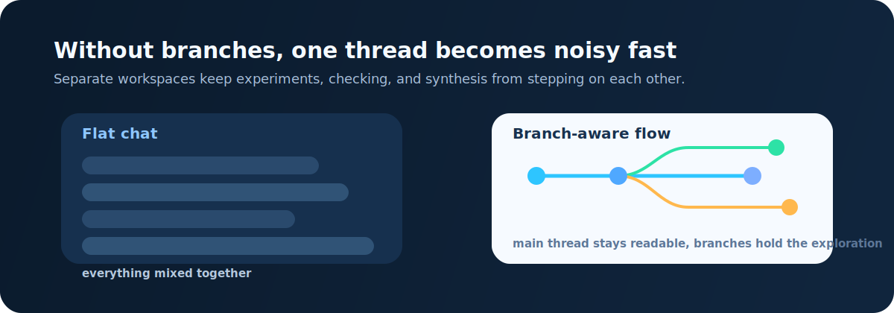
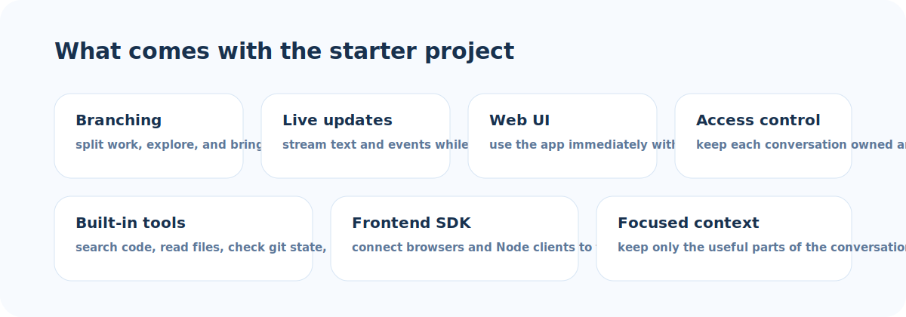
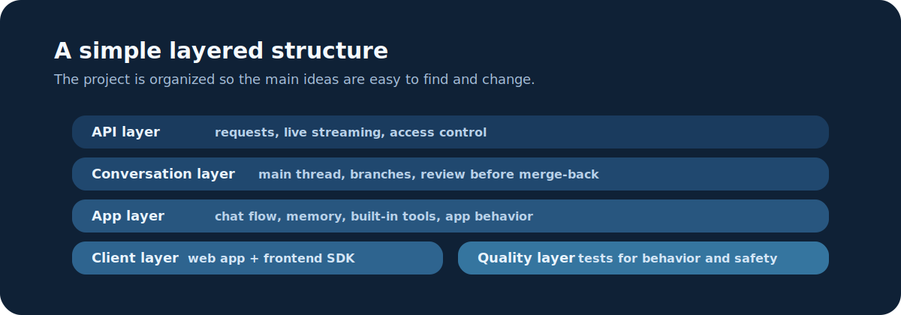

# Focus Agent


Focus Agent is a compact Python starter project for building AI apps that support branching conversations, live responses, access control, and a lightweight web UI.

It is designed for teams that need a clear starting point for longer AI workflows without adopting a heavy platform too early.

- Chinese README: [`README.zh-CN.md`](README.zh-CN.md)
- Frontend SDK: [`frontend-sdk/README.md`](frontend-sdk/README.md)
- Contribution guide: [`CONTRIBUTING.md`](CONTRIBUTING.md)
- Security policy: [`SECURITY.md`](SECURITY.md)

## Overview



Most agent demos assume one chat box and one final answer. Focus Agent is built around a different core assumption:

Long AI sessions lose focus for a simple reason: conversation is linear, but serious thinking is not. Research, debugging, writing, and review work all involve trying side paths, checking evidence, and returning only the conclusions that survive. When every detour lives in the same chat log, the thread gets noisy for both people and models.

- real research work often requires splitting one problem into multiple branches, exploring them independently, and then bringing the useful conclusions back to the main thread

That is the center of the project. Live updates, access control, the web app, and the SDK are important, but they are there to support this branching workflow rather than define the project by themselves.

## Principles

- Branch-aware by default. Exploration happens in separate branches instead of being mixed into one long conversation.
- Small enough to modify. The repository is intentionally lightweight, so teams can adapt it without fighting framework complexity.
- Clear where it matters. Access control, conversation ownership, configuration, and branch review are all easy to find in the code.
- Easy to connect to real products. The project includes a web app, live streaming, and a typed frontend SDK.
- Friendly for local development. It works with different model providers and keeps secrets in local files instead of the repository.

## Why Branching Matters



Branching is not a side feature in Focus Agent. It is the main interaction model.

In real work, a team often needs to:

- test alternative approaches without polluting the main thread
- run verification or deep-dive work separately from synthesis
- compare competing lines of reasoning before deciding what belongs in the final answer
- keep exploratory noise out of the primary conversation state

That shows up in concrete workflows such as:

- researching several competitors in parallel and merging back only the findings worth comparing
- trying alternative outlines or implementation strategies without overwriting the accepted direction
- investigating an uncertain review finding in a branch by reading code, checking logs, or running tests before reporting back

Flat chat logs handle these workflows poorly. Once every exploration is mixed into one thread, the conversation becomes noisy, harder to review, and harder to keep using.

Focus Agent treats the main thread as the place for shared progress and treats branches as temporary workspaces for exploration. That makes it a better fit for research, analysis, checking, and writing workflows where the path to a good answer is rarely linear.

This design also tends to reduce token waste as a side effect: the system can keep the active conversation focused, summarize branch work instead of replaying it in full, and bring back only the conclusions that matter.

## Mental Model

- Main thread: the clean record of shared progress, accepted decisions, and working conclusions
- Branch: a temporary workspace for exploration, verification, comparison, or experiments
- Review and merge-back: the point where useful outcomes return to the main thread as distilled conclusions instead of raw transcript replay

If Git is a familiar analogy, that mapping is intentional. The main thread plays the role of `main`, branches act like short-lived feature branches, and merge-back is controlled by review. The difference is that Focus Agent manages conversation state and context rather than source code.

## Core Capabilities



- Branchable conversations with controlled merge-back
- API endpoints for normal responses and live streaming
- A conversation engine that emits structured live events
- Built-in React web app at `/app`
- Access control with per-conversation ownership checks
- Lower-noise context management through focused working context and selective merge-back from branches
- Built-in tools for searching the repo, reading files, checking git state, and searching the web
- Typed frontend SDK for browser and Node integrations

## Quick Start

Requirements:

- Python 3.11+
- [`uv`](https://docs.astral.sh/uv/)
- Node.js 18+ if you want to build the web frontend and SDK

```bash
uv venv
source .venv/bin/activate
uv pip install -e '.[openai,dev]'
cp .env.example .env
mkdir -p .focus_agent
cp docs/local.env.example .focus_agent/local.env
cp docs/models.example.toml .focus_agent/models.toml
cp docs/tools.example.toml .focus_agent/tools.toml
pnpm install --registry=https://registry.npmjs.org
pnpm web:build
focus-agent-api
```

By default, runtime persistence and AI-generated artifacts stay under `.focus_agent/`, including `.focus_agent/artifacts/`, so local outputs do not pollute the repository. Move generated files into tracked paths like `docs/` only when you explicitly want to keep them in git.

Then open:

- `http://127.0.0.1:8000/app`
- `http://127.0.0.1:8000/healthz`

For local frontend development, run `make web-dev` in a second shell and set `WEB_APP_DEV_SERVER_URL=http://127.0.0.1:5173/app` in `.focus_agent/local.env` when you want `/app` to redirect to the Vite dev server. In that mode the frontend lives at `http://127.0.0.1:5173/app/` while FastAPI continues serving the API on port `8000`.

If you want one command that starts both sides with hot reload, use `make serve-dev` or its compatibility alias `make serve`. It runs the Vite dev server for the frontend and starts the API with reload enabled for local development. For a production-style local run, use `make serve-prod`, which builds the static frontend bundle first and then starts only the backend without reload.

Merged branches are read-only after a merge is applied. If you want to continue exploration, fork a new branch from the parent or main thread instead of sending more turns into the merged branch.

For local auth, create a demo token:

```bash
curl -X POST http://127.0.0.1:8000/v1/auth/demo-token \
  -H 'content-type: application/json' \
  -d '{"user_id": "researcher-1"}'
```

## Security Notes

Focus Agent ships with development-friendly defaults. Treat the quick start and demo token flow as local-only setup, not production guidance.

- `/v1/auth/demo-token` is intended for local development and demos only
- do not use `make serve`, `make serve-dev`, Vite HMR, or `API_RELOAD=1` as a production deployment mode
- set `AUTH_DEMO_TOKENS_ENABLED=false` before any shared, hosted, or public deployment
- replace `AUTH_JWT_SECRET` with a strong secret in any non-local environment
- review [`SECURITY.md`](SECURITY.md) and [`docs/release-checklist.md`](docs/release-checklist.md) before publishing or deploying the project

## Architecture At A Glance



- API layer: handles requests, live streaming, and access control
- Conversation layer: tracks threads, branches, and review before results return to the main thread
- App layer: powers chat, branch workflows, memory, and built-in tools
- Client layer: includes the web app and the TypeScript frontend SDK
- Quality layer: tests cover API behavior, access control, branching, streaming, config, and SDK integrity

## Development

```bash
make help
make install
make setup-local
make serve
make serve-dev
make serve-prod
make dev
make test
make lint
make check
make web-dev
make web-build
make ui-smoke
```

`make serve` is an alias for `make serve-dev`. `make serve-dev` starts the frontend Vite dev server and the backend API together with hot reload enabled. `make serve-prod` builds the static frontend bundle and starts only the backend without reload so `/app` is served from FastAPI. `make web-dev` starts only the React frontend dev server. `make web-build` produces the static frontend bundle that FastAPI serves at `/app`.

`make ui-smoke` launches a dedicated Chrome window with a temporary profile, opens the local app, creates a conversation when needed, sends one chat turn, forks a branch, enters merge review, and fails if the visible response still contains DSML or tool-call markup.

## More Docs

- Frontend SDK: [`frontend-sdk/README.md`](frontend-sdk/README.md)
- Roadmap: [`docs/current-roadmap.md`](docs/current-roadmap.md)
- Local env example: [`docs/local.env.example`](docs/local.env.example)
- Model catalog example: [`docs/models.example.toml`](docs/models.example.toml)
- Tool catalog example: [`docs/tools.example.toml`](docs/tools.example.toml)
- Release checklist: [`docs/release-checklist.md`](docs/release-checklist.md)
- License notes: [`docs/license-guide.md`](docs/license-guide.md)

## License

This project is licensed under the MIT License. See [`LICENSE`](LICENSE) for details.
