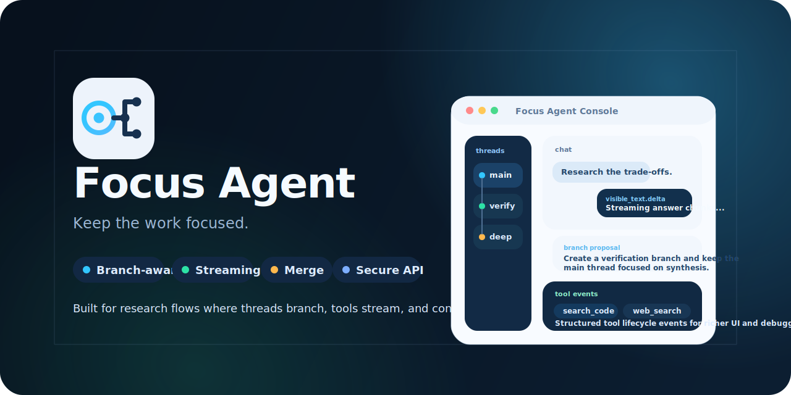

# Focus Agent

---

**English** | [中文](README.zh-CN.md)



Focus Agent is a compact Python starter project for building AI apps with branching conversations, live responses, access control, and a lightweight web UI.

It is designed for teams that want a clear foundation for longer AI workflows without adopting a heavy platform too early.

## Why Focus Agent

Most agent demos assume one chat box and one final answer. Focus Agent is built around a different idea: serious research, debugging, writing, and review work are not linear.

Instead of forcing every detour into one noisy thread, Focus Agent treats the main thread as shared progress and branches as temporary workspaces for exploration, verification, and comparison.

## Core Capabilities

- Branch-aware conversations with controlled merge-back
- Streaming chat APIs and a built-in React web app at `/app`
- Trajectory observability console at `/app/observability/trajectory`
- Access control, memory pipeline, and typed frontend SDK
- Built-in repo, git, web, artifact, and memory tools

## Quick Start

Requirements:

- Python 3.11+
- [`uv`](https://docs.astral.sh/uv/)
- Node.js 20+ if you want to build the web frontend and SDK

```bash
uv venv
source .venv/bin/activate
uv pip install -e '.[openai,dev]'
cp .env.example .env
make setup-local
pnpm install --registry=https://registry.npmjs.org
pnpm web:build
make api
```

Then open:

- `http://127.0.0.1:8000/app`
- `http://127.0.0.1:8000/app/observability/trajectory`
- `http://127.0.0.1:8000/healthz`

For the full local startup flow, managed repo-local PostgreSQL behavior, Vite dev mode, and local auth examples, see [docs/quick-start.md](docs/quick-start.md).

## Container Deployment

- Local Docker: `compose.yaml`
- Production/staging template: `compose.prod.yaml`
- Full deployment guide: [docs/docker-deployment.md](docs/docker-deployment.md)

```bash
export FOCUS_AGENT_AUTH_JWT_SECRET=replace-with-a-strong-secret
export OPENAI_API_KEY=replace-me
docker compose up --build
```

For production or staging, use `compose.prod.yaml` with an external Postgres connection in `FOCUS_AGENT_DATABASE_URI`.

## Documentation

- [Quick Start](docs/quick-start.md)
- [Development Guide](docs/development.md)
- [Architecture](docs/architecture.md)
- [Docker Deployment](docs/docker-deployment.md)
- [Roadmap](docs/roadmap.md)
- [Tool and Skill System Design](docs/tool-skill-design.md)
- [Frontend SDK](frontend-sdk/README.md)
- [Contributing](CONTRIBUTING.md)
- [Security Policy](SECURITY.md)
- [Release Checklist](docs/release-checklist.md)
- [Docs Index](docs/README.md)

## License

This project is licensed under the MIT License. See [`LICENSE`](LICENSE) for details.
