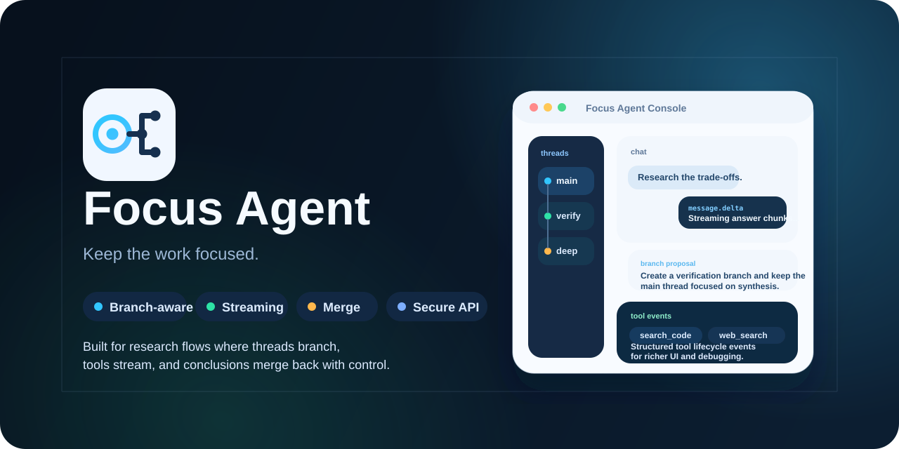

# Focus Agent

---

**English** | [中文](README.zh-CN.md)



Focus Agent is a web-first Agent application scaffold that has grown into a small platform for branching conversations, live responses, access control, admin operations, observability, memory, Agent Team workflows, and a typed frontend SDK.

It is designed for teams that want a local-first, understandable foundation for longer AI workflows while keeping the main platform boundaries explicit. It is no longer just a minimal demo: backend runtime, Web app, SDK, persistence adapters, release/eval tooling, and Agent Team collaboration are maintained as separate areas.

## Why Focus Agent

Most agent demos assume one chat box and one final answer. Focus Agent is built around a different idea: serious research, debugging, writing, and review work are not linear.

Instead of forcing every detour into one noisy thread, Focus Agent treats the main thread as shared progress and branches as temporary workspaces for exploration, verification, and comparison.

## Core Capabilities

- Branch-aware conversations with controlled merge-back
- AI-assisted branch decisions and pre-turn branch recommendations that produce user-confirmed Branch Action cards
- Streaming chat APIs and a built-in React web app at `/app`
- Current context-window usage in the composer, with non-destructive manual and automatic compaction
- Agent Team Mission Runner for goal-driven multi-agent planning, task evidence, and final-answer synthesis
- Owner-scoped Productivity workbench (notes + tasks) with source trace (`/app/productivity/notes`, `/app/productivity/tasks`)
- Split observability flow: `/app/observability/overview` for trends and hotspots, `/app/observability/trajectory` for single-turn review
- Access control, Admin Console, memory pipeline, and typed frontend SDK
- Quarantined tool/protocol streams so `message.delta` only carries confirmed visible assistant text
- Built-in repo read/edit, git, web, artifact, memory, and productivity tools with guarded workspace command execution

## Quick Start

Requirements:

- Python 3.11+
- [`uv`](https://docs.astral.sh/uv/)
- Node.js 20+ if you want to build the web frontend and SDK

```bash
uv venv
source .venv/bin/activate
uv pip install -e '.[openai,dev]'
make setup-local
pnpm install --registry=https://registry.npmjs.org
pnpm web:build
make api
```

`make setup-local` creates `.focus_agent/local.env`, `.focus_agent/models.toml`, and `.focus_agent/tools.toml`.
The root `.env.example` is a reference for Compose or manual shell exports; the local API startup path reads `.focus_agent/local.env` and process environment variables.

Model/provider metadata is loaded from the packaged default catalog and can be
overridden locally through `.focus_agent/models.toml`; keep provider secrets in
`.focus_agent/local.env`. See [docs/quick-start.md](docs/quick-start.md) for the
custom OpenAI-compatible model path.

Memory embedding is enabled by default when PostgreSQL memory is available. Local auto mode prefers Ollama `embeddinggemma`; install it explicitly with `ollama pull embeddinggemma`, or configure an OpenAI-compatible embedding endpoint.

Then open:

- `http://127.0.0.1:8000/app`
- `http://127.0.0.1:8000/app/agent-team`
- `http://127.0.0.1:8000/app/agent/memory`
- `http://127.0.0.1:8000/app/admin/users`
- `http://127.0.0.1:8000/app/admin/audit-events`
- `http://127.0.0.1:8000/app/productivity/notes`
- `http://127.0.0.1:8000/app/productivity/tasks`
- `http://127.0.0.1:8000/app/observability/overview`
- `http://127.0.0.1:8000/app/observability/trajectory`
- `http://127.0.0.1:8000/healthz`
- `http://127.0.0.1:8000/readyz`
- `http://127.0.0.1:8000/metrics`

For the full local startup flow, managed repo-local PostgreSQL behavior, Vite dev mode, and local auth examples, see [docs/quick-start.md](docs/quick-start.md). The built-in auth page supports username/password, Demo login, and Bearer Token login; account switching is logout followed by another login method.

## Container Deployment

- Local Docker: `compose.yaml`
- Production/staging template: `compose.prod.yaml`
- Full deployment guide: [docs/docker-deployment.md](docs/docker-deployment.md)

```bash
export FOCUS_AGENT_AUTH_JWT_SECRET=replace-with-a-strong-secret-at-least-32-chars
export OPENAI_API_KEY=replace-me
docker compose up --build
```

For production or staging, use `compose.prod.yaml` with an external Postgres connection in `FOCUS_AGENT_DATABASE_URI`.

## Documentation

- [Docs Index](docs/README.md)
- [Quick Start](docs/quick-start.md)
- [Development Guide](docs/development.md)
- [Architecture and module map](docs/architecture.md)
- [Auth / Access](docs/auth-access.md)
- [Agent Team Workbench](docs/agent-team-workbench.md)
- [Productivity System](docs/productivity-system.md)
- [Admin Console](docs/admin-console.md)
- [Branch Decisions](docs/branch-decisions.md)
- [Streaming Contract](docs/streaming-contract.md)
- [Release Checklist](docs/release-checklist.md)
- [Frontend SDK](frontend-sdk/README.md)
- [Current Context Window](docs/context-window.md)
- [Docker Deployment](docs/docker-deployment.md)
- [Contributing](CONTRIBUTING.md)
- [Security Policy](SECURITY.md)

## License

This project is licensed under the MIT License. See [`LICENSE`](LICENSE) for details.
