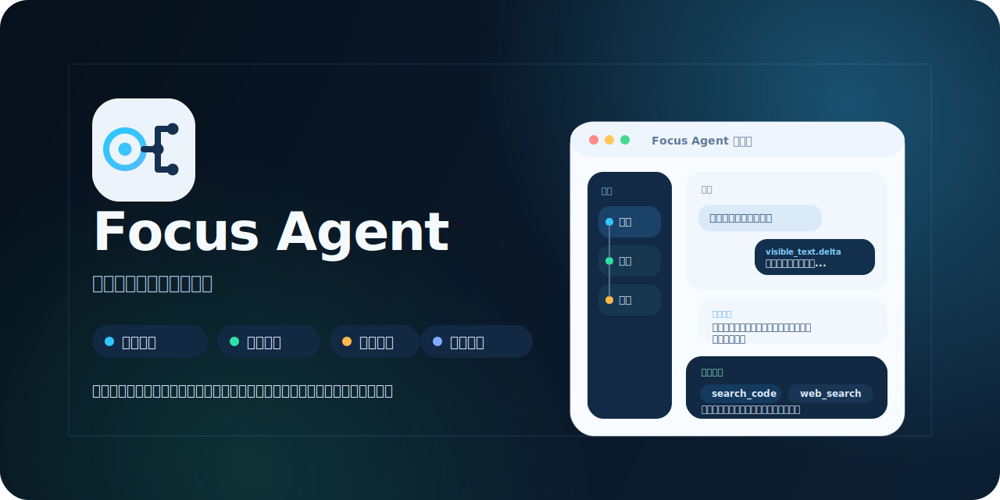

# Focus Agent

---

[English](README.md) | **中文**



Focus Agent 是一个精简的 Python 起步项目，用来构建支持分支式会话、实时输出、访问控制和轻量 Web UI 的 AI 应用。

它面向的是这样一类团队：需要一个清晰、可演进的 AI 系统起点，但又不想过早引入庞大、难改、难理解的平台。

## 为什么是 Focus Agent

很多 Agent Demo 默认只有“一问一答”。而 Focus Agent 的核心假设不同：真实的研究、调试、写作和审查过程并不是线性的。

与其把所有探索过程都塞进一条越来越嘈杂的主线程里，Focus Agent 把主线程当作共享进展，把分支当作临时工作区，用来做探索、验证和对比。

## 核心能力

- 支持分支式会话与受控 merge 回主线
- 提供流式聊天 API 和内置 React Web 界面 `/app`
- 内置 observability overview 与 trajectory 观测控制台 `/app/observability/overview`、`/app/observability/trajectory`
- 带有访问控制、记忆链路和类型完备的前端 SDK
- 提供仓库、git、网页、artifact 和 memory 工具

## 快速开始

环境要求：

- Python 3.11+
- [`uv`](https://docs.astral.sh/uv/)
- 如果要构建 Web 前端和 SDK，需要 Node.js 20+

```bash
uv venv
source .venv/bin/activate
uv pip install -e '.[openai,dev]'
cp .env.example .env
make setup-local
pnpm install --registry=https://registry.npmjs.org
pnpm web:build
make api
```

启动后可访问：

- `http://127.0.0.1:8000/app`
- `http://127.0.0.1:8000/app/observability/overview`
- `http://127.0.0.1:8000/app/observability/trajectory`
- `http://127.0.0.1:8000/healthz`
- `http://127.0.0.1:8000/readyz`
- `http://127.0.0.1:8000/metrics`

更完整的本地启动方式、repo-local PostgreSQL 自动托管、Vite 开发模式和本地鉴权说明见 [docs/quick-start.zh-CN.md](docs/quick-start.zh-CN.md)。

## 容器化部署

- 本地 Docker：`compose.yaml`
- 生产/预发模板：`compose.prod.yaml`
- 完整部署说明：[docs/docker-deployment.md](docs/docker-deployment.md)

```bash
export FOCUS_AGENT_AUTH_JWT_SECRET=replace-with-a-strong-secret
export OPENAI_API_KEY=replace-me
docker compose up --build
```

生产或预发部署请使用 `compose.prod.yaml`，并通过 `FOCUS_AGENT_DATABASE_URI` 指向外部 Postgres。

## 文档导航

- [快速开始](docs/quick-start.zh-CN.md)
- [开发指南](docs/development.zh-CN.md)
- [记忆系统设计](docs/memory-system.md)
- [Observability Runbook](docs/observability-runbook.md)
- [架构说明](docs/architecture.md)
- [Docker 部署说明](docs/docker-deployment.md)
- [路线图](docs/roadmap.md)
- [Tool / Skill 系统设计](docs/tool-skill-design.md)
- [前端 SDK](frontend-sdk/README.md)
- [贡献指南](CONTRIBUTING.md)
- [安全策略](SECURITY.md)
- [发布检查清单](docs/release-checklist.md)
- [文档索引](docs/README.md)

## License

本项目采用 MIT License。详情见根目录 [`LICENSE`](LICENSE)。
