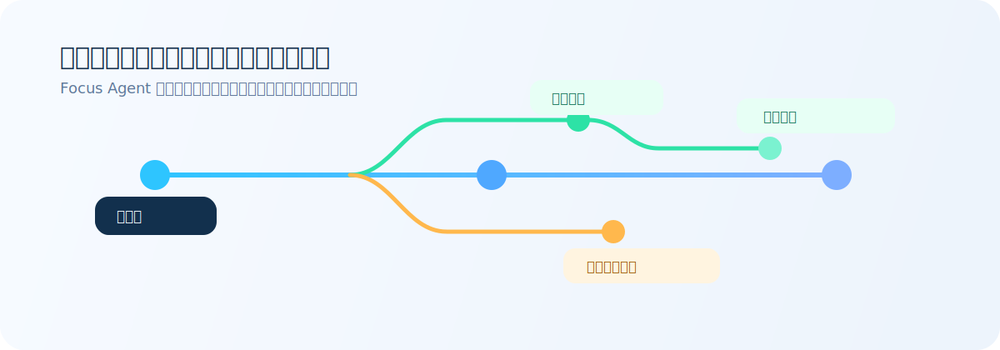
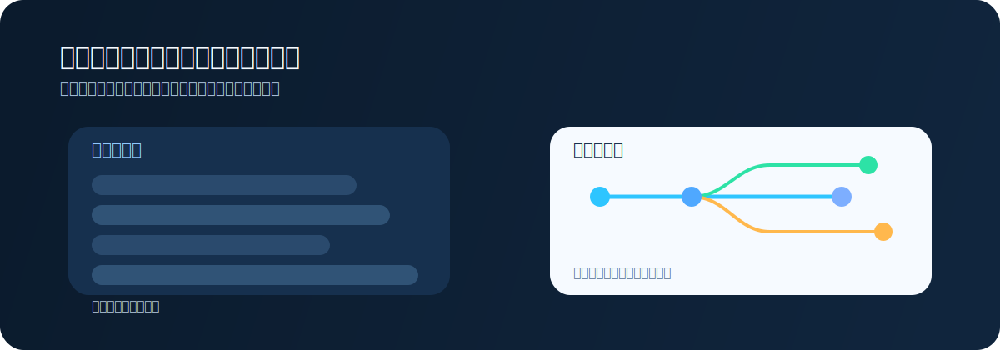
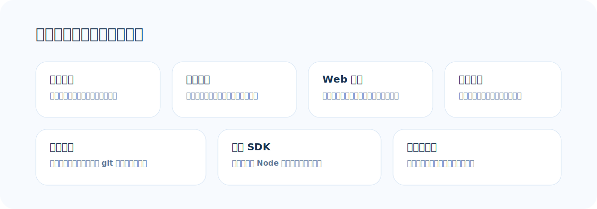
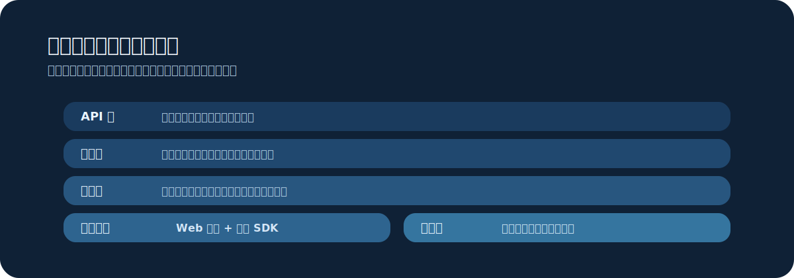

# Focus Agent


Focus Agent 是一个精简的 Python 起步项目，用来构建支持分支式会话、实时输出、访问控制和轻量 Web UI 的 AI 应用。

它面向的是这样一类团队：需要一个清晰、可演进的 AI 系统起点，但又不想过早引入庞大、难改、难理解的平台。

- English README: [`README.md`](README.md)
- 前端 SDK: [`frontend-sdk/README.md`](frontend-sdk/README.md)
- 贡献指南: [`CONTRIBUTING.md`](CONTRIBUTING.md)
- 安全策略: [`SECURITY.md`](SECURITY.md)

## 项目概览



很多 Agent Demo 默认只有“一问一答”。而 Focus Agent 的核心假设不同：

长对话之所以容易失焦，原因其实很直接：对话记录是线性的，但真实的研究、调试、写作和审查过程不是。人会不断试不同路径，模型也会不断接收上下文；如果探索、试错和已确认结论全部堆在同一条时间线上，这条对话对人和模型都会越来越嘈杂。

- 真实的研究工作，经常需要把一个问题拆成多个分支分别探索，再把真正有价值的结论带回主线

这才是项目的中心。实时输出、访问控制、Web UI 和前端 SDK 都很重要，但它们本质上是在服务这个“分支式研究工作流”，而不是项目本身的第一定义。

## 设计原则

- 默认支持分支工作流。探索过程放在单独分支里，而不是全部堆成一条长对话。
- 体量克制，便于修改。这个仓库保持轻量，适合作为团队二次开发的基础。
- 关键位置足够清晰。访问控制、会话归属、配置和分支审核都能直接在代码中找到。
- 便于接入真实产品。仓库内提供 Web UI、实时流式输出和类型完备的前端 SDK。
- 对本地开发友好。支持不同模型提供方，也支持把敏感信息放在本地文件里，而不是提交进仓库。

## 为什么分支能力最重要



在 Focus Agent 里，分支不是附加功能，而是核心交互模型。

真实工作里，团队经常需要：

- 在不污染主线的前提下测试不同思路
- 把验证、深挖和综合整理拆开处理
- 对比多条推理路径，再决定哪些内容值得进入最终回答
- 把探索过程中的噪声隔离在临时工作区，而不是全部堆进主对话

这会体现在很多很具体的工作场景里，比如：

- 做竞品分析时，把多个竞品分别放进独立分支研究，最后只把可对比的结论合并回主线
- 写长文或做方案设计时，先在分支里尝试不同大纲或实现路径，不覆盖已经确认的方向
- 做代码审查时，把不确定的问题放进分支里查日志、读源码、跑测试，确认后再回到主线汇报

平铺式聊天记录并不擅长处理这种流程。只要所有探索都混进一条线程里，对话就会迅速变得嘈杂、难以回顾，也更难继续使用。

Focus Agent 把主线程视为共享进展的主线，把分支视为临时探索工作区。这让它更适合研究、分析、核查、写作整理这类“答案不是一步得到”的任务。

这种设计也常常会顺带减少 token 浪费：系统可以只保留当前真正需要的对话内容，把分支过程先整理成摘要，再把真正重要的结论带回主线，而不是把整段探索历史全部重复塞回去。

## 心智模型

- 主线程：保存共享进展、已确认决策和当前认可的结论
- 分支：承载探索、验证、对比和实验的临时工作区
- Review 与 merge：只把有价值的结果整理后带回主线，而不是把原始分支对话整段回放

如果你熟悉 Git，这个类比是有意为之的。主线程有点像 `main`，分支像短生命周期的 feature branch，merge 回主线前有 review。区别在于 Focus Agent 管理的不是源代码，而是对话状态和上下文。

## 核心能力



- 支持分支式会话与受控 merge 回主线
- 提供普通返回和实时流式返回两类接口
- 对话引擎会输出结构化的实时事件
- 内置基于 React 的 `/app` Web 界面
- 内置 `/app/observability/trajectory` trajectory 观测控制台
- 带有访问控制和按会话归属进行的权限检查
- 通过聚焦当前工作内容和选择性回灌分支结果，减少不必要的信息噪声
- 提供搜索仓库、读取文件、查看 git 状态和网页搜索等内置工具
- 附带浏览器和 Node 可用的 TypeScript SDK

## 快速开始

环境要求：

- Python 3.11+
- [`uv`](https://docs.astral.sh/uv/)
- 如果要构建 Web 前端和 SDK，需要 Node.js 20+
- 如果希望本地启动脚本自动托管 repo 内 PostgreSQL，需要本机可用的 PostgreSQL CLI/服务端工具（`initdb`、`pg_ctl`、`createdb`、`psql`）；否则请自行设置 `DATABASE_URI`

```bash
uv venv
source .venv/bin/activate
uv pip install -e '.[openai,dev]'
cp .env.example .env
make setup-local
pnpm install --registry=https://registry.npmjs.org
pnpm web:build
make api
```

默认情况下，运行时持久化和 AI 生成产物都会放在 `.focus_agent/` 下，包括 `.focus_agent/artifacts/`，这样本地输出不会污染仓库。只有当你明确希望纳入 git 管理时，再把生成文件迁到 `docs/` 之类的受版本控制目录。

启动后可访问：

- `http://127.0.0.1:8000/app`
- `http://127.0.0.1:8000/app/observability/trajectory`
- `http://127.0.0.1:8000/healthz`

如果你是在本地联调前端，建议在另一个 shell 里运行 `make web-dev`，并在 `.focus_agent/local.env` 中设置 `WEB_APP_DEV_SERVER_URL=http://127.0.0.1:5173/app`。这样访问 `/app` 时会自动跳转到 Vite 开发服务器；此时前端地址是 `http://127.0.0.1:5173/app/`，FastAPI 仍继续在 `8000` 端口提供 API。

如果你希望一条命令同时拉起前后端并开启热加载，可以使用 `make serve-dev`，或者继续使用兼容别名 `make serve`。它会启动前端 Vite dev server，并以 reload 模式启动后端 API，适合本地开发调试。如果你想在本地按接近生产的方式运行，可以使用 `make serve-prod`：它会先构建静态前端产物，再以非 reload 模式只启动后端，由 FastAPI 直接托管 `/app`。

如果启动前没有设置 `DATABASE_URI`，本地启动命令（`make api`、`make dev`、`make serve`、`make serve-dev`、`make serve-prod`）现在会自动管理一个 repo 内本地 PostgreSQL，并把生成的 `DATABASE_URI` 自动注入到 API 进程里。这个托管数据库会随着服务一起停止并清理临时运行态，但会保留 Postgres 数据目录，方便下次本地启动继续复用。如果你在启动前已经显式设置了 `DATABASE_URI`，启动命令会保留该值，不再覆盖，也不会再做托管本地 Postgres 的注入。

如果你更希望直接运行 `.venv/bin/focus-agent-api`，请先自行准备并导出 `DATABASE_URI`。裸跑二进制不会帮你启动这套托管本地 PostgreSQL。

启动脚本还会把托管数据库的运行态写入 `.focus_agent/postgres/runtime.env`，里面包含当前实际使用的 `DATABASE_URI`、host、port、user 和 database 名称。如果你另开一个 shell 做调试，建议先 `source` 这个文件，确保手工命令连到的是和正在运行的应用同一套 Postgres。

```bash
source .focus_agent/postgres/runtime.env
psql "$DATABASE_URI"
```

## 容器化部署

仓库里提供了一套推荐版 Docker 部署分层：

- `compose.yaml`：本地 Docker 联调，启动 `focus-agent + postgres`
- `compose.prod.yaml`：生产/预发模板，只启动 `focus-agent` 并连接外部 PostgreSQL
- [`docs/docker-deployment.md`](docs/docker-deployment.md)：部署说明、环境变量和迁移流程

镜像会在构建阶段产出 React 前端静态资源，运行阶段由 FastAPI 托管 `/app`，并把运行时状态统一放到 `/data`。完整环境变量和迁移说明放在上面的 Docker 文档里。
生产或预发部署请使用 `compose.prod.yaml`，并通过 `FOCUS_AGENT_DATABASE_URI` 指向外部 Postgres。

```bash
export FOCUS_AGENT_AUTH_JWT_SECRET=replace-with-a-strong-secret
export OPENAI_API_KEY=replace-me
docker compose up --build
```

启动后可访问：

- `http://127.0.0.1:8000/app`
- `http://127.0.0.1:8000/app/observability/trajectory`
- `http://127.0.0.1:8000/healthz`

常用 Compose 包装命令是 `make docker-rebuild`、`make docker-restart` 和 `make docker-logs`。

分支一旦完成 merge，就会进入只读状态。后续如果还想继续探索，请从父分支或主线程重新 fork 新分支，而不是继续往已合并分支里发送新一轮对话。

本地鉴权可先创建 demo token：

```bash
curl -X POST http://127.0.0.1:8000/v1/auth/demo-token \
  -H 'content-type: application/json' \
  -d '{"user_id": "researcher-1"}'
```

## 安全说明

Focus Agent 当前默认偏向本地开发体验。快速开始和 demo token 流程应视为“仅限本地开发”的示例，而不是生产环境部署建议。

- `/v1/auth/demo-token` 只适用于本地开发和演示
- 不要把 `make serve`、`make serve-dev`、Vite HMR 或 `API_RELOAD=1` 当作线上部署方式
- 任何共享、托管或公开部署前，都应设置 `FOCUS_AGENT_AUTH_DEMO_TOKENS_ENABLED=false`（或 `AUTH_DEMO_TOKENS_ENABLED=false`）
- 任何非本地环境，都应把 `AUTH_JWT_SECRET` 替换成高强度密钥
- 在公开仓库或部署服务前，请先检查 [`SECURITY.md`](SECURITY.md) 和 [`docs/release-checklist.md`](docs/release-checklist.md)

## 架构一览



- API 层：处理请求、实时输出和访问控制
- 会话层：管理主线程、分支，以及结果回到主线前的审核
- 应用层：负责聊天、分支流程、记忆处理和内置工具
- 客户端层：包括内置 Web 界面和 TypeScript 前端 SDK
- 质量层：测试覆盖 API、访问控制、分支、流式输出、配置和 SDK
- 观测层：Postgres trajectory 记录、CLI/API 查询、replay/promote 流程和 Web review console

## 开发

```bash
make help
make install
make setup-local
make serve
make serve-dev
make serve-prod
make dev
make test
make lint
make check
make ci-test
make ci
make web-dev
make web-build
make docker-rebuild
make docker-restart
make ui-smoke
```

`make serve` 是 `make serve-dev` 的兼容别名。`make serve-dev` 会同时启动前端 Vite dev server 和带热重载的后端 API。`make serve-prod` 会先构建静态前端，再以非 reload 模式只启动后端，由 FastAPI 直接托管 `/app`。`make api` 和 `make dev` 走的是同一条后端启动链路，只是不额外启动前端开发服务器。`make web-dev` 用来单独启动 React Web App 的开发服务器，`make web-build` 用来生成由 FastAPI 在 `/app` 下托管的静态前端产物。当 `DATABASE_URI` 未设置时，这条本地启动链路会自动托管一个 repo 内本地 PostgreSQL、注入生成的 `DATABASE_URI`，并在服务停止时一并关闭数据库，同时保留数据目录供下次复用；如果 `DATABASE_URI` 已显式设置，则会原样保留，不做覆盖。

`make ci-test` 会把 `FOCUS_AGENT_LOCAL_ENV_FILE` 指向一个不存在的文件再运行 pytest，这样更接近 GitHub Actions，避免本机 `.focus_agent/local.env` 里的密钥或模型配置掩盖测试环境缺口。`make ci` 会依次运行 Ruff、`make ci-test`、前端 SDK 类型检查和 SDK 构建。

`make ui-smoke` 会启动一个带临时 profile 的独立 Chrome 窗口，打开本地应用，必要时创建会话，发送一轮聊天，再 fork 一个分支并进入合并评审；如果最终可见回复仍然包含 DSML 或工具调用标记，就会直接失败。

启用 Postgres trajectory 记录后，可以用 `focus-agent-trajectory` 做 CLI 检查，也可以在内置 Web App 打开 `/app/observability/trajectory`，筛选 turn、查看工具步骤，并预览 replay / promote 动作。

## 更多文档

- 文档索引: [`docs/README.md`](docs/README.md)
- 架构与部署: [`docs/architecture.md`](docs/architecture.md)
- Docker 部署说明: [`docs/docker-deployment.md`](docs/docker-deployment.md)
- 路线图: [`docs/roadmap.md`](docs/roadmap.md)
- 前端 SDK: [`frontend-sdk/README.md`](frontend-sdk/README.md)
- Tool / Skill 系统设计: [`docs/tool-skill-design.md`](docs/tool-skill-design.md)
- 本地环境变量示例: [`docs/local.env.example`](docs/local.env.example)
- 模型目录示例: [`docs/models.example.toml`](docs/models.example.toml)
- 工具目录示例: [`docs/tools.example.toml`](docs/tools.example.toml)
- 发布检查清单: [`docs/release-checklist.md`](docs/release-checklist.md)

## License

本项目采用 MIT License。详情见根目录 [`LICENSE`](LICENSE)。
