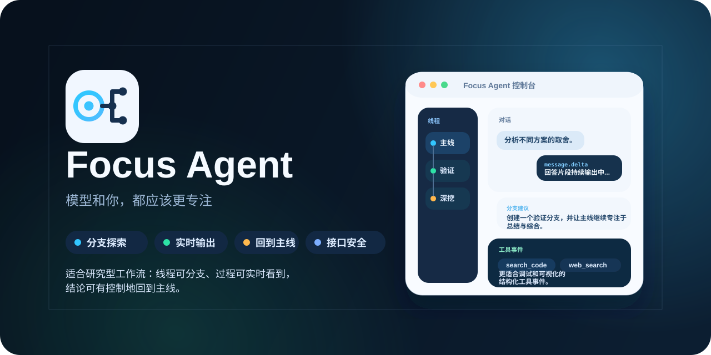

# Focus Agent

---

[English](README.md) | **中文**

[](https://github.com/William-zgx/focus-agent/actions/workflows/ci.yml)
[](LICENSE)




Focus Agent 是一个 **自托管、branch-aware 的 Agent 工作台与平台参考实现**，面向长任务 AI 工作流。它的核心思想很简单：主线程保持专注，探索过程进入临时分支，结论成熟后再受控合并回主线。

围绕这条分支工作流，仓库提供完整产品面：流式聊天 API、React Web App、类型化 frontend SDK、访问控制、管理员运维、可观测性、记忆与检索、Productivity 工具、Agent Team 协作、沙箱执行、发布/eval 证据链，以及可选的 Android 壳。

> 定位、体量、适用边界与运行主路径详见：
> **[docs/project-overview.md](docs/project-overview.md)**

## 项目状态

Focus Agent 是开源 **平台参考实现 / 自托管工作台**，不是托管式 SaaS 产品。它适合本地开发、产品原型验证，以及改造成团队自有的 branch-aware AI 工作台。

请按 **中型 monorepo** 理解本仓库（后端 + typed SDK + React App + 可选 Android target + 较宽 OpenAPI 面），而不是“周末 chat 模板”。当前体量数字与产品分层集中维护在 [project-overview.md](docs/project-overview.md)，避免多处漂移。分支工作流、后端 API、SSE stream contract、frontend SDK 和已记录的 Web 功能面会通过 contract、build 和 smoke checks 保护。模型 provider、鉴权策略、PostgreSQL 托管方式、observability backend 和发布流程等部署选择，仍然由采用方显式配置。

### 已加固并验证的基线

- **本地持久化：** 维护中的 `make api` / `make dev` / `make serve*` 入口在未设置 `DATABASE_URI` 时仍会托管 repo-local PostgreSQL。直接启动 API 且不设置 `DATABASE_URI` 时，则使用本地 SQLite 持久化 app-state、LangGraph checkpoint 和 store；签名 pickle 仅作为兼容路径，owner 或 HMAC 校验失败会 fail closed。详见[快速开始](docs/quick-start.zh-CN.md)和[架构说明](docs/architecture.md)。
- **安全边界：** Cookie 鉴权的写请求会校验浏览器同源元数据；非开发客户端缺少这些元数据时才要求 CSRF double-submit。被禁用用户会在受保护请求中立即失效并撤销 refresh session；governance trajectory 默认按 owner 隔离；`web_fetch` 通过 DNS 校验和固定 IP transport 抵御 DNS rebinding SSRF。详见[安全策略](SECURITY.md)和 [Auth / Access](docs/auth-access.md)。
- **生产证据：** schema v2 evidence pack 将报告绑定到 commit、deployment ID、deployment version、environment 和带时区的生成时间；production 模式会校验身份与新鲜度，不接受无关或过期报告。详见[发布检查清单](docs/release-checklist.md)和 [CI Release Gate](docs/ci/github-actions-release-gate.md)。
- **可执行 UI 与移动端门禁：** 独立 workflow 在真实 Chrome 中验证聊天和 observability 交互；CI 同时构建、lint 并单测 Android debug 项目。Android 还具备有界可取消的原生 HTTP、cold/hot deep link 单次投递、原生安全存储和关闭 Capacitor bridge logging。详见[验证手册](docs/validation-runbook.md)和 [Android](docs/android.md)。
- **流式韧性：** 已结束的内存 stream 会在 replay 窗口后回收；SDK reconnect 会跨连接按 event ID 去重，若 EOF 前没有 terminal event 则抛出 `FocusAgentIncompleteStreamError`。详见[流式事件契约](docs/streaming-contract.md)和[前端 SDK](frontend-sdk/README.md)。
- **架构债务量化：** architecture gate 阻断超过 800 行的非生成文件，当前不 grandfather 任何大文件债务；兼容债务按稳定 item ID 跟踪，当前基线为 **169** 个有意保留的 1.x 项，其中 public facade 要到满足 2.0 移除条件后才会删除。详见 [architecture baseline](docs/architecture-debt-baseline.json) 和 [compatibility baseline](docs/compat-debt-baseline.json)。
- **App Postgres schema：** 应用 schema 版本为 **v19**（含 Agent Team v2 表及更早的 productivity / branch-decision / embedding-status 迁移）。详见[架构说明 §14](docs/architecture.md)。

### 适用与不适用

| 更适合 | 通常不适合 |
|--------|------------|
| 要自托管 AI 工作台，并在意审计、回放、发布证据 | 只要最小 LangGraph + 单页 chat 的周末项目 |
| 认同 branch/merge 工作流并愿意投入改造 | 期望“装上即企业 Agent 员工” |
| 能维护鉴权、Postgres、stream contract 的平台团队 | 无人专职 dig monorepo 的小团队 |
| 需要 typed SDK + 可观测闭环的准生产路径 | 需要开箱即用的企业 IdP / 多区域高可用 |

诚实边界：**当前平台完备度高于 Agent 结果质量证据。** eval、真实失败 golden、成本/延迟画像、多 Agent 质量门槛仍是开放工作。见 [路线图](docs/roadmap.md)。

## 为什么是 Focus Agent

很多 Agent Demo 默认只有“一问一答”。而 Focus Agent 的核心假设不同：真实的研究、调试、写作和审查过程并不是线性的。

与其把所有探索过程都塞进一条越来越嘈杂的主线程里，Focus Agent 把主线程当作共享进展，把分支当作临时工作区，用来做探索、验证和对比。分支推荐 **不会静默 fork**，只会生成待用户确认的 Branch Action 卡片。

## 核心能力

- 支持分支式会话与受控 merge 回主线
- 支持 AI 辅助的分支决策与发送前分支推荐，并通过用户确认的 Branch Action 卡片执行
- 提供流式聊天 API（默认 harness 路径：`/v2/threads/.../runs[/stream]`）和内置 React Web 界面 `/app`
- 在发送栏展示当前上下文窗口占用，并支持非破坏式手动/自动压缩
- 提供 Agent Team Mission Runner，把目标拆成动态多 Agent 任务、回传证据并汇总最终答案（v2 执行受 feature flag 控制，见 [Agent Team v2 灰度](docs/agent-team-v2-rollout.md)）
- 提供基于 owner 的生产力工作台（笔记 + 任务），并保留来源追踪（`/app/productivity/notes`、`/app/productivity/tasks`）
- 内置分层 observability 流程：`/app/observability/overview` 负责趋势与热点发现，`/app/observability/trajectory` 负责单条样本复盘
- 带有访问控制、管理员控制台、按能力收拢的设置中心、Zvec 检索/RAG、记忆链路、治理反馈趋势和类型完备的前端 SDK
- 对工具/协议流做隔离，确保 `message.delta` 只承载确认可见的 assistant 正文
- 提供仓库读写、git、网页、artifact、memory、productivity 和 Skill catalog 工具，并对 workspace 命令执行做保护
- 为 workspace 命令和声明式 Skill entrypoint 提供线程级沙箱执行基座，默认 Docker 优先，并在本地降级时显式返回 fallback 元数据
- 管理员可在设置中心维护模型连接、工具 provider、Skill 启停、Agent 行为、安全/运行时策略和低频高级选项

## 仓库结构

| 路径 | 用途 |
|------|------|
| `src/focus_agent/` | Python 后端：API、`AppRuntime`、harness、LangGraph engine、service、持久化、工具、memory、retrieval、observability |
| `apps/web/` | 挂载在 `/app` 下的 React Web App（含 Android local-runtime 模块） |
| `frontend-sdk/` | 覆盖 API、SSE 和 stream reducer 集成的类型化 TypeScript SDK |
| `android/` | Capacitor Android 壳 |
| `docs/` | 架构、启动、部署、功能、契约和运维文档 |
| `migrations/` | 面向 PostgreSQL 部署的 Alembic 迁移 |
| `scripts/` | 本地启动、验证、发布、截图和维护脚本 |
| `tests/` | Python、contract、integration、eval 和前端回归测试 |
| `compose.yaml`, `compose.prod.yaml` | 本地和生产取向的 Docker Compose 入口 |

## 快速开始

环境要求：

- Python 3.11+
- [`uv`](https://docs.astral.sh/uv/)
- 如果要构建 Web 前端和 SDK，需要 Node.js 20+
- Corepack 与 pnpm 9.15.9（`corepack enable && corepack prepare pnpm@9.15.9 --activate`）
- 如果要构建 Android App，需要 Node.js 22+、JDK 21，以及 Android Studio / Android SDK

```bash
uv venv
source .venv/bin/activate
uv pip install -e '.[openai,dev]'
make setup-local
pnpm install --registry=https://registry.npmjs.org
pnpm web:build
make api
```

完成同样的初始化后，若需要 API + Vite 热更新的全栈本地开发，使用 `make serve-dev`。细节见 [docs/quick-start.zh-CN.md](docs/quick-start.zh-CN.md)。

`make setup-local` 会创建 `.focus_agent/local.env`、`.focus_agent/models.toml` 和 `.focus_agent/tools.toml`。
根目录 `.env.example` 主要供 Compose 或手动 shell export 参考；本地 API 启动路径读取 `.focus_agent/local.env` 和进程环境变量。

`make api` 及其他维护中的本地 `make` 入口，会在没有显式 export
`DATABASE_URI` 时托管 repo-local PostgreSQL。直接运行 API binary 不会启动
该 helper；此时若仍无 `DATABASE_URI`，会改用持久化的本地 SQLite app-state、
checkpoint 和 store。精确的启动与迁移边界见
[docs/quick-start.zh-CN.md](docs/quick-start.zh-CN.md)。

模型和 provider 元数据会先读取包内默认 catalog，也可以通过
`.focus_agent/models.toml` 做本地覆盖；provider 密钥请放在
`.focus_agent/local.env`。新增自定义 OpenAI-compatible 模型的路径见
[docs/quick-start.zh-CN.md](docs/quick-start.zh-CN.md)。

Skill runtime 也走 local-first 路径。包内 bundled skills 提供基础 catalog，
可选本地 skill 放在 `.focus_agent/skills`，管理员设置页可以启停整个 Skill
系统或单个 Skill，而不需要修改 tracked source。

代码执行通过线程级沙箱服务进入统一入口。需要 Docker 隔离的 workspace
命令和 Skill entrypoint，请先运行 `make sandbox-image` 准备执行镜像；本地
开发可以降级到 `local_subprocess` 或 `local_venv`，结果会明确标记
fallback。详情见 [docs/sandbox-execution.md](docs/sandbox-execution.md)。

Zvec 是默认的可重建检索索引，覆盖 memory search、artifact RAG、Skill matching、trajectory reuse、branch/team shadow signal 和 workspace semantic search。PostgreSQL 与文件系统仍是 canonical store。详见 [docs/retrieval-zvec.md](docs/retrieval-zvec.md)。

PostgreSQL memory 可用时默认启用 Memory Embedding。本地 auto 模式优先 Ollama `embeddinggemma`，请显式执行 `ollama pull embeddinggemma`，或配置 OpenAI-compatible embedding endpoint。

启动后可访问：

- `http://127.0.0.1:8000/app`
- `http://127.0.0.1:8000/app/agent-team`
- `http://127.0.0.1:8000/app/agent/governance`
- `http://127.0.0.1:8000/app/admin/config`
- `http://127.0.0.1:8000/app/observability/overview`
- `http://127.0.0.1:8000/readyz` 与 `http://127.0.0.1:8000/metrics`

更完整的本地启动方式、repo-local PostgreSQL 自动托管、Vite 开发模式和本地鉴权说明见 [docs/quick-start.zh-CN.md](docs/quick-start.zh-CN.md)。内置登录页支持用户名密码、Demo 登录和 Bearer Token 登录；账号切换就是先退出再选择另一种登录方式。

## Android App

Android target 使用 Capacitor 打包 React App，并通过 SDK **local transport** 使用设备内单用户 runtime（`apps/web/src/android-local-runtime/`）。Provider key 保存在原生安全存储中；原生 HTTP 有界且可取消，deep link 会经过 allowlist 并对 cold/hot intent 各投递一次，bridge logging 默认关闭。Web target 仍通过 `/v1` 和 `/v2` **连接服务端**。能力边界、限制、CI 检查和设备/模拟器验证详见 [Android App](docs/android.md)。

```bash
pnpm android:web:build
pnpm android:sync
pnpm android:apk:debug
```

需要在 Android Studio 中检查原生项目时运行 `pnpm android:open`；需要同步并安装到已连接设备或模拟器时运行 `pnpm android:run`。

## 容器化部署

- 本地 Docker：`compose.yaml`
- 生产/预发模板：`compose.prod.yaml`
- 完整部署说明：[docs/docker-deployment.md](docs/docker-deployment.md)

```bash
export FOCUS_AGENT_AUTH_JWT_SECRET=replace-with-a-strong-secret-at-least-32-chars
export OPENAI_API_KEY=replace-me
docker compose up --build
```

生产或预发部署请使用 `compose.prod.yaml`，并通过 `FOCUS_AGENT_DATABASE_URI` 指向外部 Postgres。

## 开发与验证

使用 `make help` 查看当前维护的本地命令。覆盖面最广的本地检查是：

```bash
make ci
```

GitHub CI 还会检查 OpenAPI schema 与 generated SDK types 是否漂移。如果改动了后端路由或 Pydantic response model，请运行并提交生成物：

```bash
make sdk-openapi-types-check
```

按改动范围收敛的验证路径见 [docs/development.zh-CN.md](docs/development.zh-CN.md)。常用的局部检查包括：

```bash
make lint-strict
make contract-check
make architecture-gate
make compat-gate
pnpm sdk:check
pnpm web:check
pnpm web:build
make frontend-qa
```

如果改动影响用户可见行为、stream 事件、鉴权、存储或 SDK 类型，请在同一个 PR 中补齐相关测试和文档。

GitHub Actions 还包含真实 Chrome workflow，用于验证聊天、branch/review 和
observability 交互；Android job 会运行 debug build、lint 和 unit tests。
本地等价命令及模拟器/真机检查见
[docs/validation-runbook.md](docs/validation-runbook.md)。涉及 runtime、沙箱、
Skill、Agent Team、observability 或 release-readiness 的大范围改动时，请以该
runbook 作为完整证据路径（源码检查、OpenAPI/SDK 漂移、真实浏览器 smoke、
`/readyz`）。

## 贡献与支持

欢迎提交能让 runtime 更清楚、更可验证、更容易适配的贡献。优先做尊重平台边界与既有契约的聚焦改动。开发环境、PR 预期和 issue 提交流程见 [CONTRIBUTING.md](CONTRIBUTING.md)。

Bug、功能请求和文档改进请优先使用 GitHub issue templates。安全漏洞或敏感问题请按 [SECURITY.md](SECURITY.md) 处理，不要先创建公开 issue。

## 文档导航

- [项目定位与现状](docs/project-overview.md)
- [文档索引](docs/README.md)
- [快速开始](docs/quick-start.zh-CN.md)
- [开发指南](docs/development.zh-CN.md)
- [验证手册](docs/validation-runbook.md)
- [架构说明与模块导航](docs/architecture.md)
- [路线图](docs/roadmap.md)
- [流式事件契约](docs/streaming-contract.md)
- [Auth / Access](docs/auth-access.md)
- [Agent Team 工作台](docs/agent-team-workbench.md)
- [Agent Team v2 灰度](docs/agent-team-v2-rollout.md)
- [Android App](docs/android.md)
- [发布检查清单](docs/release-checklist.md)
- [前端 SDK](frontend-sdk/README.md)
- [贡献指南](CONTRIBUTING.md)
- [安全策略](SECURITY.md)

## License

本项目使用 MIT License。详见 [`LICENSE`](LICENSE)。
