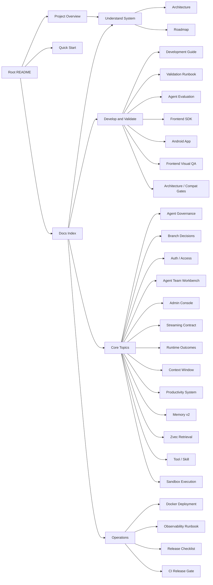

# Focus Agent Docs Index / 文档索引

更新时间：2026-07-14

This is the canonical navigation entry for `docs/`. Root README files stay lightweight
and point here for depth. **Product positioning, scale, fit/non-fit, and runtime spines**
live in [project-overview.md](project-overview.md).

这份索引是 `docs/` 的唯一导航入口。根目录 README 保持轻量，并跳转到这里获取深度说明。
**产品定位、体量、适用边界与运行主路径** 见 [project-overview.md](project-overview.md)。

## Start Here / 从这里开始

| Goal | Doc |
|------|-----|
| 5 分钟理解“这是什么 / 适不适合我” | [project-overview.md](project-overview.md) |
| 本地跑起来 | [quick-start.md](quick-start.md) / [quick-start.zh-CN.md](quick-start.zh-CN.md) |
| 改代码与验证矩阵 | [development.md](development.md) / [development.zh-CN.md](development.zh-CN.md) |
| 模块边界与请求链路 | [architecture.md](architecture.md) |
| 已验证基线 vs 剩余风险 | [roadmap.md](roadmap.md) |
| 全面验收口径 | [validation-runbook.md](validation-runbook.md) |

## Quick Use / 快速使用

- [../README.md](../README.md) / [../README.zh-CN.md](../README.zh-CN.md)：项目介绍、最短启动路径和核心入口。
- [project-overview.md](project-overview.md)：定位、体量快照、产品面分层、运行主路径、fit/non-fit。
- [quick-start.md](quick-start.md) / [quick-start.zh-CN.md](quick-start.zh-CN.md)：本地初始化、`make` 托管 repo-local PostgreSQL、直接 API 启动时的 SQLite app-state/checkpoint/store、SQLite/legacy pickle 迁移、Vite 开发模式和本地鉴权。
- [development.md](development.md) / [development.zh-CN.md](development.zh-CN.md)：日常开发命令、验证矩阵、真实 Chrome smoke、Android CI 和常见工作流。
- [validation-runbook.md](validation-runbook.md)：跨运行时、沙箱、Skill、SDK、真实 Chrome、Android 模拟器/设备、Agent Team、Observability 和 release-health 的全面验证口径。
- [agent-evaluation.md](agent-evaluation.md)：Agent / model eval 分层、case taxonomy、judges、reports、CI 策略和多 Agent 执行 ownership。
- [android.md](android.md)：Capacitor Android 包、App 内本地 runtime、secure storage、有界可取消 HTTP、cold/hot deep link 单次投递、CI 和模拟器/设备 smoke。

## Understand The System / 理解系统

- [architecture.md](architecture.md)：整体架构、核心请求链路、平台维护边界、AppRuntime/harness/graph、本地 SQLite 与 PostgreSQL（schema **v19**）持久化边界、前端/SDK、部署和验证总览。
- [roadmap.md](roadmap.md)：已验证基线、仍需真实环境落地的风险和下一阶段优先级；不重复专题实施细节。
- [architecture/agent-capability-map.md](architecture/agent-capability-map.md)：planning / execution / critic / memory / retrieval / skill 能力成熟度一览。

## Develop And Validate / 开发验证

- [../frontend-sdk/README.md](../frontend-sdk/README.md)：TypeScript SDK 包结构、客户端 API、stream reducer、transport validation 和 SDK 验证方式。
- [frontend-visual-system.md](frontend-visual-system.md)：Web App token、primitive、CSS module ownership、style governance、bundle budget、截图/a11y 验证口径。
- [architecture-debt-baseline.json](architecture-debt-baseline.json)：architecture gate 的 800 行阈值；当前没有 grandfathered large-file debt。
- [compat-debt-baseline.json](compat-debt-baseline.json)：按稳定 item ID 管理的兼容库存与 2.0 exit criteria；当前总量为 **169**，1.x public facade 仍保留。

## Core Topics / 核心专题

- [agent-role-routing.md](agent-role-routing.md)：Agent Governance、role routing、tool routing、delegation、context、feedback trend、task ledger、critic gate 和 eval gate。
- [branch-decisions.md](branch-decisions.md)：BranchDecisionEvent、发送前分支推荐、用户确认的 Branch Action、配置、API/SDK surface 和验证口径。
- [productivity-system.md](productivity-system.md)：生产力工作台（笔记 + 任务）的 API、持久化、来源追踪、路由接入和验证口径。
- [auth-access.md](auth-access.md)：登录、注册、Bearer/Demo token、refresh session、disabled-user 即时失效、Cookie mutation CSRF、账号自助页面、ownership 和生产鉴权边界。
- [agent-team-workbench.md](agent-team-workbench.md)：Agent Team Mission Runner 的目标驱动规划、DAG 执行、最终答案、API、持久化边界和多 Agent 开发验收口径。
- [agent-team-v2-rollout.md](agent-team-v2-rollout.md)：Agent Team v2 feature flag、readiness、灰度与回滚；**UI 可见 ≠ v2 runtime ready**。
- [admin-console.md](admin-console.md)：设置中心、能力管理、Skill 启停、管理员用户目录、详情抽屉、状态/角色/会话/密码操作、审计事件、权限边界和验证口径。
- [streaming-contract.md](streaming-contract.md)：SSE 事件模型、`message.delta` 可见文本边界、工具协议隔离、结束 run 的延迟 cleanup、跨 reconnect event-ID 去重、无 terminal EOF 的 `FocusAgentIncompleteStreamError`、SDK reducer 和处理过程卡契约。
- [runtime-outcomes.md](runtime-outcomes.md)：ToolOutcome / TaskOutcome 状态机、retry/recovery/degraded answer 策略、Stream/API/SDK/Observability 合同和验证矩阵。
- [context-window.md](context-window.md)：当前上下文窗口用量、发送栏 Context Meter、手动/自动压缩、API/SDK 和 `token_usage` 边界。
- [memory-system-v2.md](memory-system-v2.md)：PostgreSQL canonical memory、Zvec-first 检索接入、namespace、写入、审计、forget/tombstone 防复活、branch promotion 和 local SQLite / legacy pickle migration 背景。
- [retrieval-zvec.md](retrieval-zvec.md)：Zvec 检索索引、collections、memory/artifact/skill/trajectory/branch/team/workspace 接入、CLI、fallback 和部署边界。
- [tool-skill-design.md](tool-skill-design.md)：Tool / Skill / Connector / Storage 的边界、Skill 管理配置、live-web evidence contract、`web_fetch` DNS/IP pinning SSRF 边界、productivity tools、运行时策略和扩展检查项。
- [sandbox-execution.md](sandbox-execution.md)：`run_workspace_command`、`run_skill_entrypoint`、`SandboxExecutionService`、Docker image、local fallback、线程级 workspace 生命周期和验证矩阵。
- [skill-execution-matrix.md](skill-execution-matrix.md)：本地 Skill 的执行分类、entrypoint 覆盖、host-control broker 边界和 smoke 验收矩阵。
- [android.md](android.md)：Capacitor Android shell、SDK local transport、Android local runtime 模块图、移动端能力边界和 smoke 验证。

## Operations And Release / 运维发布

- [docker-deployment.md](docker-deployment.md)：本地 Docker 联调、生产/预发模板、外部 PostgreSQL 和迁移边界。
- [observability-runbook.md](observability-runbook.md)：overview、trajectory workbench、request/trace pivot、replay 和 promote 操作手册。
- [release-checklist.md](release-checklist.md)：发布前人工检查清单、production evidence schema v2、身份/新鲜度阻断口径和证据包要求。
- [ci/github-actions-release-gate.md](ci/github-actions-release-gate.md)：GitHub Actions、Buildkite 和通用 CI 的 release gate provider 绑定、`RELEASE_*` identity attestation、approval metadata、artifact retention 和 evidence upload 说明。
- [operations/secret-rotation.md](operations/secret-rotation.md)：密钥轮换操作说明。
- [rollback-manual.md](rollback-manual.md)：回滚手册入口。

## Configuration Examples / 配置示例

- [local.env.example](local.env.example)：本地环境变量示例，包含 secret、runtime、Agent policy 和 Skill 管理开关。
- [models.example.toml](models.example.toml)：模型目录示例。
- [tools.example.toml](tools.example.toml)：工具目录示例。
- [../.env.example](../.env.example)：Compose / 手动 export 参考（本地 API 优先读 `.focus_agent/local.env`）。

## Historical / Stage Docs / 阶段性文档

以下文档保留作历史实施记录，**不是**日常导航入口；新改动请更新对应 canonical 专题，而不是继续堆并行清单。

- [multi_agent_refactor/](multi_agent_refactor/)：多 Agent 重构期 tickets、DAG 模板、risk levels、validation 记录
- [agent-team-v2-rollout.md](agent-team-v2-rollout.md)：v2 灰度手册（仍在维护的操作文档；与 workbench 互补）

## Maintenance Principles / 维护原则

- 同一主题只保留一个 canonical 文档，其他文档只做摘要和跳转。
- 根目录 README 只做轻入口和当前定位说明，不承载长篇操作说明；深度定位见 `project-overview.md`。
- `docs/README.md` 是 `docs/` 的唯一导航入口；新增文档应先确认归属分组和 canonical 位置。
- 本地持久化说明必须区分两条路径：维护中的 `make` 启动命令会管理 repo-local PostgreSQL；直接 API 启动且无 `DATABASE_URI` 时使用持久 SQLite app-state/checkpoint/store。
- App Postgres schema 以代码 `SCHEMA_VERSION` 为准（当前 **v19**）；文档中的 schema 说明必须与 `src/focus_agent/repositories/postgres_schema.py` 同步。
- 1.x public import surfaces、保留路由和历史状态读取器仍受 item-ID baseline
  管理；除非对应 2.0 exit criteria 已满足，文档不得宣称它们已全部删除。
- 后端路由、Pydantic response model 或 SDK 类型变化时，必须同步 `docs/api/openapi.json`、`frontend-sdk/src/types/__generated__.ts` 和必要的 `tests/contracts/*.json` snapshot；本地运行 `make sdk-openapi-types-check` 与 `make contract-check`。
- 非生成源码超过 800 行会触发 architecture gate；兼容库存新增、删除或 identity 漂移必须通过 `make compat-gate` 显式更新和审查，不允许只放宽总量。
- `architecture.md` 讲整体结构和跨模块路径；专题细节分别放到 Agent Governance、Branch Decisions、Auth / Access、Agent Team、Admin Console、Streaming Contract、Runtime Outcomes、Context Window、Memory、Zvec Retrieval、Tool / Skill、Sandbox Execution、Android、Docker、Observability 和 SDK 文档。
- `development.md` / `development.zh-CN.md` 讲本地开发与验证命令；release provider 细节放到 `ci/github-actions-release-gate.md`。
- `release-checklist.md` 讲人工发布检查项；CI provider 绑定细节只在 `ci/github-actions-release-gate.md` 维护。
- 阶段性方案、执行记录和草稿不要长期堆在 `docs/` 根目录；应放到 issue、PR、项目管理工具，或明确标注为 historical 子目录。
- 兼容债务数量以 `compat-debt-baseline.json` 的 `max_total` / `item_ids` 为准（当前 **169**）；README 与专题文档不得漂移。
