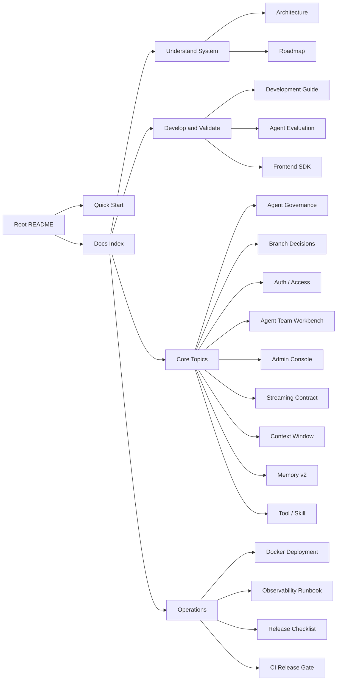

# Focus Agent Docs Index / 文档索引

更新时间：2026-05-16

This is the canonical navigation entry for `docs/`. Root README files stay lightweight and describe the current platform-scale positioning; deeper guides live here and are grouped by use case.

这份索引是 `docs/` 的唯一导航入口。根目录 README 保持轻量，并描述当前平台化应用骨架的定位；更完整的说明集中到这里，并按使用场景分组。

## Quick Use / 快速使用

- [../README.md](../README.md) / [../README.zh-CN.md](../README.zh-CN.md)：项目介绍、最短启动路径和核心入口。
- [quick-start.md](quick-start.md) / [quick-start.zh-CN.md](quick-start.zh-CN.md)：本地初始化、repo-local PostgreSQL、Vite 开发模式和本地鉴权。
- [development.md](development.md) / [development.zh-CN.md](development.zh-CN.md)：日常开发命令、验证矩阵、真实浏览器 smoke 和常见工作流。
- [agent-evaluation.md](agent-evaluation.md)：Agent / model eval 分层、case taxonomy、judges、reports、CI 策略和多 Agent 执行 ownership。

## Understand The System / 理解系统

- [architecture.md](architecture.md)：整体架构、核心请求链路、平台维护边界、拆分后的服务/工具/图边界、持久化边界、前端/SDK、部署和验证总览。
- [roadmap.md](roadmap.md)：当前基线、下一阶段重点和仍在推进的方向。

## Develop And Validate / 开发验证

- [../frontend-sdk/README.md](../frontend-sdk/README.md)：TypeScript SDK 包结构、客户端 API、stream reducer、transport validation 和 SDK 验证方式。
- [frontend-visual-system.md](frontend-visual-system.md)：Web App token、primitive、CSS module ownership、视觉基线和截图/a11y 验证口径。

## Core Topics / 核心专题

- [agent-role-routing.md](agent-role-routing.md)：Agent Governance、role routing、tool routing、delegation、context、task ledger、critic gate 和 eval gate。
- [branch-decisions.md](branch-decisions.md)：BranchDecisionEvent、发送前分支推荐、用户确认的 Branch Action、配置、API/SDK surface 和验证口径。
- [auth-access.md](auth-access.md)：登录、注册、Bearer/Demo token、refresh session、账号自助页面、ownership 和生产鉴权边界。
- [agent-team-workbench.md](agent-team-workbench.md)：Agent Team Mission Runner 的目标驱动规划、DAG 执行、最终答案、API、持久化边界和多 Agent 开发验收口径。
- [admin-console.md](admin-console.md)：管理员用户目录、详情抽屉、状态/角色/会话/密码操作、审计事件、权限边界和验证口径。
- [streaming-contract.md](streaming-contract.md)：SSE 事件模型、`message.delta` 可见文本边界、工具协议隔离、SDK reducer 和处理过程卡契约。
- [context-window.md](context-window.md)：当前上下文窗口用量、发送栏 Context Meter、手动/自动压缩、API/SDK 和 `token_usage` 边界。
- [memory-system-v2.md](memory-system-v2.md)：PostgreSQL canonical memory、pgvector embedding、namespace、检索、写入、审计、forget、branch promotion 和 legacy fallback / migration 背景。
- [tool-skill-design.md](tool-skill-design.md)：Tool / Skill / Connector / Storage 的边界、运行时策略和扩展检查项。

## Operations And Release / 运维发布

- [docker-deployment.md](docker-deployment.md)：本地 Docker 联调、生产/预发模板、外部 PostgreSQL 和迁移边界。
- [observability-runbook.md](observability-runbook.md)：overview、trajectory workbench、request/trace pivot、replay 和 promote 操作手册。
- [release-checklist.md](release-checklist.md)：发布前人工检查清单、阻断口径和证据包要求。
- [ci/github-actions-release-gate.md](ci/github-actions-release-gate.md)：GitHub Actions、Buildkite 和通用 CI 的 release gate provider 绑定、approval metadata、artifact retention 和 evidence upload 说明。

## Configuration Examples / 配置示例

- [local.env.example](local.env.example)：本地环境变量示例。
- [models.example.toml](models.example.toml)：模型目录示例。
- [tools.example.toml](tools.example.toml)：工具目录示例。

## Maintenance Principles / 维护原则

- 同一主题只保留一个 canonical 文档，其他文档只做摘要和跳转。
- 根目录 README 只做轻入口和当前定位说明，不承载长篇操作说明。
- `docs/README.md` 是 `docs/` 的唯一导航入口；新增文档应先确认归属分组和 canonical 位置。
- `architecture.md` 讲整体结构和跨模块路径；专题细节分别放到 Agent Governance、Branch Decisions、Auth / Access、Agent Team、Admin Console、Streaming Contract、Context Window、Memory、Tool / Skill、Docker、Observability 和 SDK 文档。
- `development.md` / `development.zh-CN.md` 讲本地开发与验证命令；release provider 细节放到 `ci/github-actions-release-gate.md`。
- `release-checklist.md` 讲人工发布检查项；CI provider 绑定细节只在 `ci/github-actions-release-gate.md` 维护。
- 阶段性方案、执行记录和草稿不要长期堆在 `docs/`，应放到 issue、PR 或项目管理工具。
