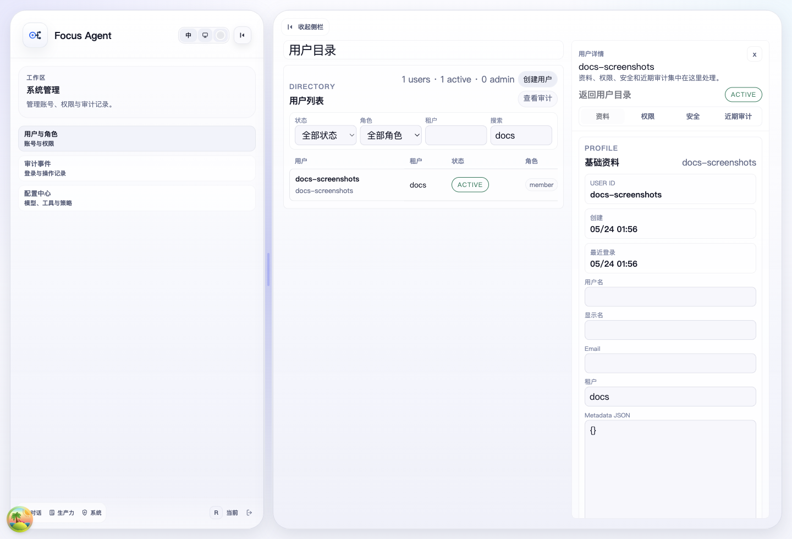

# Admin Console 操作与实现手册

更新时间：2026-06-06

Admin Console 是 Focus Agent 当前的管理员访问治理入口，用于管理运行时设置、能力开关、持久化用户、管理员角色、账号状态、会话、密码重置和审计事件。普通登录、注册、账号自助页面和 token/session 语义见 [auth-access.md](auth-access.md)。它和普通 `/app` 聊天工作区共享同一套认证与 SDK，但权限判断以数据库中的用户状态和角色为准。

## 1. 入口

Web 页面：

- `/app/admin/config`：设置中心，按总览、连接、能力、Agent 行为、安全与运行、高级配置组织模型 provider/model、MCP 扩展入口、工具、Skill 和策略。
- `/app/admin/users`：用户目录、筛选、创建用户和详情抽屉。
- `/app/admin/users/{userId}`：直接打开指定用户详情抽屉。
- `/app/admin/audit-events`：管理员审计事件列表、筛选和详情抽屉。

真实产品截图（由 `scripts/capture_docs_screenshots.py` 捕获）：



API：

```text
GET   /v1/admin/config
PATCH /v1/admin/config/models
PATCH /v1/admin/config/tools
PATCH /v1/admin/config/policies
PATCH /v1/admin/config/skills
POST  /v1/admin/config/skills/refresh
GET   /v1/admin/users
POST  /v1/admin/users
GET   /v1/admin/users/{user_id}
PATCH /v1/admin/users/{user_id}
POST  /v1/admin/users/{user_id}/status
PUT   /v1/admin/users/{user_id}/roles
GET   /v1/admin/users/{user_id}/sessions
POST  /v1/admin/users/{user_id}/sessions/revoke
POST  /v1/admin/users/{user_id}/password
GET   /v1/admin/audit-events
```

Frontend SDK 对应 `frontend-sdk/src/client/admin.ts` 和 `frontend-sdk/src/types/admin.ts`，公共 client 方法包括 `getAdminConfig()`、`updateAdminModelConfig()`、`updateAdminToolConfig()`、`updateAdminPolicyConfig()`、`updateAdminSkillConfig()`、`refreshAdminSkillConfig()`、`listUsers()`、`createUser()`、`getUser()`、`updateUser()`、`updateUserStatus()`、`updateUserRoles()`、`listUserSessions()`、`revokeUserSession()`、`resetUserPassword()` 和 `listAuditEvents()`。

## 2. 权限边界

Admin Console 不把 bearer token 里的 scope 当作管理员身份来源。管理员权限来自持久化用户记录中的角色和权限；被禁用用户不能通过 `/v1/auth/me` 继续进入应用。

本地开发有两条 bootstrap 便利路径：

- `AUTH_DEMO_TOKENS_ENABLED=true` 时可以用 Demo 登录创建本地 demo 用户。
- local/development 数据库中第一个非匿名用户可以 bootstrap 为 admin，也可以通过 `AUTH_BOOTSTRAP_ADMIN_USER_IDS` 显式指定本地管理员。

生产或预发数据库不应依赖隐式 demo admin。生产部署需要关闭 demo token，并用明确的管理员配置或迁移流程授予 admin 角色。`AUTH_ENABLED=false` 下的 anonymous principal 仍不是 admin。

高风险变更有两条保护线：

- 变更状态、角色、会话和密码需要 reason，用于审计。
- 系统阻止禁用最后一个 active admin，或把最后一个 active admin 的 admin 角色移除。

## 3. 用户管理流程

用户目录支持按 status、role、tenant 和 query 搜索筛选，并把筛选状态同步到 URL。创建用户会打开抽屉并选中新用户；创建动作只建立用户记录，验证用户名密码登录前需要先为该用户 reset password。

用户详情抽屉分为：

- Profile：基础资料和租户信息。
- Access：角色、状态和权限摘要；角色/状态变更必须填写 reason。
- Security：会话列表、会话撤销和密码重置；撤销和重置同样需要 reason。
- Audit：该用户相关的管理员操作记录。

账号切换没有单独 switcher。Web App 的切换路径是先从左侧栏退出，再用用户名密码、Demo 登录或 Bearer Token 面板重新登录。

## 4. 设置中心

`/app/admin/config` 是运行时配置的管理员入口。页面不再按底层文件拆成一组平铺表单，而是按管理员意图组织：

- 总览：快速查看默认模型、模型连接、工具能力、Skill、Agent 策略和运行安全状态。
- 连接：维护模型 Provider、默认模型、helper model、API key env/base URL 等连接项；MCP Server 目前作为扩展连接预留入口展示，不伪造后端尚未提供的数据。
- 能力：集中维护 Skill 管理和工具配置。Skill 管理支持全局启停、单个 Skill 启停、搜索 catalog，并展示触发词、推荐工具、来源、路径和信任/安装状态；工具配置继续维护 tool provider、工具级描述、启用状态和 settings。
- Agent 行为：维护路由、委派、记忆、上下文、多 Agent、Task Ledger、Critic Gate 等 runtime policy 值。
- 安全与运行：维护敏感、安全、访问和运行时相关策略。
- 高级：保留配置来源、低频策略和工程向信息，避免污染主要流程。

Skill 配置写入 `.focus_agent/local.env`，主要环境变量包括：

- `FOCUS_AGENT_SKILLS_ENABLED`
- `FOCUS_AGENT_SKILLS_DIRS`
- `SKILL_INSTALL_DIRECTORY`
- `SKILL_DISABLED_IDS`
- `SKILL_SEMANTIC_MATCH_ENABLED`
- `SKILL_SEMANTIC_MATCH_THRESHOLD`

Skill catalog 即使在全局关闭时仍可展示；关闭全局 Skill 或禁用单个 Skill 后，该 Skill 不会被自动选择、前缀触发或注入上下文。刷新动作会重建运行时 Skill registry，并返回当前可见 catalog 数量。

本地 Android runtime 会复用同一套配置页面，但模型 API key 保存到 App 本机安全存储，不发送到 Focus Agent HTTP 后端。Web/backend 模式下仍应把 provider secrets 放在 `.focus_agent/local.env`、环境变量或部署 secret manager 中。

## 5. 审计事件

`/app/admin/audit-events` 面向管理员治理复盘。列表支持按 actor、resource type、resource id 和 decision 过滤，并通过 URL query 保留当前筛选与选中事件。详情抽屉展示 actor、resource、decision、reason、request id 和 metadata。

审计事件用于解释管理员操作和拒绝原因，不等同于完整 SIEM。安全运营或合规导出仍应结合应用日志、Postgres 备份策略和部署侧审计能力。

## 6. 实现导航

```text
src/focus_agent/api/routers/admin_users.py
src/focus_agent/api/routers/admin_config.py
src/focus_agent/api/contract_models/admin_config.py
src/focus_agent/services/admin_config.py
src/focus_agent/skills/registry.py
src/focus_agent/services/users.py
src/focus_agent/repositories/user_repository.py
apps/web/src/pages/admin/
apps/web/src/features/admin-users/
apps/web/src/features/admin-config/
apps/web/src/shared/styles/modules/admin.css
frontend-sdk/src/client/admin.ts
frontend-sdk/src/types/admin.ts
tests/test_admin_users_api.py
tests/test_admin_config_api.py
tests/test_skill_registry.py
tests/test_web_app_scaffold.py
```

Admin Web shell 使用 `AdminAccessGate` 做页面级保护。普通聊天 shell 不展示管理员入口；管理员页面有自己的 route tabs 和 page bar，避免把治理操作混进聊天工作流。

## 7. 推荐验证

影响 Admin API、认证、用户模型或权限边界时：

```bash
uv run pytest tests/test_admin_users_api.py tests/test_auth.py tests/test_auth_accounts_api.py tests/test_user_service.py tests/test_auth_ownership.py
make contract-check
```

影响设置中心、Skill 管理、Admin Web、路由、SDK 类型或页面保护时：

```bash
uv run pytest tests/test_admin_config_api.py tests/test_skill_registry.py tests/test_config_local_doc.py
uv run pytest tests/test_web_app_scaffold.py
make web-check
make web-build
make sdk-check
make frontend-android-runtime-smoke
```

真实浏览器检查应覆盖：

- 打开 `/app/admin/config`，确认总览、连接、能力、Agent 行为、安全与运行、高级分区可读。
- 在能力区搜索 Skill，确认全局 Skill 开关、单个 Skill 开关和工具配置可见。
- 在连接区确认模型 Provider 可编辑，MCP Server 只作为预留入口展示。
- 修改 Skill 或策略前填写变更原因，确认保存动作需要权限且错误提示清楚。
- 未登录访问 `/app/admin/users`，确认跳转到 `/app/auth/login?return_to=...`。
- 用 `Demo 登录` 返回受保护目标页。
- 在 `/app/admin/users` 创建用户，打开详情抽屉。
- 填写 reason 后更新角色或状态。
- 在 Security 中 reset password 或 revoke session。
- 在 `/app/admin/audit-events` 按 resource 或 decision 过滤，并打开事件详情。
- 从侧栏退出，再用另一种登录方式进入，确认账号上下文已切换。

## 8. 常见风险

- 不要用 token scope 替代持久化 admin 角色。
- 不要在生产环境打开 demo token。
- 不要把 admin-created user 当作已经能用密码登录的账号；需要先 reset password。
- 不要绕过 reason 字段执行角色、状态、会话或密码变更。
- 不要把 `AUTH_ENABLED=false` 的 anonymous principal 当作管理员。
- 不要把 Web/backend provider secret 写入 tracked config；Android local runtime 的 App 内 key 存储只适用于移动端本地 transport。
- 不要把 MCP Server 管理能力写成已完整落地；当前设置中心只保留扩展连接入口，后端合同接入后再开放真实启停、测试和 secret mask。
- 不要只在前端隐藏 Skill；禁用 Skill 必须同步到后端 registry，使自动选择、前缀触发和 prompt 注入都跳过禁用项。
