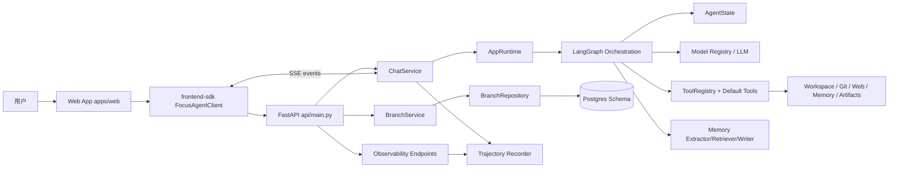
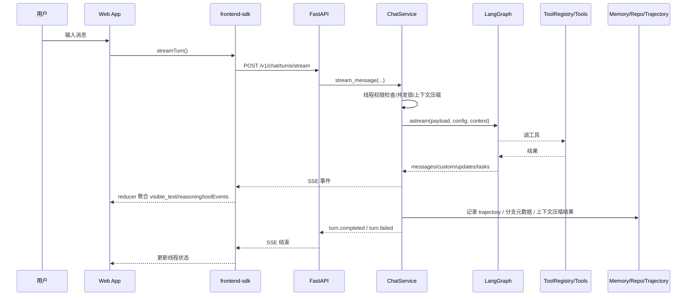
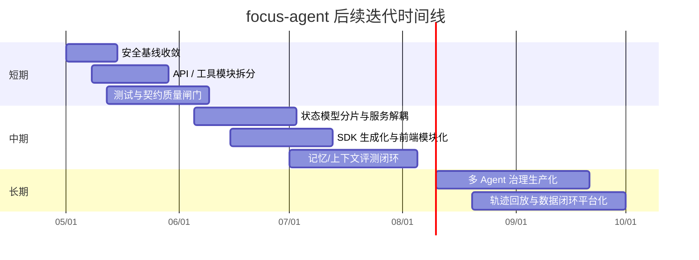

# focus-agent 项目源码深度研究报告

## 执行摘要

已启用连接器清单只有 **GitHub**。本次研究先通过 `api_tool` 枚举已启用连接器并确认 GitHub 可用，再仅对用户指定仓库 **`William-zgx/focus-agent`** 执行仓库定位、代码搜索、文件抓取与文档读取；未使用其他仓库。研究重点覆盖了仓库根目录下的后端入口、核心状态与编排、分支与合并、记忆系统、工具系统、可观测性、前端路由与前端 SDK，以及测试文件分布。

从当前源码看，`focus-agent` 已经不是单纯的“聊天应用”，而是一个以 **FastAPI + LangGraph 编排内核 + Branch/Merge 工作流 + Memory 子系统 + Tool Registry + Trajectory Observability + React Web App + TypeScript SDK** 组成的、面向“可分支长对话研究”的应用平台。后端主入口在 `src/focus_agent/api/main.py`，运行参数集中在 `src/focus_agent/config.py`，状态核心在 `src/focus_agent/core/state.py`，分支/合并核心在 `src/focus_agent/services/branches.py`，聊天与 SSE 处理在 `src/focus_agent/services/chat.py`，前端应用位于 `apps/web`，前端 SDK 位于 `frontend-sdk`。fileciteturn39file0L1-L1 fileciteturn21file0L1-L1 fileciteturn22file0L1-L1 fileciteturn24file0L1-L1 fileciteturn23file0L1-L1 fileciteturn42file0L1-L1 fileciteturn46file0L1-L1

这个项目的优点非常明确：它把“分支探索、合并审查、长期记忆、流式输出、工具调用、轨迹回放、前端可视化”放进了同一套产品逻辑里，而且很多高级能力已经通过 feature flag 预埋好了，这使它具备继续演进成研究型 Agent 平台的潜力。`Settings` 内已经内置了模型目录、工具目录、Plan-Act-Reflect、Role Routing、Tool Router、Delegation、Model Router、Context Engineering、Task Ledger、Critic Gate、Trajectory 等开关，这种“平台化预建设”是架构上的强项。fileciteturn21file0L1-L1 fileciteturn27file0L1-L1

但问题也同样突出，而且已经开始影响后续演进效率。综合源码实况，我认为当前版本的主要结构性问题不是“功能不足”，而是 **功能增长速度大于模块隔离速度**：`api/main.py` 过大、`default_tools.py` 过大、`AgentState` 过宽、`BranchService` 职责过多、配置项过于集中、手写前端 SDK 容易和后端漂移；同时还有几个生产级高风险点，例如默认 JWT secret、默认开启 demo token、默认关闭 rate limiting。换句话说，这个项目当前最需要的不是再加功能，而是 **先做安全基线收敛、再做模块分治、最后做评测闭环**。fileciteturn39file0L1-L1 fileciteturn38file0L1-L1 fileciteturn22file0L1-L1 fileciteturn24file0L1-L1 fileciteturn21file0L1-L1

我的总体结论是：**这是一个方向正确、能力完整、但正在进入“平台复杂度拐点”的项目**。如果短期内把安全、模块化、测试与评测链路补齐，它会从“功能很多的实验平台”升级为“可持续迭代的 Agent 产品底座”；如果继续沿当前方式堆叠功能，则维护成本、回归风险与认知负担会持续上升。fileciteturn16file0L1-L1 fileciteturn21file0L1-L1 fileciteturn39file0L1-L1

### 2026-04-26 执行状态更新

基于本报告提出的短期与中期高优先级事项，P0-P3 多 Agent 工程治理已完成一轮兼容型落地：

| 范围 | 状态 | 已完成内容 |
|---|---|---|
| P0 生产安全基线 | 已完成 | 非 development/local/test 环境启动时强制校验 `AUTH_ENABLED=true`、`AUTH_JWT_SECRET` 显式且非开发默认值、`AUTH_DEMO_TOKENS_ENABLED=false`、`RATE_LIMIT_ENABLED=true` |
| P1 API / Tool 模块拆分 | 已完成 | `api/main.py` 已按领域拆分 router；`default_tools.py` 已拆到默认工具子模块，并保留 `get_default_tools()` 与旧导入路径兼容 |
| P2 发布门禁 | 已完成 | 发布 checklist 已固化安全配置测试、API/SDK/Web、observability smoke 与 eval smoke 的验证口径 |
| P3 状态与分支服务解耦 | 已完成 | `AgentState` 增加 conversation / branch / memory / governance / observability 分域 helper；`BranchService` 保持 facade，对 lifecycle / merge / tree 内部职责做拆分 |

因此，接下来不应继续优先做同类大文件拆分，而应转向 **契约自动化、发布门禁产品化、可观测闭环、Auth / Access Model 产品化、Memory / Context 质量评测**。

2026-04-26 追加更新：P4-P7 多 Agent 协同开发技术文档已补充到 `docs/multi-agent-collaboration.md`；其中 P4 契约自动化与 release gate 一键化、P5 release-health 发布阻断信号、P6 JWT audience 配置边界、P7 Memory / Context Evaluation 小样本金集与 deterministic quality report 已完成首轮兼容型落地。

| 范围 | 状态 | 已完成内容 |
|---|---|---|
| P4-A API / SDK 契约自动化 | 已完成首轮落地 | 新增 API route/schema snapshot 与 frontend SDK method/type/event/reducer contract snapshot，并提供 `make contract-check` |
| P4-B Release Gate 一键化 | 已完成首轮落地 | 新增 `make release-gate` 与 `reports/release-gate/latest.json` 机器可读报告，支持 dry-run、only、skip、keep-going |
| P5 Observability Alert & Replay | 已完成首轮落地 | 新增 release-health signals 与 `scripts/release_health_check.py`，把 eval JSON report / replay comparison 转成发布阻断信号并接入 release gate |
| P6 Auth / Access Model | 部分完成 | 保持生产 fail-fast 基线，新增可选 `AUTH_JWT_AUDIENCE`，JWT 签发与验证按 audience 对齐；完整 principal ownership 产品化仍可继续扩展 |
| P7 Memory / Context Evaluation | 已完成首轮落地 | 新增 `memory_context_quality` 小样本金集与 `scripts/memory_context_eval.py`，覆盖事实保真、关键事实召回、无关记忆污染、冲突记忆标记、compaction 后可回答率和 artifact refs，并接入 release-health |

## 仓库入口与整体架构

从已读取的根目录文件和路径分布看，仓库大致由“后端应用 + 前端应用 + 前端 SDK + 测试 + 文档”构成。`pyproject.toml` 定义了 Python 运行时与核心依赖；`src/focus_agent` 是后端主代码；`apps/web` 是 React Web App；`frontend-sdk` 是对后端 REST/SSE 协议的前端封装；`tests` 中能看到图编排、默认工具、记忆流水线、前端脚手架与治理能力的测试文件；`docs/architecture.md` 则提供了仓库内架构说明文档。fileciteturn17file0L1-L1 fileciteturn42file0L1-L1 fileciteturn45file0L1-L1 fileciteturn35file8L1-L1 fileciteturn35file6L1-L1 fileciteturn37file4L1-L1 fileciteturn41file2L1-L1 fileciteturn41file3L1-L1 fileciteturn16file0L1-L1

| 路径 | 角色 | 说明 | 证据 |
|---|---|---|---|
| `pyproject.toml` | 后端依赖与构建入口 | 定义 FastAPI、LangChain/LangGraph、Postgres、OpenTelemetry 等依赖 | fileciteturn17file0L1-L1 |
| `src/focus_agent/api/main.py` | 后端 HTTP 入口 | 注册健康检查、认证、聊天、分支、可观测性、agent governance 与 agent-team 相关接口 | fileciteturn39file0L1-L1 |
| `src/focus_agent/config.py` | 配置总线 | 集中定义模型、工具、鉴权、观测、代理治理、上下文工程、轨迹等配置 | fileciteturn21file0L1-L1 |
| `src/focus_agent/core/state.py` | 运行时状态模型 | `AgentState` 聚合消息、分支、记忆、策略、评审、任务账本等字段 | fileciteturn22file0L1-L1 |
| `apps/web` | 前端 UI | 使用 React、TanStack Router、React Query、Zustand | fileciteturn42file0L1-L1 fileciteturn43file0L1-L1 |
| `frontend-sdk` | 协议 SDK | 统一封装 REST、SSE 事件流、reducer 逻辑 | fileciteturn45file0L1-L1 fileciteturn46file0L1-L1 fileciteturn47file0L1-L1 |
| `tests` | 回归验证 | 已见 graph、memory、tools、frontend、agent governance 等测试文件 | fileciteturn35file8L1-L1 fileciteturn35file6L1-L1 fileciteturn37file4L1-L1 fileciteturn35file7L1-L1 fileciteturn35file9L1-L1 |
| `docs/architecture.md` | 架构文档 | 仓库内已有设计说明，便于对照源码实况 | fileciteturn16file0L1-L1 |

后端主入口非常明确：`create_app()` 创建 FastAPI 应用，`app_lifespan()` 中通过 `create_runtime(Settings.from_env())` 初始化 `AppRuntime`，并注入 `ChatService`；文件尾部则以 `app = create_app()` 暴露运行对象。前端侧，`AppRouter()` 使用 `/app` 作为 basepath，挂接线程页、审查页、observability 页、agent role 控制台与 agent team 工作台；此外，`FocusAgentClient` 负责统一发起 `/v1/*` REST 请求和 `/v1/chat/*/stream` SSE 流。fileciteturn39file0L1-L1 fileciteturn43file0L1-L1 fileciteturn46file0L1-L1



上图对应的核心依赖关系可以概括为：**UI 不直接理解后端内部状态；它只依赖 SDK 协议层。API 不直接执行业务规则；它把请求分派给 ChatService / BranchService / 轨迹与治理接口。真正的业务编排集中在 Runtime + Graph + State + Memory + Capability 这一层。** 这种分层方向是合理的，也是本项目的基本骨架。fileciteturn39file0L1-L1 fileciteturn23file0L1-L1 fileciteturn22file0L1-L1 fileciteturn36file0L1-L1



## 主要模块设计详解

下表按“职责、关键对象、依赖、配置、测试面”对当前主模块做聚合梳理。这里不把样式文件、重复页面壳层、未展开的边缘测试逐个列出，而是聚焦主路径模块；未直接验证到的测试面标记为“未直接确认”或“未指定”。

| 模块 | 主要文件 | 职责 | 关键函数/类 | 外部依赖 | 关键配置项 | 测试覆盖情况 |
|---|---|---|---|---|---|---|
| 配置与启动 | `pyproject.toml`、`config.py`、`api/main.py` | 装配运行时、统一配置、加载模型与工具目录、启动 FastAPI | `Settings.from_env()`、`create_app()`、`app_lifespan()` | FastAPI、LangChain/LangGraph、Postgres、OpenTelemetry | 模型、工具目录、鉴权、限流、分支深度、上下文压缩、治理开关 | 看到 `tests/test_runtime_backend_selection.py`，其余启动流程未直接确认全链路测试。fileciteturn17file0L1-L1 fileciteturn21file0L1-L1 fileciteturn39file0L1-L1 fileciteturn28file3L1-L1 |
| 编排与状态 | `core/state.py`、`engine/graph_builder.py` | 定义 AgentState、串联图编排节点、承载计划/反思/策略/上下文等状态 | `AgentState`、`initial_agent_state()`、`normalize_agent_state()` | LangGraph、LangChain message types、Pydantic | `plan_act_reflect_enabled`、多 agent / context / critic 相关 flags | 看到 `tests/test_graph_builder.py`。fileciteturn22file0L1-L1 fileciteturn35file8L1-L1 |
| 聊天与流式传输 | `services/chat.py`、`transport/*`、`frontend-sdk/src/reducers.ts` | 权限校验、并发保护、上下文压缩、SSE 事件流、线程状态返回 | `ChatService.send_message()`、`stream_message()`、`_astream_result()`、`reduceStreamEvent()` | LangGraph、Pydantic、SSE、前端 reducer | `context_auto_compaction_*`、`sse_heartbeat_seconds` | 本轮未直接看到 ChatService 专门测试；前端流式 reducer 由 SDK 文件体现。fileciteturn23file0L1-L1 fileciteturn47file0L1-L1 |
| 分支与合并 | `services/branches.py`、`repositories/branch_repository.py`、`repositories/postgres_schema.py` | 分支创建、命名与角色识别、合并提案、导入结论、归档、树视图 | `fork_branch()`、`prepare_merge_proposal()`、`apply_merge_decision()`、`BranchRepository` | LangGraph SDK、Pydantic、Postgres | `branch_max_depth`、LangGraph API URL、Memory Curator 开关 | 本轮未直接确认 branch service 专门测试；持久化 schema 清晰。fileciteturn24file0L1-L1 fileciteturn25file0L1-L1 fileciteturn26file0L1-L1 |
| 记忆系统 | `memory/extractor.py`、`memory/retriever.py`、`memory/writer.py` | 从对话提取可持久化记忆、检索命中并重排、去重与冲突合并 | `extract_from_turn()`、`retrieve_for_turn()`、`persist_records()`、`_upsert_record()` | Store 抽象、Pydantic、去重/评分策略 | 记忆 kind/scope/visibility、auto promote 相关开关 | 看到 `tests/test_memory_pipeline.py`。fileciteturn33file0L1-L1 fileciteturn29file0L1-L1 fileciteturn30file0L1-L1 fileciteturn35file6L1-L1 |
| 工具与能力层 | `capabilities/tool_registry.py`、`capabilities/default_tools.py` | 注册默认工具与技能工具，附加运行时元数据，提供文件/Git/Web/记忆/Artifact 能力 | `ToolRuntimeMeta`、`build_tool_registry()`、`get_default_tools()` | LangChain tool、Git、urllib、ddgs | `tool_catalog.*`、`web_search.*`、`workspace_root`、`artifact_dir` | 看到 `tests/test_default_tools.py` 和 `tests/test_skill_registry.py`。fileciteturn36file0L1-L1 fileciteturn38file0L1-L1 fileciteturn37file4L1-L1 fileciteturn37file5L1-L1 |
| 可观测性与轨迹 | `observability/trajectory.py`、`api/main.py` | 提取 tool trajectory、记录指标、回放、提升数据集、对外暴露查询/统计接口 | `build_turn_trajectory_record()`、`extract_trajectory_steps()`、`/v1/observability/*` | Postgres、OpenTelemetry、Pydantic | `trajectory_enabled`、`trajectory_*_max_chars`、tracing 配置 | 轨迹接口在 API 中较完整，本轮未直接确认独立轨迹测试。fileciteturn27file0L1-L1 fileciteturn39file0L1-L1 |
| 前端应用与 SDK | `apps/web/package.json`、`apps/web/src/app/router.tsx`、`frontend-sdk/src/client.ts` | 路由、页面承载、鉴权引导、REST/SSE 协议调用、事件去重与状态聚合 | `AppRouter()`、`FocusAgentClient`、`collectStream()` | React 19、TanStack Router/Query、Zustand、TypeScript | `basepath=/app`、token bootstrap、前端构建脚本 | 看到 `tests/test_web_app_scaffold.py`、`tests/test_frontend_sdk_files.py`。fileciteturn42file0L1-L1 fileciteturn43file0L1-L1 fileciteturn46file0L1-L1 fileciteturn41file2L1-L1 fileciteturn41file3L1-L1 |

从设计视角看，最值得肯定的是这套模块并不是彼此孤立的“功能碎片”，而是围绕同一个业务对象——**分支化线程（thread / root_thread / branch）**——建立了统一模型：Chat 负责驱动、Branch 负责结构、Memory 负责沉淀、Tool 负责能力外接、Trajectory 负责回放与评估、Web/SDK 负责把这一切变成产品交互。这个“围绕 thread 的中轴线”是当前项目最好的设计资产。fileciteturn23file0L1-L1 fileciteturn24file0L1-L1 fileciteturn29file0L1-L1 fileciteturn27file0L1-L1

下面给出三段最能说明当前设计状态的源码片段。

```python
# src/focus_agent/core/state.py 近似 L22-L125
class AgentState(TypedDict, total=False):
    messages: Annotated[list[AnyMessage], operator.add]
    rolling_summary: str
    pinned_facts: Annotated[list[PinnedFact], operator.add]
    branch_local_findings: Annotated[list[FindingItem], operator.add]
    imported_findings: Annotated[list[FindingItem], operator.add]
    retrieved_memories: list[dict[str, Any]]
    active_skill_ids: list[str]
    selected_model: str
    role_route_plan: dict[str, Any] | None
    memory_curator_decision: dict[str, Any] | None
    tool_route_plan: dict[str, Any] | None
    agent_delegation_plan: dict[str, Any] | None
    context_budget_decision: dict[str, Any] | None
    agent_task_ledger: dict[str, Any] | None
    artifact_synthesis_result: dict[str, Any] | None
    critic_gate_result: dict[str, Any] | None
    plan: Plan | None
    reflection: ReflectionVerdict | None
```

这段代码说明，当前 `AgentState` 已经从“对话状态”演化成“平台级总状态容器”。这对功能扩展有利，但也意味着状态耦合已经非常高。fileciteturn22file0L1-L1

```python
# src/focus_agent/config.py 近似 L360-L430
class Settings:
    auth_enabled: bool = True
    auth_demo_tokens_enabled: bool = True
    auth_jwt_secret: str = "focus-agent-dev-secret"
    ...
    rate_limit_enabled: bool = False
    rate_limit_per_minute: int = 60
    rate_limit_chat_per_minute: int = 20
```

这段配置说明项目已经有认证、限流能力，但默认值更偏“本地开发便利”而不是“生产默认安全”。这是优先级最高的短期整改点。fileciteturn21file0L1-L1

```python
# src/focus_agent/services/branches.py 近似 L610-L705
self.graph.update_state(
    target_config,
    {
        'messages': [import_notice],
        'rolling_summary': self._append_imported_summary(...),
        'merge_queue': [imported.model_dump(mode='json')],
        'imported_findings': [finding.model_dump(mode='json') for finding in imported_findings],
    },
    as_node='bootstrap_turn',
)
...
self._write_imported_conclusion_to_main_memory(...)
self.promote_branch_findings_to_main_memory(...)
```

这段路径很关键：分支合并不是只“回写一段文本”，而是同时写入消息、滚动摘要、merge queue、imported findings，且在条件满足时还会晋升到主记忆空间。这说明 Branch/Merge 机制已经被建成一等能力，而不是 UI 层伪功能。fileciteturn24file0L1-L1

## 优点与缺点分析

### 当前实现的主要优点

| 优点 | 说明 | 对业务/工程的价值 | 证据 |
|---|---|---|---|
| 分层方向正确 | API、Service、State、Memory、Capability、Frontend/SDK 已形成明确层次 | 有利于后续拆分与演进 | fileciteturn39file0L1-L1 fileciteturn23file0L1-L1 fileciteturn36file0L1-L1 |
| 分支系统是一等公民 | 具备 fork、命名、角色分类、merge proposal、apply merge、tree view | 这是区别于普通 chat app 的核心壁垒 | fileciteturn24file0L1-L1 fileciteturn25file0L1-L1 |
| 记忆系统不仅“存”，还“提取/检索/去重/冲突合并” | MemoryExtractor、Retriever、Writer 分工明确 | 支撑长对话与跨分支知识沉淀 | fileciteturn33file0L1-L1 fileciteturn29file0L1-L1 fileciteturn30file0L1-L1 |
| 流式协议抽象成熟 | SDK 统一处理 REST、SSE、alias dedupe、reducer 聚合 | 前后端协作成本低，UI 不需要理解底层流事件细节 | fileciteturn46file0L1-L1 fileciteturn47file0L1-L1 |
| 工具层具备安全边界意识 | 文件读取限制在 workspace root，web fetch 拒绝 localhost/private host | 安全意识已进入框架层，而不是完全依赖调用方 | fileciteturn38file0L1-L1 |
| Feature flag 体系完整 | 代理路由、委派、模型路由、上下文工程、critic gate 等都可配置 | 可以分阶段上线，不必一次性“全开” | fileciteturn21file0L1-L1 |
| 可观测性设计超前 | trajectory 记录 turn、tool calls、cache/fallback、latency，并支持 replay/promotion | 为后续评测、回放、质量闭环打下基础 | fileciteturn27file0L1-L1 fileciteturn39file0L1-L1 |
| 前端与 SDK 解耦 | `apps/web` 与 `frontend-sdk` 分离 | 有利于未来接入 CLI、插件 UI、其他前端载体 | fileciteturn42file0L1-L1 fileciteturn45file0L1-L1 |
| 已有针对性测试面 | graph、memory、tools、governance、frontend scaffold/SDK 均有测试文件 | 说明项目不是纯原型阶段 | fileciteturn35file8L1-L1 fileciteturn35file6L1-L1 fileciteturn37file4L1-L1 fileciteturn35file7L1-L1 fileciteturn35file9L1-L1 fileciteturn41file2L1-L1 fileciteturn41file3L1-L1 |

### 当前实现的主要缺点

下表列出 **12 项** 与后续迭代高度相关的短板，并给出严重性、定位建议与复现思路。

| 缺点 | 严重性 | 原因与影响 | 复现或定位建议 | 证据 |
|---|---|---|---|---|
| 生产默认安全基线不足：JWT secret 为开发默认值 | 高 | `auth_jwt_secret` 默认 `"focus-agent-dev-secret"`，在多人环境中风险极高 | 搜索 `auth_jwt_secret`，在非本地环境下启动并验证是否允许默认 secret | fileciteturn21file0L1-L1 |
| demo token 默认开启 | 高 | `auth_demo_tokens_enabled=True` 更适合开发/演示，不适合生产默认暴露 | 检查 `/v1/auth/demo-token` 是否在生产配置可达 | fileciteturn21file0L1-L1 fileciteturn39file0L1-L1 |
| rate limiting 默认关闭 | 高 | `rate_limit_enabled=False` 意味着接口更容易被滥用或压垮 | 使用并发压测 `/v1/chat/turns` 与 `/v1/chat/turns/stream` | fileciteturn21file0L1-L1 |
| `api/main.py` 过大，承担过多路由分组 | 高 | 一个入口文件同时管理 auth/chat/branches/observability/agent governance/agent-team，维护成本高 | 以路由域拆分统计文件职责；先从 `/v1/agent/*` 和 `/v1/observability/*` 分包 | fileciteturn39file0L1-L1 |
| `default_tools.py` 过于庞大 | 高 | 文件同时实现 artifact/files/git/web/memory 等工具与元数据，违反单一职责 | 统计工具类别，按域拆成 `workspace_tools.py` / `git_tools.py` / `memory_tools.py` / `web_tools.py` | fileciteturn38file0L1-L1 |
| `AgentState` 宽度过大 | 高 | 同时承载对话、分支、记忆、路由、委派、上下文、ledger、critic 等状态；图节点间耦合高 | 对 state key 做审计，识别只在单功能链路使用的字段并分片 | fileciteturn22file0L1-L1 |
| `BranchService` 职责过多 | 高 | 同时负责分支 CRUD、命名与角色识别、merge proposal、记忆提升、树构建 | 按“metadata / merge / archive / memory promotion”拆分子服务 | fileciteturn24file0L1-L1 |
| 配置项集中但过度膨胀 | 中 | `Settings` 汇聚了过多布尔开关与运行参数，认知负担高、profile 管理困难 | 用配置域拆分：security/runtime/governance/observability/frontend | fileciteturn21file0L1-L1 |
| 上下文压缩主要是启发式拼接与截断 | 中 | `_build_compacted_summary()` 基于摘要拼接、样本消息截断，不保证语义保真 | 构造长线程，比较压缩前后关键事实丢失率 | fileciteturn23file0L1-L1 |
| 分支命名/角色分类依赖 LLM，存在非确定性 | 中 | 元数据刷新依赖 `proposal_model.invoke(...)`，不同轮次可能给出不同结果 | 对同一线程多次 refresh name/role，比较输出稳定性 | fileciteturn24file0L1-L1 |
| 前端 SDK 为手写超大客户端，容易与后端接口漂移 | 中 | `frontend-sdk/src/client.ts` 人工维护大量 endpoint wrapper，扩展时易漏改 | 对比 OpenAPI 与 SDK 方法清单；新增接口时做 contract test | fileciteturn46file0L1-L1 fileciteturn39file0L1-L1 |
| 工具治理元数据框架已存在，但风险/审批/角色约束未普遍落地 | 中 | `ToolRuntimeMeta` 支持 risk/roles/approval，但默认工具元数据大多只用了 side_effect / validator / fallback | 检查所有默认工具 metadata 覆盖情况，列出未设定风险级别的工具 | fileciteturn36file0L1-L1 fileciteturn38file0L1-L1 |
| 已见模块级测试，但未在本轮证据中直接确认同强度 E2E/安全/压测体系 | 中 | 这会让分支、SSE、merge、trajectory 这类跨层能力的回归成本偏高 | 补充从 Web/SDK 到 API 到 graph 的端到端测试链路 | fileciteturn35file8L1-L1 fileciteturn35file6L1-L1 fileciteturn37file4L1-L1 fileciteturn35file7L1-L1 fileciteturn35file9L1-L1 |

对这些缺点做优先级排序后，最应该先处理的是三件事：**安全默认值、模块大文件拆分、状态与配置瘦身**。原因很简单：它们分别决定了项目能否安全上线、能否持续开发、能否避免继续积累技术债。相比之下，诸如更复杂的多 agent 治理、更强的上下文工程能力，应该放到第二阶段，否则会在旧债未清的前提下继续放大复杂度。fileciteturn21file0L1-L1 fileciteturn39file0L1-L1 fileciteturn38file0L1-L1 fileciteturn22file0L1-L1

## 迭代路线与实施计划

以下路线图按 **短期 / 中期 / 长期** 划分。由于真实团队规模、预算、部署约束均为 **未指定**，下面的人力估算采用一个参考小队：**后端 2 人、前端 1 人、QA/测试 1 人、DevOps 0.5 人**。这不是组织事实，而是便于评估成本的工程假设。

### 改进建议总表

| 建议 | 原因 | 改进后收益 | 难度 | 优先级 | 阶段 |
|---|---|---|---|---|---|
| 安全基线收敛 | 当前默认 secret、demo token、限流配置偏开发态 | 安全性、上线可信度、抗滥用能力显著提高 | 低 | 极高 | 短期 |
| API 路由分包 | `api/main.py` 过大，回归与审查成本高 | 可维护性、可测试性提升，路由变更更可控 | 中 | 极高 | 短期 |
| 默认工具按域拆包 | `default_tools.py` 过大且职责混杂 | 可扩展性、测试颗粒度、代码可读性提升 | 中 | 高 | 短期 |
| `AgentState` 分片建模 | 状态宽度过大导致图节点耦合 | 降低心智负担，便于 schema 演进与调试 | 高 | 高 | 中期 |
| `BranchService` 解耦 | 分支 CRUD、命名、合并、记忆提升耦合在一起 | 降低变更半径，减少 merge 逻辑回归风险 | 高 | 高 | 中期 |
| 前端 SDK 改为 OpenAPI/契约驱动生成 | 当前手写 client 规模过大且易漂移 | 前后端协作效率提升，类型漂移显著减少 | 中 | 高 | 中期 |
| 上下文压缩改为“可评测压缩” | 当前主要是启发式截断与拼接 | 稳定性更高，可量化事实丢失率与摘要漂移 | 中 | 中 | 中期 |
| 测试金字塔补齐 | 当前更偏模块级测试，跨层链路风险较高 | 回归速度与质量提升，发布风险下降 | 中 | 高 | 短期到中期 |
| 轨迹闭环运营化 | 已有 trajectory 基础，但还可进一步服务评测和运营 | 形成可比较、可回放、可晋升数据集的质量闭环 | 中 | 中 | 长期 |
| Feature flag 治理收敛 | 开关很多，产品面与代码面可能脱节 | 减少“代码存在/功能未实用”的复杂度噪音 | 中 | 中 | 长期 |

### 分阶段实施计划

| 阶段 | 目标 | 具体改动点与实现步骤 | 所需资源/人员估计 | 风险与回退方案 | 预期收益与 KPI |
|---|---|---|---|---|---|
| 短期：安全与基线治理 | 让系统达到“可安全部署”的最低门槛 | 禁止生产使用默认 `AUTH_JWT_SECRET`；默认关闭 demo token；默认开启 rate limit；补充环境校验与启动时 fail-fast；新增安全配置文档与 `.env.example` | 后端 1 人周 + DevOps 0.5 人周 | 风险是影响本地开发体验；回退方式是在 `development` profile 中保留宽松默认，但在 `production` profile 强制严格校验 | **KPI**：生产环境不允许默认 secret；burst 压测出现 429；鉴权配置缺失时启动失败；安全检查覆盖率 100% |
| 短期：入口与工具模块拆分 | 降低大文件维护成本 | 将 `api/main.py` 按 auth/chat/branches/observability/agent/team/governance 切为 routers；将 `default_tools.py` 拆为 workspace/git/web/memory/artifact 子模块；保留向后兼容导出 | 后端 2 人周 | 风险是 import 路径与注册顺序变化；回退方式是保持旧模块 re-export，分批切换注册入口 | **KPI**：单文件 LOC 显著下降；单次变更影响面减少；新路由/工具单测更易编写 |
| 短期：测试与契约闸门 | 补齐跨层验证 | 为聊天流、分支合并、context compact、trajectory 查询增加集成测试；给前端 SDK 增加契约快照测试；CI 增加关键路径 smoke tests | 后端 1 人周 + 前端 0.5 人周 + QA 1 人周 | 风险是 CI 时间增加；回退方式是把重型 case 移到 nightly pipeline | **KPI**：核心路径 smoke pass 率 100%；关键 API/SDK mismatch 为 0；线上回归事故下降 |
| 中期：状态与服务解耦 | 降低系统级耦合和认知负担 | 将 `AgentState` 分片为 conversation / branch / memory / governance / observability 逻辑域；将 `BranchService` 拆成 `BranchLifecycleService`、`MergeService`、`BranchMetadataService`、`MemoryPromotionService`；为各域补 schema 文档 | 后端 3~4 人周 | 风险是 graph 节点读取字段方式变化；回退方式是先保留兼容映射层，在一个版本内双写/双读 | **KPI**：状态字段分域完成；graph 节点依赖字段数下降；merge 相关改动回归率下降 |
| 中期：前端协议自动化与 UI 模块化 | 避免 client 漂移，降低前端维护成本 | 由后端导出 OpenAPI/contract，前端 SDK 以生成代码为主、手写逻辑为辅；将治理控制台、trajectory 页面、thread 页面进一步模块化；完善 stream reducer tests | 前端 2 人周 + 后端 1 人周 | 风险是生成代码与现有手写 SDK 并存期复杂；回退方式是先在新接口采用生成客户端，旧接口逐步替换 | **KPI**：新增/变更接口无需手写 80% 以上 SDK 代码；前后端类型不一致问题显著减少 |
| 中期：记忆与上下文工程评测化 | 把“好不好用”从主观体验改成可测指标 | 为 context compaction 增加事实保真评测；为 memory extraction/retrieval 增加准确率与冲突率指标；将 trajectory replay 与 memory/context 评测联动 | 后端 2 人周 + QA 1 人周 | 风险是评测基线建立成本高；回退方式是先按高价值场景建立小样本金集 | **KPI**：摘要漂移率下降；关键事实召回率上升；memory conflict 可量化 |
| 长期：多 Agent 治理生产化 | 让 feature flags 变成稳定产品能力 | 对 role routing、tool router、delegation、critic gate 建立准入标准；只保留对业务有价值的开关；为 governance 数据提供 dashboard | 后端 2 人周 + 前端 1 人周 + 产品/运营协同未指定 | 风险是过早暴露不成熟能力；回退方式是继续 observe-only 模式，不强制 enforce | **KPI**：治理特性具有明确 on/off 策略；review backlog 可监控；误拒绝/误路由率可观测 |
| 长期：轨迹回放与数据闭环平台化 | 建立持续优化飞轮 | 将 trajectory promotion、batch replay compare、Prometheus 指标串起来；明确质量门槛，把 replay 结果作为版本发布依据之一 | 后端 2 人周 + DevOps 1 人周 | 风险是数据量上涨影响成本；回退方式是仅保留高价值场景与抽样策略 | **KPI**：replay pass rate 稳定提升；版本上线前具备可重复对比数据；性能/质量回归更早发现 |

### 实施时间线



截至 2026-04-26，下表中的三项已完成 P0-P3 兼容型落地：

| 建议 | 原因 | 改进后收益 | 难度 | 优先级 | 证据 |
|---|---|---|---|---|---|
| 先做安全基线收敛 | 当前默认值对生产不安全 | 直接降低上线风险，属于“必须修” | 低 | 极高 | fileciteturn21file0L1-L1 |
| 再做 `api/main.py` 与 `default_tools.py` 拆分 | 这是维护效率与回归风险的主要瓶颈 | 提升代码可维护性与团队协作效率 | 中 | 极高 | fileciteturn39file0L1-L1 fileciteturn38file0L1-L1 |
| 然后做 `AgentState` 与 `BranchService` 解耦 | 这是平台复杂度继续上升的根因 | 为后续长期演进腾出结构空间 | 高 | 高 | fileciteturn22file0L1-L1 fileciteturn24file0L1-L1 |

下一轮 P4-P7 已启动后，如果只能选 **最值得继续推进的三项改进**，建议改为：

| 建议 | 原因 | 改进后收益 | 难度 | 优先级 |
|---|---|---|---|---|
| Memory / Context Evaluation 样本扩容 | P7 已有小样本门禁，但覆盖面还需要从 deterministic fixtures 扩到真实失败 trajectory 与线上 memory/context 样本 | 把事实保真、关键事实召回、冲突记忆识别和 compaction 后可回答率变成长期可回归指标 | 中 | 极高 |
| Auth / Access Model ownership 产品化 | P6 已补 audience，但 principal、thread ownership、外部登录接入边界仍需要更完整的产品化测试与文档 | 让生产访问模型从“启动安全”升级到“运行时权限可靠” | 中 | 高 |
| Release Gate 接入真实部署信号 | P4/P5 已有本地 gate 与 release-health helper，但线上 `/readyz`、trajectory stats、baseline replay 输入仍需环境化 | 让坏 trajectory、metrics 异常和 replay regression 在真实发布链路中稳定阻断 | 中 | 高 |

## 开放问题与研究限制

本次报告已经覆盖了仓库的主路径源码与关键模块，但仍有几项信息在源码中 **未指定** 或在本轮未做完全展开，因此我在结论中采取了保守判断。

| 项目 | 状态 |
|---|---|
| 真实部署环境（单机 / 容器 / K8s / Serverless） | 未指定 |
| 生产是否启用 Postgres、LangGraph API、Trajectory 持久化 | 未指定 |
| 真实团队规模、预算、排期约束 | 未指定 |
| 峰值并发、SLO、成本目标 | 未指定 |
| 某些边缘文件（如样式、部分前端页面、部分测试）是否逐字全文纳入本轮分析 | 未完全展开，结论均已按保守口径处理 |
| 是否已存在独立的 E2E / 安全压测 / 性能基准体系 | 本轮未直接确认，标为未指定 |

最终结论不变：`focus-agent` 的**战略方向与平台能力布局是值得肯定的**，但当前最关键的工作已经从“继续加功能”转向“治理复杂度与提升可持续性”。只要先把安全默认值、模块拆分、状态解耦三件事做好，这个项目的后续演进路径会明显更稳，很多已经预埋的治理与评测能力也才能真正发挥价值。fileciteturn21file0L1-L1 fileciteturn22file0L1-L1 fileciteturn24file0L1-L1 fileciteturn38file0L1-L1 fileciteturn39file0L1-L1
