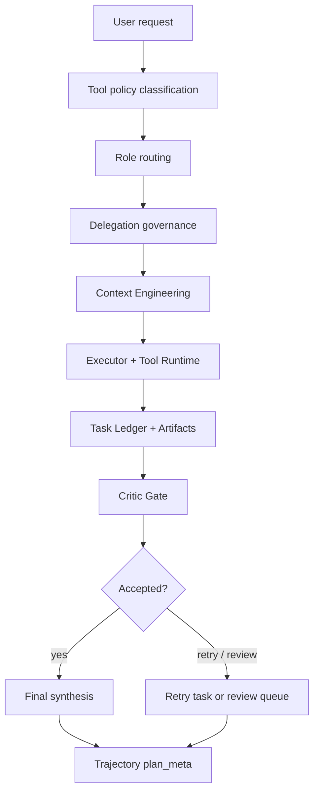
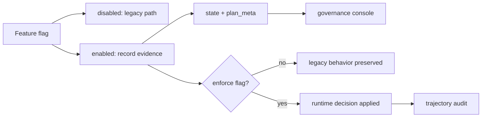
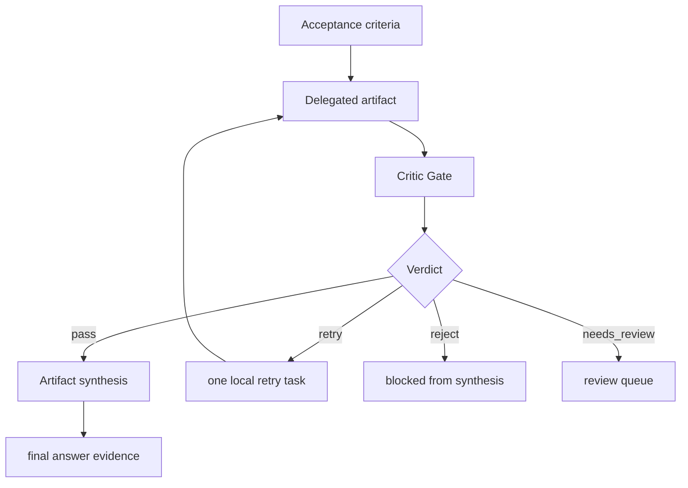

# Agent Governance

Updated: 2026-04-24

This document is the canonical guide for Focus Agent's role routing and governance layer. It explains what the governance layer controls, which records it writes, when it can affect execution, and how to validate it. Runtime topology stays in [architecture.md](architecture.md); memory details stay in [memory-system.md](memory-system.md); tool and skill taxonomy stays in [tool-skill-design.md](tool-skill-design.md).

## 1. Purpose

Agent governance turns a complex turn from an opaque model call into a traceable process. It does not make every request multi-agent by default. The default path remains legacy-safe: a normal request still runs as a single executor path unless feature flags enable additional governance records or enforcement.

The layer answers five questions:

- Which role should reason about this request?
- Which tools should that role be allowed to see?
- Which model should that role use?
- Which artifacts are accepted, rejected, retried, or waiting for review?
- Which evidence should be recorded for trajectory, eval, and Web inspection?



## 2. Role Set

Current routed roles:

| Role | Responsibility | Typical Evidence |
|------|----------------|------------------|
| `orchestrator` | Decide whether the turn needs governance, routing, or decomposition | `role_route_plan`, route rationale |
| `planner` | Shape complex work into bounded steps and acceptance criteria | plan, task slices, replan signal |
| `executor` | Run the main model path, call tools, write artifacts, produce the answer | tool calls, observations, patch/artifact summary |
| `critic` | Review artifacts against acceptance criteria without taking over execution | `critic_gate_result`, rejected artifact ids |
| `memory_curator` | Decide whether branch-local findings can become durable main-thread memory | `memory_curator_decision`, conflicts, promoted ids |
| `skill_scout` | Recommend prompt-first skills and safe tool methods | skill hints, tool route evidence |

The role names are intentionally small. New roles should only be added when they need distinct context, tools, model routing, or verdict semantics.

## 3. Governance Flow

The governance path is attached to the normal LangGraph turn:

```text
user request
  -> classify tool policy
  -> role_route_dry_run
  -> delegation_governance
  -> plan / agent_loop / tool_executor / reflect
  -> task ledger, delegated artifacts, critic gate, synthesis
  -> trajectory plan_meta and Web governance console
```

Important boundaries:

- Role routing can run in dry-run mode and only records evidence.
- Delegation can build task/run records without changing the legacy executor path.
- Tool Router can observe decisions before it enforces tool filtering.
- Model Router can recommend a model before it changes the effective model.
- Critic Gate can record verdicts before it blocks synthesis.

This observe-first design lets the project collect trajectory evidence before giving the governance layer stronger execution authority.

## 4. Feature Flags

| Capability | Default | Flag | Primary State |
|------------|---------|------|---------------|
| Role Routing | off | `AGENT_ROLE_ROUTING_ENABLED` | `role_route_plan` |
| Memory Curator | off | `AGENT_MEMORY_CURATOR_ENABLED` | `memory_curator_decision` |
| Tool Router | off | `AGENT_TOOL_ROUTER_ENABLED` | `tool_route_plan` |
| Tool Router enforcement | on when router is enabled | `AGENT_TOOL_ROUTER_ENFORCE` | filtered tool binding |
| Delegation Runtime | off | `AGENT_DELEGATION_ENABLED` | `agent_delegation_plan`, `agent_runs` |
| Delegation enforcement | off | `AGENT_DELEGATION_ENFORCE` | enforced run records |
| Model Router | off | `AGENT_MODEL_ROUTER_ENABLED` | `model_route_decision` |
| Model Router mode | observe | `AGENT_MODEL_ROUTER_MODE` | observe or enforce |
| Self Repair | off | `AGENT_SELF_REPAIR_ENABLED` | `agent_failure_records` |
| Review Queue | off | `AGENT_REVIEW_QUEUE_ENABLED` | `agent_review_queue` |
| Context Engineering v2 | off | `AGENT_CONTEXT_ENGINEERING_V2_ENABLED` | context decisions and refs |
| Context artifact refs | off | `AGENT_CONTEXT_ARTIFACTIZE_LONG_OBSERVATIONS` | `context_artifact_refs` |
| Context role views | off | `AGENT_CONTEXT_ROLE_VIEWS_ENABLED` | `role_context_views` |
| Task Ledger | off | `AGENT_TASK_LEDGER_ENABLED` | `agent_task_ledger` |
| Artifact Synthesis | off | `AGENT_ARTIFACT_SYNTHESIS_ENABLED` | `artifact_synthesis_result` |
| Critic Gate | off | `AGENT_CRITIC_GATE_ENABLED` | `critic_gate_result` |
| Critic Gate enforcement | off | `AGENT_CRITIC_GATE_ENFORCE` | blocked synthesis / retry task |

Feature flags move a capability through three practical stages: no-op, observation, and enforcement. This lets the project collect trajectory evidence before a router, curator, or critic is allowed to change execution behavior.



## 5. Behavioral Contract

These rules are regression-sensitive:

- Default off keeps the existing single-run model path unchanged.
- `AGENT_DELEGATION_ENABLED=false` keeps legacy execution unchanged even if role routing records `role_route_plan`.
- Routed roles use the current role set: `orchestrator`, `planner`, `executor`, `critic`, `memory_curator`, and `skill_scout`.
- Workspace lookup must stay local-first and must not call web tools when the user says not to browse.
- Symbol, definition, usage, or location lookup should start with `search_code` when that tool is available; `.focus_agent/` runtime files are excluded from code search.
- Memory preview is prompt evidence only; uncommitted preview content must not leak into durable memory or final answers.
- Role-specific model settings use `AGENT_ROLE_*_MODEL`.
- If a role model is unset, `executor` falls back to the main selected model; planning, critique, memory, skill, and orchestration roles fall back to `helper_model`, then the main model.
- Memory Curator auto-promotion only runs after approved branch merge; conflicts stay in `needs_review`.
- Tool Router enforcement means denied tools are not bound to the model.
- Model Router observe mode records `model_route_decision`; enforce mode may replace the effective role model.
- Self Repair and Review Queue record failure candidates and pending human-review items without writing eval datasets automatically.
- Context Engineering records budget, compression, refs, and role views in `plan_meta`; it only materializes long observations when artifactization is enabled.
- Task Ledger converts delegated tasks into traceable task nodes, delegated artifacts, critic verdicts, and optional final synthesis.
- Critic enforce mode blocks rejected artifacts from synthesis and allows only one local retry task.
- Web operators can inspect role routing, memory curator, tool route, delegation, model route, self-repair, review queue, context engineering, task ledger, delegated artifact, and critic gate records at `/app/agent/governance`; `/app/agent/roles` remains compatible.

## 6. Role Routing

Role routing lives in `src/focus_agent/agent_roles.py`.

Inputs:

- user task text
- tool policy
- available tool names
- configured role model settings
- `AGENT_ROLE_MAX_PARALLEL_RUNS`

Outputs:

- `RoleRoutePlan.enabled`
- `route_reason`
- `max_parallel_runs`
- `decisions`
- role-specific `tool_governance`
- `legacy_execution_unchanged`

The route plan is intentionally conservative. It is a governance recommendation first, not an automatic fan-out engine.

## 7. Tool Governance

Tool governance lives in `src/focus_agent/capabilities/tool_router.py`.

The router receives a role, a tool policy, and the tools available for the turn. It returns:

- `allowed_tools`
- `denied_tools`
- per-tool decisions with reasons

Typical deny reasons:

- `direct_answer_policy`
- `workspace_lookup_no_network`
- `live_web_policy`
- `role_not_allowed:*`
- `approval_required`
- `critic_no_workspace_write`
- `memory_write_reserved`

Tool routing is layered after coarse turn-level tool policy. For example, a workspace lookup request should not expose web tools even if the Planner role normally can use web search.

## 8. Memory Curator

Memory Curator lives in `src/focus_agent/memory/curator.py`.

It only governs branch-local finding promotion. It does not replace the memory retriever, extractor, writer, or dedupe policy.

Promotion checks:

- branch status must allow promotion
- finding must be merge-importable
- candidate must have a semantic key
- existing main-thread memories must not conflict semantically
- auto-promotion must be enabled for automatic write

Conflict output stays explicit through `needs_review`; the system should not silently overwrite durable main-thread memory.

## 9. Delegation, Model Router, Self Repair, Review Queue

These records live in `src/focus_agent/agent_delegation.py`.

Delegation converts route decisions into:

- `AgentTask`
- `AgentRun`
- `AgentDecision`

Model Router records:

- selected model
- recommended model
- effective model
- fallback usage
- candidate list

Self Repair records structured failure candidates such as planning gaps, tool denials, model protocol errors, memory scope violations, and budget issues.

Review Queue turns governance uncertainty into pending human-review items. It should expose risk rather than pretending the system is certain.

### Observe-First Autonomy Outputs

The autonomy surface is intentionally report-first before it is action-first. When governance is enabled without enforcement, it may emit:

- skill selection: `skill_scout` role decisions use `skills_list` and `skill_view` to recommend prompt-first skills and toolsets.
- branch suggestion: delegated role decisions include `run_isolation_key` values such as `role:planner`, `role:executor`, and `role:skill_scout`; these are branch/run hints, not background spawns.
- risk-aware workflow policy: denied high-risk workspace tools are represented as `tool_denied` failure records and `agent_review_queue` items.
- model routing report: high-risk tool usage can produce a Model Router observe-mode rationale while keeping `effective_model` equal to the selected model.

Observe mode must not execute high-risk actions by itself. It records skill, branch, model, and review evidence for the governance console so a human or later enforcement flag can make the execution decision explicitly.

## 10. Ownership Audit Dashboard

Ownership audit events live in `src/focus_agent/security/ownership.py` and can be exported as individual trajectory-compatible records or as a dashboard report.

The dashboard report aggregates:

- total allow and deny counts
- deny rate
- deny reasons
- denies by resource type, action, and principal
- deny trend in event order with request ids

The report export uses the `ownership.audit.report` tool name and keeps the aggregated payload under `runtime`. It is meant for dashboard and trajectory inspection only; it does not change the underlying thread or branch ownership decision.

## 11. Context Engineering

Context Engineering lives in `src/focus_agent/agent_context_engineering.py`.

It records:

- `context_budget_decision`
- `context_compression_plan`
- `context_artifact_refs`
- `role_context_views`

The purpose is not to create prettier summaries. It is to keep the prompt surface scoped, auditable, and role-appropriate. Long tool observations can become artifact references so the prompt sees a compact summary while replay and humans can still inspect the evidence.

## 12. Task Ledger, Artifact Synthesis, Critic Gate

Task Ledger and Critic Gate live in `src/focus_agent/agent_task_ledger.py`.

Task Ledger records:

- task nodes
- task edges
- retry counts
- acceptance criteria
- artifact ids

Delegated artifact kinds:

- `plan`
- `patch_summary`
- `evidence`
- `critic_verdict`
- `memory_candidate`
- `tool_route_evidence`
- `context_ref`
- `final_synthesis`

Critic verdicts:

- `pass`
- `reject`
- `retry`
- `needs_review`
- `skipped`

Artifact Synthesis only consumes accepted artifacts. When Critic Gate is enforced, rejected, retried, or review-needed artifacts can block synthesis.

The critic loop is intentionally narrow: it judges artifacts against recorded criteria and either allows synthesis, asks for one bounded retry, or exposes uncertainty for human review.



## 13. Observability Surface

Governance records are copied into trajectory `plan_meta` so they can be inspected through:

- API trajectory detail
- `/app/agent/governance`
- observability trajectory workbench
- eval trajectory judges
- replay and promote workflows

This means a failed turn should be diagnosable by looking at the route, tool decisions, model route, context decisions, task ledger, artifacts, and critic verdict, rather than only reading the final answer.

## 14. Eval Gate

Run this gate whenever role routing, planning, tool policy, memory preview, or model fallback behavior changes:

```bash
uv run python -m tests.eval --suite agent_arch --concurrency 1
uv run python -m tests.eval --suite agent_governance --concurrency 1
uv run python -m tests.eval --suite agent_delegation --concurrency 1
uv run python -m tests.eval --suite agent_context --concurrency 1
uv run python -m tests.eval --suite agent_task_ledger --concurrency 1
```

For framework-only validation without provider credentials:

```bash
uv run pytest tests/eval/test_agent_arch_suite.py tests/eval/test_agent_governance_suite.py tests/eval/test_agent_delegation_suite.py tests/eval/test_agent_context_suite.py tests/eval/test_agent_task_ledger_suite.py
```

If the Web console or SDK contract changed, pair the gate with:

```bash
make sdk-check
make web-check
```

If the browser chat, branch, review, or observability surfaces changed, add:

```bash
uv run python scripts/ui_smoke_test.py
uv run python scripts/observability_ui_smoke.py --scenario all
pnpm --dir apps/web smoke:observability
```
