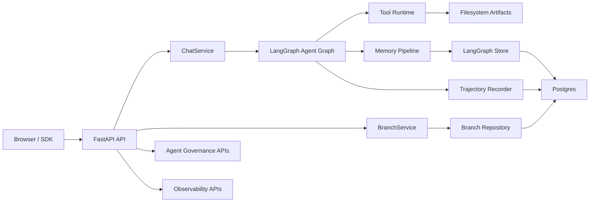
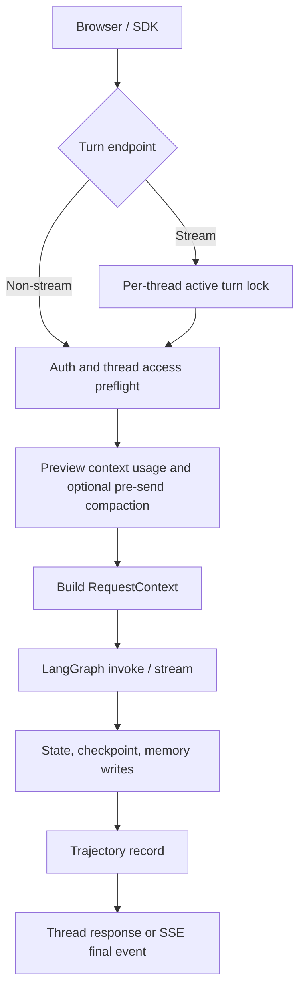
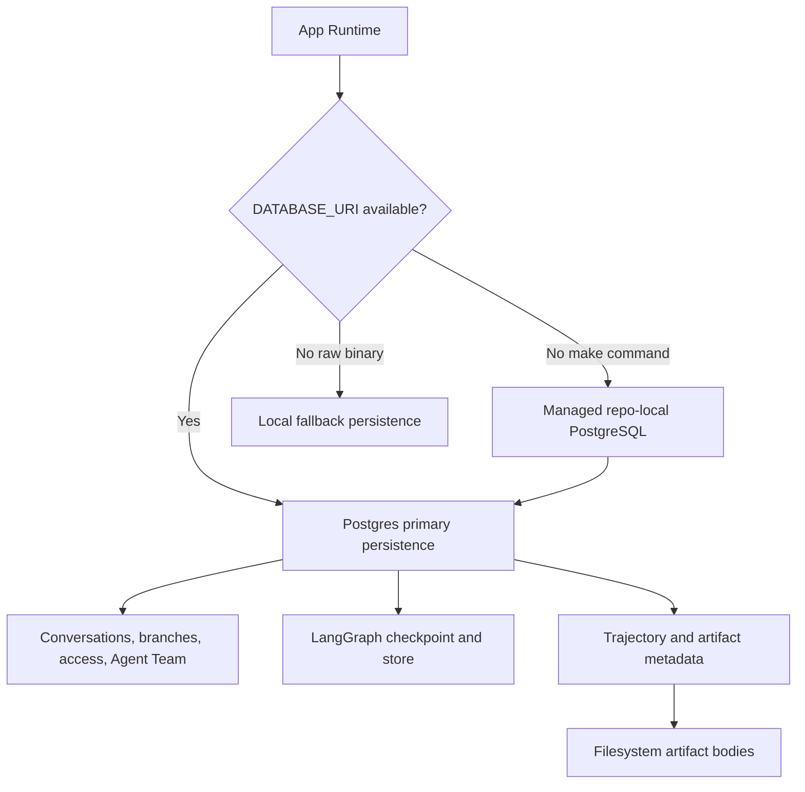
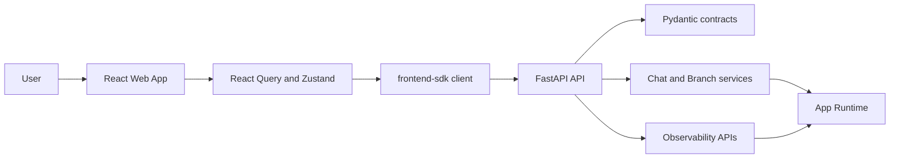

# Focus Agent 整体架构设计

更新时间：2026-04-26

本文是 Focus Agent 的整体架构入口，说明系统分层、核心请求链路、持久化边界、前端/SDK、部署形态和验证口径。它只保留跨模块设计和关键路径；深入专题请跳转到对应 canonical 文档：

- Agent governance：[agent-role-routing.md](agent-role-routing.md)
- Memory：[memory-system.md](memory-system.md)
- Tool / Skill：[tool-skill-design.md](tool-skill-design.md)
- Docker / Compose：[docker-deployment.md](docker-deployment.md)
- Observability 操作手册：[observability-runbook.md](observability-runbook.md)

## 1. 系统定位

Focus Agent 是一个 Web-first Agent 应用骨架，用于构建支持分支式会话、流式响应、受控 merge-back、记忆治理、工具调用、可观测复盘和 TypeScript SDK 的 AI 应用。

它的核心假设是：复杂任务不是单线聊天。研究、调试、写作和验证往往需要并行探索，主线需要稳定沉淀，分支需要可丢弃、可合并、可审计。因此系统围绕以下能力设计：

| 能力 | 架构含义 | 主要模块 |
|------|----------|----------|
| Branch-aware conversation | root thread 派生 child thread，探索不污染主线 | `BranchService`、branch repository、branch tree UI |
| Controlled merge-back | 分支结论通过 proposal / decision 回到主线 | merge review、imported findings、memory promotion |
| Long-context governance | 对话、记忆、工具观察和 artifact 需要预算与引用 | context policy、Context Engineering |
| Tool and skill governance | 工具能力按任务意图和角色收紧 | tool registry、tool runtime、tool router、skill registry |
| Traceable execution | 不只保存最终回答，还保存工具、模型、缓存、fallback 和治理元数据 | trajectory repository、observability API、Web workbench |
| Release confidence | 发布前把 readiness、trajectory、eval、alert、Postgres migration 和 evidence pack 汇总为阻断信号 | release gate、release-health、release evidence |
| Local-first development | 本地命令可以自动托管 repo-local PostgreSQL | `scripts/serve-*.sh`、`make serve-dev` |

## 2. 总体拓扑

当前整体形态：

- Backend：FastAPI + LangGraph + LangChain + Pydantic
- Frontend：React 19 + Vite + TanStack Router + TanStack Query + Zustand
- SDK：`frontend-sdk` typed browser / Node client
- Persistence：Postgres primary persistence；local fallback persistence；filesystem artifact bodies
- Observability：request id、readiness、metrics、trajectory、replay、promote、release-health
- Release evidence：release gate reports、production evidence pack、approval、artifact storage verification



```text
Browser / SDK
  |
  | HTTP / SSE
  v
FastAPI app
  |
  +-- API contracts, auth, middleware, error envelope
  +-- ChatService
  |     +-- LangGraph agent graph
  |     +-- stream event mapping
  |     +-- trajectory recording
  +-- BranchService
  |     +-- fork / archive / activate / merge
  |     +-- branch role classification
  |     +-- merge proposal and imported findings
  +-- Agent governance APIs
  |     +-- role route / tool route / context / ledger / critic
  +-- Observability APIs
        +-- overview / trajectory / stats / replay / promote

Persistence
  |
  +-- Postgres app tables
  +-- LangGraph Postgres checkpoint/store
  +-- Postgres trajectory tables
  +-- artifact metadata table
  +-- filesystem artifact bodies
  +-- local SQLite + pickle fallback
```

## 3. 代码分层

| 路径 | 责任 |
|------|------|
| `src/focus_agent/api/` | FastAPI app、contracts、deps、middleware、errors |
| `src/focus_agent/engine/` | runtime 创建、LangGraph 图、本地 fallback persistence |
| `src/focus_agent/core/` | state、branching、request context、context policy、merge review |
| `src/focus_agent/services/` | ChatService、BranchService 等 API-facing 业务服务 |
| `src/focus_agent/repositories/` | Postgres / SQLite repository、schema、trajectory、artifact metadata |
| `src/focus_agent/memory/` | memory model、retriever、extractor、writer、curator、policy、dedupe |
| `src/focus_agent/capabilities/` | default tools、tool registry、tool runtime、tool router |
| `src/focus_agent/skills/` | skill registry、skill metadata、skill view rendering |
| `src/focus_agent/observability/` | trajectory record、actions、tracing facade、OTel runtime |
| `src/focus_agent/web/` | React build serving 和 Vite dev redirect |
| `apps/web/src/` | React app shell、pages、features、shared UI |
| `frontend-sdk/src/` | typed client、types、guards、stream parser、reducers |

## 4. App Runtime

`src/focus_agent/engine/runtime.py` 中的 `create_runtime()` 是后端运行态装配点。它根据 `Settings` 创建：

- `graph`：LangGraph 编译后的 Agent 执行图。
- `repo`：conversation / branch / thread access repository。
- `branch_service`：fork、merge 和 branch tree 业务服务。
- `checkpointer`：LangGraph checkpoint persistence。
- `store`：LangGraph store，用于 memory。
- `memory_policy`、`memory_retriever`、`memory_writer`、`memory_extractor`。
- `skill_registry`、`tool_registry`。
- `trajectory_recorder`。
- `artifact_metadata_repository`。
- `otel_runtime`。

当 `DATABASE_URI` 存在时，runtime 选择 Postgres primary persistence；否则选择 local fallback persistence。

## 5. API Surface

API 路由集中在 `src/focus_agent/api/main.py`：

| 分组 | 代表路径 | 说明 |
|------|----------|------|
| Health | `GET /healthz`、`GET /readyz`、`GET /metrics` | 存活、就绪、指标 |
| Web App | `GET /app`、`GET /app/zh`、`GET /app/{path:path}` | React build serving 或 Vite redirect |
| Auth | `POST /v1/auth/demo-token`、`GET /v1/auth/me` | demo token 和当前 principal |
| Models | `GET /v1/models` | 模型目录和能力 |
| Conversations | `GET/POST/PATCH /v1/conversations`、archive / activate | root thread 会话管理 |
| Chat | `POST /v1/chat/turns`、stream、resume | 非流式和流式 turn |
| Threads | `GET /v1/threads/{thread_id}`、`POST /v1/threads/{thread_id}/context/preview`、`POST /v1/threads/{thread_id}/context/compact` | 线程状态读取、当前上下文窗口预览和非破坏式压缩 |
| Branches | fork、archive、activate、rename、proposal、merge、tree | 分支生命周期 |
| Agent | `/v1/agent/*` | governance preview、policy、records 和 evaluate APIs |
| Observability | `/v1/observability/*` | overview、trajectory、stats、replay、promote |

API 层保持薄封装：鉴权、参数校验和 response shape 在 API；业务流程在 services、runtime、repositories 和 graph nodes。

## 6. Chat Turn 数据流

Chat turn 的关键不是入口数量，而是非流式和流式入口最终都会汇入同一个 graph 执行、状态落盘和 trajectory 记录路径。下图把共享生命周期和分支点压缩在一起：



### 6.1 非流式 turn

```text
POST /v1/chat/turns
  -> authenticate principal
  -> ChatService preflight access
  -> RequestContext
  -> graph.invoke
  -> final AgentState
  -> trajectory record
  -> ThreadStateResponse
```

### 6.2 流式 turn

```text
POST /v1/chat/turns/stream
  -> authenticate principal
  -> acquire per-thread active turn lock
  -> graph stream
  -> map LangGraph updates to SSE events
  -> text / reasoning / tool events / metadata
  -> final thread state
  -> trajectory record
```

`ChatService` 使用 per-thread active turn lock，避免同一 thread 同时写入多个 turn。

## 7. LangGraph 主路径

核心图在 `src/focus_agent/engine/graph_builder.py`。主路径保留 legacy single-run，同时可插入 governance 记录：

```text
bootstrap_turn
  -> retrieve_memories
  -> assemble_context
  -> role_route_dry_run
  -> delegation_governance
  -> plan
  -> agent_loop
       -> tool_executor -> agent_loop
       -> reflect
       -> summarize_turn
  -> extract_memories
  -> write_memories
  -> maybe_interrupt_for_merge
```

关键点：

- `retrieve_memories` 从可读 namespace 检索 durable memory。
- `assemble_context` 组装 recent messages、rolling summary、memory block、skill block 和 prompt budget。
- `agent_loop` 根据 tool policy 与 Tool Router 绑定工具。
- `tool_executor` 执行工具、处理缓存、fallback 和观察裁剪。
- `reflect` 只在 Plan-Act-Reflect 开启并产生 plan 时参与。
- `extract_memories` / `write_memories` 是 turn 后记忆写入路径。
- `maybe_interrupt_for_merge` 对 merge proposal 触发 human review interrupt。

## 8. Agent State

`src/focus_agent/core/state.py` 定义跨节点状态。主要类别：

- Conversation：`messages`、`rolling_summary`、`recent_messages`
- User intent：`task_brief`、`active_goal`、`user_constraints`、`pinned_facts`
- Branch：`branch_meta`、`branch_local_findings`、`imported_findings`、`merge_queue`
- Prompt surface：`assembled_context`、`memory_prompt_block`、`available_skills_block`
- Context window：`context_budget`、`context_compaction`；`context_usage` 是响应层派生估算，不作为持久化 state 字段写入
- Runtime choice：`selected_model`、`selected_thinking_mode`
- Governance：`role_route_plan`、`tool_route_plan`、`model_route_decision`、`agent_delegation_plan`
- Context Engineering：`context_budget_decision`、`context_compression_plan`、`context_artifact_refs`、`role_context_views`
- Ledger and critic：`agent_task_ledger`、`delegated_artifacts`、`artifact_synthesis_result`、`critic_gate_result`
- Memory write：`memory_write_requests`、`memory_write_result`
- Planning：`plan`、`current_step_id`、`reflection`、`plan_meta`

内容型状态可以通过 review 后显式 merge；执行策略、prompt surface 和 runtime choice 属于当前 turn，不应自动回流。

## 9. 分支与 Merge-back

分支业务在 `src/focus_agent/services/branches.py`：

```text
main thread
  -> fork branch
  -> child thread receives branch_meta and checkpoint
  -> user explores, executes, verifies, or writes in branch
  -> branch-local findings are collected
  -> merge proposal is prepared
  -> user applies merge decision
  -> imported findings become visible to parent
  -> optional memory promotion
```

约束：

- `root_thread_id` 表示整棵会话树。
- `child_thread_id` 是分支自己的 LangGraph thread。
- `branch_depth` 受 `BRANCH_MAX_DEPTH` 控制。
- merged branch 在前后端都按只读处理。
- branch role 会根据第一轮分支交互更新为 execute、verify、deep dive、alternatives、writeup 等语义。
- imported conclusion 可写入父线程状态，并可进入 memory pipeline。

## 10. Memory 概览

Memory 的 canonical 文档是 [memory-system.md](memory-system.md)。架构层只保留边界：

- `MemoryRetriever`：根据 RequestContext、state、query 和 prompt mode 检索。
- `MemoryExtractor`：从 turn 中提取候选记忆。
- `MemoryWriter`：按 policy、dedupe、semantic key 和 conflict 规则写入。
- `MemoryCurator`：只治理 branch-local finding 是否 promotion 到主线。

Namespace 由 `src/focus_agent/storage/namespaces.py` 管理，区分 root thread、conversation main、branch local memory 等作用域。

## 11. Tool / Skill 概览

Tool / Skill 的 canonical 文档是 [tool-skill-design.md](tool-skill-design.md)。

分层：

- default tools：repo、git、web、artifact、memory、conversation 等工具。
- tool registry：把工具和 `ToolRuntimeMeta` 组合成 runtime registry。
- tool runtime：处理并行安全、缓存、fallback、观察裁剪。
- tool router：按 role、tool policy、risk、side effect 过滤工具。
- skill registry：暴露 prompt-first 技能说明，不把 skill 当成副作用工具。

## 12. Agent Governance 概览

Agent governance 的 canonical 文档是 [agent-role-routing.md](agent-role-routing.md)。

架构层需要记住两点：

- 默认 off，legacy single-run path 不变。
- observe-first，enforce 能力逐步打开。

当前治理记录包括 role route、tool route、memory curator、delegation、model router、self repair、review queue、context engineering、task ledger、artifact synthesis 和 critic gate。这些记录写入 AgentState 与 trajectory `plan_meta`，供 Web console、eval 和 replay 使用。

## 13. 持久化

持久化分成三层：生产和容器联调优先使用 Postgres primary persistence，本地裸跑保留 fallback，artifact 正文始终留在文件系统。这个边界避免把大正文塞进数据库，也避免把本地便利路径误当成生产方案：



### 13.1 Postgres primary persistence

配置 `DATABASE_URI` 后，主运行态数据走 Postgres primary persistence：

- conversation / branch / thread access
- Agent Team sessions / tasks / outputs
- LangGraph checkpoint/store
- artifact metadata
- trajectory turn / step observability tables

应用 schema 位于 `src/focus_agent/repositories/postgres_schema.py`，包括 `focus_conversations`、`focus_thread_access`、`focus_branches`、`focus_artifacts`、`focus_agent_team_sessions`、`focus_agent_team_tasks`、`focus_agent_team_outputs` 等表。

Agent Team 的 Postgres 表使用 `data_json JSONB NOT NULL` 保存完整 Pydantic model，辅助列只用于按用户、root thread、session/task 和创建时间查询排序。schema migration 会逐版本执行，因此已有 v1 数据库会继续升级到包含 Agent Team 表的 v2。

Artifact 正文仍在文件系统，Postgres 保存 metadata、relative path、checksum、source thread / branch、summary 等字段。

### 13.2 Local fallback persistence

未配置 `DATABASE_URI` 且直接裸跑 API 二进制时，runtime 使用：

- SQLite branch repository
- SQLite Agent Team repository
- pickle-backed LangGraph checkpointer
- pickle-backed LangGraph store
- no trajectory recorder
- no artifact metadata repository

这是本地 fallback，不是生产多副本方案。

### 13.3 Managed repo-local PostgreSQL

本机启动命令（`make api`、`make dev`、`make serve`、`make serve-dev`、`make serve-prod`）会在未显式设置 `DATABASE_URI` 时自动托管 repo-local PostgreSQL，并把生成的运行态环境写入 `.focus_agent/postgres/runtime.env`。

直接运行 `.venv/bin/focus-agent-api` 不会启动托管数据库。历史 `.focus_agent` 状态需要通过 `focus-agent-migrate-local-state` 显式迁移。

## 14. Frontend 与 SDK

前端和 SDK 共享 API contract：Web App 不绕过 SDK 直接拼 response shape，SDK 也负责把流式事件规整成前端可消费的状态更新。边界如下：



Web App 位于 `apps/web/src/`：

```text
app/                      router, shell, providers
pages/thread/             chat, branch tree, merge review
pages/agents/             governance console
pages/observability/      overview and trajectory workbench
features/                 branch, conversation, merge, models, stream, trajectory
shared/                   config, query keys, SDK provider, UI, styles
```

主要入口：

- `/app`
- `/app/zh`
- `/app/observability/overview`
- `/app/observability/trajectory`
- `/app/agent/governance`

`frontend-sdk` 提供 typed client、types、guards、stream parser 和 reducers。Web App 使用 SDK client + React Query 访问后端，保持 API contract、SDK 类型和 UI 数据访问一致。

## 15. 安全边界

当前安全能力：

- Bearer token authentication。
- demo token bootstrap，仅适合本地与演示。
- owner / access check，线程和会话操作必须匹配 owner。
- CORS。
- 进程内 sliding-window rate limit。
- 统一错误信封。
- Tool Router 对 network、workspace write、memory write 做 role-level 收紧。

生产部署必须显式设置 `AUTH_JWT_SECRET`，并关闭 demo token。

## 16. Observability 与 Eval

Observability 分三层：

- 请求层：request id、结构化日志、耗时、错误信封。
- 运行态层：`/readyz`、`/metrics`、runtime labels、OTel facade。
- Agent trajectory 层：turn、step、tool、model、fallback、cache、trace correlation、plan_meta。

Trajectory API 支持 list、detail、stats、replay、promote、batch promote preview、batch replay compare。Web 侧拆成 overview 和 trajectory workbench。

Eval framework 使用 rule judge、LLM judge、trajectory judge，把真实运行中的失败和边界案例沉淀为可执行回归。

## 17. Docker / Compose 部署

Docker 本地联调用 [compose.yaml](../compose.yaml)，生产/预发模板用 [compose.prod.yaml](../compose.prod.yaml)。详细部署文档见 [docker-deployment.md](docker-deployment.md)。

边界：

- `compose.yaml` 包含 app + postgres，适合本地 Docker 联调。
- `compose.prod.yaml` 不内置 Postgres，要求外部注入 `FOCUS_AGENT_DATABASE_URI`。
- Dockerfile 使用前端构建阶段和 Python runtime 阶段。
- `docker/entrypoint.sh` 准备 `/data` 下的默认配置和 fallback 路径。

## 18. 本地开发运行

推荐完整开发入口：

```bash
make serve-dev
```

常用命令：

```bash
make api
make dev
make serve
make serve-prod
make web-dev
```

更完整启动说明见 [quick-start.md](quick-start.md) 和 [development.md](development.md)。

## 19. 当前限制

- 进程内限流不适合多副本共享额度。
- Artifact 正文仍在文件系统，生产多节点需要共享文件系统或对象存储方案。
- Agent governance 多数能力默认 observe/off，enforce 面需要基于 trajectory 逐步扩大。
- Context window 已有发送栏用量、手动/自动压缩和 128k 默认预算，但 token 估算当前仍以确定性裁剪和近似预算为主。
- Local fallback persistence 只适合本地，不适合生产多副本。

## 20. 推荐验证

日常后端和文档改动：

```bash
make lint
make ci-test
```

影响 SDK：

```bash
make sdk-check
make sdk-build
```

影响 Web：

```bash
make web-check
make web-build
```

影响部署、持久化或 observability：

```bash
uv run pytest \
  tests/test_api_middleware.py \
  tests/test_containerization_scaffold.py \
  tests/test_local_startup_docs.py \
  tests/test_runtime_backend_selection.py \
  tests/test_api_trajectory_observability.py \
  tests/test_api_trajectory_actions.py \
  tests/test_trajectory_cli.py
```

影响 Agent governance：

```bash
uv run pytest tests/eval/test_agent_arch_suite.py tests/eval/test_agent_governance_suite.py tests/eval/test_agent_delegation_suite.py tests/eval/test_agent_context_suite.py tests/eval/test_agent_task_ledger_suite.py
```

如果本机 `.venv` 的 `psycopg` 缺少 `libpq` 导致测试收集阶段 `ImportError`，可使用仓库当前测试约定的 stub 路径跑 focused observability 回归：

```bash
PYTHONPATH=/tmp/psycopg_stub .venv/bin/pytest \
  tests/test_api_middleware.py \
  tests/test_metadata.py \
  tests/test_trajectory_observability.py \
  tests/test_api_trajectory_observability.py \
  tests/test_chat_service.py
```

## 21. 文件导航

- API：`src/focus_agent/api/main.py`
- Contracts：`src/focus_agent/api/contracts.py`
- Runtime：`src/focus_agent/engine/runtime.py`
- Graph builder：`src/focus_agent/engine/graph_builder.py`
- State：`src/focus_agent/core/state.py`
- Chat service：`src/focus_agent/services/chat.py`
- Branch service：`src/focus_agent/services/branches.py`
- Postgres schema：`src/focus_agent/repositories/postgres_schema.py`
- Trajectory repository：`src/focus_agent/repositories/postgres_trajectory_repository.py`
- Web App：`apps/web/src/`
- SDK：`frontend-sdk/src/`
