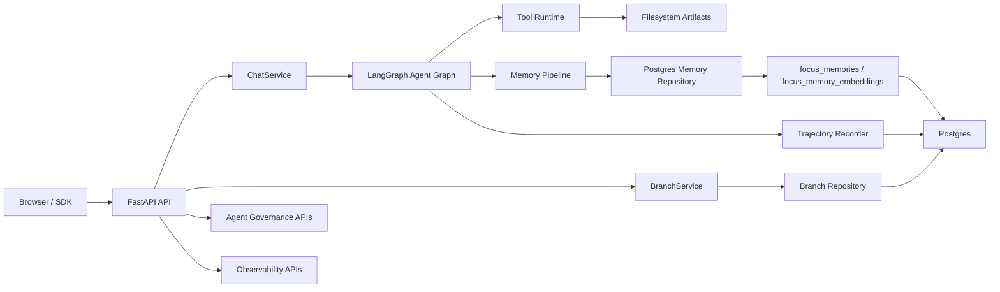
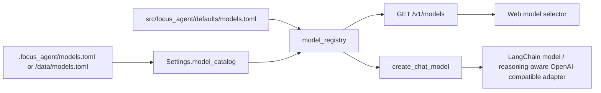
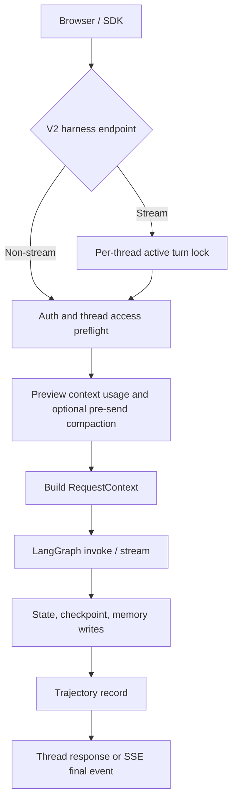
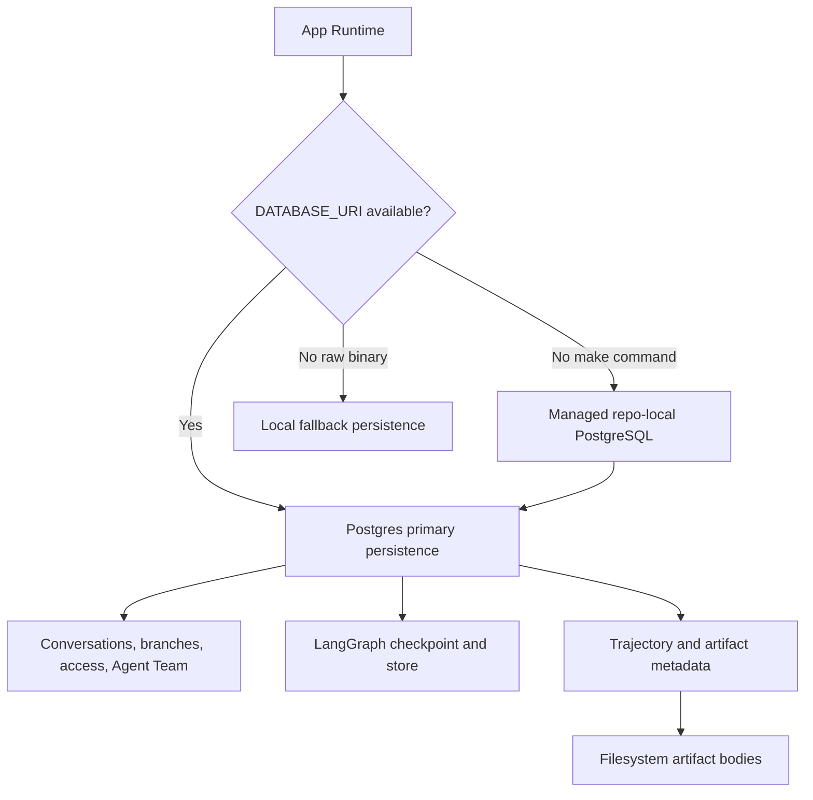
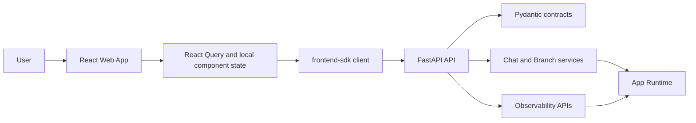

# Focus Agent 整体架构设计

更新时间：2026-05-07

本文是 Focus Agent 的整体架构入口，说明系统分层、核心请求链路、持久化边界、前端/SDK、部署形态和验证口径。它只保留跨模块设计和关键路径；深入专题请跳转到对应 canonical 文档：

- Agent governance：[agent-role-routing.md](agent-role-routing.md)
- Agent Team Workbench：[agent-team-workbench.md](agent-team-workbench.md)
- Context Window：[context-window.md](context-window.md)
- Memory：[memory-system-v2.md](memory-system-v2.md)
- Tool / Skill：[tool-skill-design.md](tool-skill-design.md)
- Docker / Compose：[docker-deployment.md](docker-deployment.md)
- Observability 操作手册：[observability-runbook.md](observability-runbook.md)

## 1. 系统定位

Focus Agent 是一个 Web-first Agent 应用骨架，用于构建支持分支式会话、流式响应、受控 merge-back、记忆治理、工具调用、可观测复盘和 TypeScript SDK 的 AI 应用。

它的核心假设是：复杂任务不是单线聊天。研究、调试、写作和验证往往需要并行探索，主线需要稳定沉淀，分支需要可丢弃、可合并、可审计。因此系统围绕以下能力设计：

| 能力 | 架构含义 | 主要模块 |
|------|----------|----------|
| Branch-aware conversation | root thread 派生 child thread，探索不污染主线 | `BranchService`、branch repository、branch tree UI |
| Controlled merge-back | 分支结论通过 proposal / decision 回到主线 | merge review、imported findings、memory promotion |
| Long-context governance | 对话、记忆、工具观察和 artifact 需要预算与引用 | context policy、Context Engineering |
| Tool and skill governance | 工具能力按任务意图和角色收紧 | tool registry、tool runtime、tool router、skill registry |
| Traceable execution | 不只保存最终回答，还保存工具、模型、缓存、fallback 和治理元数据 | trajectory repository、observability API、Web workbench |
| Release confidence | 发布前把 readiness、trajectory、eval、alert、Postgres migration 和 evidence pack 汇总为阻断信号 | release gate、release-health、release evidence |
| Local-first development | 本地命令可以自动托管 repo-local PostgreSQL | `scripts/serve-*.sh`、`make serve-dev` |

## 2. 总体拓扑

当前整体形态：

- Backend：FastAPI + LangGraph + LangChain + Pydantic
- Frontend：React 19 + Vite + TanStack Router + TanStack Query
- SDK：`frontend-sdk` typed browser / Node client
- Persistence：Postgres primary persistence；local fallback persistence；filesystem artifact bodies
- Observability：request id、readiness、metrics、trajectory、replay、promote、release-health
- Release evidence：release gate reports、production evidence pack、approval、artifact storage verification


```mermaid
flowchart LR
    User["Browser / SDK"] --> API["FastAPI API"]
    API --> Chat["ChatService"]
    API --> Branch["BranchService"]
    API --> Governance["Agent Governance APIs"]
    API --> Obs["Observability APIs"]
    Chat --> Graph["LangGraph Agent Graph"]
    Graph --> Tools["Tool Runtime"]
    Graph --> Memory["Memory Pipeline"]
    Graph --> Trace["Trajectory Recorder"]
    Branch --> Repo["Branch Repository"]
    Memory --> MemoryRepo["Postgres Memory Repository"]
    MemoryRepo --> MemoryTables["focus_memories / focus_memory_embeddings"]
    Trace --> PG["Postgres"]
    Repo --> PG
    MemoryTables --> PG
    Tools --> Artifacts["Filesystem Artifacts"]
```

```text
Browser / SDK
  |
  | HTTP / SSE
  v
FastAPI app
  |
  +-- API contracts, auth, middleware, error envelope
  +-- ChatService
  |     +-- LangGraph agent graph
  |     +-- stream event mapping
  |     +-- trajectory recording
  +-- BranchService
  |     +-- fork / archive / activate / merge
  |     +-- branch role classification
  |     +-- merge proposal and imported findings
  +-- Agent governance APIs
  |     +-- role route / tool route / context / ledger / critic
  +-- Observability APIs
        +-- overview / trajectory / stats / replay / promote

Persistence
  |
  +-- Postgres app tables
  +-- LangGraph Postgres checkpoint/store
  +-- Postgres trajectory tables
  +-- artifact metadata table
  +-- filesystem artifact bodies
  +-- local SQLite + pickle fallback
```

## 3. 代码分层

| 路径 | 责任 |
|------|------|
| `src/focus_agent/api/` | FastAPI app、contracts、contract models、route utils、deps、middleware、errors |
| `src/focus_agent/config_parts/` | Settings 子域加载、模型/工具 catalog TOML 解析、环境变量与安全校验 |
| `src/focus_agent/defaults/` | 包内默认配置数据；当前内置模型 provider/model catalog 只维护在 `models.toml` |
| `src/focus_agent/engine/` | runtime 创建、LangGraph 图 facade、graph node/policy helpers、模型工厂、message helpers、本地 fallback persistence |
| `src/focus_agent/core/` | state、branching、request context、context policy facade、context assembly/budget/tool-observation helpers、merge review |
| `src/focus_agent/services/` | ChatService、BranchService、AgentTeamService 等 API-facing 业务服务；大型服务按 branch action facade、stream lifecycle、thread access、compaction、recording、agent-team session/merge/dispatch 等 helper 拆分 |
| `src/focus_agent/repositories/` | Postgres / SQLite repository、schema、trajectory、artifact metadata |
| `src/focus_agent/memory/` | memory model、retriever、extractor、writer、curator、policy、dedupe、embedding provider/service/policy |
| `src/focus_agent/capabilities/` | default tools、tool registry、tool runtime facade、tool execution/cache/messages/parallel helpers、tool router；default tools 按 workspace、git、web、artifact、memory、conversation 模块拆分 |
| `src/focus_agent/skills/` | skill registry、skill metadata、skill view rendering |
| `src/focus_agent/observability/` | trajectory record、actions、tracing facade、OTel runtime |
| `src/focus_agent/web/` | React build serving 和 Vite dev redirect |
| `apps/web/src/` | React app shell、pages、features、shared UI |
| `frontend-sdk/src/` | typed client facade、domain client modules、type barrels、guards、stream parser、reducers |

## 4. App Runtime

`src/focus_agent/engine/runtime.py` 中的 `create_runtime()` 是后端运行态装配点。它先调用 `ensure_runtime_directories(settings)` 创建运行时目录，再按小型 factory 组装运行态：

- `RuntimePersistence`：`checkpointer`、`store`、branch repository、trajectory recorder、artifact metadata repository。
- `RuntimeMemoryComponents`：`memory_policy`、`memory_retriever`、`memory_writer`、`memory_extractor`、`memory_embedding_service`。
- `RuntimeRegistries`：`skill_registry`、`tool_registry`。
- `RuntimeServices`：`branch_service`、`agent_team_service`。

这些结构由 `_create_runtime_persistence()`、`_create_memory_components()`、`_create_runtime_registries()`、`_create_runtime_graph()` 和 `_create_runtime_services()` 分段创建，最后汇总为 `AppRuntime`。`AppRuntime` 仍保留稳定字段：

- `graph`：LangGraph 编译后的 Agent 执行图。
- `repo`：conversation / branch / thread access repository。
- `branch_service`：fork、merge 和 branch tree 业务服务。
- `agent_team_service`：Agent Team session / task / output 业务服务。
- `checkpointer`：LangGraph checkpoint persistence。
- `store`：LangGraph store，用于 checkpoint/graph 兼容路径和无数据库 local fallback。
- `memory_repository`：PostgreSQL canonical memory repository，读写 `focus_memories`、audit/tombstone/candidate 和可重建的 `focus_memory_embeddings`。
- `memory_policy`、`memory_retriever`、`memory_writer`、`memory_extractor`。
- `memory_embedding_service`、`memory_embedding_provider`、`memory_embedding_backend_error`。
- `skill_registry`、`tool_registry`。
- `trajectory_recorder`。
- `artifact_metadata_repository`。
- `otel_runtime`。

当 `DATABASE_URI` 存在时，runtime 选择 Postgres primary persistence，并初始化 `PostgresMemoryRepository`。默认 memory embedding backend 为 `auto`，会优先探测本地 Ollama `embeddinggemma`，并按 `AGENT_MEMORY_PGVECTOR_EXTENSION_MODE` 管理 pgvector v10 schema；无 `DATABASE_URI` 时使用 local fallback，memory repository 和 pgvector shadow 不可用。配置解析由 `Settings.from_env()` 完成；目录创建副作用集中在 `ensure_runtime_directories(settings)`，并由 runtime 入口调用。

## 5. 模型 Provider 与 Catalog

模型路径现在收口成一个配置驱动链路：


```mermaid
flowchart LR
    Builtin["src/focus_agent/defaults/models.toml"] --> Registry["model_registry"]
    Local[".focus_agent/models.toml or /data/models.toml"] --> Settings["Settings.model_catalog"]
    Settings --> Registry
    Registry --> API["GET /v1/models"]
    Registry --> Factory["create_chat_model"]
    API --> Web["Web model selector"]
    Factory --> Adapter["LangChain model / reasoning-aware OpenAI-compatible adapter"]
```

边界：

- 包内默认 provider/model 只在 `src/focus_agent/defaults/models.toml` 维护，避免在 Python 里重复写 provider/model tuple。
- 本地部署通过 `.focus_agent/models.toml` 覆盖；容器部署通过 `/data/models.toml` 覆盖。
- `Settings` 加载本地 catalog 后由 `model_registry` 合并包内默认与本地配置，并校验 provider id、alias 冲突、重复 model、未知 provider 引用等错误。
- `/v1/models` 暴露 model id、provider label、thinking capability 和可选 logo metadata；Web model selector 优先使用后端返回的 metadata，不再按 provider 写死文案。
- OpenAI-compatible 且需要 `reasoning_content` 透传的模型走 `ReasoningAwareChatOpenAI`；`MoonshotChatOpenAI` 仍作为旧导入别名保留。
- 新增单部署模型时优先改 `.focus_agent/models.toml` 和 `.focus_agent/local.env`；只有要成为所有新环境的内置默认支持时，才改包内 `defaults/models.toml`。

## 6. API Surface

API 路由集中在 `src/focus_agent/api/main.py`：

| 分组 | 代表路径 | 说明 |
|------|----------|------|
| Health | `GET /healthz`、`GET /readyz`、`GET /metrics` | 存活、就绪、指标 |
| Web App | `GET /app`、`GET /app/zh`、`GET /app/{path:path}` | React build serving 或 Vite redirect |
| Auth | `POST /v1/auth/demo-token`、`GET /v1/auth/me` | demo token 和当前 principal |
| Models | `GET /v1/models` | 模型目录和能力 |
| Conversations | `GET/POST/PATCH /v1/conversations`、archive / activate | root thread 会话管理 |
| Harness Runs | `POST /v2/threads/{thread_id}/runs`、`/runs/stream`、`/runs/resume/stream`、`GET/POST /v2/runs/{run_id}` | V2 harness run、流式 run、resume、查询与取消 |
| Threads | `GET /v1/threads/{thread_id}`、`POST /v1/threads/{thread_id}/context/preview`、`POST /v1/threads/{thread_id}/context/compact` | 线程状态读取、当前上下文窗口预览和非破坏式压缩 |
| Branches | fork、archive、activate、rename、proposal、merge、tree | 分支生命周期 |
| Agent | `/v1/agent/*` | governance preview、policy、records 和 evaluate APIs |
| Observability | `/v1/observability/*` | overview、trajectory、stats、replay、promote |

API 层保持薄封装：鉴权、参数校验和 response shape 在 API；业务流程在 services、runtime、repositories 和 graph nodes。

`src/focus_agent/api/deps.py` 是 API dependency 的 canonical 入口：

- `get_current_principal()` 强制 bearer token，并在 auth disabled 时返回 anonymous principal。
- `get_optional_principal()` 用于允许匿名读取或渐进鉴权的路由。
- `require_scopes()` / `require_roles()` 为路由级 scope / role enforcement 提供 dependency helper。
- `get_chat_service()` 通过 `ChatServicePorts.from_runtime(runtime)` 创建 `ChatService`，避免 ChatService 直接依赖完整 runtime 对象。

## 7. Harness Run 数据流

Harness run 是默认聊天入口。非流式、流式和 resume 入口最终都会汇入 V2 harness runtime、RunManager、StreamBridge、graph 执行、状态落盘和 trajectory 记录路径。下图把共享生命周期和分支点压缩在一起：


```mermaid
flowchart TD
    Client["Browser / SDK"] --> Entry{"V2 harness endpoint"}
    Entry -- "Non-stream" --> Preflight["Auth and thread access preflight"]
    Entry -- "Stream" --> Lock["Per-thread active turn lock"]
    Lock --> Preflight
    Preflight --> Usage["Preview context usage and optional pre-send compaction"]
    Usage --> Context["Build RequestContext"]
    Context --> Graph["LangGraph invoke / stream"]
    Graph --> Persist["State, checkpoint, memory writes"]
    Persist --> Trace["Trajectory record"]
    Trace --> Response["Thread response or SSE final event"]
```

### 7.1 非流式 run

```text
POST /v2/threads/{thread_id}/runs
  -> authenticate principal
  -> harness request preflight access
  -> RunManager create run record
  -> RequestContext
  -> graph.invoke
  -> final AgentState
  -> trajectory record
  -> ThreadStateResponse
```

### 7.2 流式 run

```text
POST /v2/threads/{thread_id}/runs/stream
  -> authenticate principal
  -> RunManager create run record
  -> graph stream
  -> map LangGraph updates to canonical SSE events
  -> message / reasoning / tool / task / state / run events
  -> final thread state
  -> trajectory record
```

`ChatService` 使用 per-thread active turn lock，避免同一 thread 同时写入多个 turn。服务本身依赖 `ChatServicePorts` 窄端口，当前端口只暴露 settings、graph、repo、branch service、skill registry、trajectory recorder 和 checkpointer；调用方仍可从 `AppRuntime` 适配出 ports，但 chat 编排逻辑不再直接绑定完整 runtime。

## 8. LangGraph 主路径

核心图入口仍是 `src/focus_agent/engine/graph_builder.py`。该文件现在主要负责节点/边注册；节点实现、tool policy、message repair、plan/reflect、memory 与 tool executor 逻辑拆在同目录 `graph_*` 模块中。主路径保留 legacy single-run，同时可插入 governance 记录：

```text
bootstrap_turn
  -> retrieve_memories
  -> assemble_context
  -> role_route_dry_run
  -> delegation_governance
  -> plan
  -> agent_loop
       -> tool_executor -> agent_loop
       -> reflect
       -> summarize_turn
  -> extract_memories
  -> write_memories
  -> maybe_interrupt_for_merge
```

关键点：

- `retrieve_memories` 从可读 namespace 检索 durable memory。
- `assemble_context` 组装 recent messages、rolling summary、memory block、skill block 和 prompt budget。
- `agent_loop` 根据 tool policy 与 Tool Router 绑定工具；模型创建和 bind-tools 缓存由 `engine/model_factory.py` 承担。
- message/tool-call repair helpers 保持在 graph builder/message helper 边界内，避免 provider stream chunk 泄漏到 prompt。
- `tool_executor` 执行工具、处理缓存、fallback 和观察裁剪。
- `reflect` 只在 Plan-Act-Reflect 开启并产生 plan 时参与。
- `extract_memories` / `write_memories` 是 turn 后记忆写入路径。
- `maybe_interrupt_for_merge` 对 merge proposal 触发 human review interrupt。

## 9. Agent State

`src/focus_agent/core/state.py` 定义跨节点状态。主要类别：

- Conversation：`messages`、`rolling_summary`、`recent_messages`
- User intent：`task_brief`、`active_goal`、`user_constraints`、`pinned_facts`
- Branch：`branch_meta`、`branch_local_findings`、`imported_findings`、`merge_queue`
- Prompt surface：`assembled_context`、`memory_prompt_block`、`available_skills_block`
- Context window：`context_budget`、`context_compaction`；`context_usage` 是响应层派生估算，不作为持久化 state 字段写入
- Runtime choice：`selected_model`、`selected_thinking_mode`
- Governance：`role_route_plan`、`tool_route_plan`、`model_route_decision`、`agent_delegation_plan`
- Context Engineering：`context_budget_decision`、`context_compression_plan`、`context_artifact_refs`、`role_context_views`
- Ledger and critic：`agent_task_ledger`、`delegated_artifacts`、`artifact_synthesis_result`、`critic_gate_result`
- Memory write：`memory_write_requests`、`memory_write_result`
- Planning：`plan`、`current_step_id`、`reflection`、`plan_meta`

内容型状态可以通过 review 后显式 merge；执行策略、prompt surface 和 runtime choice 属于当前 turn，不应自动回流。

## 10. 分支与 Merge-back

分支业务在 `src/focus_agent/services/branches.py`：

```text
main thread
  -> fork branch
  -> child thread receives branch_meta and checkpoint
  -> user explores, executes, verifies, or writes in branch
  -> branch-local findings are collected
  -> merge proposal is prepared
  -> user applies merge decision
  -> imported findings become visible to parent
  -> optional memory promotion
```

约束：

- `root_thread_id` 表示整棵会话树。
- `child_thread_id` 是分支自己的 LangGraph thread。
- `branch_depth` 受 `BRANCH_MAX_DEPTH` 控制。
- merged branch 在前后端都按只读处理。
- branch role 会根据第一轮分支交互更新为 execute、verify、deep dive、alternatives、writeup 等语义。
- imported conclusion 可写入父线程状态，并可进入 memory pipeline。

## 11. Memory 概览

Memory 的 canonical 文档是 [memory-system-v2.md](memory-system-v2.md)。架构层只保留边界：

- `MemoryRetriever`：根据 RequestContext、state、query 和 prompt mode 检索，Postgres 模式下先按 namespace/status 权限过滤，再结合 FTS/ILIKE 与可选 pgvector hybrid。
- `MemoryExtractor`：从 turn 中提取候选记忆。
- `MemoryWriter`：按 policy、dedupe、semantic key 和 conflict 规则写入；Postgres 模式下委托 `MemoryService` 和 `MemoryRepository`。
- `MemoryEmbeddingService`：对长期语义 memory best-effort 写入 `focus_memory_embeddings`；短期上下文、规则、工作记忆、artifact/citation/tool observation 默认不进入向量索引。
- `MemoryCurator`：只治理 branch-local finding 是否 promotion 到主线。

Namespace 由 `src/focus_agent/storage/namespaces.py` 管理，区分 root thread、conversation main、branch local memory 等作用域。

## 12. Tool / Skill 概览

Tool / Skill 的 canonical 文档是 [tool-skill-design.md](tool-skill-design.md)。

分层：

- default tools：workspace/repo、git、web、artifact、memory、conversation 等工具，分别位于 `capabilities/default_tool_modules/` 下的独立模块。
- tool registry：把工具和 `ToolRuntimeMeta` 组合成 runtime registry。
- tool runtime：处理并行安全、缓存、fallback、观察裁剪。
- tool router：按 role、tool policy、risk、side effect 过滤工具。
- skill registry：暴露 prompt-first 技能说明，不把 skill 当成副作用工具。

## 13. Agent Governance 概览

Agent governance 的 canonical 文档是 [agent-role-routing.md](agent-role-routing.md)。

架构层需要记住两点：

- 默认 off，legacy single-run path 不变。
- observe-first，enforce 能力逐步打开。

当前治理记录包括 role route、tool route、memory curator、delegation、model router、self repair、review queue、context engineering、task ledger、artifact synthesis 和 critic gate。这些记录写入 AgentState 与 trajectory `plan_meta`，供 Web console、eval 和 replay 使用。

## 14. 持久化

持久化分成三层：生产和容器联调优先使用 Postgres primary persistence，本地裸跑保留 fallback，artifact 正文始终留在文件系统。这个边界避免把大正文塞进数据库，也避免把本地便利路径误当成生产方案：


```mermaid
flowchart TD
    Runtime["App Runtime"] --> Decision{"DATABASE_URI available?"}
    Decision -- "Yes" --> PG["Postgres primary persistence"]
    Decision -- "No make command" --> Managed["Managed repo-local PostgreSQL"]
    Decision -- "No raw binary" --> Fallback["Local fallback persistence"]
    Managed --> PG
    PG --> AppState["Conversations, branches, access, Agent Team"]
    PG --> GraphStore["LangGraph checkpoint and store"]
    PG --> TraceMeta["Trajectory and artifact metadata"]
    TraceMeta --> Files["Filesystem artifact bodies"]
```

### 14.1 Postgres primary persistence

配置 `DATABASE_URI` 后，主运行态数据走 Postgres primary persistence：

- conversation / branch / thread access
- Agent Team sessions / tasks / outputs
- LangGraph checkpoint/store
- artifact metadata
- trajectory turn / step observability tables

应用 schema 位于 `src/focus_agent/repositories/postgres_schema.py`，包括 `focus_conversations`、`focus_thread_access`、`focus_branches`、`focus_artifacts`、`focus_agent_team_sessions`、`focus_agent_team_tasks`、`focus_agent_team_outputs` 等表。

Agent Team 的 Postgres 表使用 `data_json JSONB NOT NULL` 保存完整 Pydantic model，辅助列只用于按用户、root thread、session/task 和创建时间查询排序。schema migration 会逐版本执行，因此已有 v1 数据库会继续升级到包含 Agent Team 表的 v2。

Artifact 正文仍在文件系统，Postgres 保存 metadata、relative path、checksum、source thread / branch、summary 等字段。

### 14.2 Local fallback persistence

未配置 `DATABASE_URI` 且直接裸跑 API 二进制时，runtime 使用：

- SQLite branch repository
- SQLite Agent Team repository
- pickle-backed LangGraph checkpointer
- pickle-backed LangGraph store
- no trajectory recorder
- no artifact metadata repository

这是本地 fallback，不是生产多副本方案。

### 14.3 Managed repo-local PostgreSQL

本机启动命令（`make api`、`make dev`、`make serve`、`make serve-dev`、`make serve-prod`）会在未显式设置 `DATABASE_URI` 时自动托管 repo-local PostgreSQL，并把生成的运行态环境写入 `.focus_agent/postgres/runtime.env`。

直接运行 `.venv/bin/focus-agent-api` 不会启动托管数据库。历史 `.focus_agent` 状态需要通过 `focus-agent-migrate-local-state` 显式迁移。

### 14.4 Repository contract tests

Repository behavior is guarded by both implementation-specific tests and shared contract tests. `tests/test_agent_team_repository_contract.py` runs the same AgentTeam repository contract against SQLite by default and against Postgres when `DATABASE_URI` is available; missing Postgres configuration skips only the Postgres cases. This keeps local fallback and Postgres primary semantics aligned for session, task, task output, ordering, upsert, and missing-record behavior.

## 15. Frontend 与 SDK

前端和 SDK 共享 API contract：Web App 不绕过 SDK 直接拼 response shape，SDK 也负责把流式事件规整成前端可消费的状态更新。边界如下：


```mermaid
flowchart LR
    User["User"] --> Web["React Web App"]
    Web --> ClientState["React Query and local component state"]
    ClientState --> SDK["frontend-sdk client"]
    SDK --> API["FastAPI API"]
    API --> Contracts["Pydantic contracts"]
    API --> Services["Chat and Branch services"]
    API --> Obs["Observability APIs"]
    Services --> Runtime["App Runtime"]
    Obs --> Runtime
```

Web App 位于 `apps/web/src/`：

```text
app/                      router, shell, providers
pages/thread/             chat, branch tree, merge review
pages/agents/             governance console
pages/observability/      overview and trajectory workbench
features/                 branch, conversation, merge, models, stream, trajectory
shared/                   config, query keys, SDK provider, UI, styles
```

主要入口：

- `/app`
- `/app/zh`
- `/app/observability/overview`
- `/app/observability/trajectory`
- `/app/agent/governance`

`frontend-sdk` 提供 typed client、types、guards、stream parser、transport、request errors 和 reducers。`src/client.ts` 是 `FocusAgentClient` facade，具体 endpoint 组装在 `src/client/` 下按 auth、admin、agent-team、agent-governance、thread/branch、observability、streaming 分区；`src/types.ts` 是 public type barrel，领域类型拆在 `src/types/` 下。`src/transport.ts` 承载 fetch/token/AbortSignal/SSE transport glue，`src/errors.ts` 暴露 `FocusAgentRequestError`，`src/transport.validation.ts` 与 `tsconfig.validation.json` 用于 transport-focused SDK validation。后端必须发送符合 SDK validator 的 canonical SSE payload，例如 `tool.call.delta` 的可选 `id` / `name` 为空时应省略而不是传 `null`。Web App 使用 SDK client + React Query 访问后端，保持 API contract、SDK 类型和 UI 数据访问一致。

Message transcript 渲染保持分层：`apps/web/src/entities/messages/message-list.tsx` 负责 React 展示与交互，`message-transcript.ts` 保持兼容 re-export，transcript item 构建、internal content filtering、tool activity summary/detail、normalization 和类型拆在 `message-transcript-*` 模块。Thread streaming hooks 按 request registry、cache、errors、navigation 和 entry state 拆分在 `apps/web/src/features/thread-stream/`。CSS 入口 `shared/styles/app.css` 只组织 imports，页面/功能样式按 shell、chat、composer、auth、agent-team、observability、trajectory、workbench 等模块归档。Web app 目前有局部 Biome 门禁，范围集中在 `src/entities/messages` 与 trajectory observability scope，完整类型与构建仍通过 `make web-check` / `make web-build` 验证。

## 16. 安全边界

当前安全能力：

- Bearer token authentication。
- demo token bootstrap，仅适合本地与演示。
- owner / access check，线程和会话操作必须匹配 owner。
- CORS。
- 进程内 sliding-window rate limit。
- 统一错误信封。
- Tool Router 对 network、workspace write、memory write 做 role-level 收紧。

生产部署必须显式设置 `AUTH_JWT_SECRET`，并关闭 demo token。

## 17. Observability 与 Eval

Observability 分三层：

- 请求层：request id、结构化日志、耗时、错误信封。
- 运行态层：`/readyz`、`/metrics`、runtime labels、OTel facade。
- Agent trajectory 层：turn、step、tool、model、fallback、cache、trace correlation、plan_meta。

Trajectory API 支持 list、detail、stats、replay、promote、batch promote preview、batch replay compare。Web 侧拆成 overview 和 trajectory workbench。

Eval framework 使用 rule judge、LLM judge、trajectory judge，把真实运行中的失败和边界案例沉淀为可执行回归。

## 18. Docker / Compose 部署

Docker 本地联调用 [compose.yaml](../compose.yaml)，生产/预发模板用 [compose.prod.yaml](../compose.prod.yaml)。详细部署文档见 [docker-deployment.md](docker-deployment.md)。

边界：

- `compose.yaml` 包含 app + postgres，适合本地 Docker 联调。
- `compose.prod.yaml` 不内置 Postgres，要求外部注入 `FOCUS_AGENT_DATABASE_URI`。
- Dockerfile 使用前端构建阶段和 Python runtime 阶段。
- `docker/entrypoint.sh` 准备 `/data` 下的默认配置和 fallback 路径。

## 19. 本地开发运行

推荐完整开发入口：

```bash
make serve-dev
```

常用命令：

```bash
make api
make dev
make serve
make serve-prod
make web-dev
```

更完整启动说明见 [quick-start.md](quick-start.md) 和 [development.md](development.md)。

## 20. 当前限制

- 进程内限流不适合多副本共享额度。
- Artifact 正文仍在文件系统，生产多节点需要共享文件系统或对象存储方案。
- Agent governance 多数能力默认 observe/off，enforce 面需要基于 trajectory 逐步扩大。
- Context window 已有发送栏用量、手动/自动压缩、工具观察 artifactization 和 128k 默认预算，但 token 估算当前仍以确定性裁剪和近似预算为主。
- Local fallback persistence 只适合本地，不适合生产多副本。

## 21. 推荐验证

日常后端和文档改动：

```bash
make lint
make ci-test
```

Python formatting：

```bash
make format-check
```

完整本地 CI parity：

```bash
make ci
```

`make ci` 当前覆盖 Python lint、CI pytest、contract-check、SDK check/build 和 Web check/build。CI pytest 通过 `FOCUS_AGENT_LOCAL_ENV_FILE=/tmp/focus-agent-ci-missing.env` 避免 repo-local secrets 影响结果。

影响 SDK：

```bash
make sdk-check
make sdk-build
make contract-check
```

影响 Web：

```bash
pnpm --filter @focus-agent/web-app lint
pnpm --filter @focus-agent/web-app format
make web-check
make web-build
make ui-smoke
make ui-smoke-observability
```

影响部署、持久化或 observability：

```bash
uv run pytest \
  tests/test_api_middleware.py \
  tests/test_containerization_scaffold.py \
  tests/test_local_startup_docs.py \
  tests/test_runtime_backend_selection.py \
  tests/test_api_trajectory_observability.py \
  tests/test_api_trajectory_actions.py \
  tests/test_trajectory_cli.py
```

影响 Agent governance：

```bash
uv run pytest tests/eval/test_agent_arch_suite.py tests/eval/test_agent_governance_suite.py tests/eval/test_agent_delegation_suite.py tests/eval/test_agent_context_suite.py tests/eval/test_agent_task_ledger_suite.py
```

如果本机 `.venv` 的 `psycopg` 缺少 `libpq` 导致测试收集阶段 `ImportError`，可使用仓库当前测试约定的 stub 路径跑 focused observability 回归：

```bash
PYTHONPATH=/tmp/psycopg_stub .venv/bin/pytest \
  tests/test_api_middleware.py \
  tests/test_metadata.py \
  tests/test_trajectory_observability.py \
  tests/test_api_trajectory_observability.py \
  tests/test_chat_service.py
```

## 22. 文件导航

- API：`src/focus_agent/api/main.py`
- API deps：`src/focus_agent/api/deps.py`
- Contracts facade：`src/focus_agent/api/contracts.py`
- Contract models：`src/focus_agent/api/contract_models/`
- Runtime：`src/focus_agent/engine/runtime.py`
- Graph builder facade：`src/focus_agent/engine/graph_builder.py`
- Graph nodes and policies：`src/focus_agent/engine/graph_*.py`
- Graph model factory：`src/focus_agent/engine/model_factory.py`
- Model registry：`src/focus_agent/model_registry.py`
- Built-in model catalog：`src/focus_agent/defaults/models.toml`
- OpenAI-compatible reasoning adapter：`src/focus_agent/providers/reasoning_openai.py`
- State：`src/focus_agent/core/state.py`
- Chat service orchestration：`src/focus_agent/services/chat.py`
- Harness run API：`src/focus_agent/api/routers/harness_runs.py`
- Harness runtime：`src/focus_agent/harness/`
- Chat branch action facade：`src/focus_agent/services/chat_branch_action_facade.py`
- Branch service：`src/focus_agent/services/branches.py`
- Branch naming / memory promotion：`src/focus_agent/services/branch_naming_policy.py`、`src/focus_agent/services/branch_memory_promotion.py`
- Postgres schema：`src/focus_agent/repositories/postgres_schema.py`
- Trajectory repository：`src/focus_agent/repositories/postgres_trajectory_repository.py`
- AgentTeam repository contract tests：`tests/test_agent_team_repository_contract.py`
- Web App：`apps/web/src/`
- Web message transcript facade：`apps/web/src/entities/messages/message-transcript.ts`
- Web message transcript modules：`apps/web/src/entities/messages/message-transcript-*.ts`
- Web thread streaming hooks：`apps/web/src/features/thread-stream/`
- SDK facade：`frontend-sdk/src/client.ts`、`frontend-sdk/src/types.ts`
- SDK endpoint/type modules：`frontend-sdk/src/client/`、`frontend-sdk/src/types/`
- SDK transport：`frontend-sdk/src/transport.ts`
- Stream event extraction：`src/focus_agent/transport/stream_events.py`
