# Focus Agent 整体架构设计

更新时间：2026-07-14

本文是 Focus Agent 的整体架构入口，说明系统定位、平台维护边界、核心请求链路、持久化边界、前端/SDK、部署形态和验证口径。它只保留跨模块设计和关键路径。

**产品定位、体量、适用边界与运行主路径** 的 canonical 文档是
[project-overview.md](project-overview.md)。深入专题请跳转到对应 canonical 文档：

- Project positioning / scale：[project-overview.md](project-overview.md)
- Agent governance：[agent-role-routing.md](agent-role-routing.md)
- Branch decisions / recommendations：[branch-decisions.md](branch-decisions.md)
- Auth / Access：[auth-access.md](auth-access.md)
- Agent Team Workbench：[agent-team-workbench.md](agent-team-workbench.md)
- Agent Team v2 rollout：[agent-team-v2-rollout.md](agent-team-v2-rollout.md)
- Admin Console：[admin-console.md](admin-console.md)
- Streaming Contract：[streaming-contract.md](streaming-contract.md)
- Context Window：[context-window.md](context-window.md)
- Memory：[memory-system-v2.md](memory-system-v2.md)
- Zvec Retrieval：[retrieval-zvec.md](retrieval-zvec.md)
- Productivity：[productivity-system.md](productivity-system.md)
- Tool / Skill：[tool-skill-design.md](tool-skill-design.md)
- Android App：[android.md](android.md)
- Frontend Visual System：[frontend-visual-system.md](frontend-visual-system.md)
- Docker / Compose：[docker-deployment.md](docker-deployment.md)
- Observability 操作手册：[observability-runbook.md](observability-runbook.md)
- Roadmap / risks：[roadmap.md](roadmap.md)

## 1. 系统定位

Focus Agent 是一个 **自托管、Web-first 的 branch-aware Agent 工作台与平台参考实现**。
它已经超过单一 agent demo 或最小 starter 的范围，当前覆盖分支式会话、流式响应、
受控 merge-back、记忆治理、工具调用、可观测复盘、Agent Team 协作、Admin 运维、
发布/eval 证据链、TypeScript SDK，以及可选的 Android 本地 runtime。

按代码体量，应按 **中型 monorepo 平台** 维护（约 560 个 Python 模块 / ~12.6 万行后端、
OpenAPI ~159 paths、compat baseline 169 项），而不是“轻量脚手架”叙事。

它的核心假设是：复杂任务不是单线聊天。研究、调试、写作和验证往往需要并行探索，主线需要稳定沉淀，分支需要可丢弃、可合并、可审计。因此系统围绕以下能力设计：

| 能力 | 架构含义 | 主要模块 |
|------|----------|----------|
| Branch-aware conversation | root thread 派生 child thread，探索不污染主线 | `BranchService`、branch repository、branch tree UI |
| Branch decision and recommendation | post-turn 决策记录与 pre-turn 分支推荐分离；推荐只生成待确认 Branch Action，不静默 fork | `BranchDecisionService`、governance repository、Branch Action UI |
| Controlled merge-back | 分支结论和 Agent Team worktree 结果通过 proposal / adoption review 回到主线 | merge review、Agent Team adoption、imported findings、memory promotion |
| Long-context governance | 对话、记忆、工具观察和 artifact 需要预算与引用 | context policy、Context Engineering |
| Retrieval / RAG | 记忆、artifact、Skill、trajectory、branch/team context 和 workspace code/docs 需要统一候选检索 | `RetrievalIndex`、Zvec adapter、Postgres/filesystem canonical hydrate |
| Tool and skill governance | 工具能力按任务意图和角色收紧 | tool registry、tool runtime、tool router、skill registry |
| Traceable execution | 不只保存最终回答，还保存工具、模型、缓存、fallback 和治理元数据 | trajectory repository、observability API、Web workbench |
| Release confidence | 发布前把 readiness、trajectory、eval、feedback、alert、Postgres migration 和 evidence pack 汇总为阻断信号 | release gate、release-health、nightly regression、release evidence |
| Access and admin governance | 登录、注册、refresh session、持久化用户、角色、状态、密码重置和审计事件统一治理 | auth service、user repository、Auth / Admin API、Auth / Account / Admin Web |
| Local-first development | 本地命令可以自动托管 repo-local PostgreSQL | `scripts/serve-*.sh`、`make serve-dev` |

## 2. 总体拓扑

当前整体形态：

- Backend：FastAPI + LangGraph + LangChain + Pydantic；运行态由 `AppRuntime` + `FocusAgentHarness` 装配
- 默认聊天入口：V2 Harness Runs（`/v2/threads/{thread_id}/runs` 与 stream/resume/cancel）
- Frontend：React 19 + Vite + TanStack Router + TanStack Query（`apps/web`）
- SDK：`frontend-sdk` typed browser / Node client；OpenAPI schema 导出和 generated TypeScript types 作为 drift guard
- Persistence：Postgres primary persistence（app schema **v19**）；local SQLite fallback；filesystem artifact bodies behind `ArtifactStore`
- Retrieval：Zvec 为默认可重建索引；Postgres/文件系统仍是 canonical store
- Observability：request id、readiness、metrics、trajectory、replay、promote、release-health
- Release evidence：release gate reports、production evidence pack、approval、artifact storage verification
- Mobile：Capacitor Android + `apps/web/src/android-local-runtime/`（设备内 local transport，不假设 HTTP 后端）

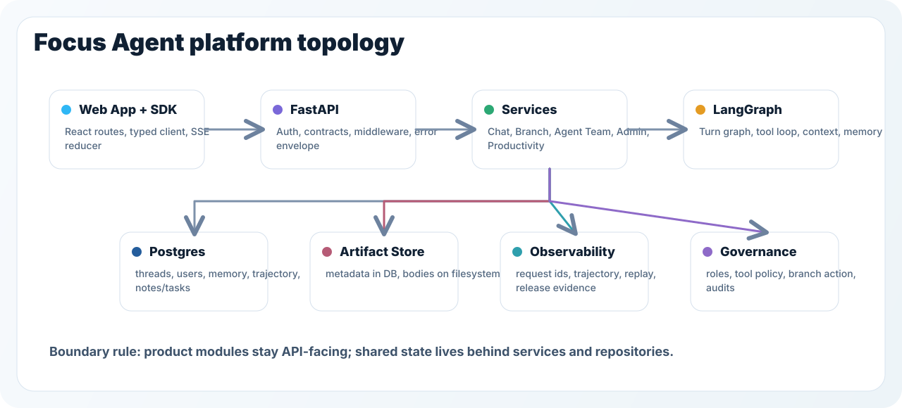

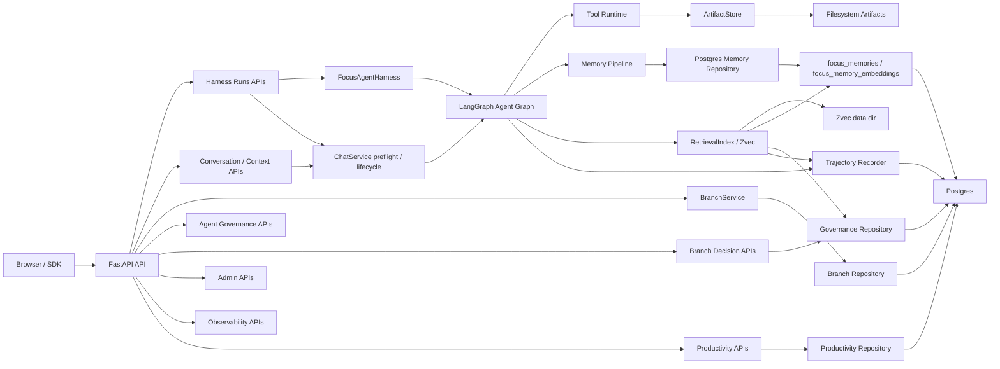
```mermaid
flowchart LR
    User["Browser / SDK"] --> API["FastAPI API"]
    API --> HarnessRoutes["Harness Runs APIs"]
    API --> ChatRoutes["Conversation / Context APIs"]
    API --> Branch["BranchService"]
    API --> Governance["Agent Governance APIs"]
    API --> Decision["Branch Decision APIs"]
    API --> Admin["Admin APIs"]
    API --> Obs["Observability APIs"]
    API --> Productivity["Productivity APIs"]
    HarnessRoutes --> Harness["FocusAgentHarness"]
    HarnessRoutes --> Chat["ChatService preflight / lifecycle"]
    ChatRoutes --> Chat
    Harness --> Graph["LangGraph Agent Graph"]
    Chat --> Graph["LangGraph Agent Graph"]
    Graph --> Tools["Tool Runtime"]
    Graph --> Memory["Memory Pipeline"]
    Graph --> Retrieval["RetrievalIndex / Zvec"]
    Graph --> Trace["Trajectory Recorder"]
    Branch --> Repo["Branch Repository"]
    Decision --> GovRepo["Governance Repository"]
    Memory --> MemoryRepo["Postgres Memory Repository"]
    MemoryRepo --> MemoryTables["focus_memories / focus_memory_embeddings"]
    Retrieval --> Zvec["Zvec data dir"]
    Retrieval --> MemoryTables
    Retrieval --> GovRepo
    Retrieval --> Trace
    Trace --> PG["Postgres"]
    Repo --> PG
    Productivity --> ProductivityRepo["Productivity Repository"]
    ProductivityRepo --> PG
    GovRepo --> PG
    MemoryTables --> PG
    Tools --> ArtifactStore["ArtifactStore"]
    ArtifactStore --> Artifacts["Filesystem Artifacts"]
```

## 3. 代码分层

| 路径 | 责任 |
|------|------|
| `src/focus_agent/api/` | FastAPI app、contracts、contract models、route utils、deps、middleware、errors |
| `src/focus_agent/api/routers/` | 按域拆分的路由：harness runs、branches、branch decisions、agent team、admin、auth、memory、productivity、observability 等 |
| `src/focus_agent/api/streaming/` | SSE response helper 和公共 streaming response headers |
| `src/focus_agent/config_parts/` | Settings 子域加载、模型/工具 catalog TOML 解析、环境变量与安全校验 |
| `src/focus_agent/defaults/` | 包内默认配置数据；当前内置模型 provider/model catalog 只维护在 `models.toml` |
| `src/focus_agent/engine/` | `AppRuntime` 创建、LangGraph 图 facade（`graph_builder.py` + `graph/`）、graph node/policy helpers、模型工厂、本地 fallback persistence |
| `src/focus_agent/harness/` | FocusAgentHarness、RunManager、stream bridge、middleware stack、subagents、run journal |
| `src/focus_agent/core/` | state、branching、request context、context policy facade、context assembly/budget/tool-observation helpers、merge review |
| `src/focus_agent/services/` | ChatService、BranchService、AgentTeamService 等 API-facing 业务服务；实现优先在 `services/chat/`、`services/branches/`、`services/agent_team/` 等 package |
| `src/focus_agent/services/*` 顶层 shim | 大量 `import *` / re-export 兼容 facade（计入 compat baseline）；**找实现时优先进子 package** |
| `src/focus_agent/branch_decision/` | branch decision / pre-turn recommendation 的 signal collection、scoring 和 service |
| `src/focus_agent/repositories/` | Postgres / SQLite repository、schema（`SCHEMA_VERSION`）、trajectory、artifact metadata |
| `src/focus_agent/runtime/` | 运行时共享工具；当前包含进程级共享线程池和关闭钩子 |
| `src/focus_agent/memory/` | memory model、retriever、extractor、writer、curator、policy、dedupe、embedding provider/service/policy |
| `src/focus_agent/retrieval/` | `RetrievalIndex` protocol、Zvec adapter、memory/artifact/skill/trajectory/branch/team/failure/governance/workspace indexing helpers |
| `src/focus_agent/capabilities/` | default tools、tool registry、tool runtime facade、tool execution/cache/messages/parallel helpers、tool router；default tools 按 workspace、git、web、artifact、memory、conversation、productivity 模块拆分 |
| `src/focus_agent/skills/` | skill registry、skill metadata、skill view rendering、bundled skills |
| `src/focus_agent/delegation/` | role/tool/model routing、delegation planning、task ledger、execution registry（治理与委派逻辑） |
| `src/focus_agent/multi_agent/` | multi-agent coordination 相关运行时组件（与 Agent Team v2 flags 协同） |
| `src/focus_agent/observability/` | trajectory record、actions、tracing facade、OTel runtime |
| `src/focus_agent/storage/` | namespace helpers、import helpers、`ArtifactStore` protocol 和 local filesystem implementation |
| `src/focus_agent/security/` | SSRF / URL 安全等防护 helpers |
| `src/focus_agent/eval/` | eval runner / judges 框架 |
| `src/focus_agent/web/` | React build serving 和 Vite dev redirect |
| `apps/web/src/` | React app shell、pages、features、entities、shared UI、`android-local-runtime/` |
| `frontend-sdk/src/` | typed client facade、domain client modules、type barrels、guards、stream parser、reducers |
| `android/` | Capacitor 原生壳与 Android 工程 |

### 3.1 维护边界

当前代码库已经超过“单一 agent demo”的规模，维护时按平台边界拆分，而不是按文件类型拆分：

| 边界 | 包含内容 | 改动原则 |
|------|----------|----------|
| Core runtime | `engine/`、`harness/`、`core/`、conversation / branch / graph lifecycle | 保持协议稳定；新能力优先进入 typed port 或小型 helper，避免在 API route 中直接拼接 runtime 细节 |
| Product surfaces | FastAPI routes、Web app、SDK、Admin、Observability | 路由、SDK 类型、SSE event 和用户可见主流程是兼容边界；route handler 只保留鉴权、参数校验和 presenter 组装 |
| Agent Team module | `services/agent_team/`、`services/agent_team_run*`、`apps/web/src/features/agent-team`、Agent Team API、v2 schema/flags | 作为独立产品模块维护；planning/run/merge、workbench state、task output helper 分别收口；**v2 执行默认 flag 关闭**，UI 可见不等于 runtime ready |
| Persistence adapters | Postgres / SQLite repositories、schema、migration、本地 fallback | schema 和 repository contract 是稳定边界；兼容路径先用引用扫描证明安全，再删除 |
| Mobile local runtime | `apps/web/src/android-local-runtime/`、Capacitor 原生桥 | 与 server-backed Web 并行；协议与能力变更必须单独验证，避免 silently drift |
| Release and eval tooling | `scripts/`、release/eval/smoke tests、contract snapshots | CLI 参数、exit code、报告字段稳定；重复 I/O 和 report 读取可抽 helper，但不改变输出 shape |
| Compatibility surface | 顶层 `agent_*.py` / `services/*` re-export facade | 1.x 仍受支持；新增代码应 import 新路径；删除须满足 compat exit criteria |

`make architecture-report` 生成 `reports/architecture/latest.json`，用于本地观察大型文件和 import 边界信号；`make architecture-gate` 使用同一份 canonical 800 行策略和 `docs/architecture-debt-baseline.json` 在 CI 中阻断回归。当前 baseline 没有 grandfathered large file；发现问题后应按模块边界拆小 helper 或调整依赖方向，而不是放宽阈值。

当一个改动跨越两个以上边界时，默认拆成多阶段：先抽私有 helper 或 typed port，再迁移调用点，最后才考虑删除 compatibility alias。

### 3.2 读代码时的“权威路径”

| 场景 | 优先阅读 |
|------|----------|
| 一次用户消息如何变成 SSE | `api/routers/harness_runs/` → `services/chat/` → `engine/graph*` → `transport/stream_events.py` → `frontend-sdk` parser/reducers |
| 分支如何创建/合并 | `branch_decision/` + `services/branches/` + branch/merge routers |
| 运行态如何装配 | `engine/runtime.py`（`create_runtime` / `AppRuntime`） |
| 工具如何执行 | `capabilities/` + sandbox service + tool policy in `engine/graph/` |
| Agent Team session | `services/agent_team*` + `api/routers/agent_team.py` + `docs/agent-team-v2-rollout.md` |
| Android 本地语义 | `apps/web/src/android-local-runtime/` + `docs/android.md` |

## 4. App Runtime

`src/focus_agent/engine/runtime.py` 中的 `create_runtime()` 是后端运行态装配点。它先调用 `ensure_runtime_directories(settings)` 创建运行时目录，再按小型 factory 组装运行态：

- `RuntimePersistence`：`checkpointer`、`store`、branch repository、trajectory recorder、artifact metadata repository。
- `RuntimeMemoryComponents`：`memory_policy`、`memory_retriever`、`memory_writer`、`memory_extractor`、`memory_embedding_service`。
- `RuntimeRegistries`：`skill_registry`、`tool_registry`。
- `RuntimeServices`：`branch_service`、`branch_decision_service`、`agent_team_service`、`user_service`、`productivity_service`。

这些结构由 `_create_runtime_persistence()`、`_create_memory_components()`、`_create_runtime_registries()`、`_create_runtime_graph()` 和 `_create_runtime_services()` 分段创建，最后汇总为 `AppRuntime`。`AppRuntime` 仍保留稳定字段：

- `graph`：LangGraph 编译后的 Agent 执行图。
- `repo`：conversation / branch / thread access repository。
- `branch_service`：fork、merge 和 branch tree 业务服务。
- `branch_decision_service`：post-turn branch decision 和 pre-turn branch recommendation 业务服务。
- `agent_team_service`：Agent Team session / task / output 业务服务。
- `user_service`：local user/session/role 业务服务。
- `productivity_service`、`productivity_repository`：owner-scoped notes/tasks/capture 业务服务和 repository。
- `coordination_backend`、`background_worker`：thread lease、durable background job 和后台 side-effect 调度。
- `checkpointer`：LangGraph checkpoint persistence。
- `store`：LangGraph store，用于 checkpoint/graph 兼容路径和无数据库 local fallback。
- `memory_repository`：PostgreSQL canonical memory repository，读写 `focus_memories`、audit/tombstone/candidate 和可重建的 `focus_memory_embeddings`。
- `memory_policy`、`memory_retriever`、`memory_writer`、`memory_extractor`。
- `memory_embedding_service`、`memory_embedding_provider`、`memory_embedding_backend_error`。
- `retrieval_index`、`retrieval_index_error`：默认 Zvec embedded retrieval index；Postgres/文件系统仍是 canonical store，Zvec 可删除后 backfill。
- `skill_registry`、`tool_registry`。
- `trajectory_recorder`。
- `artifact_metadata_repository`。
- `otel_runtime`。

当 `DATABASE_URI` 存在时，runtime 选择 Postgres primary persistence，并初始化 `PostgresMemoryRepository`。默认 memory embedding backend 为 `auto`，会优先探测本地 Ollama `embeddinggemma`。默认 retrieval backend 为 Zvec，data dir 来自 `AGENT_ZVEC_DATA_DIR`；pgvector v10 schema 由 `AGENT_MEMORY_PGVECTOR_EXTENSION_MODE` 管理，作为兼容/fallback 路径。无 `DATABASE_URI` 时使用 local fallback，memory repository 和 pgvector shadow 不可用，但本地 Zvec index 仍可用于可重建的 workspace/artifact/skill 等索引。配置解析由 `Settings.from_env()` 完成；目录创建副作用集中在 `ensure_runtime_directories(settings)`，并由 runtime 入口调用。

### 4.1 Perf P1/P2 Runtime Path

`perf-p1` 和 `perf-p2` 把高频同步 I/O 从请求热路径拆开，但所有改动都保留 feature flag 回滚口：

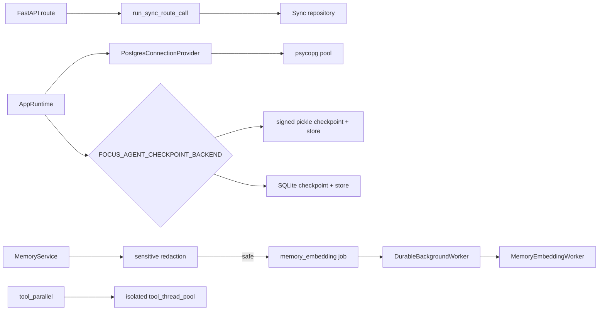
```mermaid
flowchart LR
    API["FastAPI route"] --> RouteHelper["run_sync_route_call"]
    RouteHelper --> Repo["Sync repository"]
    Runtime["AppRuntime"] --> PGProvider["PostgresConnectionProvider"]
    PGProvider --> PGPool["psycopg pool"]
    Runtime --> CheckpointChoice{"FOCUS_AGENT_CHECKPOINT_BACKEND"}
    CheckpointChoice --> Pickle["signed pickle checkpoint + store"]
    CheckpointChoice --> SQLite["SQLite checkpoint + store"]
    Memory["MemoryService"] --> Redact["sensitive redaction"]
    Redact -->|safe| Queue["memory_embedding job"]
    Queue --> Worker["DurableBackgroundWorker"]
    Worker --> Embedding["MemoryEmbeddingWorker"]
    Tools["tool_parallel"] --> ToolPool["isolated tool_thread_pool"]
```

Key boundaries:

- Postgres repositories share `PostgresConnectionProvider`; `FOCUS_AGENT_DB_POOL_ENABLED=false` restores short-lived connections.
- Local checkpoint writes are debounced by default; `FOCUS_AGENT_CHECKPOINT_INCREMENTAL=false` restores per-write flush.
- Local LangGraph checkpoints and the local store both use SQLite by default.
- `FOCUS_AGENT_CHECKPOINT_BACKEND=pickle` explicitly switches both local files to pickle. When `FOCUS_AGENT_CHECKPOINT_VERIFY_SIGNATURE=true`, startup requires a stable `FOCUS_AGENT_CHECKPOINT_HMAC_KEY` before either file is created; owner and HMAC validation remain mandatory on restore.
- Memory writes enqueue `memory_embedding` durable jobs when `FOCUS_AGENT_MEMORY_EMBED_ASYNC=true`; setting it to `false` restores synchronous best-effort embedding.
- Tool execution uses `tool_thread_pool` when `FOCUS_AGENT_TOOL_POOL_ISOLATED=true`; setting it to `false` returns tool batches to the shared pool.

Operational metrics to watch during rollout:

- `/readyz.active_connections` for DB pool activity.
- `focus_agent.tool_pool.active` and `focus_agent.tool_pool.queue` for tool pool saturation.
- `agent_team_scheduler_lock_wait_ms` for scheduler lock contention.
- durable background job pending/retry/dead-letter counts for `memory_embedding` backlog.
- checkpoint benchmark output from `scripts/bench_checkpoint.py` for local fallback write latency and file growth.

## 5. 模型 Provider 与 Catalog

模型路径现在收口成一个配置驱动链路：

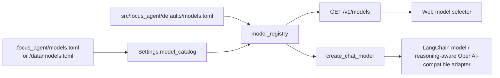
```mermaid
flowchart LR
    Builtin["src/focus_agent/defaults/models.toml"] --> Registry["model_registry"]
    Local[".focus_agent/models.toml or /data/models.toml"] --> Settings["Settings.model_catalog"]
    Settings --> Registry
    Registry --> API["GET /v1/models"]
    Registry --> Factory["create_chat_model"]
    API --> Web["Web model selector"]
    Factory --> Adapter["LangChain model / reasoning-aware OpenAI-compatible adapter"]
```

边界：

- 包内默认 provider/model 只在 `src/focus_agent/defaults/models.toml` 维护，避免在 Python 里重复写 provider/model tuple。
- 本地部署通过 `.focus_agent/models.toml` 覆盖；容器部署通过 `/data/models.toml` 覆盖。
- `Settings` 加载本地 catalog 后由 `model_registry` 合并包内默认与本地配置，并校验 provider id、alias 冲突、重复 model、未知 provider 引用等错误。
- `/v1/models` 暴露 model id、provider label、thinking capability 和可选 logo metadata；Web model selector 优先使用后端返回的 metadata，不再按 provider 写死文案。
- OpenAI-compatible 且需要 `reasoning_content` 透传的模型走 `ReasoningAwareChatOpenAI`；`MoonshotChatOpenAI` 仍作为旧导入别名保留。
- 新增单部署模型时优先改 `.focus_agent/models.toml` 和 `.focus_agent/local.env`；只有要成为所有新环境的内置默认支持时，才改包内 `defaults/models.toml`。

## 6. API Surface

API 路由集中在 `src/focus_agent/api/main.py`：

| 分组 | 代表路径 | 说明 |
|------|----------|------|
| Health | `GET /healthz`、`GET /readyz`、`GET /metrics` | 存活、就绪、指标 |
| Web App | `GET /app`、`GET /app/zh`、`GET /app/{path:path}` | React build serving 或 Vite redirect |
| Auth | `POST /v1/auth/demo-token`、register / login / refresh / logout / change-password / sessions、`GET /v1/auth/me` | 本地 demo token、用户名密码登录、refresh session、账号自助和当前 principal |
| Models | `GET /v1/models` | 模型目录和能力 |
| Conversations | `GET/POST/PATCH /v1/conversations`、archive / activate | root thread 会话管理 |
| Harness Runs | `POST /v2/threads/{thread_id}/runs`、`/runs/stream`、`/runs/resume/stream`、`POST /v2/threads/{thread_id}/runs/cancel`、`POST /v2/runs/{run_id}/stream`、`GET /v2/runs/{run_id}`、`POST /v2/runs/{run_id}/cancel`、`GET /events|snapshot|trajectory` | V2 harness run、流式 run、resume、按 thread 或 run 取消、事件回放、snapshot、trajectory |
| Threads | `GET /v1/threads/{thread_id}`、`GET /v1/threads/{thread_id}/resolution`、`POST /v1/threads/{thread_id}/context/preview`、`POST /v1/threads/{thread_id}/context/compact` | 线程状态读取、root/child 线程引用解析、当前上下文窗口预览和非破坏式压缩 |
| Branches | fork、archive、activate、rename、proposal、merge、tree、branch action execute/dismiss | 分支生命周期、root/child-aware branch tree 和用户确认的分支动作 |
| Branch Decisions | `GET /v1/branch-decisions/config`、`GET /v1/threads/{thread_id}/branch-decisions`、decision promote / dismiss | post-turn 决策记录和 pre-turn recommendation 证据 |
| Agent | `/v1/agent/*`、`GET /v1/agent/feedback/trend` | governance preview、policy、records、evaluate APIs 和反馈趋势聚合 |
| Agent Team | `/v1/agent-team/*` | Mission session、DAG planning/run、task lifecycle、outputs、merge bundle 和 merge decision |
| Memory | `GET /v1/memory`、`/audit`、`/candidates`、`POST /v1/memory/{memory_id}/forget` | memory list/detail/audit/candidate/forget surface |
| Productivity | `GET/POST /v1/notes`、`GET/PATCH /v1/notes/{note_id}`、`GET/POST /v1/tasks`、`GET/PATCH /v1/tasks/{task_id}`、`POST /v1/tasks/{task_id}/complete`、`POST /v1/tasks/{task_id}/archive`、`GET /v1/tasks/{task_id}/events`、`POST /v1/productivity/capture/note`、`POST /v1/productivity/capture/task` | owner-scoped notes/tasks workbench，包含 capture 与事件追踪 |
| Admin | `/v1/admin/config`、`/v1/admin/config/{models,tools,policies,skills}`、`/v1/admin/config/skills/refresh`、`/v1/admin/users/*`、`/v1/admin/audit-events` | 设置中心、模型/工具/策略/Skill 配置、用户目录、详情、会话撤销、密码重置、状态、角色和审计事件管理 |
| Observability | `/v1/observability/*` | overview、trajectory、stats、replay、promote |

API 层保持薄封装：鉴权、参数校验和 response shape 在 API；业务流程在 services、runtime、repositories 和 graph nodes。

`src/focus_agent/api/deps.py` 是 API dependency 的 canonical 入口：

- `get_current_principal()` 接受 Bearer 或 auth access cookie，并在 auth enabled
  时对每次受保护请求重新读取持久化 active user；已禁用用户即使持有未过期
  access token 也会被拒绝。auth disabled 时返回 anonymous principal。
- `get_optional_principal()` 用于允许匿名读取或渐进鉴权的路由。
- `require_scopes()` / `require_roles()` 为路由级 scope / role enforcement 提供 dependency helper。
- `get_chat_service()` 通过 `ChatServicePorts.from_runtime(runtime)` 创建 `ChatService`，避免 ChatService 直接依赖完整 runtime 对象。

### 6.1 Productivity API 与数据边界

生产力模块包含独立的 note/task CRUD 与 capture 入口，路由位于
`src/focus_agent/api/routers/productivity.py`，并由 `AppRuntime` 上挂载的
`productivity_service` 与 `productivity_repository` 运行。

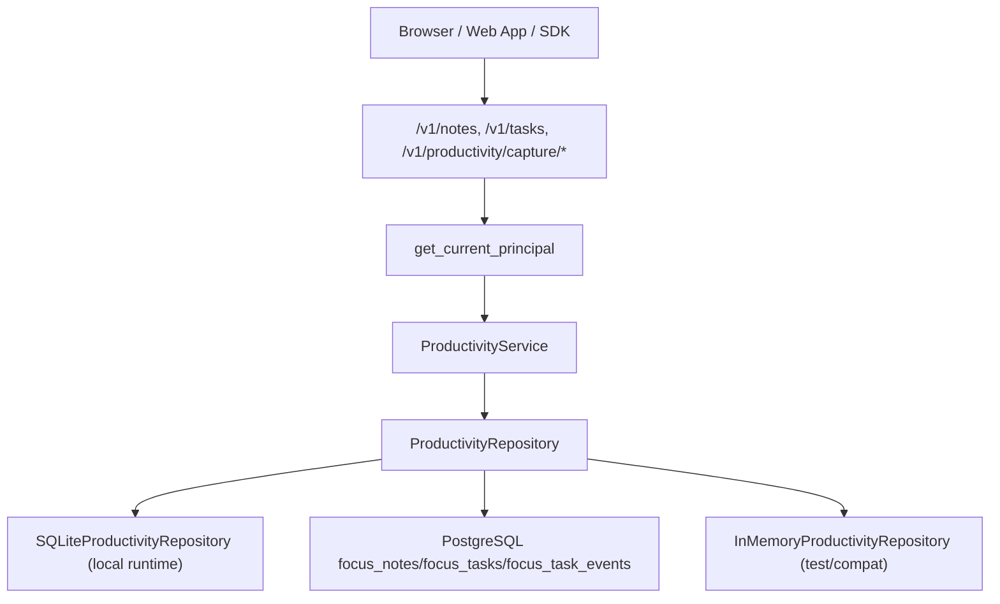
```mermaid
flowchart TD
    Producer["Browser / Web App / SDK"] --> APIRouter["/v1/notes, /v1/tasks, /v1/productivity/capture/*"]
    APIRouter --> AuthN["get_current_principal"]
    AuthN --> ProductService["ProductivityService"]
    ProductService --> Repo["ProductivityRepository"]
    Repo --> SQLite["SQLiteProductivityRepository (local runtime)"]
    Repo --> Postgres["PostgreSQL focus_notes/focus_tasks/focus_task_events"]
    Repo --> InMemory["InMemoryProductivityRepository (test/compat)"]
```

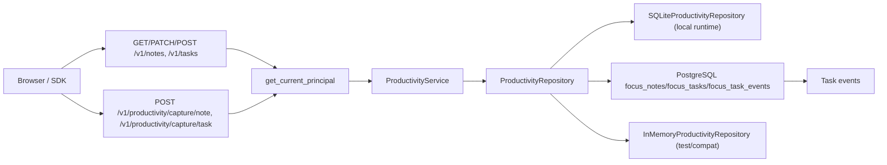
```mermaid
flowchart LR
    BrowserWebSDK["Browser / SDK"] --> NotesTasks["GET/PATCH/POST /v1/notes, /v1/tasks"]
    BrowserWebSDK --> Capture["POST /v1/productivity/capture/note, /v1/productivity/capture/task"]
    NotesTasks --> AuthN["get_current_principal"]
    Capture --> AuthN
    AuthN --> ProductService["ProductivityService"]
    ProductService --> Repo["ProductivityRepository"]
    Repo --> SQLite["SQLiteProductivityRepository (local runtime)"]
    Repo --> PG["PostgreSQL focus_notes/focus_tasks/focus_task_events"]
    Repo --> InMemory["InMemoryProductivityRepository (test/compat)"]
    PG --> Events["Task events"]
```

边界规则：

- 持久化对象始终按 `user_id` 作用域读取和写入，owner 不一致会得到 404/空列表，避免列表与操作跨用户泄露。
- 笔记支持归档/恢复、标题-内容、标签检索、关键字搜索、来源元数据（`source_*`）和来源追踪字段。
- 任务支持 `todo`、`in_progress`、`completed`、`archived` 状态迁移；`complete` 与 `archive` 通过专用接口封装业务语义。
- 每次任务更新会写入 `focus_task_events`，用于回看历史变更；capture 接口会按 `source_kind`/`payload` 补齐可追溯元数据。
- 列表接口参数：
  - notes：`q`、`tag`、`include_archived`、`limit`、`offset`
  - tasks：`status`、`include_archived`、`limit`、`offset`
- SDK/前端目前仍会在列表请求里附带 `source_kind`（用于来源筛选 UI），但当前 API 路由未声明该查询参数，因此会被忽略；若要恢复服务端过滤，需要先扩展路由+repository+测试契约。
- `GET /v1/notes/{note_id}`、`GET /v1/tasks/{task_id}` 均为 owner-scoped；不存在或无权限时返回 404。

### 6.2 Admin Console 和设置中心边界

认证、账号自助和 access model 的 canonical 文档是 [auth-access.md](auth-access.md)；Admin Console 的 canonical 文档是 [admin-console.md](admin-console.md)。架构层只保留安全边界：

- 管理员身份来自持久化用户角色和权限，不来自 bearer token scope 本身。
- `AUTH_ENABLED=false` 时的 anonymous principal 仍不是 admin。
- local/development 可以通过首个非匿名用户或 `AUTH_BOOTSTRAP_ADMIN_USER_IDS` bootstrap admin；生产数据库必须显式配置管理员并关闭 demo token。
- 状态、角色、会话撤销和密码重置动作需要 reason，并写入 admin audit event。
- 最后一个 active admin 不能被禁用，也不能失去 admin 角色。
- 设置中心通过 Admin API 更新模型、工具、策略和 Skill 配置；Skill 启停必须同时影响 registry 的搜索、前缀触发、语义匹配和 prompt 注入。
- MCP Server 目前只在设置中心作为扩展连接入口保留，架构层不把它描述成已具备完整 lifecycle 管理。

## 7. Harness Run 数据流

Harness run 是默认聊天入口。非流式、流式和 resume 入口最终都会汇入 V2 harness runtime、RunManager、StreamBridge、graph 执行、状态落盘和 trajectory 记录路径。下图把共享生命周期和分支点压缩在一起：

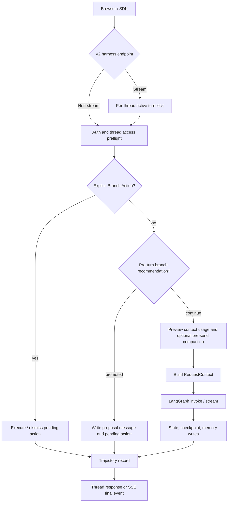
```mermaid
flowchart TD
    Client["Browser / SDK"] --> Entry{"V2 harness endpoint"}
    Entry -- "Non-stream" --> Preflight["Auth and thread access preflight"]
    Entry -- "Stream" --> Lock["Per-thread active turn lock"]
    Lock --> Preflight
    Preflight --> Action{"Explicit Branch Action?"}
    Action -- "yes" --> ExecuteAction["Execute / dismiss pending action"]
    Action -- "no" --> Recommendation{"Pre-turn branch recommendation?"}
    Recommendation -- "promoted" --> Proposal["Write proposal message and pending action"]
    Recommendation -- "continue" --> Usage["Preview context usage and optional pre-send compaction"]
    Usage --> Context["Build RequestContext"]
    Context --> Graph["LangGraph invoke / stream"]
    Graph --> Persist["State, checkpoint, memory writes"]
    Persist --> Trace["Trajectory record"]
    ExecuteAction --> Trace
    Proposal --> Trace
    Trace --> Response["Thread response or SSE final event"]
```

### 7.1 非流式 run

```text
POST /v2/threads/{thread_id}/runs
  -> authenticate principal
  -> harness request preflight access
  -> RunManager create run record
  -> explicit Branch Action intent, if present
  -> pre-turn branch recommendation, if enabled
  -> RequestContext
  -> graph.invoke
  -> final AgentState
  -> trajectory record
  -> ThreadStateResponse
```

### 7.2 流式 run

```text
POST /v2/threads/{thread_id}/runs/stream
  -> authenticate principal
  -> RunManager create run record
  -> explicit Branch Action intent, if present
  -> pre-turn branch recommendation, if enabled
  -> graph stream
  -> map LangGraph updates to canonical SSE events
  -> message / reasoning / tool / task / state / run events
  -> final thread state
  -> trajectory record
```

`ChatService` 使用 per-thread active turn lock，避免同一 thread 同时写入多个 turn。服务本身依赖 `ChatServicePorts` 窄端口，当前端口只暴露 settings、graph、repo、branch service、skill registry、trajectory recorder 和 checkpointer；调用方仍可从 `AppRuntime` 适配出 ports，但 chat 编排逻辑不再直接绑定完整 runtime。

流式响应的 FastAPI `StreamingResponse` 组装由 `src/focus_agent/api/streaming/sse.py` 统一提供。路由层只负责创建事件迭代器，公共 helper 负责 `text/event-stream` media type、`Cache-Control: no-cache`、`Connection: keep-alive` 和 `X-Accel-Buffering: no` 这组 SSE headers。

### 7.3 流式可见文本边界

流式入口会把 LangGraph chunk 映射成 canonical SSE events，但 `message.delta` 有额外强约束：它只能承载确认可见的 assistant answer text。

- graph 内部模型调用会标记内部 `stream_phase`，工具绑定调用和 repair 调用默认 `quarantine`，最终 tool-free answer 才能标为 `visible`。
- `src/focus_agent/api/routers/harness_runs/replay_streaming.py` 在发布
  `message.delta` 前做 phase gate；缺省 phase 也按 `quarantine` 处理。
- `tool.call.delta`、`tool.requested/result/error`、`reasoning.delta`、`task.update` 和 `state.update` 不受 visible gate 阻断，工具处理卡仍能正常展示。
- DSML/XML/function-call 文本、内部工具规划口播和 split protocol prefix 会在后端与 SDK reducer 两侧过滤。
- 对外事件 payload 不暴露内部 `stream_phase` metadata/tags。

完整契约见 [streaming-contract.md](streaming-contract.md)。

## 8. LangGraph 主路径

核心图入口仍是 `src/focus_agent/engine/graph_builder.py`。该文件现在主要负责节点/边注册；节点实现、tool policy、message repair、plan/reflect、memory 与 tool executor 逻辑拆在同目录 `graph_*` 模块中。主路径保留 legacy single-run，同时可插入 governance 记录：

```text
bootstrap_turn
  -> retrieve_memories
  -> assemble_context
  -> role_route_dry_run
  -> delegation_governance
  -> plan
  -> agent_loop
       -> tool_executor -> agent_loop
       -> reflect
       -> summarize_turn
  -> extract_memories
  -> write_memories
  -> maybe_interrupt_for_merge
```

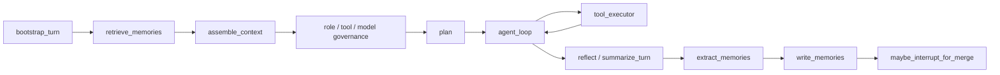
```mermaid
flowchart LR
    Bootstrap["bootstrap_turn"] --> Retrieve["retrieve_memories"]
    Retrieve --> Assemble["assemble_context"]
    Assemble --> Govern["role / tool / model governance"]
    Govern --> Plan["plan"]
    Plan --> Loop["agent_loop"]
    Loop --> Tools["tool_executor"]
    Tools --> Loop
    Loop --> Reflect["reflect / summarize_turn"]
    Reflect --> Extract["extract_memories"]
    Extract --> Write["write_memories"]
    Write --> Merge["maybe_interrupt_for_merge"]
```

关键点：

- `retrieve_memories` 从可读 namespace 检索 durable memory。
- `assemble_context` 组装 recent messages、rolling summary、memory block、skill block 和 prompt budget。
- `agent_loop` 根据 tool policy 与 Tool Router 绑定工具；模型创建和 bind-tools 缓存由 `engine/model_factory.py` 承担。
- message/tool-call repair helpers 保持在 graph builder/message helper 边界内，避免 provider stream chunk 泄漏到 prompt。
- `tool_executor` 执行工具、处理缓存、fallback 和观察裁剪。
- `reflect` 只在 Plan-Act-Reflect 开启并产生 plan 时参与。
- `extract_memories` / `write_memories` 是 turn 后记忆写入路径。
- `maybe_interrupt_for_merge` 对 merge proposal 触发 human review interrupt。

## 9. Agent State

`src/focus_agent/core/state.py` 定义跨节点状态。主要类别：

- Conversation：`messages`、`rolling_summary`、`recent_messages`
- User intent：`task_brief`、`active_goal`、`user_constraints`、`pinned_facts`
- Branch：`branch_meta`、`branch_local_findings`、`imported_findings`、`merge_queue`
- Prompt surface：`assembled_context`、`memory_prompt_block`、`available_skills_block`
- Context window：`context_budget`、`context_compaction`；`context_usage` 是响应层派生估算，不作为持久化 state 字段写入
- Runtime choice：`selected_model`、`selected_thinking_mode`
- Governance：`role_route_plan`、`tool_route_plan`、`model_route_decision`、`agent_delegation_plan`
- Context Engineering：`context_budget_decision`、`context_compression_plan`、`context_artifact_refs`、`role_context_views`
- Ledger and critic：`agent_task_ledger`、`delegated_artifacts`、`artifact_synthesis_result`、`critic_gate_result`
- Memory write：`memory_write_requests`、`memory_write_result`
- Planning：`plan`、`current_step_id`、`reflection`、`plan_meta`

内容型状态可以通过 review 后显式 merge；执行策略、prompt surface 和 runtime choice 属于当前 turn，不应自动回流。

## 10. 分支、Branch Action 与 Merge-back

分支业务与兼容导出统一位于 `src/focus_agent/services/branches/` package。
聊天里的分支意图
先进入 Branch Action proposal；用户确认后才 fork、open 或 return。AI 辅助
的发送前推荐由 [branch-decisions.md](branch-decisions.md) 维护。

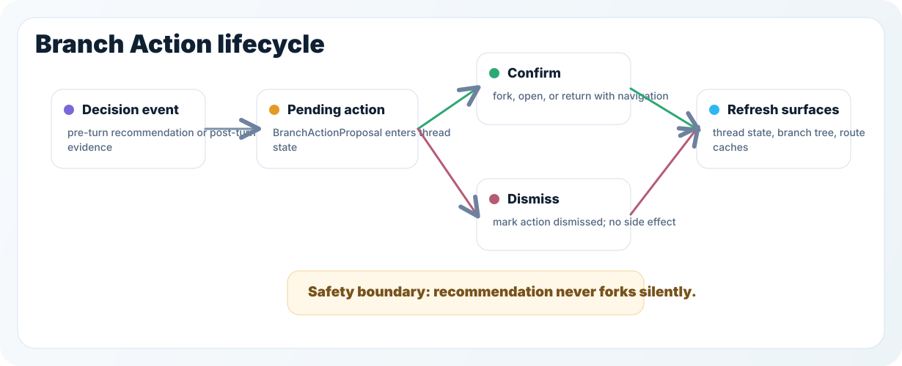

```text
main thread
  -> fork branch
  -> child thread receives branch_meta and checkpoint
  -> user explores, executes, verifies, or writes in branch
  -> branch-local findings are collected
  -> merge proposal is prepared
  -> user applies merge decision
  -> imported findings become visible to parent
  -> optional memory promotion
```

约束：

- `root_thread_id` 表示整棵会话树。
- `child_thread_id` 是分支自己的 LangGraph thread。
- repository 的 `resolve_thread_ref()` 和 `GET /v1/threads/{thread_id}/resolution` 是 root/child 解析边界；branch tree 可以从 root 或 child 打开，最终按 canonical root 查询。
- archive/activate/rename/proposal/merge 等 child-only 操作会显式拒绝 root thread id，并返回 400 诊断，而不是把 root 误报为未知分支。
- `local_snapshot_seed` fork 会先净化父线程快照：移除复制过来的 Branch Action 控制消息、已执行确认回执、临时 tool / prompt / agent 状态，并用 `branch_fork_message_count` 记录新分支初始可见消息边界。
- Branch Action 的 `handoff_message` 会在新 child / sibling thread 中作为唯一交接 user message 注入；如果 seed 中已经有相同 human message，auto-run 不会重复追加。
- UI transcript、模型消息组装和 context preview 都使用 branch-visible message 过滤，避免同级分支上下文或旧确认卡泄漏进新分支。
- `branch_depth` 受 `BRANCH_MAX_DEPTH` 控制。
- merged branch 在前后端都按只读处理。
- branch role 会根据第一轮分支交互更新为 execute、verify、deep dive、alternatives、writeup 等语义。
- imported conclusion 可写入父线程状态，并可进入 memory pipeline。
- pre-turn branch recommendation 可以生成 `fork_child_branch` 或 `fork_sibling_branch` 的 pending Branch Action，但不会直接执行 fork。

## 11. Memory 概览

Memory 的 canonical 文档是 [memory-system-v2.md](memory-system-v2.md)。架构层只保留边界：

- `MemoryRetriever`：根据 RequestContext、state、query 和 prompt mode 检索，默认先走共享 `RetrievalIndex` / Zvec，再回查 Postgres canonical memory 做 namespace/status/tombstone 校验；Zvec 不可用时降级到 FTS/ILIKE 与可选 pgvector fallback。
- `MemoryExtractor`：从 turn 中提取候选记忆。
- `MemoryWriter`：按 policy、dedupe、semantic key 和 conflict 规则写入；Postgres 模式下委托 `MemoryService` 和 `MemoryRepository`。
- `MemoryEmbeddingService`：对长期语义 memory best-effort 写入 `focus_memory_embeddings`；短期上下文、规则、工作记忆、artifact/citation/tool observation 默认不进入向量索引。
- `MemoryCurator`：只治理 branch-local finding 是否 promotion 到主线。

Namespace 由 `src/focus_agent/storage/namespaces.py` 管理，区分 root thread、conversation main、branch local memory 等作用域。

## 12. Tool / Skill 概览

Tool / Skill 的 canonical 文档是 [tool-skill-design.md](tool-skill-design.md)。代码执行沙箱的 canonical 文档是 [sandbox-execution.md](sandbox-execution.md)。

分层：

- default tools：workspace/repo、git、web、artifact、memory、conversation 等工具，分别位于 `capabilities/default_tool_modules/` 下的独立模块。
- tool registry：把工具和 `ToolRuntimeMeta` 组合成 runtime registry。
- tool runtime：处理并行安全、缓存、fallback、观察裁剪；工具 timeout、并行工具调用和 delegated background execution 复用 `focus_agent.runtime.thread_pool.shared_thread_pool()`，并由调用点保留 batch / role 级并发限流。
- tool router：按 role、tool policy、risk、side effect 过滤工具。
- skill registry：暴露 prompt-first 技能说明，不把 skill 当成副作用工具；管理员可全局关闭 Skill 系统或禁用单个 Skill，禁用项仍可见但不会参与搜索、触发或 prompt 注入。
- artifact tools：通过 `ArtifactStore` protocol 读写正文，默认 `LocalArtifactStore` 仍写入 `ARTIFACT_DIR` 下的文件系统；Postgres 只保存 artifact metadata。
- retrieval tools：`memory_search`、`artifact_search` 和 `workspace_search` 默认使用共享 `RetrievalIndex`，Zvec 命中必须回查 canonical memory、artifact metadata/body 或当前 workspace 文件 hash 后才返回。
- 线程级沙箱执行：`run_workspace_command` 和声明式 `run_skill_entrypoint` 会构造 `SandboxExecutionRequest`，由 `SandboxExecutionService` 路由到 Docker backend 或显式 local fallback。同一 thread / branch 使用稳定 `sandbox_id` 和 `.focus_agent/sandboxes/threads/<sandbox_id>/workspace`；单次命令仍用 `run_id` 记录审计和输出。
- live web research：`live_web_research` policy 会要求 web evidence；相对时间问题先用 `current_utc_time` 锚定为绝对 UTC 日期/范围，再检索。证据 ledger 会过滤同 turn 中与当前 query 无关的 web result；缺失或过期证据会触发一次 `web_search` 修复，仍不可靠时返回明确不确定答案。

## 13. Agent Governance 概览

Agent governance 的 canonical 文档是 [agent-role-routing.md](agent-role-routing.md)。

架构层需要记住两点：

- 默认 off，legacy single-run path 不变。
- observe-first，enforce 能力逐步打开。

当前治理记录包括 role route、branch decision、tool route、memory curator、delegation、model router、self repair、review queue、context engineering、task ledger、artifact synthesis 和 critic gate。这些记录写入 AgentState、governance repository 与 trajectory `plan_meta`，供 Web console、eval 和 replay 使用。

## 14. 持久化

持久化分成三层：生产和容器联调优先使用 Postgres primary persistence，本地裸跑保留 fallback，artifact 正文始终留在文件系统。这个边界避免把大正文塞进数据库，也避免把本地便利路径误当成生产方案：

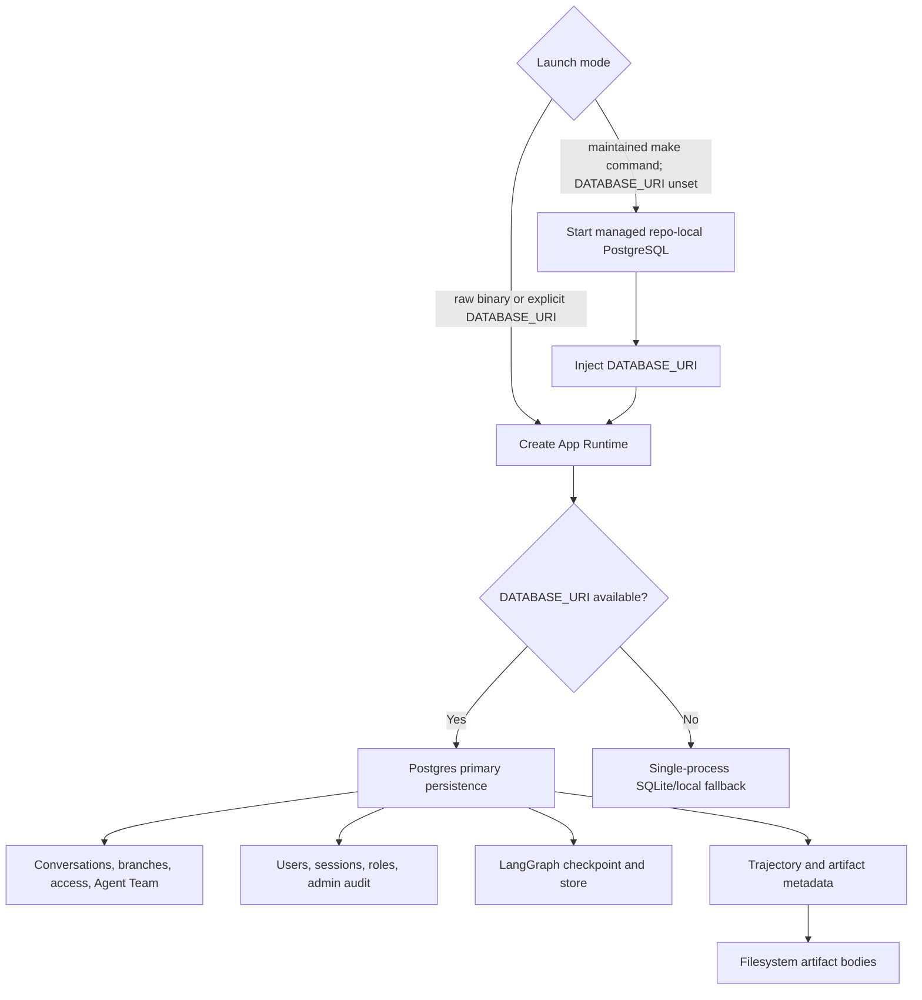
```mermaid
flowchart TD
    Launch{"Launch mode"}
    Launch -- "maintained make command; DATABASE_URI unset" --> Managed["Start managed repo-local PostgreSQL"]
    Managed --> Inject["Inject DATABASE_URI"]
    Launch -- "raw binary or explicit DATABASE_URI" --> Runtime["Create App Runtime"]
    Inject --> Runtime
    Runtime --> Decision{"DATABASE_URI available?"}
    Decision -- "Yes" --> PG["Postgres primary persistence"]
    Decision -- "No" --> Fallback["Single-process SQLite/local fallback"]
    PG --> AppState["Conversations, branches, access, Agent Team"]
    PG --> AdminState["Users, sessions, roles, admin audit"]
    PG --> GraphStore["LangGraph checkpoint and store"]
    PG --> TraceMeta["Trajectory and artifact metadata"]
    TraceMeta --> Files["Filesystem artifact bodies"]
```

### 14.1 Postgres primary persistence

配置 `DATABASE_URI` 后，主运行态数据走 Postgres primary persistence：

- conversation / branch / thread access
- Agent Team sessions / tasks / outputs / merge reviews
- users / roles / sessions / admin audit events
- LangGraph checkpoint/store
- artifact metadata
- trajectory turn / step observability tables
- branch decision / recommendation events
- productivity notes / tasks / task-events
- feedback events、context/memory evidence、skill selection events

应用 schema 位于 `src/focus_agent/repositories/postgres_schema.py`（`SCHEMA_VERSION`），
包括 conversation、thread access、branch、branch decision、artifact、Agent Team、
productivity、feedback、context/memory evidence、skill selection event、coordination
和 rate-limit 等表。当前 schema version 是 **v19**：

- v13：新增 productivity 主表 `focus_notes` / `focus_tasks` / `focus_task_events`
- v14：为 notes/tasks 增加来源元数据索引字段（`source_kind` / `source_id` / `source_url` / `pinned_context` / `captured_from`）
- v15：新增 multi-agent coordination 表
- v16：新增 `focus_rate_limit_buckets`
- v17：新增 `focus_branch_decision_events` 及其 idempotency 索引
- v18：`focus_memories.embedding_status` 列与索引（embedding worker 条件更新 / 防复活）
- v19：Agent Team v2 结构化表（revisions、task edges/attempts、checkpoints、approvals、jobs、resource leases、side-effect receipts、evidence、events 等）

仓库仍保留 `focus_schema_migrations` 和逐版本 Python migration 作为应用 schema 的真实迁移记录；Alembic `001_baseline` 通过 `ensure_app_postgres_schema_on_connection()` 桥接到这套迁移，Docker entrypoint 在存在 `DATABASE_URI` 时执行 `alembic upgrade head`。

Agent Team 的 v1 主表仍可使用 `data_json JSONB NOT NULL` 保存完整 Pydantic model，辅助列只用于按用户、root thread、session/task 和创建时间查询排序。v19 起补充了更细粒度的 v2 运行时表；是否走 v2 执行路径仍由 feature flags 控制（见 [agent-team-v2-rollout.md](agent-team-v2-rollout.md)）。schema migration 会逐版本执行，因此已有数据库会继续升级到当前 schema。

Artifact 正文仍在文件系统，Postgres 保存 metadata、relative path、checksum、source thread / branch、summary 等字段。工具侧通过 `ArtifactStore` protocol 访问正文；默认实现是 `LocalArtifactStore`。

### 14.2 Async repository boundary

Harness run journal 的接口保持 async。SQLite 和 Postgres journal 仍使用各自同步 DB driver，但同步 I/O 会通过共享线程池执行，并保留 journal 内部 `asyncio.Lock` 来串行 sequence-sensitive 写入。这避免了 run 创建、stream event 持久化、snapshot 和 trajectory 查询在 event loop 线程上直接阻塞，同时保持现有 repository contract 不变。

### 14.3 Local fallback persistence

未配置 `DATABASE_URI` 且直接裸跑 API 二进制时，runtime 使用：

- SQLite branch / conversation / thread-access repository
- In-memory Agent Team repository
- SQLite user and productivity repositories
- SQLite-backed LangGraph checkpointer
- SQLite-backed LangGraph store
- SQLite harness run journal
- no trajectory recorder
- no artifact metadata repository

branch、conversation、thread access、用户和 productivity 数据统一写入
`BRANCH_DB_PATH`（默认 `.focus_agent/branches.sqlite3`），因此直接重启裸跑 API
不会丢失这些 app-state。Agent Team 仍保留 in-memory fallback；trajectory 和
artifact metadata 也不会在该模式下获得 Postgres durability。这是单机本地
fallback，不是生产多副本方案。

LangGraph checkpoint/store 默认分别写入
`.focus_agent/langgraph-checkpoints.sqlite3` 和
`.focus_agent/langgraph-store.sqlite3`。`FOCUS_AGENT_CHECKPOINT_BACKEND=pickle`
只保留为显式兼容路径；签名校验默认开启并要求稳定
`FOCUS_AGENT_CHECKPOINT_HMAC_KEY`。如果 backend 未显式设置但发现历史 pickle，
runtime 只有在 pickle 与 `.sig` 都属于当前用户且 HMAC 校验通过时才继续使用；
owner、签名、格式或 key 校验失败都会在启动时 fail closed，不会静默创建空状态。

### 14.4 Managed repo-local PostgreSQL

本机启动命令（`make api`、`make dev`、`make serve`、`make serve-dev`、`make serve-prod`）会在未显式设置 `DATABASE_URI` 时自动托管 repo-local PostgreSQL，并把生成的运行态环境写入 `.focus_agent/postgres/runtime.env`。

直接运行 `.venv/bin/focus-agent-api` 不会启动托管数据库。历史 `.focus_agent` 状态需要通过 `focus-agent-migrate-local-state` 显式迁移。

迁移器同时识别 canonical SQLite 与 legacy signed-pickle checkpoint/store。
如果同一类源同时存在 SQLite 与 pickle，必须先显式设置
`FOCUS_AGENT_CHECKPOINT_BACKEND`；配置的 backend 与实际文件头不匹配、SQLite
schema 未知或存在活动 `-wal` / `-shm` sidecar 时都会拒绝迁移。迁移前应停止
本地 runtime，让 SQLite 完成 checkpoint。app-state 导入在 Postgres 端以一个
事务执行，并拒绝用不同 owner 覆盖已有 thread、conversation 或 branch。

### 14.5 Repository contract tests

Repository behavior is guarded by both implementation-specific tests and shared contract tests. `tests/test_agent_team_repository_contract.py` runs the same AgentTeam repository contract against the local fallback repository by default and against Postgres when `DATABASE_URI` is available; missing Postgres configuration skips only the Postgres cases. This keeps local fallback and Postgres primary semantics aligned for session, task, task output, ordering, upsert, and missing-record behavior.

## 15. Frontend 与 SDK

前端和 SDK 共享 API contract：Web App 不绕过 SDK 直接拼 response shape，SDK 也负责把流式事件规整成前端可消费的状态更新。边界如下：

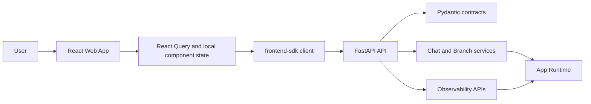
```mermaid
flowchart LR
    User["User"] --> Web["React Web App"]
    Web --> ClientState["React Query and local component state"]
    ClientState --> SDK["frontend-sdk client"]
    SDK --> API["FastAPI API"]
    API --> Contracts["Pydantic contracts"]
    API --> Services["Chat and Branch services"]
    API --> Obs["Observability APIs"]
    Services --> Runtime["App Runtime"]
    Obs --> Runtime
```

Web App 位于 `apps/web/src/`：

```text
app/                      router, shell, providers
pages/thread/             chat, branch tree, merge review
pages/agent-team/         Agent Team Mission Runner
pages/agents/             governance console
pages/auth/               login and registration
pages/account/            profile, password, and session self-service
pages/admin/              user and audit administration
pages/observability/      overview and trajectory workbench
pages/productivity/       note/task workbench（notes/tasks）
features/                 branch, conversation, merge, models, stream, trajectory
shared/                   config, query keys, SDK provider, UI, styles
```

主要入口：

- `/app`
- `/app/zh`
- `/app/c/{conversationId}/t/{threadId}`
- `/app/c/{conversationId}/t/{threadId}/review`
- `/app/agent-team`
- `/app/agent-team/{sessionId}`
- `/app/agent/memory`
- `/app/agent/roles`
- `/app/observability/overview`
- `/app/observability/trajectory`
- `/app/agent/governance`
- `/app/admin/users`
- `/app/admin/users/{userId}`
- `/app/admin/audit-events`
- `/app/productivity/notes`
- `/app/productivity/tasks`
- `/app/auth/login`
- `/app/auth/register`
- `/app/account/profile`
- `/app/account/security`
- `/app/account/sessions`

`frontend-sdk` 提供 typed client、types、guards、stream parser、transport、request errors 和 reducers。`src/client.ts` 是 `FocusAgentClient` facade，具体 endpoint 组装在 `src/client/` 下按 auth、admin、agent-team、agent-governance、productivity、thread/branch、observability、streaming 分区；`src/types.ts` 是 public type barrel，领域类型拆在 `src/types/` 下。`src/types/__generated__.ts` 由 `scripts/generate-sdk-types.sh` 通过 `openapi-typescript` 从 `docs/api/openapi.json` 生成，用作 OpenAPI drift guard；当前公共 barrel 仍优先导出手写领域类型。`src/transport.ts` 承载 fetch/token/AbortSignal/SSE transport glue，`src/errors.ts` 暴露 `FocusAgentRequestError`，`src/transport.validation.ts` 与 `tsconfig.validation.json` 用于 transport-focused SDK validation。后端必须发送符合 SDK validator 的 canonical SSE payload，例如 `tool.call.delta` 的可选 `id` / `name` 为空时应省略而不是传 `null`。Web App 使用 SDK client + React Query 访问后端，保持 API contract、SDK 类型和 UI 数据访问一致。

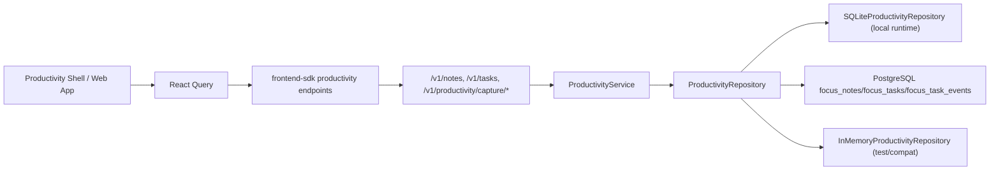
```mermaid
flowchart LR
    User["Productivity Shell / Web App"] --> ReactQuery["React Query"]
    ReactQuery --> SDK["frontend-sdk productivity endpoints"]
    SDK --> Routes["/v1/notes, /v1/tasks, /v1/productivity/capture/*"]
    Routes --> Service["ProductivityService"]
    Service --> Repo["ProductivityRepository"]
    Repo --> SQLite["SQLiteProductivityRepository (local runtime)"]
    Repo --> Postgres["PostgreSQL focus_notes/focus_tasks/focus_task_events"]
    Repo --> InMemory["InMemoryProductivityRepository (test/compat)"]
```

Admin Web 使用独立的 `pages/admin/` 路由和 admin CSS module。`/app/admin/users/{userId}` 通过详情抽屉承载 Profile、Access、Security 和 Audit tabs；`/app/admin/audit-events` 通过 URL query 同步 actor/resource/decision 过滤和选中事件。普通聊天 header 不暴露 admin 导航。

Message transcript 渲染保持分层：`apps/web/src/entities/messages/message-list.tsx` 负责 React 展示与交互，`message-transcript.ts` 保持兼容 re-export，transcript item 构建、internal content filtering、tool activity summary/detail、normalization 和类型拆在 `message-transcript-*` 模块。实时处理过程卡以 SDK reducer 派生的 `processingSteps` 为 canonical 输入；`toolCalls`、`toolEvents` 和 `reasoningText` 保留为 raw/debug/backcompat state。Thread streaming hooks 按 request registry、cache、errors、navigation 和 entry state 拆分在 `apps/web/src/features/thread-stream/`。

CSS 入口 `shared/styles/app.css` 只组织 imports，页面/功能样式按 shell、chat、composer、auth、admin、agent-team、observability、trajectory、productivity、workbench 和 responsive override 模块归档。大块样式已经拆到 `*-01-*`、`*-02-*` 等窄文件，例如 chat shell/messages/tool activity、composer toolbar/input/context meter、auth bootstrap/login/form、admin workspace panels/table、Agent Team mission/create/results。Web app 的维护门禁分三层：

- 局部快速门禁：`make web-lint` / `make web-format-check`，范围是 `src/entities` 和 `src/features/trajectory-observability`。
- 全量源码门禁：`make web-lint-full` / `make web-format-check-full` / `make web-check` / `make web-build`。
- 产品级前端门禁：`make frontend-qa`，额外覆盖 style governance、Android local runtime smoke、bundle budget、architecture report 和 compatibility inventory。

Android target 的本地 runtime 位于 `apps/web/src/android-local-runtime/`。`local-focus-agent-runtime.ts` 是 facade；auth/conversation、thread/branch、admin、agent governance、memory/observability、model provider、stream SSE、web search 和 workspace runtime 已拆成独立模块。Android 使用 SDK local transport 和 App 内数据，不连接 Focus Agent HTTP 后端；Web target 仍默认使用 `/v1` / `/v2` HTTP transport。

## 16. 安全边界

当前安全能力：

- Bearer token authentication。
- demo token bootstrap，仅适合本地与演示。
- owner / access check，线程和会话操作必须匹配 owner。
- persisted admin role check，管理员操作必须匹配数据库用户状态和角色。
- CORS。
- rate limit：无 `DATABASE_URI` 时使用进程内 backend；Postgres-backed runtime 使用 `focus_rate_limit_buckets` 共享固定窗口计数。
- 统一错误信封。
- Tool Router 对 network、workspace write、memory write 做 role-level 收紧。

生产部署必须显式设置 `AUTH_JWT_SECRET` 或 active JWT key set，签名 secret 不得使用开发默认值且至少 32 字符，关闭 demo token，并显式配置管理员。管理员高风险操作需要 reason 并写入审计事件；token scope 不能单独授予 admin 权限。

## 17. Observability 与 Eval

Observability 分三层：

- 请求层：request id、结构化日志、耗时、错误信封。
- 运行态层：`/readyz`、`/metrics`、runtime labels、OTel facade。
- 检索层：`retrieval_zvec` readiness、`focus-agent-retrieval-index doctor/stats/backfill`、Zvec fallback rate 和 canonical hydrate failures。
- Agent trajectory 层：turn、step、tool、model、fallback、cache、trace correlation、plan_meta。

Trajectory API 支持 list、detail、stats、replay、promote、batch promote preview、batch replay compare。Web 侧拆成 overview 和 trajectory workbench。

Eval framework 使用 rule judge、LLM judge、trajectory judge，把真实运行中的失败和边界案例沉淀为可执行回归。

## 18. Docker / Compose 部署

Docker 本地联调用 [compose.yaml](../compose.yaml)，生产/预发模板用 [compose.prod.yaml](../compose.prod.yaml)。详细部署文档见 [docker-deployment.md](docker-deployment.md)。

边界：

- `compose.yaml` 包含 app + postgres，适合本地 Docker 联调。
- `compose.prod.yaml` 不内置 Postgres，要求外部注入 `FOCUS_AGENT_DATABASE_URI`。
- Dockerfile 使用前端构建阶段和 Python runtime 阶段。
- `docker/sandbox.Dockerfile` 是独立的 sandbox execution image，用于工具/Skill 代码执行；通过 `make sandbox-image` 或 `scripts/ensure_sandbox_image.py` 准备，不等同于应用服务镜像。
- `docker/entrypoint.sh` 准备 `/data` 下的默认配置和 fallback 路径。

## 19. 本地开发运行

推荐完整开发入口：

```bash
make serve-dev
```

常用命令：

```bash
make api
make dev
make serve
make serve-prod
make web-dev
```

更完整启动说明见 [quick-start.md](quick-start.md) 和 [development.md](development.md)。

## 20. 当前限制

- rate limit 已支持 Postgres-backed 多副本共享计数，但它仍是应用层固定窗口保护，不替代 API gateway / WAF 层面的全局限流。
- Artifact 正文通过 `ArtifactStore` protocol 访问，默认 local implementation 仍在文件系统；生产多节点需要共享文件系统或对象存储实现。
- Agent governance 多数能力默认 observe/off，enforce 面需要基于 trajectory 逐步扩大。
- Context window 已有发送栏用量、手动/自动压缩、工具观察 artifactization 和 128k 默认预算，但 token 估算当前仍以确定性裁剪和近似预算为主。
- Local fallback persistence 只适合本地，不适合生产多副本；裸跑 API 且无 `DATABASE_URI` 时 Agent Team 仍可能走 in-memory repository，trajectory/artifact metadata 也不具备 Postgres durability。
- Agent Team v2 执行受 feature flag 保护；工作台 UI 可见、v1 API 可用，**不等于** v2 runtime ready 或真实执行已上线。
- Android local runtime 与 server-backed Web 是并行集成模型，能力集合有意裁剪（例如部分 workbench/productivity 在 Android build flag 下关闭），不能假设与 Web 全量对等。
- 1.x 兼容 facade（约 169 项）仍在；读代码时需区分 re-export 与真正实现路径。
- 平台工程完备度高于 Agent 结果质量证据：eval / golden failure / 成本延迟画像 / 多 Agent 质量门槛仍在扩展中（见 [roadmap.md](roadmap.md)）。
- 企业 IdP/JWKS、不可伪造的部署控制面绑定、生产规模 RPO/RTO 演练仍是采用方集成与运维责任。

## 21. 推荐验证

日常后端和文档改动：

```bash
make lint
make ci-test
```

Python formatting：

```bash
make format-check
```

完整本地检查：

```bash
make ci
```

`make ci` 当前覆盖 strict Python lint、CI pytest、contract-check、阻断式
architecture/compatibility gates、SDK check/build/transport validation、全量 Web
lint/format-check/check/build，以及 Node stream frontend regression。CI pytest
通过 `FOCUS_AGENT_LOCAL_ENV_FILE=/tmp/focus-agent-ci-missing.env` 避免
repo-local secrets 影响结果。GitHub CI 还会额外执行
`make sdk-openapi-types-check`，因此 API route、Pydantic response model 或
generated SDK types 改动必须提交 `docs/api/openapi.json` 和
`frontend-sdk/src/types/__generated__.ts` 的生成结果。

影响生产力工作台：

```bash
uv run pytest tests/test_productivity_api.py tests/test_productivity_repository.py tests/test_default_tools.py -k productivity
make ui-smoke-productivity
```

影响 SDK：

```bash
make sdk-check
make sdk-build
make sdk-validate-transport
make sdk-openapi-types-check
make contract-check
```

影响流式事件、工具协议隔离或 SDK reducer：

```bash
.venv/bin/pytest tests/test_streaming.py tests/test_harness_api.py tests/test_graph_builder.py -q
pnpm test:thread-stream-frontend-regressions
pnpm sdk:check
pnpm web:check
```

影响 Web：

```bash
make web-lint
make web-format-check
make web-check
make web-build
make frontend-qa
make ui-smoke
make ui-smoke-observability
make ui-smoke-agent-team-adoption
make feedback-regression
```

影响 Admin Console、Auth UI 或访问治理：

```bash
uv run pytest tests/test_admin_config_api.py tests/test_skill_registry.py tests/test_config_local_doc.py
uv run pytest tests/test_admin_users_api.py tests/test_auth.py tests/test_auth_accounts_api.py tests/test_user_service.py tests/test_auth_ownership.py
uv run pytest tests/test_web_app_scaffold.py
make contract-check
make web-check
make web-build
make frontend-android-runtime-smoke
```

影响部署、持久化或 observability：

```bash
uv run alembic -c alembic.ini heads
uv run python scripts/export-openapi.py
uv run pytest \
  tests/test_api_middleware.py \
  tests/test_containerization_scaffold.py \
  tests/test_local_startup_docs.py \
  tests/test_runtime_backend_selection.py \
  tests/test_api_trajectory_observability.py \
  tests/test_api_trajectory_actions.py \
  tests/test_trajectory_cli.py
```

影响 Agent governance：

```bash
uv run pytest tests/eval/test_agent_arch_suite.py tests/eval/test_agent_governance_suite.py tests/eval/test_agent_delegation_suite.py tests/eval/test_agent_context_suite.py tests/eval/test_agent_task_ledger_suite.py
```

影响 Zvec retrieval / RAG：

```bash
uv run pytest tests/test_retrieval_index.py tests/test_retrieval_expansion.py
uv run pytest tests/test_memory_retriever.py tests/test_default_tools.py tests/test_skill_registry.py
focus-agent-retrieval-index doctor
```

如果本机 `.venv` 的 `psycopg` 缺少 `libpq` 导致测试收集阶段 `ImportError`，可使用仓库当前测试约定的 stub 路径跑 focused observability 回归：

```bash
PYTHONPATH=/tmp/psycopg_stub .venv/bin/pytest \
  tests/test_api_middleware.py \
  tests/test_metadata.py \
  tests/test_trajectory_observability.py \
  tests/test_api_trajectory_observability.py \
  tests/test_chat_service.py
```

## 22. 文件导航

- Project overview：`docs/project-overview.md`
- API：`src/focus_agent/api/main.py`
- API deps：`src/focus_agent/api/deps.py`
- Contracts facade：`src/focus_agent/api/contracts.py`
- Contract models：`src/focus_agent/api/contract_models/`
- Runtime：`src/focus_agent/engine/runtime.py`、`src/focus_agent/engine/runtime_composition.py`
- Shared thread pool：`src/focus_agent/runtime/thread_pool.py`
- Coordination backend：`src/focus_agent/services/coordination.py`
- Background jobs：`src/focus_agent/services/background_work.py`
- Graph builder facade：`src/focus_agent/engine/graph_builder.py`
- Graph package (nodes/policy/tool execution)：`src/focus_agent/engine/graph/`
- Graph node/policy helpers (compat facades)：`src/focus_agent/engine/graph_*.py`
- Graph model factory：`src/focus_agent/engine/model_factory.py`
- Harness：`src/focus_agent/harness/`（`agents/factory.py` 中的 `FocusAgentHarness`）
- Model registry：`src/focus_agent/model_registry.py`
- Built-in model catalog：`src/focus_agent/defaults/models.toml`
- OpenAI-compatible reasoning adapter：`src/focus_agent/providers/reasoning_openai.py`
- State：`src/focus_agent/core/state.py`
- Chat service orchestration：`src/focus_agent/services/chat/service.py`；兼容导入由
  `src/focus_agent/services/chat/__init__.py` 维护。
- Harness run API：`src/focus_agent/api/routers/harness_runs/`
- SSE helper：`src/focus_agent/api/streaming/sse.py`
- Harness runtime：`src/focus_agent/harness/`
- Auth API：`src/focus_agent/api/routers/auth_models.py`
- Admin API：`src/focus_agent/api/routers/admin_users.py`
- User service / repository：`src/focus_agent/services/users.py`、`src/focus_agent/repositories/user_repository.py`
- Chat branch action facade：`src/focus_agent/services/chat/branch_actions.py`
- Branch service：`src/focus_agent/services/branches/service.py`
- Branch decision service：`src/focus_agent/branch_decision/service.py`
- Branch decision API：`src/focus_agent/api/routers/branch_decisions.py`
- Branch naming / memory promotion：`src/focus_agent/services/branch_naming_policy.py`、`src/focus_agent/services/branch_memory_promotion.py`
- Postgres schema：`src/focus_agent/repositories/postgres_schema.py`
- Productivity API：`src/focus_agent/api/routers/productivity.py`
- Productivity Service：`src/focus_agent/services/productivity.py`
- Productivity Repository：`src/focus_agent/repositories/productivity_repository.py`
  定义 contract 与 test/compat 用 `InMemoryProductivityRepository`；
  `PostgresProductivityRepository` 是数据库部署 primary path，
  `SQLiteProductivityRepository` 是无 `DATABASE_URI` 时的单机持久化 runtime path。
- Productivity Tool Module：`src/focus_agent/capabilities/default_tool_modules/productivity.py`
- Alembic config：`alembic.ini`、`migrations/env.py`、`migrations/versions/001_baseline.py`
- Trajectory repository：`src/focus_agent/repositories/postgres_trajectory_repository.py`
- ArtifactStore：`src/focus_agent/storage/artifact_store.py`、`src/focus_agent/storage/local_artifact_store.py`
- OpenAPI export / SDK typegen：`scripts/export-openapi.py`、`scripts/generate-sdk-types.sh`、`docs/api/openapi.json`、`frontend-sdk/src/types/__generated__.ts`
- AgentTeam repository contract tests：`tests/test_agent_team_repository_contract.py`
- Web App：`apps/web/src/`
- Web auth/account pages：`apps/web/src/pages/auth/`、`apps/web/src/pages/account/`
- Web Admin pages：`apps/web/src/pages/admin/`、`apps/web/src/features/admin-users/`
- Web message transcript facade：`apps/web/src/entities/messages/message-transcript.ts`
- Web message transcript modules：`apps/web/src/entities/messages/message-transcript-*.ts`
- Web thread streaming hooks：`apps/web/src/features/thread-stream/`
- Android local runtime：`apps/web/src/android-local-runtime/`
- Frontend style / bundle / visual QA：`apps/web/scripts/check-no-important.mjs`、`apps/web/scripts/check-no-hex.mjs`、`apps/web/scripts/css-loc-budget.mjs`、`apps/web/scripts/bundle-budget.mjs`、`apps/web/scripts/visual-baseline.mjs`、`apps/web/scripts/a11y-baseline.mjs`
- Productivity web pages/routes：`apps/web/src/pages/productivity/productivity-page.tsx`、`apps/web/src/app/router.tsx`
- Productivity shell 与导航：`apps/web/src/app/shell/app-shell-config.ts`、`apps/web/src/app/shell/app-shell-global-navigation.tsx`
- Productivity source-level smoke：`apps/web/scripts/productivity-smoke.mjs`
- SDK facade：`frontend-sdk/src/client.ts`、`frontend-sdk/src/types.ts`
- SDK endpoint/type modules：`frontend-sdk/src/client/`、`frontend-sdk/src/types/`
- SDK transport：`frontend-sdk/src/transport.ts`
- Productivity SDK endpoint/types：`frontend-sdk/src/client/productivity.ts`、`frontend-sdk/src/types/productivity.ts`
- Stream event extraction：`src/focus_agent/transport/stream_events.py`
