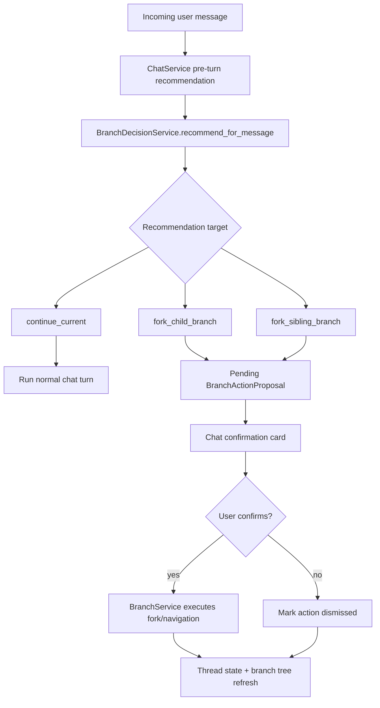
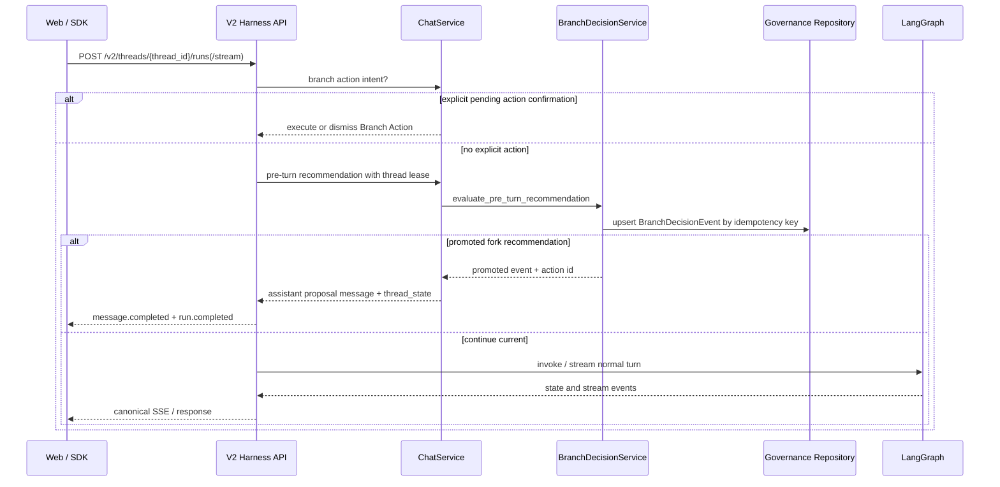

# Branch Decisions And Recommendations

更新时间：2026-05-16

This document is the canonical guide for Focus Agent branch decision records,
pre-turn branch recommendations, and user-confirmed Branch Actions. Branch
lifecycle, tree rendering, and merge-back details stay in
[architecture.md](architecture.md); broader governance flags stay in
[agent-role-routing.md](agent-role-routing.md); streaming event rules stay in
[streaming-contract.md](streaming-contract.md).

## 1. Purpose

Long AI work is not always linear. A user may ask for a deeper dive, a sibling
alternative, or a return to the parent thread while a normal chat turn is about
to start. Focus Agent separates those branch-control decisions from visible
assistant prose:

- `BranchDecisionEvent` records why the system thinks the current thread should
  continue, split, conclude, or become a merge candidate.
- `BranchActionProposal` is the user-confirmable action card that can fork,
  open, return, execute, dismiss, fail, and carry navigation metadata.
- `BranchRecord` is the persistent branch tree node created only after an
  action is executed.

The important safety boundary is that branch recommendations do not silently
fork. In `suggest` mode they create a pending Branch Action; the user must
confirm before a new branch is created or navigation happens.



## 2. Decision Types

Two evaluators share the same persisted event model:

| Evaluator | Timing | Actions | Typical outcome |
|-----------|--------|---------|-----------------|
| `evaluate_pre_turn_recommendation` | before a user message enters the graph | `continue_current`, `fork_child_branch`, `fork_sibling_branch` | normal turn, or pending Branch Action |
| `evaluate_thread_turn` | after a completed turn | `split`, `conclude`, `merge_candidate` | governance evidence, optional promotion |

Pre-turn recommendations are deterministic classifier/scorer decisions from
`src/focus_agent/branch_decision/signals.py` and
`src/focus_agent/branch_decision/scorers.py`. They use the incoming message,
recent state, branch metadata, confidence threshold, and idempotency key. They
do not call the main chat model.

Post-turn decisions inspect the completed thread state and branch metadata.
They are useful for trajectory review, governance dashboards, and future
automation, but they should not change the visible turn unless explicitly
promoted.

## 3. Runtime Flow

The default V2 chat path checks explicit Branch Action intent first, then
pre-turn recommendations, and only then invokes or streams the LangGraph turn.
Both non-streaming and streaming harness endpoints use the same recommendation
helper so the browser and SDK observe the same behavior.



Important implementation boundaries:

- `ChatService._handle_branch_recommendation_turn_with_lease()` holds the
  per-thread turn lease while it writes the proposal message and pending action.
- V2 non-streaming and streaming routes short-circuit before graph invocation
  when a promoted pre-turn recommendation creates a Branch Action.
- Streaming Branch Action execution waits for the worker thread to finish even
  if the stream coroutine is cancelled, so run status and branch side effects do
  not diverge.
- The Postgres governance repository treats idempotency keys as a cross-request
  boundary. Retrying the same decision can update the same event from
  `suggested` to `promoted`; a conflicting decision with the same key reuses the
  existing canonical id.

## 4. Modes And Configuration

Branch decisions have two feature surfaces: post-turn decision records and
pre-turn recommendations.

| Setting | Default | Meaning |
|---------|---------|---------|
| `AGENT_BRANCH_DECISION_ENABLED` | `false` | Enables post-turn branch decision evaluation |
| `AGENT_BRANCH_DECISION_MODE` | `shadow` | `shadow`, `suggest`, or `execute` for post-turn decisions |
| `AGENT_BRANCH_DECISION_MIN_CONFIDENCE` | `0.70` | Minimum confidence for a decision to become actionable |
| `AGENT_BRANCH_DECISION_SPLIT_THRESHOLD` | `0.65` | Split threshold |
| `AGENT_BRANCH_DECISION_CONCLUDE_THRESHOLD` | `0.70` | Conclude threshold |
| `AGENT_BRANCH_DECISION_MERGE_CANDIDATE_THRESHOLD` | `0.75` | Merge-candidate threshold |
| `AGENT_BRANCH_DECISION_RATE_LIMIT_PER_HOUR` | `3` | Per-thread/user decision rate limit |
| `AGENT_BRANCH_RECOMMENDATION_ENABLED` | `false` | Enables pre-turn recommendation checks |
| `AGENT_BRANCH_RECOMMENDATION_MODE` | `shadow` | `shadow` or `suggest` for pre-turn recommendations |
| `AGENT_BRANCH_RECOMMENDATION_MIN_CONFIDENCE` | `0.72` | Minimum confidence for a pre-turn recommendation |

Recommended rollout:

1. Start with both surfaces disabled.
2. Enable post-turn decisions in `shadow` to collect evidence.
3. Enable pre-turn recommendations in `shadow` and inspect persisted events.
4. Move pre-turn recommendations to `suggest` only after browser and SDK flows
   handle pending Branch Actions cleanly.

`execute` is intentionally not available for pre-turn recommendations. The
pre-turn surface is a confirmation workflow, not silent automation.

## 5. API And SDK Surface

API endpoints:

```text
GET  /v1/branch-decisions/config
GET  /v1/threads/{thread_id}/branch-decisions
POST /v1/threads/{thread_id}/branch-decisions/{decision_id}/promote
POST /v1/threads/{thread_id}/branch-decisions/{decision_id}/dismiss
POST /v1/threads/{thread_id}/branch-actions/{action_id}/execute
POST /v1/threads/{thread_id}/branch-actions/{action_id}/dismiss
```

The Web SDK exposes:

- `getBranchDecisionConfig()`
- `listThreadBranchDecisions()`
- `promoteBranchDecision()`
- `dismissBranchDecision()`
- `executeBranchAction()`
- `dismissBranchAction()`

`ThreadStateResponse` includes `branch_actions` and
`branch_decision_summary`. Stream `run.completed` may include
`branch_action` and an extra `branch_decision` payload field when a pre-turn
recommendation short-circuits a run.

## 6. Web UX

The chat transcript renders pending Branch Actions as confirmation cards. A card
shows whether it came from an AI branch decision, the action target, confidence,
and controls to confirm or dismiss. Confirming a fork action refreshes:

- conversations,
- branch tree,
- source thread state,
- target thread state when navigation is returned.

If the backend returns a thread-busy conflict because the previous turn is still
settling, the Web hook retries for a bounded window. The retry loop is tied to
the current thread/request epoch and is cancelled when the user navigates away,
so an old retry cannot later write caches or pull the browser back to a stale
thread.

## 7. Validation

When branch decisions, recommendations, or Branch Action UX change, run:

```bash
uv run pytest tests/test_branch_decision_service.py tests/test_branch_decision_api.py tests/test_branch_decision_repository.py
uv run pytest tests/test_chat_service.py tests/test_harness_api.py tests/test_web_app_scaffold.py
make contract-check
make sdk-openapi-types-check
make web-check
```

For browser coverage, use a real prompt that asks for a sibling or child branch
and confirm:

- a recommendation card appears without invoking the normal graph turn,
- confirming creates or opens the expected branch,
- dismissing clears the pending action,
- route changes during retry do not navigate back to the old thread.

For streaming changes, also run the stream checks from
[streaming-contract.md](streaming-contract.md).
