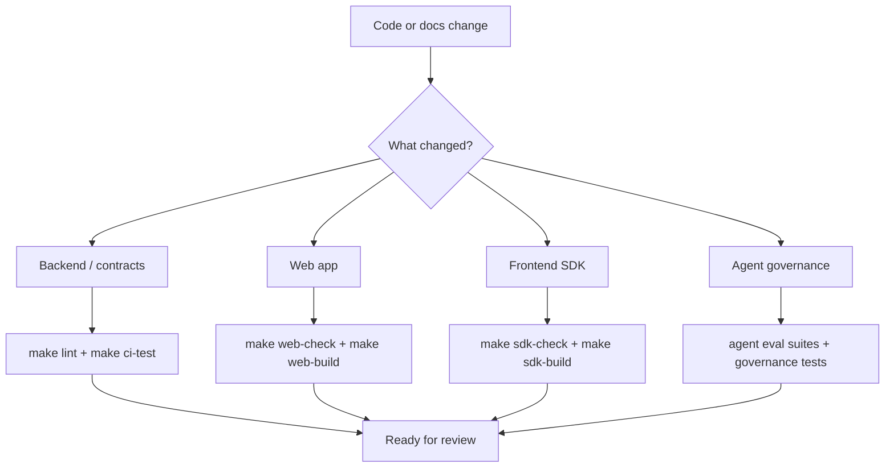

# Development Guide

This guide collects the day-to-day development and validation commands that do not belong in the root README.



## Command Matrix

```bash
make help
make install
make setup-local
make api
make dev
make serve
make serve-dev
make serve-prod
make web-dev
make web-build
make sdk-check
make sdk-build
make ci-test
make ci
make ui-smoke
make ui-smoke-observability
```

## Common Flows

### Backend only

- `make api`: start the API server
- `make dev`: start the API server with `API_RELOAD=1`

### Full local development

- `make serve` / `make serve-dev`: run frontend Vite dev server and backend API together
- `make serve-prod`: build the frontend bundle first, then run only the backend without reload

### Frontend only

- `make web-dev`: start the React frontend dev server
- `make web-build`: build the bundle that FastAPI serves at `/app`

## Validation

Recommended validation ladder:

1. Broad changes:

```bash
make ci
```

2. If backend routes, stream events, or frontend SDK usage changed:

```bash
make contract-check
uv run pytest tests/test_contract_checks.py
```

`make contract-check` compares the FastAPI route snapshot, frontend SDK public
surface, SDK package barrel exports, and the Web App's `@focus-agent/web-sdk`
imports under `apps/web/src`. If a route or SDK/E2E contract drift is
intentional, update snapshots with `uv run python scripts/check_contracts.py
--update` and include the snapshot diff in review.

3. If the frontend SDK implementation changed:

```bash
make sdk-check
make sdk-build
```

4. If the Web App changed:

```bash
make web-check
make web-build
```

5. If browser-level chat, branch tree, or merge-review flows changed:

```bash
make ui-smoke
# or run the underlying browser smoke directly:
uv run python scripts/ui_smoke_test.py
```

6. If observability pages or seeded trajectory browser flows changed:

```bash
make ui-smoke-observability
# release-style observability smoke:
uv run python scripts/observability_ui_smoke.py --scenario all
pnpm --dir apps/web smoke:observability
```

7. If trajectory observability contracts changed:

```bash
uv run pytest tests/test_api_middleware.py tests/test_api_trajectory_observability.py tests/test_api_trajectory_actions.py tests/test_trajectory_cli.py
```

8. If Auth / Access Model, token lifecycle, or ownership semantics changed:

```bash
uv run pytest tests/test_auth.py tests/test_config_security.py tests/test_auth_ownership.py
uv run ruff check src/focus_agent/auth.py src/focus_agent/config.py tests/test_auth.py tests/test_config_security.py tests/test_auth_ownership.py
```

This focused suite covers HS256 issuer/audience/TTL checks, expired or rotated
tokens, production demo-token blocking, and the rule that `tenant_id` and
`scope` are claim metadata rather than thread ownership keys.

9. If release ops, nightly, production smoke, Postgres ops, or OTel smoke changed:

```bash
uv run pytest tests/test_release_evidence.py tests/test_release_health_check.py tests/test_nightly_regression.py tests/test_production_smoke.py tests/test_postgres_ops.py tests/test_otel_smoke.py tests/test_agent_governance_report.py
make nightly-regression
make production-smoke PRODUCTION_SMOKE_ARGS="--dry-run --base-url https://focus-agent.example.com"
make postgres-ops POSTGRES_OPS_ARGS="--dry-run"
make otel-smoke OTEL_SMOKE_ARGS="--dry-run --endpoint http://otel-collector:4318"
make agent-governance-report
```

10. If Agent role routing, memory curator, tool router, context engineering, task ledger, helper-model fallback, or governance observability changed:

```bash
uv run pytest tests/test_agent_roles.py tests/test_agent_governance.py tests/test_agent_delegation.py tests/test_agent_context_engineering.py tests/test_agent_task_ledger.py tests/eval/test_agent_arch_suite.py tests/eval/test_agent_governance_suite.py tests/eval/test_agent_delegation_suite.py tests/eval/test_agent_context_suite.py tests/eval/test_agent_task_ledger_suite.py
uv run python -m tests.eval --suite agent_arch --concurrency 1
uv run python -m tests.eval --suite agent_governance --concurrency 1
uv run python -m tests.eval --suite agent_delegation --concurrency 1
uv run python -m tests.eval --suite agent_context --concurrency 1
uv run python -m tests.eval --suite agent_task_ledger --concurrency 1
```

Workspace lookup regressions should also cover the local-first tool path:

```bash
uv run pytest tests/test_graph_builder.py::test_graph_forces_search_code_for_workspace_definition_lookup tests/test_default_tools.py::test_search_code_skips_local_focus_agent_runtime_dir
uv run python -m tests.eval --suite agent_arch --concurrency 1
```

If local test collection fails because the active `.venv` `psycopg` install cannot load `libpq`, use the focused stub workaround for observability checks:

```bash
PYTHONPATH=/tmp/psycopg_stub .venv/bin/pytest \
  tests/test_api_middleware.py \
  tests/test_metadata.py \
  tests/test_trajectory_observability.py \
  tests/test_api_trajectory_observability.py \
  tests/test_chat_service.py
```

`make ci-test` runs pytest with `FOCUS_AGENT_LOCAL_ENV_FILE` pointed at a missing file, which mirrors GitHub Actions more closely and prevents repo-local `.focus_agent/local.env` secrets from masking setup gaps.

## Related Docs

- [Quick Start](quick-start.md)
- [Docker Deployment](docker-deployment.md)
- [Architecture](architecture.md)
- [Agent Governance](agent-role-routing.md)
- [Roadmap](roadmap.md)
