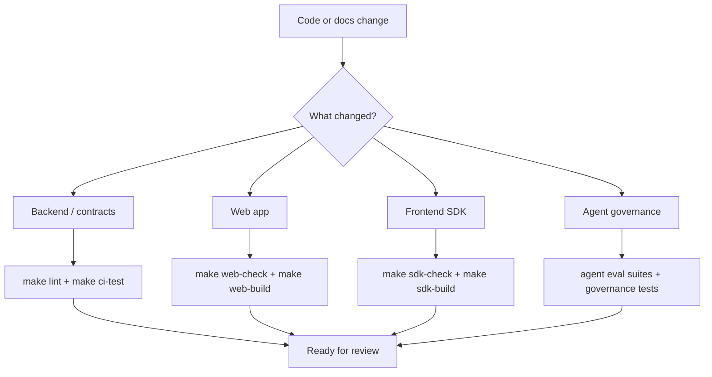

# Development Guide

This guide collects the day-to-day development and validation commands that do not belong in the root README.


```mermaid
flowchart TD
    Change["Code or docs change"] --> Scope{"What changed?"}
    Scope --> Backend["Backend / contracts"]
    Scope --> Web["Web app"]
    Scope --> SDK["Frontend SDK"]
    Scope --> Agent["Agent governance"]
    Backend --> CI["make lint + make ci-test"]
    Web --> WebChecks["make web-check + make web-build"]
    SDK --> SDKChecks["make sdk-check + make sdk-build"]
    Agent --> Eval["agent eval suites + governance tests"]
    CI --> Done["Ready for review"]
    WebChecks --> Done
    SDKChecks --> Done
    Eval --> Done
```

## Command Matrix

```bash
make help
make install
make setup-local
make api
make dev
make serve
make serve-dev
make serve-prod
make web-dev
make web-check
make web-build
make frontend-check
make frontend-build
make sdk-check
make sdk-build
make format
make format-check
make ci-test
make ci
make ui-smoke
make ui-smoke-observability
make test-graph-builder
make test-chat-service
```

## Common Flows

### Backend only

- `make api`: start the API server
- `make dev`: start the API server with `API_RELOAD=1`

### Full local development

- `make serve` / `make serve-dev`: run frontend Vite dev server and backend API together
- `make serve-prod`: build the frontend bundle first, then run only the backend without reload

### Frontend only

- `make web-dev`: start the React frontend dev server
- `make web-build`: build the bundle that FastAPI serves at `/app`

## Validation

Recommended validation ladder:

1. Broad changes:

```bash
make ci
```

`make ci` runs Python lint, CI-style pytest, API/SDK contract snapshots, frontend SDK check/build, and Web check/build. For Python formatting-only review, run:

```bash
make format-check
```

2. If backend routes, stream events, or frontend SDK usage changed:

```bash
make contract-check
uv run pytest tests/test_contract_checks.py
```

`make contract-check` compares the FastAPI route snapshot, frontend SDK public
surface, SDK package barrel exports, and the Web App's `@focus-agent/web-sdk`
imports under `apps/web/src`. If a route or SDK/E2E contract drift is
intentional, update snapshots with `uv run python scripts/check_contracts.py
--update` and include the snapshot diff in review.

3. If the frontend SDK implementation changed, especially `src/client.ts`, `src/transport.ts`, `src/parser.ts`, `src/reducers.ts`, `src/guards.ts`, or transport validation files:

```bash
make sdk-check
make sdk-build
cd frontend-sdk && npm run validate:transport
```

4. If the Web App changed:

```bash
pnpm --filter @focus-agent/web-app lint
pnpm --filter @focus-agent/web-app format
make web-check
make web-build
```

The Web lint/format scripts are intentionally scoped to the message transcript area today; `make web-check` and `make web-build` remain the full app type/build gates.

5. If browser-level chat, branch tree, or merge-review flows changed:

```bash
make ui-smoke
# or run the underlying browser smoke directly:
uv run python scripts/ui_smoke_test.py
# for backend-served static app or auth-disabled local debugging:
AUTH_ENABLED=false WEB_APP_DEV_SERVER_URL= API_PORT=8001 ./scripts/run-api.sh
uv run python scripts/ui_smoke_test.py --app-url http://127.0.0.1:8001/app/ --health-url http://127.0.0.1:8001/healthz --message '最近一周华钰矿业这只A股股票的表现怎么样？请联网查询并用中文简要说明。'
```

The browser smoke waits for the assistant response to stabilize after streaming and should be used for complex tool-use prompts, not only the default short OK response. This catches transport validation regressions such as malformed `tool_call.delta` payloads.

`scripts/ui_smoke_test.py` does not start the API or Vite dev server. Before running it with defaults, make sure `http://127.0.0.1:8000/healthz` and `http://127.0.0.1:5173/app/` are already reachable. If you point it at the backend-served static app, run `make web-build` first.

6. If observability pages or seeded trajectory browser flows changed:

```bash
make ui-smoke-observability
# release-style observability smoke:
uv run python scripts/observability_ui_smoke.py --scenario all
pnpm --dir apps/web smoke:observability
```

`scripts/observability_ui_smoke.py` can auto-start the local API through `./scripts/run-api.sh` when the health probe fails; pass `--no-start-api` when you want to require an already running API. It still needs Chrome and either `DATABASE_URI` or the managed local Postgres runtime file. `pnpm --dir apps/web smoke:observability` is a source-level route and wiring check; it complements, but does not replace, the real-browser smoke.

7. If trajectory observability contracts changed:

```bash
uv run pytest tests/test_api_middleware.py tests/test_api_trajectory_observability.py tests/test_api_trajectory_actions.py tests/test_trajectory_cli.py
```

8. If repository behavior changed, especially AgentTeam repository session/task/output semantics:

```bash
uv run pytest tests/test_agent_team_repository_contract.py
```

SQLite cases run locally by default. Postgres cases run when `DATABASE_URI` is set and otherwise skip only the Postgres backend.

9. If ChatService, runtime assembly, or config/runtime directory boundaries changed:

```bash
make test-chat-service
uv run pytest tests/test_runtime_backend_selection.py tests/test_config_local_doc.py
```

ChatService is intentionally split across branch actions, streaming, thread-state helpers, serialization, trajectory, and execution helpers. Keep behavior changes covered by service tests and browser smoke rather than relying only on import-level checks.

10. If Auth / Access Model, token lifecycle, or ownership semantics changed:

```bash
uv run pytest tests/test_auth.py tests/test_auth_accounts_api.py tests/test_admin_users_api.py tests/test_user_service.py tests/test_config_security.py tests/test_auth_ownership.py
uv run ruff check src/focus_agent/auth.py src/focus_agent/config.py tests/test_auth.py tests/test_config_security.py tests/test_auth_ownership.py
```

This focused suite covers HS256 issuer/audience/TTL checks, expired or rotated
tokens, production demo-token blocking, registration/password rules, refresh-session logout, admin role safeguards, and the rule that `tenant_id` and `scope` are claim metadata rather than thread ownership keys.

When the Web login surface, account shell, admin route protection, or token storage changes, also run a real-browser auth flow against the local app:

- Visit a protected page such as `/app/admin/users` while signed out and confirm the redirect to `/app/auth/login?return_to=...`.
- Use `Demo 登录` and confirm the app returns to the protected target.
- Sign out from the sidebar account control and confirm the login page is visible again.
- Generate a local `/v1/auth/demo-token`, use the `使用 Bearer Token` panel, and confirm the sidebar account changes.
- After registration or admin password reset, confirm username/password login still reaches the same `return_to` target.
- Switch back by signing out and logging in with a different method. The app has no separate account switcher; switching is logout followed by another login.

11. If release ops, nightly, production smoke, Postgres ops, or OTel smoke changed:

```bash
uv run pytest tests/test_release_evidence.py tests/test_release_health_check.py tests/test_nightly_regression.py tests/test_production_smoke.py tests/test_postgres_ops.py tests/test_otel_smoke.py tests/test_agent_governance_report.py
make nightly-regression
make production-smoke PRODUCTION_SMOKE_ARGS="--dry-run --base-url https://focus-agent.example.com"
make postgres-ops POSTGRES_OPS_ARGS="--dry-run"
make otel-smoke OTEL_SMOKE_ARGS="--dry-run --endpoint http://otel-collector:4318"
make agent-governance-report
```

12. If Agent role routing, delegation execution, memory curator, tool router, context engineering, task ledger, helper-model fallback, or governance observability changed:

```bash
uv run pytest tests/test_agent_roles.py tests/test_agent_governance.py tests/test_agent_delegation.py tests/test_agent_context_engineering.py tests/test_agent_task_ledger.py tests/eval/test_agent_arch_suite.py tests/eval/test_agent_governance_suite.py tests/eval/test_agent_delegation_suite.py tests/eval/test_agent_context_suite.py tests/eval/test_agent_task_ledger_suite.py
uv run python -m tests.eval --suite agent_arch --concurrency 1
uv run python -m tests.eval --suite agent_governance --concurrency 1
uv run python -m tests.eval --suite agent_delegation --concurrency 1
uv run python -m tests.eval --suite agent_context --concurrency 1
uv run python -m tests.eval --suite agent_task_ledger --concurrency 1
```

Workspace lookup and graph-builder regressions should also cover the local-first tool path:

```bash
make test-graph-builder
uv run pytest tests/test_default_tools.py::test_search_code_skips_local_focus_agent_runtime_dir
uv run python -m tests.eval --suite agent_arch --concurrency 1
```

If local test collection fails because the active `.venv` `psycopg` install cannot load `libpq`, use the focused stub workaround for observability checks:

```bash
PYTHONPATH=/tmp/psycopg_stub .venv/bin/pytest \
  tests/test_api_middleware.py \
  tests/test_metadata.py \
  tests/test_trajectory_observability.py \
  tests/test_api_trajectory_observability.py \
  tests/test_chat_service.py
```

`make ci-test` runs pytest with `FOCUS_AGENT_LOCAL_ENV_FILE` pointed at a missing file, which mirrors GitHub Actions more closely and prevents repo-local `.focus_agent/local.env` secrets from masking setup gaps. If a privacy/redaction assertion checks for short numeric fragments, prefer full secret/phone substrings so timestamps cannot cause false failures.

## Related Docs

- [Quick Start](quick-start.md)
- [Docker Deployment](docker-deployment.md)
- [Architecture](architecture.md)
- [Agent Governance](agent-role-routing.md)
- [Roadmap](roadmap.md)
