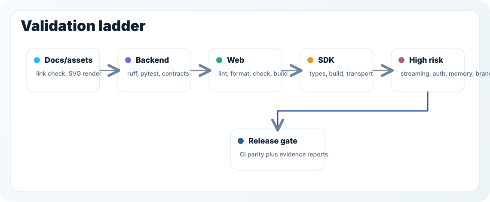

# Development Guide

This guide collects the day-to-day development and validation commands that do not belong in the root README.



## Command Matrix

```bash
make help
make install
make setup-local
make api
make dev
make serve
make serve-dev
make serve-prod
make web-dev
make web-check
make web-build
make frontend-check
make frontend-check-full
make frontend-style-check
make frontend-bundle-check
make frontend-qa
make frontend-visual-qa
make frontend-build
make sdk-check
make sdk-build
make sdk-openapi-types-check
make architecture-report
make compat-report
make format
make format-check
make ci-test
make ci
make ui-smoke
make ui-smoke-observability
make ui-smoke-productivity
make test-graph-builder
make test-chat-service
focus-agent-memory-embedding doctor --database-uri "$DATABASE_URI"
```

## Common Flows

### Backend only

- `make api`: start the API server
- `make dev`: start the API server with `API_RELOAD=1`

### Full local development

- `make serve` / `make serve-dev`: run frontend Vite dev server and backend API together
- `make serve-prod`: build the frontend bundle first, then run only the backend without reload

### Frontend only

- `make web-dev`: start the React frontend dev server
- `make web-build`: build the bundle that FastAPI serves at `/app`

## Validation

Recommended validation ladder:

1. Broad changes:

```bash
make ci
```

`make ci` runs Python lint, CI-style pytest, API/SDK contract snapshots, frontend SDK check/build/transport validation, Web lint/format-check/check/build, and the Node stream frontend regression suite. GitHub CI additionally runs the generated OpenAPI / SDK type drift guard, so API route/model changes must include `make sdk-openapi-types-check` even if `make ci` passes locally. For Python formatting-only review, run:

```bash
make format-check
```

2. If backend routes, stream events, or frontend SDK usage changed:

```bash
make contract-check
make sdk-openapi-types-check
uv run pytest tests/test_contract_checks.py
```

`make contract-check` compares the FastAPI route snapshot, frontend SDK public
surface, SDK package barrel exports, and the Web App's `@focus-agent/web-sdk`
imports under `apps/web/src`. If a route or SDK/E2E contract drift is
intentional, update snapshots with `uv run python scripts/check_contracts.py
--update` and include the snapshot diff in review.

`make sdk-openapi-types-check` regenerates `docs/api/openapi.json` and
`frontend-sdk/src/types/__generated__.ts`, then fails if either file drifts.
Run it whenever FastAPI routes, Pydantic response models, or generated SDK
types change.

Generated artifacts are tracked source. When `make sdk-openapi-types-check`
prints a diff, commit the regenerated `docs/api/openapi.json` and
`frontend-sdk/src/types/__generated__.ts`; when `make contract-check` reports
SDK/API drift, update the relevant `tests/contracts/*.json` snapshot with
`uv run python scripts/check_contracts.py --update` and review the snapshot
diff before committing.

3. If the frontend SDK implementation changed, especially `src/client.ts`, `src/client/`, `src/types.ts`, `src/types/`, `src/transport.ts`, `src/parser.ts`, `src/reducers.ts`, `src/toolProtocol.ts`, `src/guards.ts`, or transport validation files:

```bash
make sdk-check
make sdk-build
make sdk-validate-transport
make sdk-openapi-types-check
pnpm --dir frontend-sdk validate:transport
```

4. If the Web App changed:

```bash
make web-lint
make web-format-check
make web-check
make web-build
```

The package-level `web-lint` / `web-format-check` scripts remain intentionally scoped today to `src/entities` and `src/features/trajectory-observability`; `make web-lint-full` and `make web-format-check-full` cover all `apps/web/src`. `make web-check` and `make web-build` remain the full app type/build gates.

For broad frontend/runtime refactors, run the maintained frontend quality bundle:

```bash
make frontend-qa
```

It combines full frontend checks, style governance (`no !important`, no hard-coded hex colors outside owned places, CSS LOC budgets), Android local runtime smoke, bundle budget, architecture report, and compatibility inventory. For visual or a11y changes against a running app, add:

```bash
make frontend-visual-qa FRONTEND_QA_BASE_URL=http://127.0.0.1:5173
```

5. If stream visibility, tool protocol filtering, frontend stream reducers, processing cards, or the live-web execution contract changed:

```bash
.venv/bin/pytest tests/test_streaming.py tests/test_harness_api.py tests/test_graph_builder.py tests/test_execution_contract.py -q
pnpm test:thread-stream-frontend-regressions
pnpm sdk:check
pnpm web:check
```

See [streaming-contract.md](streaming-contract.md) for the public SSE event contract and the internal `quarantine` / `visible` phase boundary. Browser checks should include a tool-using prompt and confirm that no DSML/XML/function-call text appears in the assistant bubble while tool cards still render.
For live-web changes, use a relative-time prompt such as "today", "tomorrow", or "本周" and confirm `current_utc_time` anchors the search before `web_search`; stale evidence should trigger at most one repair search and then either a supported answer or an explicit uncertainty answer.

6. If Agent Team planning, execution, final-answer synthesis, or Mission Runner UI changed:

```bash
.venv/bin/python -m pytest tests/test_agent_team_* -q
make contract-check
make web-check
make web-build
```

Fake Agent Team execution is a workflow-only validation mode. It must surface as `final_answer_status="placeholder"` and `request_changes`, not as a deliverable answer. Browser checks should confirm the default UI hides raw fake run text and keeps output ids/artifact ids inside Advanced details.

7. If browser-level chat, branch tree, or merge-review flows changed:

```bash
make ui-smoke
# or run the underlying browser smoke directly:
uv run python scripts/ui_smoke_test.py
# for backend-served static app or auth-disabled local debugging:
AUTH_ENABLED=false WEB_APP_DEV_SERVER_URL= API_PORT=8001 ./scripts/run-api.sh
uv run python scripts/ui_smoke_test.py --app-url http://127.0.0.1:8001/app/ --health-url http://127.0.0.1:8001/healthz --message '最近一周华钰矿业这只A股股票的表现怎么样？请联网查询并用中文简要说明。'
```

The browser smoke waits for the assistant response to stabilize after streaming and should be used for complex tool-use prompts, not only the default short OK response. This catches transport validation regressions such as malformed `tool.call.delta` payloads.

`scripts/ui_smoke_test.py` does not start the API or Vite dev server. Before running it with defaults, make sure `http://127.0.0.1:8000/healthz` and `http://127.0.0.1:5173/app/` are already reachable. If you point it at the backend-served static app, run `make web-build` first.

When testing the Vite app, keep the `/app/` trailing slash. The dev server may return different results for `/app` versus `/app/`, while the backend-served static app normalizes through FastAPI. The smoke uses a temporary Chrome profile; if a manual Chrome profile shows a blank login page or stale auth state while the smoke passes, clear site data or use a clean profile before filing a UI regression.

8. If observability pages or seeded trajectory browser flows changed:

```bash
make ui-smoke-observability
# release-style observability smoke:
uv run python scripts/observability_ui_smoke.py --scenario all
pnpm --dir apps/web smoke:observability
```

`scripts/observability_ui_smoke.py` can auto-start the local API through `./scripts/run-api.sh` when the health probe fails; pass `--no-start-api` when you want to require an already running API. It still needs Chrome and either `DATABASE_URI` or the managed local Postgres runtime file. `pnpm --dir apps/web smoke:observability` is a source-level route and wiring check; it complements, but does not replace, the real-browser smoke.

If the API redirects `/app` to the Vite server, pass `--app-base-url http://127.0.0.1:5173/app` so the browser smoke waits on the same origin it actually renders. When the page visibly renders trajectory evidence and all captured fetches return 200 but the smoke fails on missing copy or panel text, update the smoke assertion alongside the UI change; do not paper over endpoint failures, console errors, or empty evidence states.

9. If trajectory observability contracts changed:

```bash
uv run pytest tests/test_api_middleware.py tests/test_api_trajectory_observability.py tests/test_api_trajectory_actions.py tests/test_trajectory_cli.py
```

10. If repository behavior changed, especially AgentTeam repository session/task/output semantics:

```bash
uv run pytest tests/test_agent_team_repository_contract.py
```

SQLite cases run locally by default. Postgres cases run when `DATABASE_URI` is set and otherwise skip only the Postgres backend.

11. If ChatService, runtime assembly, or config/runtime directory boundaries changed:

```bash
make test-chat-service
uv run pytest tests/test_runtime_backend_selection.py tests/test_config_local_doc.py
```

ChatService is intentionally split across branch action facade, streaming lifecycle, thread access, compaction, trajectory recording, and turn-error helpers. Keep behavior changes covered by service tests and browser smoke rather than relying only on import-level checks.

12. If Memory v2, embedding, pgvector, migration, or memory retrieval changed:

```bash
uv run pytest tests/test_memory_embedding_policy.py tests/test_memory_embedding_cli.py tests/test_memory_embedding_provider.py tests/test_postgres_memory_repository.py tests/test_memory_retriever.py tests/test_migrate_local_state.py
focus-agent-memory-embedding doctor --database-uri "$DATABASE_URI"
```

The doctor command is read-only. It expects a Postgres `DATABASE_URI`, checks provider selection, pgvector extension/table/dimensions/index state, and prints the Ollama install hint when `embeddinggemma` is missing. For fresh local shells, source `.focus_agent/postgres/runtime.env` first if the API was started through the managed Postgres helper.
When prompt filtering changes, include cases for unrelated personal preferences, handle/passcode memories, sticky language/tone preferences, and `MemoryRetrievalPlan.selected_memory_ids`.

13. If runtime coordination, durable background jobs, thread turn leases, or branch refresh scheduling changed:

```bash
uv run pytest tests/test_coordination.py tests/test_background_work.py tests/test_chat_service.py
uv run pytest tests/test_runtime_backend_selection.py tests/test_config_security.py
```

These checks cover in-memory/Postgres thread leases, durable job claim tokens and claim heartbeat, heartbeat-lost behavior, and the rule that first-turn branch title/metadata refresh is scheduled after the active chat turn lease is released.

If API rate limiting changed, include `tests/test_coordination.py`; Postgres-backed runtimes should use `PostgresRateLimitBackend` and the `focus_rate_limit_buckets` schema while local/fallback runtimes continue using the in-memory backend.

14. If branch decisions, pre-turn recommendations, or Branch Action confirmation changed:

```bash
uv run pytest tests/test_branch_decision_service.py tests/test_branch_decision_api.py tests/test_branch_decision_repository.py
uv run pytest tests/test_branch_repository_contract.py tests/test_thread_resolution_api.py
uv run pytest tests/test_chat_service.py tests/test_harness_api.py tests/test_web_app_scaffold.py
node --test tests/test_thread_stream_frontend_regressions.mjs
make contract-check
make sdk-openapi-types-check
make web-check
```

For browser validation, enable `AGENT_BRANCH_RECOMMENDATION_ENABLED=true` and
`AGENT_BRANCH_RECOMMENDATION_MODE=suggest`, then use a prompt that asks for a
child or sibling branch. Confirm that the recommendation card appears, the
normal graph turn is skipped for that recommendation, and confirm/dismiss keeps
thread and branch-tree caches current.
If the change touches handoff isolation, also run a child-to-sibling real
browser flow with distinct sentinel text in each branch. Confirm the final
sibling transcript, `GET /v1/threads/{thread_id}`, and context preview contain
only the sibling handoff, not the source child handoff or an unrelated thread id.
Also verify `GET /v1/threads/{thread_id}/resolution` for root, child, and unknown
threads, and confirm branch tree routes work when opened from a child thread id.

15. If Auth / Access Model, token lifecycle, or ownership semantics changed:

```bash
uv run pytest tests/test_auth.py tests/test_auth_accounts_api.py tests/test_admin_users_api.py tests/test_user_service.py tests/test_config_security.py tests/test_auth_ownership.py
uv run ruff check src/focus_agent/auth.py src/focus_agent/config.py tests/test_auth.py tests/test_config_security.py tests/test_auth_ownership.py
```

This focused suite covers HS256 issuer/audience/TTL checks, expired or rotated
tokens, production demo-token blocking, registration/password rules, refresh-session logout, admin role safeguards, and the rule that `tenant_id` and `scope` are claim metadata rather than thread ownership keys.

If the Admin Console settings center, Skill management, Web pages, admin SDK types, route protection, or audit event UI changed, also run:

```bash
uv run pytest tests/test_admin_config_api.py tests/test_skill_registry.py tests/test_config_local_doc.py
uv run pytest tests/test_web_app_scaffold.py
make contract-check
make web-check
make web-build
make sdk-check
make frontend-android-runtime-smoke
```

When the Web login surface, account shell, admin route protection, or token storage changes, also run a real-browser auth flow against the local app:

- Visit a protected page such as `/app/admin/users` while signed out and confirm the redirect to `/app/auth/login?return_to=...`.
- Use `Demo 登录` and confirm the app returns to the protected target.
- Sign out from the sidebar account control and confirm the login page is visible again.
- Generate a local `/v1/auth/demo-token`, use the `使用 Bearer Token` panel, and confirm the sidebar account changes.
- After registration or admin password reset, confirm username/password login still reaches the same `return_to` target.
- In `/app/admin/users`, create a user, open the detail drawer, and perform a reasoned status or role update.
- In `/app/admin/audit-events`, filter by resource or decision and open an event detail drawer.
- Switch back by signing out and logging in with a different method. The app has no separate account switcher; switching is logout followed by another login.

16. If release ops, nightly, production smoke, Postgres ops, or OTel smoke changed:

```bash
uv run pytest tests/test_release_gate.py tests/test_release_evidence.py tests/test_release_health_check.py tests/test_nightly_regression.py tests/test_production_smoke.py tests/test_postgres_ops.py tests/test_otel_smoke.py tests/test_agent_governance_report.py
make nightly-regression
make production-smoke PRODUCTION_SMOKE_ARGS="--dry-run --base-url https://focus-agent.example.com"
make postgres-ops POSTGRES_OPS_ARGS="--dry-run"
make otel-smoke OTEL_SMOKE_ARGS="--dry-run --endpoint http://otel-collector:4318"
make agent-governance-report
uv run python -m tests.eval --suite golden_multi_agent --concurrency 1
uv run python -m tests.eval --suite harness_stability --concurrency 1
```

The full release gate includes live-model eval smoke suites and expects a configured provider/model. In offline test environments, run the focused release-gate tests plus generated offline reports and document skipped live evals as a verification gap rather than treating the skip as equivalent to a live pass.

17. If schema migration, Docker entrypoint, artifact storage, OpenAPI export, or generated SDK types changed:

```bash
uv run alembic -c alembic.ini heads
uv run python scripts/export-openapi.py
make sdk-openapi-types-check
uv run pytest tests/test_coordination.py tests/test_default_tools.py -k artifact
```

`alembic upgrade head` requires `DATABASE_URI`; the Docker entrypoint runs it automatically when `DATABASE_URI` is present. The Alembic baseline currently delegates to the app schema migrations and should keep `focus_schema_migrations` aligned with `postgres_schema.py`.

18. If Agent role routing, delegation execution, memory curator, tool router, context engineering, task ledger, helper-model fallback, or governance observability changed:

```bash
uv run pytest tests/test_agent_roles.py tests/test_agent_governance.py tests/test_agent_delegation.py tests/test_agent_context_engineering.py tests/test_agent_task_ledger.py tests/eval/test_agent_arch_suite.py tests/eval/test_agent_governance_suite.py tests/eval/test_agent_delegation_suite.py tests/eval/test_agent_context_suite.py tests/eval/test_agent_task_ledger_suite.py
uv run python -m tests.eval --suite agent_arch --concurrency 1
uv run python -m tests.eval --suite agent_governance --concurrency 1
uv run python -m tests.eval --suite agent_delegation --concurrency 1
uv run python -m tests.eval --suite agent_context --concurrency 1
uv run python -m tests.eval --suite agent_task_ledger --concurrency 1
uv run python -m tests.eval --suite golden_multi_agent --concurrency 1
uv run python -m tests.eval --suite harness_stability --concurrency 1
```

The project-level eval policy is documented in `docs/agent-evaluation.md`.
`smoke`, `golden_multi_agent`, and `harness_stability` are release-blocking
suites; `model_matrix` and `trajectory_failures` are nightly, non-blocking
signal suites. When changing model routing or multi-agent behavior, also run:

```bash
uv run python -m tests.eval --suite model_matrix --concurrency 1 --max-cases 1
uv run python -m tests.eval --suite trajectory_failures --concurrency 1 --max-cases 1
```

Workspace lookup, guarded workspace editing, and graph-builder regressions should
also cover the local-first tool path:

```bash
make test-graph-builder
uv run pytest tests/test_default_tools.py -k "search_code or apply_patch or run_workspace_command"
uv run python -m tests.eval --suite agent_arch --concurrency 1
```

If local test collection fails because the active `.venv` `psycopg` install cannot load `libpq`, use the focused stub workaround for observability checks:

```bash
PYTHONPATH=/tmp/psycopg_stub .venv/bin/pytest \
  tests/test_api_middleware.py \
  tests/test_metadata.py \
  tests/test_trajectory_observability.py \
  tests/test_api_trajectory_observability.py \
  tests/test_chat_service.py
```

19. If Productivity workbench changed (notes/tasks/capture/workbench tools):

```bash
uv run pytest tests/test_productivity_api.py tests/test_productivity_repository.py tests/test_default_tools.py -k productivity
make ui-smoke-productivity
```

For source-level checks on the Productivity UI wiring, also run:

```bash
pnpm --dir apps/web smoke:productivity
```

If this fails, check:

- `apps/web/src/app/router.tsx` route registration for `/productivity/notes` and `/productivity/tasks`
- `apps/web/src/app/shell/app-shell-config.ts` productivity path handling (`isProductivityPath`)
- `apps/web/src/app/shell/app-shell-global-navigation.tsx` nav item presence
- `frontend-sdk/src/client/productivity.ts` + `frontend-sdk/src/types/productivity.ts`
- `src/focus_agent/api/routers/productivity.py` and `src/focus_agent/services/productivity.py` for 404 ownership and capture semantics

`make ci-test` runs pytest with `FOCUS_AGENT_LOCAL_ENV_FILE` pointed at a missing file, which mirrors GitHub Actions more closely and prevents repo-local `.focus_agent/local.env` secrets from masking setup gaps. If a privacy/redaction assertion checks for short numeric fragments, prefer full secret/phone substrings so timestamps cannot cause false failures.

## Related Docs

- [Quick Start](quick-start.md)
- [Docker Deployment](docker-deployment.md)
- [Architecture](architecture.md)
- [Auth / Access](auth-access.md)
- [Admin Console](admin-console.md)
- [Agent Team Workbench](agent-team-workbench.md)
- [Agent Governance](agent-role-routing.md)
- [Branch Decisions](branch-decisions.md)
- [Roadmap](roadmap.md)
