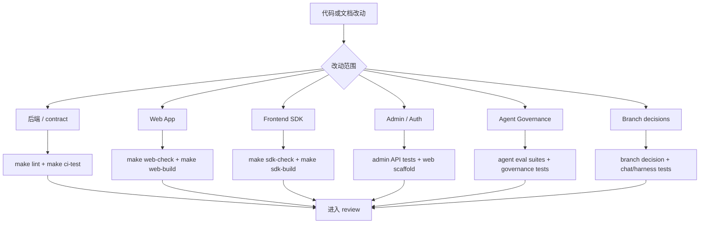

# 开发指南

这份文档收拢日常开发和验证命令，不把命令矩阵继续堆在根目录 README 里。


```mermaid
flowchart TD
    Change["代码或文档改动"] --> Scope{"改动范围"}
    Scope --> Backend["后端 / contract"]
    Scope --> Web["Web App"]
    Scope --> SDK["Frontend SDK"]
    Scope --> Admin["Admin / Auth"]
    Scope --> Agent["Agent Governance"]
    Scope --> Branch["Branch decisions"]
    Backend --> CI["make lint + make ci-test"]
    Web --> WebChecks["make web-check + make web-build"]
    SDK --> SDKChecks["make sdk-check + make sdk-build"]
    Admin --> AdminChecks["admin API tests + web scaffold"]
    Agent --> Eval["agent eval suites + governance tests"]
    Branch --> BranchChecks["branch decision + chat/harness tests"]
    CI --> Done["进入 review"]
    WebChecks --> Done
    SDKChecks --> Done
    AdminChecks --> Done
    Eval --> Done
    BranchChecks --> Done
```

## 命令矩阵

```bash
make help
make install
make setup-local
make api
make dev
make serve
make serve-dev
make serve-prod
make web-dev
make web-check
make web-build
make frontend-check
make frontend-check-full
make frontend-style-check
make frontend-bundle-check
make frontend-qa
make frontend-visual-qa
make frontend-build
make sdk-check
make sdk-build
make sdk-openapi-types-check
make architecture-report
make architecture-gate
make compat-report
make compat-gate
make format
make format-check
make ci-test
make ci
pnpm android:runtime:smoke
pnpm android:apk:debug
make ui-smoke
make ui-smoke-observability
make ui-smoke-productivity
make ui-smoke-agent-team-adoption
make test-graph-builder
make test-chat-service
focus-agent-retrieval-index doctor
focus-agent-memory-embedding --database-uri "$DATABASE_URI" doctor
```

## 常见开发流

### 只跑后端

- `make api`：启动 API 服务
- `make dev`：以 `API_RELOAD=1` 启动 API 服务

### 本地全链路开发

- `make serve` / `make serve-dev`：同时启动前端 Vite dev server 和后端 API
- `API_RELOAD=0 make serve-dev`：以同一套 dev 栈启动，但关闭后端 reload，适合完整浏览器验证
- `make serve-prod`：先构建前端，再以非 reload 模式只启动后端

### 只跑前端

- `make web-dev`：启动 React 前端开发服务器
- `make web-build`：构建由 FastAPI 在 `/app` 下托管的静态产物

### 本地持久化模式

当 `DATABASE_URI` 未设置时，受 Make 管理的启动命令（`make api`、
`make dev`、`make serve`、`make serve-dev` 和 `make serve-prod`）会启动
repo 内本地 PostgreSQL。直接裸跑 `.venv/bin/focus-agent-api` 不会启动这个
helper；没有 `DATABASE_URI` 时，裸进程会使用本地 fallback：

- 分支、用户和生产力数据等 app-state 持久化到 `BRANCH_DB_PATH` 指定的
  SQLite 数据库（默认 `.focus_agent/branches.sqlite3`）；
- LangGraph checkpoint 与本地 store 默认写入
  `.focus_agent/langgraph-checkpoints.sqlite3` 和
  `.focus_agent/langgraph-store.sqlite3`；
- harness journal 仍使用 SQLite。

`FOCUS_AGENT_CHECKPOINT_BACKEND=sqlite` 是安全默认值。旧 pickle
checkpoint/store 只是兼容输入，不是默认存储格式。显式使用 pickle 时必须
开启签名校验并配置 `FOCUS_AGENT_CHECKPOINT_HMAC_KEY`；签名缺失或无效、
密钥缺失、文件不可读或 owner 不匹配时，启动会在加载状态前 fail closed。
把本地状态迁移到 Postgres 前必须先停止本地 runtime。

## 验证建议

### 仓库债务门禁

`make ci` 包含两个阻断式债务门禁：

```bash
make architecture-gate
make compat-gate
```

architecture gate 对非生成源码使用规范化的 800 行上限。
`docs/architecture-debt-baseline.json` 没有任何 grandfathered 大文件，
所以扫描范围内所有超过 800 行的文件都是回归；已经拆分到阈值以下的文件也
不能重新长回来。

compatibility gate 使用 schema v2 和
`docs/compat-debt-baseline.json` 中与行号无关的精确 item ID。当前库存是
170 项。即使分类计数和总数不变，只要出现新的 item ID，门禁也会失败。
不要为了让 CI 通过而随意增加 `max_total`、分类上限或 `item_ids`：应移除
新兼容路径；如果确实需要新增兼容项，则必须记录并评审原因与退出条件。
`make architecture-report` 和 `make compat-report` 用于非阻断诊断，
对应的 `*-gate` 才是合并门禁。

推荐按下面的层级来跑：

1. 广义改动先跑：

```bash
make ci
```

`make ci` 会运行 strict Python lint、CI 风格 pytest、API/SDK contract
snapshot、阻断式 architecture/compatibility gates、frontend SDK
check/build/transport validation、全量 Web lint/format-check/check/build，以及
Node stream frontend regression。GitHub CI 还会额外跑 generated OpenAPI /
SDK types drift guard，所以 API route 或 response model 改动即使本地 `make ci`
通过，也必须包含 `make sdk-openapi-types-check`。只检查 Python 格式时可跑：

```bash
make format-check
```

如果是 runtime、sandbox、Skill、SDK、Web、Agent Team 或 observability 这类横跨多模块的改动，请按 [validation-runbook.md](validation-runbook.md) 跑完整证据链。该 runbook 会把 `make ci`、OpenAPI/SDK drift、源码级 smoke、真实浏览器 smoke 和 `/readyz` readiness 串成一套统一的本地通过/失败口径。

2. 如果改动影响后端路由、stream 事件或 Web App 对 frontend SDK 的使用：

```bash
make contract-check
make sdk-openapi-types-check
uv run pytest tests/test_contract_checks.py
```

`make contract-check` 会比较 FastAPI route snapshot、frontend SDK public surface、SDK package barrel exports，以及 Web App 在 `apps/web/src` 下对 `@focus-agent/web-sdk` 的 imports。如果 route 或 SDK/E2E contract 漂移是预期行为，请用 `uv run python scripts/check_contracts.py --update` 更新 snapshot，并在 review 中包含 snapshot diff。

`make sdk-openapi-types-check` 会重新生成 `docs/api/openapi.json` 和 `frontend-sdk/src/types/__generated__.ts`，并在任一文件发生 drift 时失败。只要 FastAPI 路由、Pydantic response model 或 generated SDK 类型变化，都应运行这个检查。

这些生成物是受版本控制的源码。当 `make sdk-openapi-types-check` 打印 diff 时，要提交重新生成的 `docs/api/openapi.json` 和 `frontend-sdk/src/types/__generated__.ts`；当 `make contract-check` 报 SDK/API drift 时，用 `uv run python scripts/check_contracts.py --update` 更新对应 `tests/contracts/*.json` snapshot，并先 review snapshot diff 再提交。

3. 如果改动影响 frontend SDK 实现，尤其是 `src/client.ts`、`src/client/`、`src/types.ts`、`src/types/`、`src/transport.ts`、`src/parser.ts`、`src/reducers.ts`、`src/toolProtocol.ts`、`src/guards.ts` 或 transport validation 文件：

```bash
make sdk-check
make sdk-build
make sdk-validate-transport
make sdk-openapi-types-check
pnpm --dir frontend-sdk validate:transport
```

4. 如果改动影响 Web App：

```bash
make web-lint
make web-format-check
make web-check
make web-build
```

包级 `web-lint` / `web-format-check` 脚本目前有意只覆盖 `src/entities` 和 `src/features/trajectory-observability`；`make web-lint-full` 和 `make web-format-check-full` 覆盖完整 `apps/web/src`。`make web-check` 和 `make web-build` 仍是完整 Web App 类型检查和构建门禁。

如果是较大的前端或 runtime 重构，请跑维护中的前端质量组合：

```bash
make frontend-qa
```

它会组合 full frontend checks、style governance（禁止新增 `!important`、硬编码十六进制颜色、CSS LOC 超预算）、Android local runtime smoke、bundle budget、architecture report 和 compatibility inventory。视觉或 a11y 改动还应在运行中的应用上补：

```bash
make frontend-visual-qa FRONTEND_QA_BASE_URL=http://127.0.0.1:5173
```

`.github/workflows/ci.yml` 中的 `android` 是独立阻断 job。它会安装
Android API/build-tools 36，运行 `pnpm android:sync:debug`，然后执行 debug
构建、lint 和 JVM 单测门禁：

```bash
pnpm android:sync:debug
(cd android && ./gradlew --no-daemon assembleDebug lintDebug testDebugUnitTest)
```

CI 不会假装自己提供了模拟器。做本地 native 与模拟器验证时，先运行
JavaScript local-runtime smoke，再使用真实连接的 API 36 模拟器或设备：

```bash
pnpm android:runtime:smoke
pnpm android:apk:debug
adb devices
(cd android && ./gradlew connectedDebugAndroidTest)
pnpm android:run
adb shell am start -W \
  -a android.intent.action.VIEW \
  -d 'focusagent://app/admin/config' \
  ai.focusagent.app
```

connected tests 会覆盖 native 可取消 HTTP 与 deep-link 插件。安装后还要做
一次人工真实交互：配置设备本地 provider、发送并取消一条流式请求，然后分别
在冷启动和应用运行中各打开一次 deep link。

5. 如果改动影响 stream 可见性、工具协议过滤、frontend stream reducer、处理过程卡或 live-web execution contract：

```bash
.venv/bin/pytest tests/test_streaming.py tests/test_harness_api.py tests/test_graph_builder.py tests/test_execution_contract.py -q
pnpm test:thread-stream-frontend-regressions
pnpm sdk:check
pnpm web:check
```

公开 SSE 事件契约和内部 `quarantine` / `visible` phase 边界见 [streaming-contract.md](streaming-contract.md)。浏览器检查应包含真实工具调用问题，并确认 assistant 气泡不出现 DSML/XML/function-call 文本，同时工具处理卡仍正常展示。
如果改动 live-web 行为，请用包含 "today"、"tomorrow" 或 "本周" 的相对时间问题验证 `current_utc_time` 会先锚定时间再 `web_search`；过期证据最多触发一次修复检索，最终应给出有证据的回答或明确的不确定说明。

6. 如果改动影响 Agent Team planning、execution、final-answer synthesis 或 Mission Runner UI：

```bash
.venv/bin/python -m pytest tests/test_agent_team_* -q
make contract-check
make web-check
make web-build
make ui-smoke-agent-team-adoption
```

Agent Team 的 fake execution 只用于验证流程，必须展示为 `final_answer_status="placeholder"` 和 `request_changes`，不能被当成可交付最终答案。浏览器检查应确认默认 UI 不显示 raw fake run text，output id / artifact id 只出现在高级详情里。

7. 如果改动影响真实浏览器里的聊天、分支树或 merge-review 流程：

```bash
make ui-smoke
# 或直接跑底层 browser smoke：
uv run python scripts/ui_smoke_test.py
# 调试后端托管静态页面或本地关闭鉴权时：
AUTH_ENABLED=false WEB_APP_DEV_SERVER_URL= API_PORT=8001 ./scripts/run-api.sh
uv run python scripts/ui_smoke_test.py --app-url http://127.0.0.1:8001/app/ --health-url http://127.0.0.1:8001/healthz --message '最近一周华钰矿业这只A股股票的表现怎么样？请联网查询并用中文简要说明。'
```

浏览器 smoke 会等待流式回复结束且文本稳定后再读取结果。涉及复杂工具调用时不要只用默认 OK 消息，应增加真实问题，以捕捉 `tool.call.delta` payload 等 transport 校验回归。

`scripts/ui_smoke_test.py` 不会启动 API 或 Vite dev server。按默认参数运行前，请先确认 `http://127.0.0.1:8000/healthz` 和 `http://127.0.0.1:5173/app/` 已可访问。如果指向后端托管的静态 app，请先跑 `make web-build`。

`.github/workflows/browser-smoke.yml` 是 CI 中对应的真实 Chrome 门禁。它通过
Playwright 安装 Google Chrome，构建 production Web App，启动 Postgres 和
确定性模型 fixture，托管构建产物，并运行 `scripts/ui_smoke_test.py` 以及
observability 的全部场景。它会在 pull request、默认分支 push 和手动触发时
运行；失败诊断与 smoke JSON 会上传为 workflow artifact。源码级或 DOM mock
检查不能替代这个 workflow。

在只通过 SSH 连接、没有图形显示环境的机器上，先给 Playwright/Chrome 调用配置一个 headless wrapper：

```bash
cat > /tmp/focus-agent-chromium-headless <<'SH'
#!/usr/bin/env bash
exec /usr/bin/chromium --headless --no-sandbox "$@"
SH
chmod +x /tmp/focus-agent-chromium-headless
export CHROME_PATH=/tmp/focus-agent-chromium-headless
```

长时间 browser smoke 或 Agent Team smoke 之后，要重新检查 `/readyz`，不要只看 `/healthz`。`background_jobs.ready=false` 表示进程还活着，但本地队列没有清空；在理解或清理 pending work 前，这次验证应记录为 degraded。

如果改动影响 sandbox execution，请先构建或刷新标准执行镜像，再跑依赖 Docker 执行的浏览器或 API smoke：

```bash
make sandbox-image
# 或不通过 Make：
uv run python scripts/ensure_sandbox_image.py --image focus-agent-sandbox:latest
.venv/bin/python -m pytest tests/test_sandbox_execution.py tests/test_default_tools.py tests/test_skill_registry.py tests/test_execution_contract.py -q
```

sandbox Dockerfile 默认使用 `node:20-bookworm-slim`，不再依赖体积较大的 devcontainer 镜像。如果本地镜像源更稳定，可以给 `scripts/ensure_sandbox_image.py` 传 `--base-image`、`--apt-mirror` 或 `--apt-security-mirror`。`FOCUS_AGENT_SANDBOX_IMAGE` 可以指向其他受信任本地镜像。默认镜像不存在时，dev run 可能降级到 local backend，并在工具结果里带 `fallback_reason`；不要把这个降级路径当成最终安全模型。执行契约和排障矩阵见 [sandbox-execution.md](sandbox-execution.md)。

8. 如果改动影响 observability 页面或种子 trajectory 的浏览器链路：

```bash
make ui-smoke-observability
# 发布式 observability smoke：
uv run python scripts/observability_ui_smoke.py --scenario all
pnpm --dir apps/web smoke:observability
```

`scripts/observability_ui_smoke.py` 在 health probe 失败时会尝试通过 `./scripts/run-api.sh` 自动启动本地 API；如果要强制使用已运行的 API，请加 `--no-start-api`。它仍然需要 Chrome，以及 `DATABASE_URI` 或托管本地 Postgres 的 runtime file。`pnpm --dir apps/web smoke:observability` 是源码级路由和 wiring 检查，会补充真实浏览器 smoke，但不能替代它。

如果 API 把 `/app` 重定向到 Vite server，请传入 `--app-base-url http://127.0.0.1:5173/app`，让 browser smoke 等待实际渲染的同源页面。页面已经可见渲染 trajectory evidence、所有捕获到的 fetch 都是 200，但 smoke 因 copy 或 panel 文案变化失败时，应随 UI 变更同步更新 smoke 断言；不要掩盖 endpoint failure、console error 或空 evidence state。

9. 如果改动影响 trajectory observability contract：

```bash
uv run pytest tests/test_api_middleware.py tests/test_api_trajectory_observability.py tests/test_api_trajectory_actions.py tests/test_trajectory_cli.py
```

10. 如果改动影响 repository 行为，尤其是 AgentTeam repository session/task/output 语义：

```bash
uv run pytest tests/test_agent_team_repository_contract.py
```

SQLite 用例默认本地运行。设置 `DATABASE_URI` 时会同时运行 Postgres 用例；否则只 skip Postgres backend。

11. 如果改动影响 ChatService、runtime 装配或 config/runtime 目录边界：

```bash
make test-chat-service
uv run pytest tests/test_runtime_backend_selection.py tests/test_local_runtime_app_state_persistence.py tests/test_local_persistence_fail_closed.py tests/test_migrate_local_state_sqlite_sources.py tests/test_config_local_doc.py
```

ChatService 已按 branch action facade、streaming lifecycle、thread access、compaction、trajectory recording 和 turn-error helper 拆分。行为变更应由 service tests 和 browser smoke 覆盖，不要只依赖 import 级检查。
这组 runtime 测试也会锁定裸跑且无 `DATABASE_URI` 时的 SQLite app-state、
checkpoint/store 默认值，以及 legacy pickle 的 fail-closed 行为。

12. 如果改动影响 Memory v2、Zvec retrieval、embedding、pgvector fallback、迁移或 memory retrieval：

```bash
uv run pytest tests/test_memory_embedding_policy.py tests/test_memory_embedding_cli.py tests/test_memory_embedding_provider.py tests/test_postgres_memory_repository.py tests/test_memory_retriever.py tests/test_migrate_local_state.py
uv run pytest tests/test_retrieval_index.py tests/test_retrieval_expansion.py tests/test_default_tools.py
focus-agent-retrieval-index doctor
focus-agent-memory-embedding --database-uri "$DATABASE_URI" doctor
```

`focus-agent-retrieval-index doctor` 是只读诊断命令，会检查嵌入式 Zvec index 路径、readiness、当前 backend 和 fallback backend，且不输出 vector payload。`focus-agent-memory-embedding doctor` 需要 Postgres `DATABASE_URI`，会检查 provider 选择、pgvector extension/table/dimensions/index 状态；本地 auto 模式缺少 `embeddinggemma` 时会输出 `ollama pull embeddinggemma` 提示。如果 API 是通过托管本地 Postgres 启动的，新 shell 里先 `source .focus_agent/postgres/runtime.env`。
如果改动 prompt 过滤，请覆盖无关个人偏好、称呼/口令记忆、sticky 语言/语气偏好，以及 `MemoryRetrievalPlan.selected_memory_ids`。

13. 如果改动影响 runtime coordination、durable background jobs、thread turn lease 或 branch refresh 调度：

```bash
uv run pytest tests/test_coordination.py tests/test_background_work.py tests/test_chat_service.py
uv run pytest tests/test_runtime_backend_selection.py tests/test_config_security.py
```

这些检查覆盖 in-memory/Postgres thread lease、durable job claim token 与 claim heartbeat、heartbeat lost 行为，以及首轮 branch title/metadata refresh 在 active chat turn lease release 后再调度的边界。

如果改动触及 API rate limit，也要包含 `tests/test_coordination.py`。Postgres-backed runtime 应使用 `PostgresRateLimitBackend` 和 `focus_rate_limit_buckets` schema；local/fallback runtime 继续使用 in-memory backend。

14. 如果改动影响 branch decision、发送前推荐或 Branch Action 确认链路：

```bash
uv run pytest tests/test_branch_decision_service.py tests/test_branch_decision_api.py tests/test_branch_decision_repository.py
uv run pytest tests/test_branch_repository_contract.py tests/test_thread_resolution_api.py
uv run pytest tests/test_chat_service.py tests/test_harness_api.py tests/test_web_app_scaffold.py
node --test tests/test_thread_stream_frontend_regressions.mjs
make contract-check
make sdk-openapi-types-check
make web-check
```

真实浏览器验证时，开启 `AGENT_BRANCH_RECOMMENDATION_ENABLED=true` 和
`AGENT_BRANCH_RECOMMENDATION_MODE=suggest`，并使用明确要求创建子分支或同级分支的 prompt。需要确认推荐卡片出现、该推荐没有继续进入普通 graph turn、确认/取消后 thread 与 branch tree cache 都刷新正确。
如果改动触及 handoff 隔离，还需要使用不同 sentinel 跑“子分支 -> 同级分支”真实浏览器流程，确认最终同级分支 transcript、`GET /v1/threads/{thread_id}` 和 context preview 只包含自己的交接文本，不包含源子分支交接文本或无关 thread id。
同时验证 `GET /v1/threads/{thread_id}/resolution` 对 root、child、unknown thread 的返回，以及从 child thread 路由打开分支树仍能解析到 root。

15. 如果改动影响 Auth / Access Model、token 生命周期或 ownership 语义：

```bash
uv run pytest tests/test_auth.py tests/test_auth_accounts_api.py tests/test_admin_users_api.py tests/test_user_service.py tests/test_config_security.py tests/test_auth_ownership.py tests/test_csrf_middleware.py
uv run ruff check src/focus_agent/auth.py src/focus_agent/config.py tests/test_auth.py tests/test_config_security.py tests/test_auth_ownership.py
```

这组 focused suite 覆盖 HS256 issuer/audience/TTL、过期或轮换 token、生产环境禁用 demo token、注册/密码规则、refresh session 退出、admin 角色保护，以及 `tenant_id` 和 `scope` 只是 claim metadata 而不是 thread ownership key 的边界。

除 `dev`、`development`、`local`、`test`、`testing`、`ci` 外的环境都会在
`AUTH_COOKIE_SECURE` 不是 `true` 时拒绝启动，且
`AUTH_COOKIE_SAMESITE` 只能是 `lax` 或 `strict`。使用 Cookie 鉴权的
`POST`、`PUT`、`PATCH`、`DELETE` 请求受 CSRF 保护，必须同源。没有 Fetch
Metadata 或 origin header 的非浏览器客户端，可以发送相同的、由客户端生成的
`focus_agent_csrf` Cookie 和 `X-CSRF-Token` header。携带有效
`Authorization: Bearer ...` 的 mutation 不受 Cookie CSRF 检查，但同时存在
auth Cookie 时，无效 Bearer token 不能绕过检查。

如果改动触及 Admin Console 设置中心、Skill 管理、Web 页面、admin SDK 类型、管理员路由保护或审计事件 UI，也要跑：

```bash
uv run pytest tests/test_admin_config_api.py tests/test_skill_registry.py tests/test_config_local_doc.py
uv run pytest tests/test_web_app_scaffold.py
make contract-check
make web-check
make web-build
make sdk-check
make frontend-android-runtime-smoke
```

如果改动触及 Web 登录页、账号侧栏、管理员路由保护或 token 存储，还要用真实浏览器跑一遍主流程：

- 未登录访问 `/app/admin/users` 等受保护页面，确认跳转到 `/app/auth/login?return_to=...`。
- 点击 `Demo 登录`，确认登录后回到原受保护页面。
- 从左侧栏账号区域 `退出登录`，确认重新看到登录页。
- 调用本地 `/v1/auth/demo-token` 生成 token，通过 `使用 Bearer Token` 面板登录，确认侧栏账号已切换。
- 注册或 admin reset password 后，确认用户名密码登录仍能回到同一个 `return_to` 目标页面。
- 在 `/app/admin/users` 创建用户、打开详情抽屉，并填写 reason 后变更状态或角色。
- 在 `/app/admin/audit-events` 按 resource 或 decision 过滤，并打开事件详情抽屉。
- 需要切回其他账号时先退出再重新登录。当前没有独立切换器，账号切换就是 logout 后选择另一种登录方式。

16. 如果改动影响 release ops、nightly、production smoke、Postgres ops 或 OTel smoke：

```bash
uv run pytest tests/test_release_gate.py tests/test_release_evidence.py tests/test_release_health_check.py tests/test_nightly_regression.py tests/test_production_smoke.py tests/test_postgres_ops.py tests/test_otel_smoke.py tests/test_agent_governance_report.py
make nightly-regression
make production-smoke PRODUCTION_SMOKE_ARGS="--dry-run --base-url https://focus-agent.example.com"
make postgres-ops POSTGRES_OPS_ARGS="--dry-run"
make otel-smoke OTEL_SMOKE_ARGS="--dry-run --endpoint http://otel-collector:4318"
make agent-governance-report
uv run python -m tests.eval --suite golden_multi_agent --concurrency 1
uv run python -m tests.eval --suite harness_stability --concurrency 1
```

完整 release gate 包含依赖真实 provider/model 的 live-model eval smoke。离线测试环境可以跑 focused release-gate 测试和生成的离线 report，但要把跳过的 live eval 记录成验证缺口，不能等同于真实模型链路通过。

17. 如果改动影响 schema migration、Docker entrypoint、artifact storage、OpenAPI export 或 generated SDK types：

```bash
uv run alembic -c alembic.ini heads
uv run python scripts/export-openapi.py
make sdk-openapi-types-check
uv run pytest tests/test_coordination.py tests/test_default_tools.py -k artifact
```

`alembic upgrade head` 需要 `DATABASE_URI`；Docker entrypoint 会在 `DATABASE_URI` 存在时自动执行。当前 Alembic baseline 会委托 app schema migrations，并应保持 `focus_schema_migrations` 与 `postgres_schema.py` 对齐。

18. 如果改动影响 Agent 角色路由、delegation execution、Memory Curator、Tool Router、Context Engineering、Task Ledger、helper-model fallback 或治理观测：

```bash
uv run pytest tests/test_agent_roles.py tests/test_agent_governance.py tests/test_agent_delegation.py tests/test_agent_context_engineering.py tests/test_agent_task_ledger.py tests/eval/test_agent_arch_suite.py tests/eval/test_agent_governance_suite.py tests/eval/test_agent_delegation_suite.py tests/eval/test_agent_context_suite.py tests/eval/test_agent_task_ledger_suite.py
uv run python -m tests.eval --suite agent_arch --concurrency 1
uv run python -m tests.eval --suite agent_governance --concurrency 1
uv run python -m tests.eval --suite agent_delegation --concurrency 1
uv run python -m tests.eval --suite agent_context --concurrency 1
uv run python -m tests.eval --suite agent_task_ledger --concurrency 1
uv run python -m tests.eval --suite golden_multi_agent --concurrency 1
uv run python -m tests.eval --suite harness_stability --concurrency 1
```

项目级评测策略记录在 `docs/agent-evaluation.md`。`smoke`、
`golden_multi_agent` 和 `harness_stability` 是 release-blocking suite；
`model_matrix` 和 `trajectory_failures` 是 nightly 非阻断信号。改动模型路由或多 Agent 行为时，也建议跑：

```bash
uv run python -m tests.eval --suite model_matrix --concurrency 1 --max-cases 1
uv run python -m tests.eval --suite trajectory_failures --concurrency 1 --max-cases 1
```

工作区查询、受保护的工作区编辑和 graph builder 回归还应覆盖
local-first 工具路径：

```bash
make test-graph-builder
uv run pytest tests/test_default_tools.py -k "search_code or apply_patch or run_workspace_command"
uv run python -m tests.eval --suite agent_arch --concurrency 1
```

如果本机 `.venv` 里的 `psycopg` 因缺少 `libpq` 在测试收集阶段失败，可先用当前 focused observability workaround：

```bash
PYTHONPATH=/tmp/psycopg_stub .venv/bin/pytest \
  tests/test_api_middleware.py \
  tests/test_metadata.py \
  tests/test_trajectory_observability.py \
  tests/test_api_trajectory_observability.py \
  tests/test_chat_service.py
```

19. 如果改动生产力工作台（notes/tasks/capture）：

```bash
uv run pytest tests/test_productivity_api.py tests/test_productivity_repository.py tests/test_default_tools.py -k productivity
make ui-smoke-productivity
```

如果要同步检查生产力页面源代码扫描面的接入，也跑：

```bash
pnpm --dir apps/web smoke:productivity
```

常见失败定位点：

- `apps/web/src/app/router.tsx` 的 `/productivity/notes` 与 `/productivity/tasks` 路由是否注册
- `apps/web/src/app/shell/app-shell-config.ts` 的 `isProductivityPath` 路径判定
- `apps/web/src/app/shell/app-shell-global-navigation.tsx` 导航项是否存在
- `frontend-sdk/src/client/productivity.ts` 与 `frontend-sdk/src/types/productivity.ts`
- `src/focus_agent/api/routers/productivity.py` 与 `src/focus_agent/services/productivity.py` 的 404 ownership 与 capture 行为

`make ci-test` 会把 `FOCUS_AGENT_LOCAL_ENV_FILE` 指向一个不存在的文件再跑 pytest，更接近 GitHub Actions，也避免本机 `.focus_agent/local.env` 里的配置掩盖测试环境缺口。隐私/脱敏测试不要断言过短数字片段（例如区号），应检查完整手机号或密钥片段，避免时间戳造成误报。

## 相关文档

- [快速开始](quick-start.zh-CN.md)
- [Docker 部署说明](docker-deployment.md)
- [架构说明](architecture.md)
- [Auth / Access](auth-access.md)
- [管理员控制台](admin-console.md)
- [Agent Team Workbench](agent-team-workbench.md)
- [Agent Governance](agent-role-routing.md)
- [分支决策与推荐](branch-decisions.md)
- [路线图](roadmap.md)
