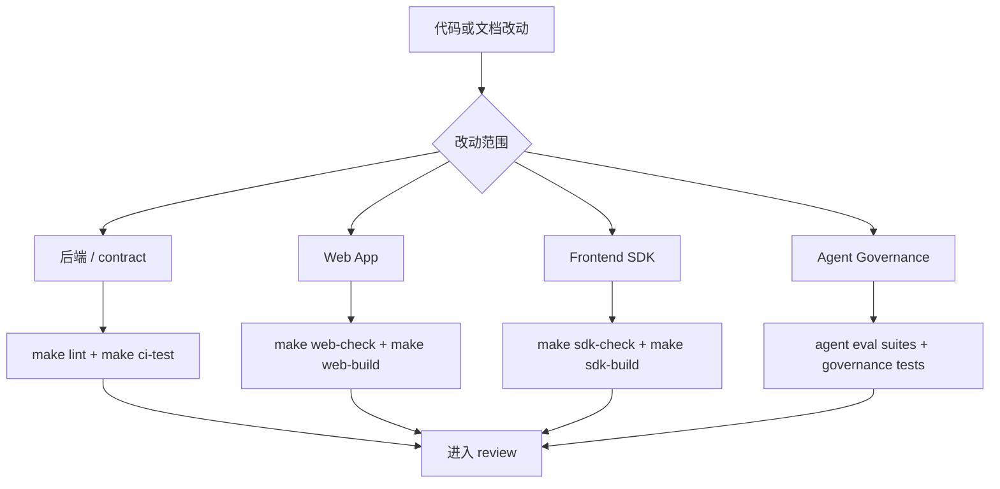

# 开发指南

这份文档收拢日常开发和验证命令，不把命令矩阵继续堆在根目录 README 里。


```mermaid
flowchart TD
    Change["代码或文档改动"] --> Scope{"改动范围"}
    Scope --> Backend["后端 / contract"]
    Scope --> Web["Web App"]
    Scope --> SDK["Frontend SDK"]
    Scope --> Agent["Agent Governance"]
    Backend --> CI["make lint + make ci-test"]
    Web --> WebChecks["make web-check + make web-build"]
    SDK --> SDKChecks["make sdk-check + make sdk-build"]
    Agent --> Eval["agent eval suites + governance tests"]
    CI --> Done["进入 review"]
    WebChecks --> Done
    SDKChecks --> Done
    Eval --> Done
```

## 命令矩阵

```bash
make help
make install
make setup-local
make api
make dev
make serve
make serve-dev
make serve-prod
make web-dev
make web-check
make web-build
make frontend-check
make frontend-build
make sdk-check
make sdk-build
make format
make format-check
make ci-test
make ci
make ui-smoke
make ui-smoke-observability
```

## 常见开发流

### 只跑后端

- `make api`：启动 API 服务
- `make dev`：以 `API_RELOAD=1` 启动 API 服务

### 本地全链路开发

- `make serve` / `make serve-dev`：同时启动前端 Vite dev server 和后端 API
- `make serve-prod`：先构建前端，再以非 reload 模式只启动后端

### 只跑前端

- `make web-dev`：启动 React 前端开发服务器
- `make web-build`：构建由 FastAPI 在 `/app` 下托管的静态产物

## 验证建议

推荐按下面的层级来跑：

1. 广义改动先跑：

```bash
make ci
```

`make ci` 会运行 Python lint、CI 风格 pytest、API/SDK contract snapshot、frontend SDK check/build 和 Web check/build。只检查 Python 格式时可跑：

```bash
make format-check
```

2. 如果改动影响后端路由、stream 事件或 Web App 对 frontend SDK 的使用：

```bash
make contract-check
uv run pytest tests/test_contract_checks.py
```

`make contract-check` 会比较 FastAPI route snapshot、frontend SDK public surface、SDK package barrel exports，以及 Web App 在 `apps/web/src` 下对 `@focus-agent/web-sdk` 的 imports。如果 route 或 SDK/E2E contract 漂移是预期行为，请用 `uv run python scripts/check_contracts.py --update` 更新 snapshot，并在 review 中包含 snapshot diff。

3. 如果改动影响 frontend SDK 实现，尤其是 `src/client.ts`、`src/transport.ts`、`src/parser.ts`、`src/reducers.ts`、`src/guards.ts` 或 transport validation 文件：

```bash
make sdk-check
make sdk-build
cd frontend-sdk && npm run validate:transport
```

4. 如果改动影响 Web App：

```bash
pnpm --filter @focus-agent/web-app lint
pnpm --filter @focus-agent/web-app format
make web-check
make web-build
```

Web lint/format 脚本目前有意只覆盖 message transcript 区域；`make web-check` 和 `make web-build` 仍是完整 Web App 类型检查和构建门禁。

5. 如果改动影响真实浏览器里的聊天、分支树或 merge-review 流程：

```bash
make ui-smoke
# 或直接跑底层 browser smoke：
uv run python scripts/ui_smoke_test.py
```

6. 如果改动影响 observability 页面或种子 trajectory 的浏览器链路：

```bash
make ui-smoke-observability
# 发布式 observability smoke：
uv run python scripts/observability_ui_smoke.py --scenario all
pnpm --dir apps/web smoke:observability
```

7. 如果改动影响 trajectory observability contract：

```bash
uv run pytest tests/test_api_middleware.py tests/test_api_trajectory_observability.py tests/test_api_trajectory_actions.py tests/test_trajectory_cli.py
```

8. 如果改动影响 repository 行为，尤其是 AgentTeam repository session/task/output 语义：

```bash
uv run pytest tests/test_agent_team_repository_contract.py
```

SQLite 用例默认本地运行。设置 `DATABASE_URI` 时会同时运行 Postgres 用例；否则只 skip Postgres backend。

9. 如果改动影响 ChatService、runtime 装配或 config/runtime 目录边界：

```bash
uv run pytest tests/test_chat_service.py tests/test_runtime_backend_selection.py tests/test_config_local_doc.py
```

10. 如果改动影响 Agent 角色路由、Memory Curator、Tool Router、Context Engineering、Task Ledger、helper-model fallback 或治理观测：

```bash
uv run pytest tests/test_agent_roles.py tests/test_agent_governance.py tests/test_agent_delegation.py tests/test_agent_context_engineering.py tests/test_agent_task_ledger.py tests/eval/test_agent_arch_suite.py tests/eval/test_agent_governance_suite.py tests/eval/test_agent_delegation_suite.py tests/eval/test_agent_context_suite.py tests/eval/test_agent_task_ledger_suite.py
uv run python -m tests.eval --suite agent_arch --concurrency 1
uv run python -m tests.eval --suite agent_governance --concurrency 1
uv run python -m tests.eval --suite agent_delegation --concurrency 1
uv run python -m tests.eval --suite agent_context --concurrency 1
uv run python -m tests.eval --suite agent_task_ledger --concurrency 1
```

工作区查询回归还应覆盖 local-first 工具路径：

```bash
uv run pytest tests/test_graph_builder.py::test_graph_forces_search_code_for_workspace_definition_lookup tests/test_default_tools.py::test_search_code_skips_local_focus_agent_runtime_dir
uv run python -m tests.eval --suite agent_arch --concurrency 1
```

如果本机 `.venv` 里的 `psycopg` 因缺少 `libpq` 在测试收集阶段失败，可先用当前 focused observability workaround：

```bash
PYTHONPATH=/tmp/psycopg_stub .venv/bin/pytest \
  tests/test_api_middleware.py \
  tests/test_metadata.py \
  tests/test_trajectory_observability.py \
  tests/test_api_trajectory_observability.py \
  tests/test_chat_service.py
```

`make ci-test` 会把 `FOCUS_AGENT_LOCAL_ENV_FILE` 指向一个不存在的文件再跑 pytest，更接近 GitHub Actions，也避免本机 `.focus_agent/local.env` 里的配置掩盖测试环境缺口。

## 相关文档

- [快速开始](quick-start.zh-CN.md)
- [Docker 部署说明](docker-deployment.md)
- [架构说明](architecture.md)
- [Agent Governance](agent-role-routing.md)
- [路线图](roadmap.md)
