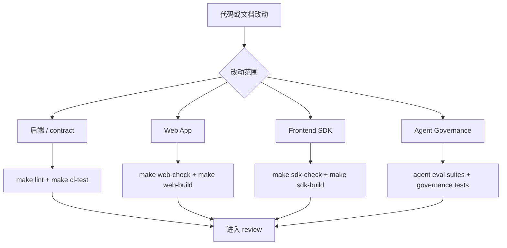

# 开发指南

这份文档收拢日常开发和验证命令，不把命令矩阵继续堆在根目录 README 里。


```mermaid
flowchart TD
    Change["代码或文档改动"] --> Scope{"改动范围"}
    Scope --> Backend["后端 / contract"]
    Scope --> Web["Web App"]
    Scope --> SDK["Frontend SDK"]
    Scope --> Agent["Agent Governance"]
    Backend --> CI["make lint + make ci-test"]
    Web --> WebChecks["make web-check + make web-build"]
    SDK --> SDKChecks["make sdk-check + make sdk-build"]
    Agent --> Eval["agent eval suites + governance tests"]
    CI --> Done["进入 review"]
    WebChecks --> Done
    SDKChecks --> Done
    Eval --> Done
```

## 命令矩阵

```bash
make help
make install
make setup-local
make api
make dev
make serve
make serve-dev
make serve-prod
make web-dev
make web-check
make web-build
make frontend-check
make frontend-build
make sdk-check
make sdk-build
make format
make format-check
make ci-test
make ci
make ui-smoke
make ui-smoke-observability
make test-graph-builder
make test-chat-service
```

## 常见开发流

### 只跑后端

- `make api`：启动 API 服务
- `make dev`：以 `API_RELOAD=1` 启动 API 服务

### 本地全链路开发

- `make serve` / `make serve-dev`：同时启动前端 Vite dev server 和后端 API
- `make serve-prod`：先构建前端，再以非 reload 模式只启动后端

### 只跑前端

- `make web-dev`：启动 React 前端开发服务器
- `make web-build`：构建由 FastAPI 在 `/app` 下托管的静态产物

## 验证建议

推荐按下面的层级来跑：

1. 广义改动先跑：

```bash
make ci
```

`make ci` 会运行 Python lint、CI 风格 pytest、API/SDK contract snapshot、frontend SDK check/build/transport validation、Web lint/format-check/check/build，以及 Node stream frontend regression。只检查 Python 格式时可跑：

```bash
make format-check
```

2. 如果改动影响后端路由、stream 事件或 Web App 对 frontend SDK 的使用：

```bash
make contract-check
uv run pytest tests/test_contract_checks.py
```

`make contract-check` 会比较 FastAPI route snapshot、frontend SDK public surface、SDK package barrel exports，以及 Web App 在 `apps/web/src` 下对 `@focus-agent/web-sdk` 的 imports。如果 route 或 SDK/E2E contract 漂移是预期行为，请用 `uv run python scripts/check_contracts.py --update` 更新 snapshot，并在 review 中包含 snapshot diff。

3. 如果改动影响 frontend SDK 实现，尤其是 `src/client.ts`、`src/client/`、`src/types.ts`、`src/types/`、`src/transport.ts`、`src/parser.ts`、`src/reducers.ts`、`src/toolProtocol.ts`、`src/guards.ts` 或 transport validation 文件：

```bash
make sdk-check
make sdk-build
cd frontend-sdk && npm run validate:transport
```

4. 如果改动影响 Web App：

```bash
pnpm --filter @focus-agent/web-app lint
pnpm --filter @focus-agent/web-app format
make web-check
make web-build
```

Web lint/format 脚本目前有意只覆盖 `src/entities` 和 `src/features/trajectory-observability`；`make web-check` 和 `make web-build` 仍是完整 Web App 类型检查和构建门禁。

5. 如果改动影响 Agent Team planning、execution、final-answer synthesis 或 Mission Runner UI：

```bash
.venv/bin/python -m pytest tests/test_agent_team_* -q
make contract-check
make web-check
make web-build
```

Agent Team 的 fake execution 只用于验证流程，必须展示为 `final_answer_status="placeholder"` 和 `request_changes`，不能被当成可交付最终答案。浏览器检查应确认默认 UI 不显示 raw fake run text，output id / artifact id 只出现在高级详情里。

6. 如果改动影响真实浏览器里的聊天、分支树或 merge-review 流程：

```bash
make ui-smoke
# 或直接跑底层 browser smoke：
uv run python scripts/ui_smoke_test.py
# 调试后端托管静态页面或本地关闭鉴权时：
AUTH_ENABLED=false WEB_APP_DEV_SERVER_URL= API_PORT=8001 ./scripts/run-api.sh
uv run python scripts/ui_smoke_test.py --app-url http://127.0.0.1:8001/app/ --health-url http://127.0.0.1:8001/healthz --message '最近一周华钰矿业这只A股股票的表现怎么样？请联网查询并用中文简要说明。'
```

浏览器 smoke 会等待流式回复结束且文本稳定后再读取结果。涉及复杂工具调用时不要只用默认 OK 消息，应增加真实问题，以捕捉 `tool_call.delta` payload 等 transport 校验回归。

`scripts/ui_smoke_test.py` 不会启动 API 或 Vite dev server。按默认参数运行前，请先确认 `http://127.0.0.1:8000/healthz` 和 `http://127.0.0.1:5173/app/` 已可访问。如果指向后端托管的静态 app，请先跑 `make web-build`。

6. 如果改动影响 observability 页面或种子 trajectory 的浏览器链路：

```bash
make ui-smoke-observability
# 发布式 observability smoke：
uv run python scripts/observability_ui_smoke.py --scenario all
pnpm --dir apps/web smoke:observability
```

`scripts/observability_ui_smoke.py` 在 health probe 失败时会尝试通过 `./scripts/run-api.sh` 自动启动本地 API；如果要强制使用已运行的 API，请加 `--no-start-api`。它仍然需要 Chrome，以及 `DATABASE_URI` 或托管本地 Postgres 的 runtime file。`pnpm --dir apps/web smoke:observability` 是源码级路由和 wiring 检查，会补充真实浏览器 smoke，但不能替代它。

7. 如果改动影响 trajectory observability contract：

```bash
uv run pytest tests/test_api_middleware.py tests/test_api_trajectory_observability.py tests/test_api_trajectory_actions.py tests/test_trajectory_cli.py
```

8. 如果改动影响 repository 行为，尤其是 AgentTeam repository session/task/output 语义：

```bash
uv run pytest tests/test_agent_team_repository_contract.py
```

SQLite 用例默认本地运行。设置 `DATABASE_URI` 时会同时运行 Postgres 用例；否则只 skip Postgres backend。

9. 如果改动影响 ChatService、runtime 装配或 config/runtime 目录边界：

```bash
make test-chat-service
uv run pytest tests/test_runtime_backend_selection.py tests/test_config_local_doc.py
```

ChatService 已按 branch action facade、streaming lifecycle、thread access、compaction、trajectory recording 和 turn-error helper 拆分。行为变更应由 service tests 和 browser smoke 覆盖，不要只依赖 import 级检查。

10. 如果改动影响 Auth / Access Model、token 生命周期或 ownership 语义：

```bash
uv run pytest tests/test_auth.py tests/test_auth_accounts_api.py tests/test_admin_users_api.py tests/test_user_service.py tests/test_config_security.py tests/test_auth_ownership.py
uv run ruff check src/focus_agent/auth.py src/focus_agent/config.py tests/test_auth.py tests/test_config_security.py tests/test_auth_ownership.py
```

这组 focused suite 覆盖 HS256 issuer/audience/TTL、过期或轮换 token、生产环境禁用 demo token、注册/密码规则、refresh session 退出、admin 角色保护，以及 `tenant_id` 和 `scope` 只是 claim metadata 而不是 thread ownership key 的边界。

如果改动触及 Web 登录页、账号侧栏、管理员路由保护或 token 存储，还要用真实浏览器跑一遍主流程：

- 未登录访问 `/app/admin/users` 等受保护页面，确认跳转到 `/app/auth/login?return_to=...`。
- 点击 `Demo 登录`，确认登录后回到原受保护页面。
- 从左侧栏账号区域 `退出登录`，确认重新看到登录页。
- 调用本地 `/v1/auth/demo-token` 生成 token，通过 `使用 Bearer Token` 面板登录，确认侧栏账号已切换。
- 注册或 admin reset password 后，确认用户名密码登录仍能回到同一个 `return_to` 目标页面。
- 需要切回其他账号时先退出再重新登录。当前没有独立切换器，账号切换就是 logout 后选择另一种登录方式。

11. 如果改动影响 release ops、nightly、production smoke、Postgres ops 或 OTel smoke：

```bash
uv run pytest tests/test_release_evidence.py tests/test_release_health_check.py tests/test_nightly_regression.py tests/test_production_smoke.py tests/test_postgres_ops.py tests/test_otel_smoke.py tests/test_agent_governance_report.py
make nightly-regression
make production-smoke PRODUCTION_SMOKE_ARGS="--dry-run --base-url https://focus-agent.example.com"
make postgres-ops POSTGRES_OPS_ARGS="--dry-run"
make otel-smoke OTEL_SMOKE_ARGS="--dry-run --endpoint http://otel-collector:4318"
make agent-governance-report
```

12. 如果改动影响 Agent 角色路由、delegation execution、Memory Curator、Tool Router、Context Engineering、Task Ledger、helper-model fallback 或治理观测：

```bash
uv run pytest tests/test_agent_roles.py tests/test_agent_governance.py tests/test_agent_delegation.py tests/test_agent_context_engineering.py tests/test_agent_task_ledger.py tests/eval/test_agent_arch_suite.py tests/eval/test_agent_governance_suite.py tests/eval/test_agent_delegation_suite.py tests/eval/test_agent_context_suite.py tests/eval/test_agent_task_ledger_suite.py
uv run python -m tests.eval --suite agent_arch --concurrency 1
uv run python -m tests.eval --suite agent_governance --concurrency 1
uv run python -m tests.eval --suite agent_delegation --concurrency 1
uv run python -m tests.eval --suite agent_context --concurrency 1
uv run python -m tests.eval --suite agent_task_ledger --concurrency 1
```

工作区查询和 graph builder 回归还应覆盖 local-first 工具路径：

```bash
make test-graph-builder
uv run pytest tests/test_default_tools.py::test_search_code_skips_local_focus_agent_runtime_dir
uv run python -m tests.eval --suite agent_arch --concurrency 1
```

如果本机 `.venv` 里的 `psycopg` 因缺少 `libpq` 在测试收集阶段失败，可先用当前 focused observability workaround：

```bash
PYTHONPATH=/tmp/psycopg_stub .venv/bin/pytest \
  tests/test_api_middleware.py \
  tests/test_metadata.py \
  tests/test_trajectory_observability.py \
  tests/test_api_trajectory_observability.py \
  tests/test_chat_service.py
```

`make ci-test` 会把 `FOCUS_AGENT_LOCAL_ENV_FILE` 指向一个不存在的文件再跑 pytest，更接近 GitHub Actions，也避免本机 `.focus_agent/local.env` 里的配置掩盖测试环境缺口。隐私/脱敏测试不要断言过短数字片段（例如区号），应检查完整手机号或密钥片段，避免时间戳造成误报。

## 相关文档

- [快速开始](quick-start.zh-CN.md)
- [Docker 部署说明](docker-deployment.md)
- [架构说明](architecture.md)
- [Agent Governance](agent-role-routing.md)
- [路线图](roadmap.md)
