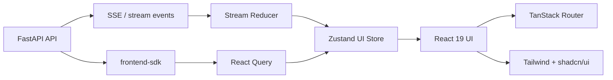

# Focus Agent 前端重构设计文档

更新时间：2026-04-18

> 状态说明：
> 这份文档保留了前端重构期间的设计决策与迁移拆分，但其中部分“迁移计划”章节现在已经属于历史记录。
> 截至 2026-04-18，`apps/web` 已接管 `/app` 主入口，旧的 Python `app_shell.py` 已删除，`frontend-sdk` 仍保留在当前目录而没有迁到 `packages/web-sdk`。
> 阅读本文时，请把“技术选型与边界设计”视为当前事实，把“Phase A-E 迁移计划”视为实现路径回顾，而不是今天仍待执行的待办清单。

## 1. 文档目标

这份文档用于记录 Focus Agent 前端重构的设计基线，以及仍然影响后续迭代的结构性决策。它最初要解决以下问题：

- 在重构开始前，内置 Web UI 由 Python 直接拼装 HTML/CSS/JS，代码已明显超出 demo 规模，维护成本高
- 前端协议层存在重复实现，内置页面与 `frontend-sdk` 各自维护一套 SSE 处理逻辑
- UI 状态、服务端状态、流式状态混杂，后续继续加功能会迅速失控
- 仓库已经具备稳定的 Python API、SSE 协议和 typed TS SDK，适合引入独立前端工程，而不是再继续扩展内嵌页面

本文档聚焦以下内容：

- 前端技术选型
- 目标架构与模块边界
- 目录设计
- 路由、状态、数据流设计
- 测试与部署方案
- 迁移阶段拆分

本文档不覆盖：

- 后端 API 重构
- merge policy、memory policy 等后端领域语义变更
- 视觉品牌升级或完整设计稿

## 2. 当前现状

当前仓库的前端能力由两部分构成：

- 独立 React Web App：后端通过 `/app` 返回 `apps/web/dist` 构建产物
- TypeScript SDK：提供 HTTP + POST-SSE typed client，位于 [frontend-sdk/src/client.ts](/Users/bytedance/go/src/code.byted.org/zgx/focus-agent/frontend-sdk/src/client.ts:1)

现状判断：

- 后端 API 边界已经比较清晰，入口在 [src/focus_agent/api/main.py](/Users/bytedance/go/src/code.byted.org/zgx/focus-agent/src/focus_agent/api/main.py:98)
- 流式事件语义已经具备统一基础，由 `ChatService` 将 LangGraph 输出映射为 SSE 事件，见 [src/focus_agent/services/chat.py](/Users/bytedance/go/src/code.byted.org/zgx/focus-agent/src/focus_agent/services/chat.py:438)
- 前端 SDK 已经具备 parser、reducer、types、guards 等基础能力，但尚未形成 React 应用层
- 旧的 Python 单文件内嵌页面已经删除，后续维护面集中到 React app 和 SDK

因此，本次前端重构的本质不是“重写 UI”，而是把现有协议和产品能力迁移到一个可持续维护的现代前端工程中，并已经完成主入口切换。

## 3. 设计结论

### 3.1 目标技术栈

推荐采用以下技术栈：

- 框架：React 19 + TypeScript
- 构建：Vite 8
- 路由：TanStack Router
- 服务端状态：TanStack Query
- 客户端交互状态：Zustand
- UI 基础：Tailwind CSS 4 + shadcn/ui
- 表单与校验：React Hook Form + Zod
- 单元与组件测试：Vitest + Testing Library
- E2E：Playwright

### 3.2 为什么不用 Next.js

本项目不建议使用 Next.js App Router 或其他全栈 React 框架，原因如下：

- 项目已有稳定的 Python API 与鉴权层，不需要再引入第二套服务端执行层
- 主要交互是控制台式的聊天、分支树、merge review，不是 SEO 驱动页面
- 核心能力是 POST-SSE 流式协议、branch-aware thread 状态与 merge review，这些与 Vite SPA 更匹配
- 额外引入 Node SSR / RSC / BFF 层只会增加系统复杂度，而不是降低复杂度

结论：

- 本项目采用“独立前端应用 + 现有 FastAPI API”的经典前后端分离架构
- 后端继续作为唯一业务与协议服务端
- 前端只负责界面、路由、状态组织和协议消费

## 4. 目标架构

### 4.1 总体结构



### 4.2 核心原则

- 协议单一来源：前端应用必须通过 `frontend-sdk` 访问 API 和流式协议，不允许页面层重复手写 SSE 解析
- 状态分层清晰：服务端状态、流式状态、本地 UI 状态分别管理
- 领域优先：按 `conversation / thread / branch / stream / merge-review` 拆模块，不按“组件杂货铺”拆
- 主入口唯一化：`/app` 只服务新的 React app，不再保留旧内嵌页面 fallback
- 后端最小侵入：尽量复用现有 API 与 contracts，不以“前端好写”为由重做后端

## 5. 仓库组织方案

### 5.1 目标目录

建议将前端调整为轻量 workspace 结构：

```text
/
  apps/
    web/
      src/
      public/
      tests/
      package.json
  packages/
    web-sdk/
      src/
      package.json
  src/
    focus_agent/
      ...
```

### 5.2 与现有仓库的映射

- 现有 `frontend-sdk/` 迁移为 `packages/web-sdk/`
- 新增 `apps/web/` 作为真正的 React 应用
- Python 后端目录 `src/focus_agent/` 不变

### 5.3 为什么采用这种结构

- SDK 与应用解耦，后续可以被其他客户端复用
- 前端工程可以独立构建、测试、发布
- 保持 Python 后端与前端应用的边界清晰
- 适合未来增加第二个客户端，例如内网管理端或 Electron 壳

## 6. 前端模块设计

### 6.1 顶层目录

建议 `apps/web/src/` 采用如下结构：

```text
src/
  app/
    providers/
    router/
    layouts/
  pages/
    conversations/
    thread/
    settings/
    not-found/
  features/
    auth/
    conversation-list/
    thread-stream/
    branch-tree/
    merge-review/
    model-picker/
    message-composer/
    theme-preferences/
  entities/
    conversation/
    thread/
    branch/
    message/
    stream-event/
  shared/
    api/
    sdk/
    ui/
    hooks/
    lib/
    config/
    styles/
    constants/
```

### 6.2 各层职责

`app/`

- 应用初始化
- Provider 注入
- Router 装配
- 全局布局框架

`pages/`

- 路由级页面组合
- 不承载复杂业务逻辑

`features/`

- 面向用户交互的功能单元
- 例如发消息、切换模型、审批 merge、管理会话

`entities/`

- 领域实体的类型、选择器、格式化、通用视图片段
- 例如 conversation card、branch badge、message renderer

`shared/`

- 可复用基础设施
- 不感知业务场景

## 7. 路由设计

### 7.1 路由方案

使用 TanStack Router 的 file-based routing。

推荐主路由如下：

- `/`
  重定向到最近会话
- `/c/$conversationId`
  会话主视图，默认展示当前 active thread
- `/c/$conversationId/t/$threadId`
  指定 thread 详情
- `/c/$conversationId/t/$threadId/review`
  merge review 视图
- `/settings`
  用户偏好设置

### 7.2 URL 作为状态的一部分

以下状态应当尽量通过 URL 表达：

- `conversationId`
- `threadId`
- `review` 是否开启
- `lang`
- 未来可能加入的筛选或视图模式

不应放在 URL 的状态：

- 当前输入框草稿
- streaming 中间缓冲
- hover / panel open 等纯 UI 状态
- 当前请求控制器或中断对象

### 7.3 路由层职责

路由负责：

- 路径解析
- 页面级 loader
- 错误边界
- 懒加载拆包

路由不负责：

- SSE 协议消费
- 大量本地状态存储
- 复杂业务副作用

## 8. 状态管理设计

这是本次重构最重要的设计部分。

### 8.1 状态分层规则

#### A. 服务端状态：TanStack Query

适用于：

- conversations list
- thread snapshot
- branch tree
- principal
- models catalog

特点：

- 来自服务端
- 可缓存、可失效、可重试
- 刷新后可以重新获取

#### B. 流式状态：stream reducer + hook

适用于：

- 当前 turn 的 visible text
- reasoning text
- tool call chunks
- tool lifecycle events
- terminal events
- interrupts

特点：

- 来源于 SSE
- 生命周期短
- 与当前 turn 强绑定
- 不适合作为普通 query cache

#### C. 本地交互状态：Zustand

适用于：

- composer 输入
- 发送中/停止中状态
- 当前展开的 branch 节点
- merge review drawer 是否打开
- 主题、语言、sidebar width
- 本地 optimistic UI 标记

特点：

- 纯客户端状态
- 与页面交互强相关
- 刷新后可丢失，或选择性持久化

### 8.2 状态边界约束

必须遵守以下规则：

- Query 不保存输入框和面板状态
- Zustand 不保存 conversations、models、thread snapshot 这类服务端状态
- 页面组件不直接解析 SSE frame
- SDK 不承担 React store 职责

## 9. 协议与数据流设计

### 9.1 单一协议入口

前端应用与后端交互统一通过 `packages/web-sdk`。

禁止：

- 页面层直接 `fetch('/v1/chat/turns/stream')` 后手工拆 `\n\n`
- 在多个 feature 里各写一份 event parser
- 页面层自行定义与 SDK 不一致的 event type

### 9.2 数据流

普通请求流：

```text
React page/feature
  -> Query hook
  -> web-sdk client
  -> FastAPI
  -> response
  -> query cache
  -> UI
```

流式请求流：

```text
User send message
  -> feature/thread-stream
  -> web-sdk.streamTurn()
  -> SSE event iterable
  -> stream reducer
  -> local stream state
  -> UI incremental render
  -> terminal event
  -> invalidate thread-related queries
```

### 9.3 Query key 设计

建议统一封装 query keys：

```ts
export const queryKeys = {
  auth: ["auth"] as const,
  models: ["models"] as const,
  conversations: ["conversations"] as const,
  thread: (threadId: string) => ["thread", threadId] as const,
  branchTree: (rootThreadId: string) => ["branch-tree", rootThreadId] as const,
};
```

约束：

- 不要在组件内临时拼 query key
- 所有失效逻辑基于同一套 key factory

### 9.4 流式事件模型

建议复用现有 SDK 事件类型，并在应用层增加派生状态：

- `visibleText`
- `reasoningText`
- `toolCalls`
- `toolEvents`
- `latestTurnState`
- `interrupts`
- `isStreaming`
- `isClosed`
- `failed`

建议保留一个 `stream session` 概念：

- 每次发送 turn 创建新的 stream session
- session 负责中断、清理、回收
- 页面切换时可以主动终止未完成 session

## 10. 页面与功能拆分

### 10.1 应优先建设的页面

第一阶段只建设以下核心页面：

1. 会话列表 + 会话切换
2. Thread 主视图
3. Branch tree + branch actions
4. Merge review 面板
5. 模型选择与基本设置

### 10.2 页面结构建议

`ConversationShell`

- 左侧：conversation list
- 中间：thread stream
- 右侧：branch tree / review panel，可按屏幕宽度切换为 drawer

`ThreadView`

- header
- message list
- system / tool / reasoning 分层展示
- composer

`BranchTreePanel`

- 树形结构
- active / archived 切换
- fork / rename / archive / activate

`MergeReviewPanel`

- proposal summary
- findings / evidence refs
- override form
- approve / reject / defer

### 10.3 组件边界

建议明确三类组件：

- `ui components`
  纯展示，放 `shared/ui`
- `entity components`
  感知领域实体但不发请求
- `feature components`
  绑定 hooks、触发 mutation、管理交互

## 11. 视觉与组件方案

### 11.1 基础方案

UI 采用：

- Tailwind CSS 4 提供设计 token、layout utility、主题变量
- shadcn/ui 提供基础可组合组件
- 仓库内维护自己的 token 和组件变体，不依赖封闭黑盒组件库

### 11.2 设计方向

当前产品更接近“控制台工作台”而不是营销站，因此视觉上建议：

- 保持清晰的层级，而不是过度装饰
- 强化 message、thread、branch、review 四类对象的辨识度
- 通过 spacing、surface、typography 区分 user / assistant / system / tool
- 支持桌面优先，同时保证窄屏可用

### 11.3 主题设计

至少支持：

- light
- dark
- system

可持久化：

- theme
- accent
- sidebar width
- language

这些偏好应优先存到 localStorage，由 Zustand 的 persist middleware 管理。

## 12. 鉴权与会话策略

### 12.1 当前阶段

第一阶段维持现有后端契约：

- 使用 demo token 或现有 bearer token
- 前端仅负责 token 获取、保存、续用

### 12.2 客户端职责

建议封装 `AuthProvider`：

- 启动时检查本地 token
- 无 token 时尝试 demo token 流程
- 暴露 principal、token、login、logout

注意：

- token 存储先沿用 localStorage 即可
- 若未来改为 cookie/session，再替换 transport 层，不影响页面层

## 13. 国际化方案

当前内置页面通过字符串替换提供中英文版本，这种方式不适合独立前端工程。

建议：

- 采用 `react-i18next` 或 `i18next` 体系
- 初期只支持 `en` 和 `zh-CN`
- 文案按 feature 组织，不做超大单文件

建议目录：

```text
src/shared/i18n/
  index.ts
  locales/
    en/
    zh-CN/
```

原则：

- 文案 key 稳定
- 服务端返回的数据字段不翻译
- UI 文案与协议字段严格分离

## 14. 测试设计

### 14.1 测试分层

单元测试：

- reducer
- formatter
- query key factory
- stream session state machine

组件测试：

- message list
- composer
- branch tree
- merge review form

集成测试：

- feature hook 与 SDK 协作
- query invalidation
- stream render 过程

E2E：

- 创建会话
- 发送消息并完成流式渲染
- 切换模型
- 创建 branch
- merge review

### 14.2 工具选择

- `Vitest`：单元与组件测试
- `Testing Library`：组件行为测试
- `MSW`：普通请求 mock
- `Playwright`：端到端

### 14.3 流式测试重点

必须专门覆盖：

- partial delta 连续渲染
- terminal event 收敛
- error event 呈现
- stream aborted 清理
- turn completed 后 query refresh

## 15. 构建与部署方案

### 15.1 开发环境

开发期采用前后端分离运行：

- `apps/web` 启动 Vite dev server
- Vite 代理 `/v1/*`、`/healthz` 到 FastAPI
- 仓库可通过 `make serve-dev`（兼容别名 `make serve`）一次拉起前端 HMR 与后端 reload，作为本地调试便利入口

这样可以获得：

- HMR
- 更快的前端迭代速度
- 与生产 API 形态接近的开发体验

### 15.2 生产环境

生产期采用静态资源托管方式：

- `apps/web` build 输出静态资源
- FastAPI 挂载静态目录并继续提供 `/app`
- API 与前端同域部署
- 可提供 `make serve-prod` 这类“先构建静态前端、再以非 reload 模式启动后端”的近生产运行入口
- 不使用 Vite dev server、HMR 或后端 reload 作为线上运行模式

优点：

- 不引入额外 Node server
- 不增加 CORS 与 cookie 跨域复杂度
- 与当前部署方式更接近

## 16. 与后端契约的协作要求

前端重构前，需要确认以下约束：

- `frontend-sdk` 成为唯一协议入口
- API contract 变更要先更新 SDK types
- 新前端不直接依赖后端内部实现细节
- 后端应保持 `/v1/*` 接口语义稳定

如果需要新增接口，优先顺序如下：

1. 先看现有接口能否满足
2. 若不能满足，补充后端 contract
3. 更新 SDK
4. 再更新前端 feature

## 17. 迁移计划

### Phase A：工程搭建

目标：

- 建立 `apps/web`
- 建立 workspace
- 迁移 `frontend-sdk` 为 `packages/web-sdk`
- 完成 Vite、Router、Query、Zustand、Tailwind、shadcn 的基础接线

完成标准：

- 新前端可启动空页面
- 可访问 `/healthz`
- 可通过 SDK 拉取 `/v1/models`

### Phase B：协议与基础设施接线

目标：

- 封装 `AuthProvider`
- 封装 QueryClient、RouterProvider
- 封装 stream hook
- 建立 query keys、API hooks、error handling

完成标准：

- 能加载 principal、models、conversations
- 能建立一次完整 stream turn 并渲染结果

### Phase C：核心页面迁移

目标：

- ConversationShell
- ThreadView
- BranchTreePanel
- MergeReviewPanel

完成标准：

- 新前端可覆盖旧 `/app` 的主要功能路径

### Phase D：测试与切换

目标：

- 补齐关键单元与 E2E
- 提供新 `/app` 切换入口
- 保留旧页面短期 fallback

状态补记：

- 该阶段已完成：`/app` 已切换到 React app 主入口，旧页面 fallback 也已经移除

完成标准：

- 新页面通过核心回归
- 新入口稳定替代旧实现，为旧页面下线创造条件

### Phase E：旧实现下线

目标：

- 删除旧的 Python 内嵌页面实现
- 后端仅保留 React 产物服务能力

状态补记：

- 该阶段也已完成：旧的 `app_shell.py` 已删除，FastAPI 现在只保留 React 构建产物服务与 dev server 重定向能力

完成标准：

- `/app` 不再存在 fallback 逻辑

## 18. 首批重构任务清单

建议稍后实际重构时按以下顺序推进：

1. 建立 workspace 与 `apps/web`
2. 迁移 `frontend-sdk` 到 `packages/web-sdk`
3. 搭建 app providers、router、query、theme、i18n
4. 封装 `useAuth`、`useModels`、`useConversations`
5. 封装 `useThreadState`、`useBranchTree`
6. 封装 `useThreadStream`
7. 实现 `ConversationShell`
8. 实现 `ThreadView`
9. 实现 `BranchTreePanel`
10. 实现 `MergeReviewPanel`
11. 补齐 Vitest 与 Playwright
12. 接入生产构建与 FastAPI 静态托管

## 19. 风险与注意事项

- 不要在迁移初期同时重写 UI 和后端协议，这会放大排查成本
- 不要让 `apps/web` 直接绕过 SDK 调 API
- 不要把 Query 和 Zustand 混用成双重事实来源
- 不要一开始追求完整设计系统，先完成结构迁移和功能闭环
- 不要过早引入 SSR、RSC、BFF，这些都不是当前复杂度瓶颈

## 20. 最终结论

Focus Agent 最合适的前端重构方向是：

- 保留 Python 后端为唯一业务服务端
- 建立独立 React 前端应用
- 以 `web-sdk` 作为唯一协议层
- 用 TanStack Router 组织页面
- 用 TanStack Query 管理服务端状态
- 用 Zustand 管理本地 UI 状态
- 用 Tailwind + shadcn/ui 建立可持续演进的控制台界面

这条路线的目标不是“换一个更时髦的前端框架”，而是把当前已经存在的协议和产品能力放进一个能长期维护的前端工程里。
