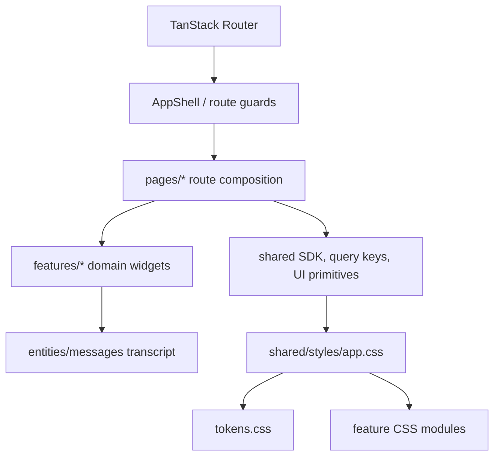

# Focus Agent Frontend Visual System

This document is the implementation baseline for the frontend optimization plan.
It keeps existing routes, copy, API calls, and interaction behavior stable while
moving shared UI toward token-first primitives.

Updated: 2026-05-16

## Tokens

Existing `--fa-*` color tokens remain valid. The foundation layer adds:

- Space: `--fa-space-1` through `--fa-space-8`
- Type: `--fa-fs-xs` through `--fa-fs-3xl`
- Line height: `--fa-lh-tight`, `--fa-lh-normal`, `--fa-lh-relaxed`
- Radius: `--fa-radius-sm`, `--fa-radius-md`, `--fa-radius-lg`, `--fa-radius-pill`
- Borders: `--fa-border-width-hairline`, `--fa-border-width-regular`, `--fa-border-width-strong`
- Shadows: `--fa-shadow-sm`, `--fa-shadow-md`, `--fa-shadow-lg`, `--fa-shadow-glow`
- Motion: `--fa-ease-standard`, `--fa-ease-emphasis`, `--fa-dur-fast`, `--fa-dur-normal`, `--fa-dur-slow`
- Layering: `--fa-z-base`, `--fa-z-elevated`, `--fa-z-dropdown`, `--fa-z-modal`, `--fa-z-toast`

## Primitive API

The frozen W0 primitive entrypoint is:

`apps/web/src/shared/ui/primitives/index.tsx`

The W0 props freeze is:

| Primitive | Stable props |
| --- | --- |
| `Button` | native button props, `variant=primary\|secondary\|ghost\|danger`, `size=sm\|md\|lg` |
| `IconButton` | native button props, required accessible `label`, `variant`, `size` |
| `Card` | section props, `tone=flat\|elevated`, optional `header`, optional `footer` |
| `Surface` | section props, `tone=panel\|section` |
| `Input` | native input props |
| `Textarea` | native textarea props |
| `Select` | native select props |
| `Badge` | span props, `tone=status\|role\|info\|warning\|danger\|success` |
| `Tag`, `Chip` | aliases of `Badge` |
| `Tabs` | `activeId`, `items`, `onChange`, optional `className` |
| `Modal`, `Drawer` | `open`, optional `title`, optional `onClose`; drawer also has `side=left\|right` |
| `Toast` | output props, `tone=info\|warning\|danger\|success` |
| `EmptyState` | required `title`, optional `description`, `icon`, `action` |
| `Skeleton` | div props, optional `lines` |

## Migration Rules

- Keep old global class names during the migration window when a page still
  relies on existing CSS selectors.
- New reusable UI must consume primitives instead of duplicating button, card,
  badge, tab, modal, or empty-state markup.
- New hard-coded color literals are not allowed outside token definitions and
  intentional brand SVG assets.
- New `!important` declarations are not allowed.
- Page-level migrations should preserve route paths, props, SDK hooks, ARIA
  labels, keyboard behavior, and user-facing copy.

## CSS Ownership Map

`apps/web/src/shared/styles/app.css` is the import-only CSS entrypoint. New
styles should live in the narrowest module that owns the route or component
surface:

| Area | Primary files |
| --- | --- |
| Foundation | `tokens.css`, `base.css`, `overrides.css` |
| Shell and layout | `shell.css`, `layout-responsive.css` |
| Chat and transcript | `chat.css`, `chat-surface.css`, `message.css`, `message-workbench*.css` |
| Composer and workbench | `composer.css`, `workbench*.css` |
| Branch tree and branch detail | `branch-tree.css`, `branch-tree-detail.css` |
| Auth, account, admin | `auth.css`, `admin.css` |
| Agent Team | `agent-team*.css` |
| Observability | `observability.css`, `trajectory.css` |
| Productivity | `productivity.css` |

Legacy `fa-*` global classes remain part of the migration window. Prefer
primitives for new reusable buttons, cards, tabs, modals, drawers, badges, and
empty states, but do not rewrite a stable page only to rename classes.

## Primitive Adoption

The current target is incremental adoption:

| Surface | Guidance |
| --- | --- |
| New reusable controls | Use `Button`, `IconButton`, `Badge`, `Tabs`, `Modal`, `Drawer`, and form primitives from `shared/ui/primitives` |
| Existing route shells | Keep route-level class names unless the page is already being migrated |
| Branch Action cards | Preserve disabled/loading/error behavior while moving visual chrome toward primitives |
| Observability workbench | Keep dense three-column layout and right rail stable; primitives should not reduce data density |
| Agent Team workbench | Preserve cockpit/adoption workflow states before replacing local markup |

## First-Tier Routes

These routes are the first migration and screenshot baseline targets:

- `/`
- `/c/$conversationId/t/$threadId`
- `/agent-team`
- `/observability/overview`
- `/observability/trajectory`

## Verification

Every frontend PR should run:

- `pnpm --filter @focus-agent/web-app check`
- `pnpm --filter @focus-agent/web-app style:check`
- Relevant smoke scripts for changed surfaces

For visual PRs, capture dark and light theme screenshots for the touched route.
The baseline script is:

- `pnpm --filter @focus-agent/web-app visual:baseline`
- `pnpm --filter @focus-agent/web-app a11y:baseline`

They write screenshots, axe-core reports, and manifests under
`apps/web/reports/`.

For branch decision or streaming UI changes, include at least one transcript
state with a pending Branch Action card and one completed streamed answer. For
observability changes, include overview, trajectory detail, replay, and promote
right-rail states.
