# Focus Agent Memory System v2

更新时间：2026-05-18

本文是 Memory 系统的 canonical 设计文档。它描述当前仓库中的真实实现，而不是未来设想；旧版 v1 背景已合并到本文的 legacy fallback / migration 章节，不再作为独立文档维护。本文件重点整理 PostgreSQL canonical memory、数据模型、运行时链路、pgvector embedding、审计治理、legacy fallback 和后续风险。

## 1. 定位

Memory v2 是 Agent graph 主路径内的执行记忆层，用于把对后续 turn 有价值的信息保存为可检索、可审计、可治理的 durable memory。它不是通用知识库，也不是脱离 agent 的独立知识服务。

核心定位：

- 保存用户偏好、用户画像、项目事实、turn summary、分支 finding、已导入结论等长期或半长期上下文。
- 在 turn 开始前检索可见 memory，渲染为 `<memory-context>`，再进入 context assembly 和模型调用。
- 在稳定 turn 结束后做保守启发式抽取，经 `MemoryPolicy` 和 `MemoryService` 写入 canonical store。
- 分支和多 agent 产生的候选默认隔离，只有 merge/promotion 语义确认后才进入主线可依赖 memory。
- PostgreSQL 独立业务表是生产 canonical storage；LangGraph Store 保留给 checkpoint/graph 兼容路径和本地 fallback。
- pgvector embedding 默认启用，并作为 turn-level memory retrieval 的 hybrid 输入参与 RRF 合并；本地默认自动探测 Ollama `embeddinggemma`，`focus_memories` 仍是 canonical truth，`focus_memory_embeddings` 是可重建索引。

当前明确不做：

- 不引入 mandatory external vector database；pgvector 是 PostgreSQL 内的默认语义检索能力，不是外部向量库。
- 不把 embedding 向量本身当 canonical memory；forget、权限、审计仍以 `focus_memories` 和 tombstone 为准。
- 不通过 API/SDK/Web 返回 embedding 向量本身，只暴露状态、模型和更新时间等 metadata。
- 不增加专用 memory summarizer model。
- 不把短期上下文、规则、项目指令或工作记忆 embedding 化；这些内容继续通过 context assembly、pinned/context state、skills 和 `AGENTS.md` 等显式上下文进入模型。
- 不把 Markdown snapshot 当运行时事实源。
- 不提供普通 HTTP create/update memory；HTTP surface 目前是 list/detail/audit/candidates/forget。
- 不改变 Agent Team / Mission Runner 公共 API、UI、任务模型。

## 2. 架构总览

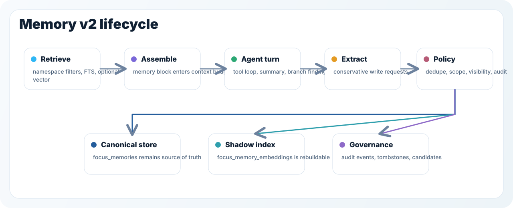

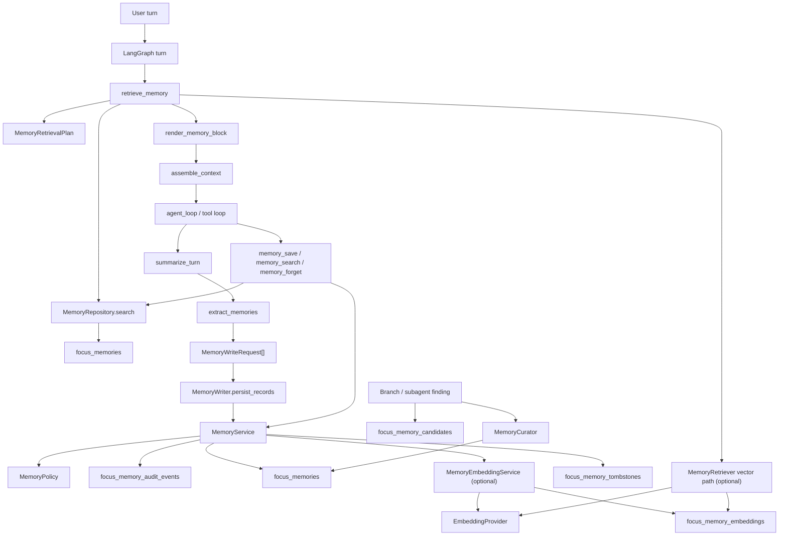

主要模块：

| 文件 | 责任 |
| --- | --- |
| `src/focus_agent/memory/models.py` | Pydantic memory 数据模型、状态枚举、写入决策、检索计划。 |
| `src/focus_agent/memory/service.py` | repository-backed 写入治理、upsert、冲突、脱敏、forget、audit，并在注入 embedding service 时 best-effort 写 shadow。 |
| `src/focus_agent/repositories/memory_repository.py` | canonical memory repository protocol。 |
| `src/focus_agent/repositories/postgres_memory_repository.py` | PostgreSQL 实现，读写 `focus_memories`、`focus_memory_embeddings` 等业务表。 |
| `src/focus_agent/repositories/postgres_schema.py` | schema v8-v10，创建 memory/audit/tombstone/candidate/embedding 表和索引。 |
| `src/focus_agent/memory/embedding.py` | `EmbeddingProvider`、Ollama native provider、OpenAI-compatible provider、deterministic test provider、provider auto detection、embedding text/hash。 |
| `src/focus_agent/memory/embedding_policy.py` | `MemoryEmbeddingPolicy`，统一判断长期语义 memory 是否进入 pgvector shadow。 |
| `src/focus_agent/memory/embedding_service.py` | `MemoryEmbeddingService` re-export，供 runtime/writer/tools/迁移引用。 |
| `src/focus_agent/memory/retriever.py` | namespace 选择、query 构造、repository FTS search、可选 vector search、shadow/hybrid 计划、rerank、dedupe、retrieval plan。 |
| `src/focus_agent/memory/policy.py` | 自动写入准入、读取 namespace、PromptMode 过滤和 section budget。 |
| `src/focus_agent/memory/writer.py` | graph 写入适配器；Postgres 模式委托 `MemoryService`，local fallback 保留 legacy store。 |
| `src/focus_agent/memory/extractor.py` | 稳定 turn 后的启发式候选抽取。 |
| `src/focus_agent/memory/assembler.py` | `<memory-context>` 渲染和 prompt injection guard。 |
| `src/focus_agent/memory/curator.py` | branch finding promotion 前的冲突检查和候选治理。 |
| `src/focus_agent/capabilities/default_tool_modules/memory.py` | agent-visible `memory_save/search/forget` tools；save/forget 接入 repository + optional embedding service，search 当前保持 FTS/rerank/dedupe。 |
| `src/focus_agent/api/routers/memory.py` | memory console 用 HTTP list/detail/audit/candidates/forget surface。 |
| `src/focus_agent/migrate_local_state.py` | legacy LangGraph Store memory backfill 到 `focus_memories`，可选补齐 memory embeddings。 |
| `src/focus_agent/memory_embedding_cli.py` | `focus-agent-memory-embedding doctor/rebuild` 维护命令。 |

## 3. 数据模型

所有 core memory model 都继承 `MemoryModel`，并使用 `extra="forbid"`。这和 repository 的 `data_json` round-trip 配合，避免持久化 payload 静默漂移。

### 3.1 MemoryKind

| kind | 语义 | 当前写入来源 |
| --- | --- | --- |
| `user_preference` | 用户输出偏好、语言、称呼、回答风格。 | 启发式抽取、`memory_save`。 |
| `user_profile` | 用户稳定自我描述，例如身份、习惯、熟悉程度。 | 启发式抽取、`memory_save`。 |
| `project_fact` | 项目规则、约定、默认配置、架构事实。 | `active_goal` 启发式抽取、`memory_save`。 |
| `turn_summary` | 最近 turn 的 episodic 摘要。 | 稳定 turn 后自动抽取。 |
| `branch_finding` | 分支内验证出的结论。 | `branch_local_findings`、branch promotion。 |
| `imported_conclusion` | merge/import 后写入主线的结论。 | Branch merge/import workflow。 |
| `artifact` | artifact 长期记忆预留类型。 | 枚举和 API surface 已有，自动链路尚未大规模使用。 |
| `citation` | citation 长期记忆预留类型。 | 枚举和 API surface 已有，自动链路尚未大规模使用。 |
| `tool_observation` | tool observation 长期记忆预留类型。 | 枚举和 API surface 已有，自动链路尚未大规模使用。 |

### 3.2 Scope、Visibility、Status

`MemoryScope` 决定归属边界：

- `user`：用户级 profile namespace。
- `root_thread`：根线程级 conversation main / episodic / semantic namespace。
- `branch`：分支级 local memory。
- `project`：项目级 memory。
- `skill`：skill 级 memory。

`MemoryVisibility` 决定依赖强度：

- `private`：默认私有或低优先级，例如 `turn_summary`。
- `promotable`：可以被 promotion，但还不是主线 approved memory。
- `shared`：可以在对应作用域中作为稳定背景使用。

`MemoryStatus` 决定生命周期：

- `active`：可检索、可注入 prompt。
- `conflict`：被写入治理标记为冲突，不参与默认检索。
- `needs_review`：候选或治理状态，等待人工/merge 决策。
- `forgotten`：soft forget 后状态，带 tombstone。
- `discarded`：候选或治理状态，表示不进入主线。

### 3.3 Durable Record

`MemoryRecord` 是 durable record，关键字段包括：

- `memory_id`
- `kind/scope/visibility/status`
- `namespace`
- `content/summary`
- `tags/evidence_refs`
- `source_thread_id/source_branch_id/root_thread_id/user_id`
- `confidence/importance`
- `promoted_to_main`
- `fingerprint/semantic_key`
- `embedding_status/embedding_model_id/embedding_updated_at`
- `created_at/updated_at/deleted_at`

`content` 保留事实内容，`summary` 优先用于 prompt、检索和控制台展示。`fingerprint` 用于物理等价去重，`semantic_key` 用于同主题合并和冲突判断。
`embedding_*` 字段是 API/SDK/Web projection metadata，用于描述可选 pgvector shadow 的索引状态，不包含向量值，也不是 memory 权限、forget 或生命周期的事实源。

### 3.4 Write Decision、Audit、Candidate、Retrieval Plan

`MemoryWriteDecision` 是统一写入结果：

- `accepted`
- `merged`
- `skipped`
- `conflict`
- `requires_review`
- `forgotten`
- `failed`

它包含 `memory_id`、`audit_id`、`tombstone_id`、`action`、`reason` 和 `redacted_payload`。

`MemoryAuditEvent` 是 append-only 审计事件。当前写入、policy skip、merge、possible conflict、forget 都会通过 repository 记录 audit。

`MemoryCandidate` 是多 agent / branch 待审记忆候选。当前表、repository、API、Web 列表已存在；默认 graph 主路径还没有把所有 subagent candidate 全量接入 promotion board。

`MemoryRetrievalPlan` 记录一次 retrieval 的 query、namespaces、filters、prompt-visible selected memory ids、budget reason 和 source。它会写入 `AgentState.memory_retrieval_plan`。

Embedding 相关 repository dataclass 也定义在 `repositories/memory_repository.py`：

- `MemoryEmbeddingRecord`：写入 `focus_memory_embeddings` 的 provider/model/dimensions/content_hash/vector payload。
- `MemoryEmbeddingMetadata`：API metadata 和幂等判断使用的 embedding 状态快照。
- `MemoryEmbeddingSearchHit`：pgvector search 返回的 hit，`MemoryRetriever` 会 normalize 成 `MemorySearchHit` 再参与 shadow plan 或 hybrid RRF。这个 normalization 是实际 pgvector smoke 测试覆盖过的边界：repository 可以返回 embedding hit，prompt 层仍只消费普通 memory hit。

## 4. PostgreSQL Canonical Storage

Schema v8-v10 创建 memory 业务表：

| 表 | 用途 |
| --- | --- |
| `focus_memories` | canonical durable memory。 |
| `focus_memory_audit_events` | append-only audit trail。 |
| `focus_memory_tombstones` | soft forget tombstone。 |
| `focus_memory_candidates` | multi-agent / branch candidate board。 |
| `focus_memory_embeddings` | pgvector embedding index；默认启用，可在显式关闭 embedding 且不用 hybrid 时跳过创建。 |

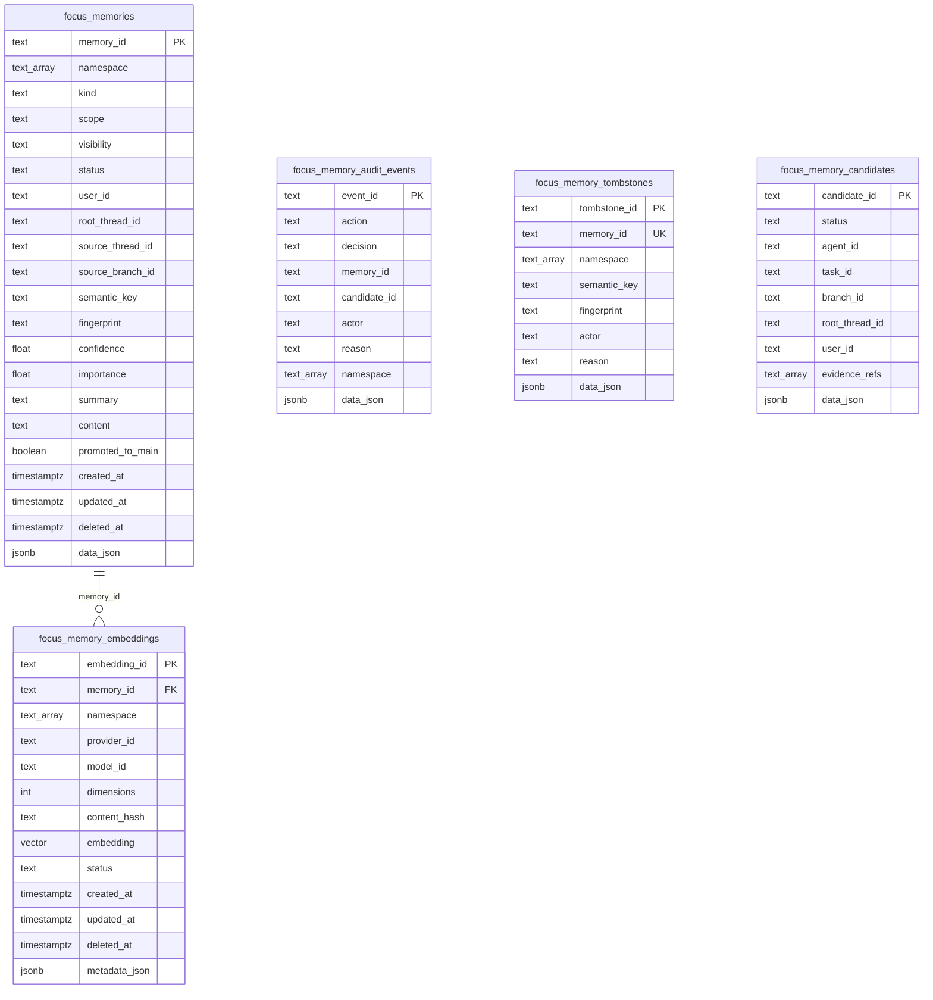

`focus_memories.data_json` 保存完整 Pydantic payload；索引列用于过滤、排序、检索和运营查询。这样既保留模型 round-trip，又避免把所有业务查询压在不透明 JSONB 上。

重要索引：

- `(namespace, status, updated_at DESC)`
- `(kind, scope, visibility)`
- `(user_id, updated_at DESC)`
- `(root_thread_id, updated_at DESC)`
- `(source_branch_id, updated_at DESC)`
- partial unique `(namespace, fingerprint)` where not forgotten/deleted
- `semantic_key`
- `GIN to_tsvector('simple', summary || content)`
- `focus_memory_embeddings(memory_id, provider_id, model_id, content_hash)` partial unique where active
- `focus_memory_embeddings(namespace, status, updated_at DESC)`
- `focus_memory_embeddings(provider_id, model_id, status, updated_at DESC)`
- optional HNSW `embedding vector_cosine_ops` when `AGENT_MEMORY_VECTOR_INDEX_ENABLED=true`

Schema version 语义：

- v8：创建 `focus_memories`、audit、tombstone、candidate 表。
- v9：幂等清理历史 forgotten rows 中遗留的正文。
- v10：按 extension mode 创建或校验 pgvector，创建 `focus_memory_embeddings` 和相关索引。当前默认 embedding backend 已启用且检索模式为 `hybrid`，因此有 `DATABASE_URI` 的默认启动会请求 v10 schema；显式关闭 embedding 且不使用 `hybrid` 时才不会强制创建 pgvector schema。

当前基础检索是 PostgreSQL FTS + `ILIKE` fallback + pgvector hybrid。`AGENT_MEMORY_POSTGRES_TRIGRAM_ENABLED` 已作为配置位存在，但 `pg_trgm` 不是当前启动硬依赖。

### 4.1 pgvector Embedding 边界

pgvector 默认启用，但它仍只是 canonical memory 的可重建语义索引：

- canonical truth 仍是 `focus_memories` 和 `data_json` round-trip。
- embedding 表只保存按 `memory_id` 关联的向量和索引 metadata，不能成为权限、forget、audit 或 migration 的唯一事实源。
- API/SDK/Web 只返回 `embedding_status`、`embedding_model_id`、`embedding_updated_at`；不会返回 `embedding`、`embedding_vector`、`vector` 等向量字段。
- 检索仍必须先应用 namespace/read policy；embedding recall 只能在同一权限边界内补充召回或排序。
- provider/model/dimensions/content_hash 是幂等和多模型并存边界；同一 memory 内容变化时 repository 会先使同 provider/model 的旧 active embedding 失效，再写入新 hash，避免 stale vector 继续参与召回。
- `OllamaEmbeddingProvider` 使用 native `/api/embed`；如果 `OLLAMA_BASE_URL` 或 `AGENT_MEMORY_EMBEDDING_BASE_URL` 以 `/v1` 结尾，会先规范化为 native base URL，再调用 `/api/tags` 和 `/api/embed`。
- embedding 缺失、过期、provider 失败或模型不匹配时，系统应继续走 PostgreSQL FTS + `ILIKE` fallback。

### 4.2 Embedding 分层策略

`MemoryEmbeddingPolicy` 是长期语义记忆是否进入向量索引的统一判断入口。默认 eligible：

- `user_preference`
- `user_profile`
- `project_fact`
- `imported_conclusion`
- 已 promotion 到 main/root 的 `branch_finding`

默认不写 embedding：

- `turn_summary`
- `tool_observation`
- `artifact`
- `citation`
- 规则、项目指令、短期上下文、工作记忆
- forgotten、deleted、空正文/空摘要 record

这些非 embedding 内容不是“不参与上下文”，而是不走向量召回：它们仍可通过 FTS、explicit context assembly、pinned/context state、skills、`AGENTS.md` 或专门 tool surface 进入 prompt。这样可以避免短期噪声、运行时观察和规则文本污染长期语义索引，也让 pgvector 表保持可重建、低噪声。

### 4.3 pgvector Extension 生命周期

`vector` 是 PostgreSQL database-level extension，不是普通应用表。规范环境中应把 extension
治理和应用 schema migration 分开：

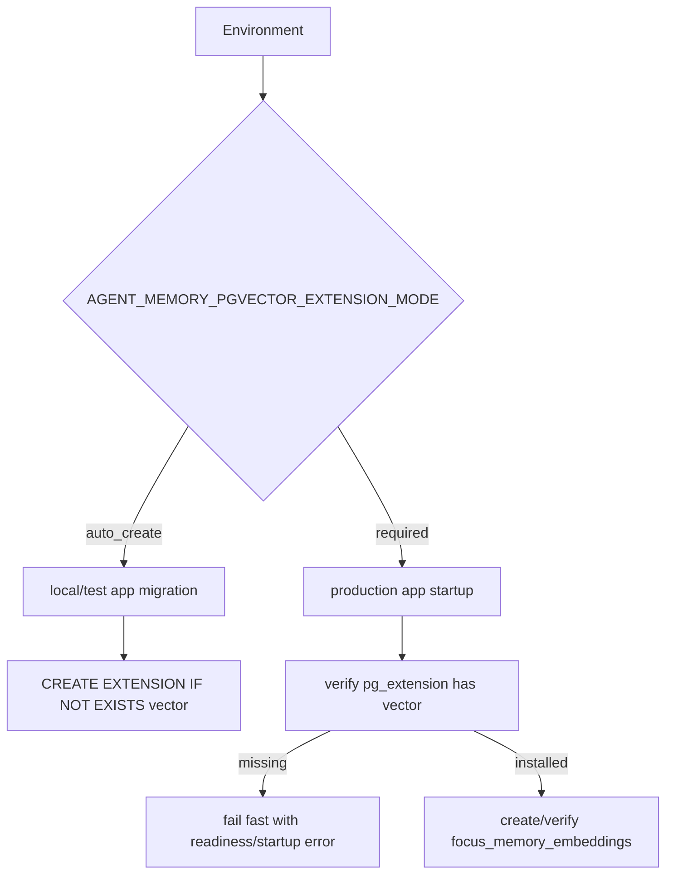

- `auto_create`：本地开发、CI、短生命周期测试库可用。应用 migration 会执行 `CREATE EXTENSION IF NOT EXISTS vector`，要求连接账号有 extension 权限。
- `required`：生产推荐。DBA 或迁移账号先执行 `CREATE EXTENSION IF NOT EXISTS vector`，应用账号启动时只校验，不尝试创建 extension。
- 显式关闭 embedding backend 且不是 `hybrid` 模式时，runtime 不执行 v10，也不会要求 pgvector；默认配置会要求 pgvector schema 可用。
- 维度由 `AGENT_MEMORY_EMBEDDING_DIMENSIONS` 决定；`embedding vector(N)` 不应在线改列类型。模型或维度变化应切换 `model_id` 并重建 shadow。
- `AGENT_MEMORY_VECTOR_INDEX_ENABLED=true` 会创建 HNSW index，适合在 staging 或生产维护窗口打开；默认关闭，避免首次构建成本影响启动。

常用检查 SQL：

```sql
SELECT extversion FROM pg_extension WHERE extname = 'vector';

SELECT format_type(a.atttypid, a.atttypmod) AS embedding_type
FROM pg_attribute a
WHERE a.attrelid = to_regclass('focus_memory_embeddings')
  AND a.attname = 'embedding'
  AND NOT a.attisdropped;

SELECT indexname
FROM pg_indexes
WHERE indexname IN (
  'idx_focus_memory_embeddings_unique_content',
  'idx_focus_memory_embeddings_vector'
);
```

## 5. Runtime Backend

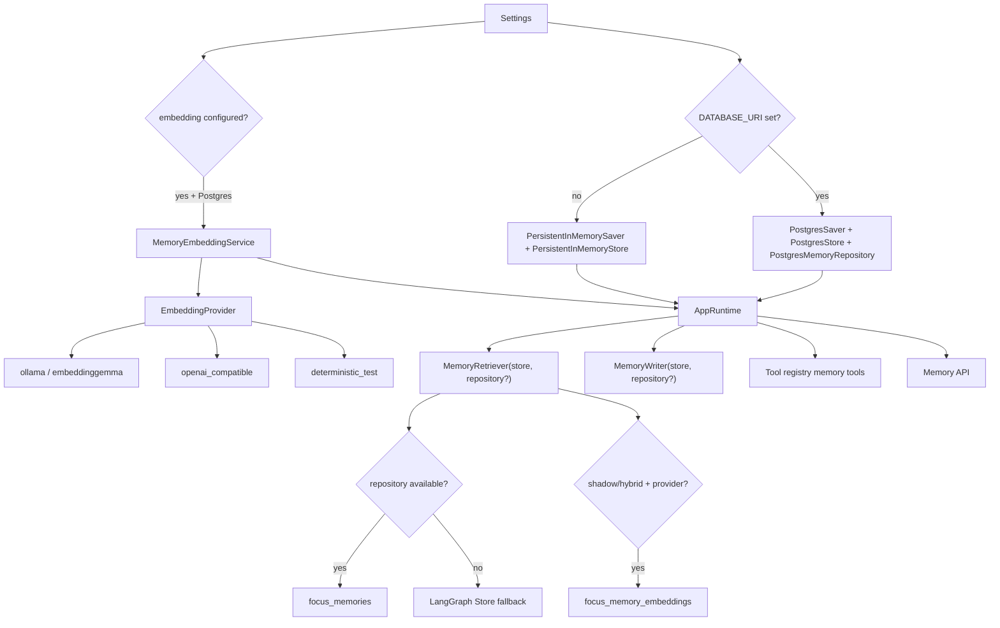

真实选择逻辑：

- 有 `DATABASE_URI`：初始化 `PostgresMemoryRepository`，并注入 retriever/writer/tool registry/API。
- 无 `DATABASE_URI`：`runtime.memory_repository=None`，memory 走 legacy LangGraph Store fallback。
- v10 schema setup 会在 embedding backend 配置启用或 `AGENT_MEMORY_VECTOR_SEARCH_MODE=hybrid` 时请求；pgvector extension 行为由 `AGENT_MEMORY_PGVECTOR_EXTENSION_MODE` 决定，`auto_create` 会尝试创建，`required` 只校验已安装。
- embedding provider 默认创建；显式设置 `AGENT_MEMORY_EMBEDDING_ENABLED=false` 且未指定 backend 时会关闭，或可直接设置 `AGENT_MEMORY_EMBEDDING_BACKEND=disabled`。仅设置 `hybrid` 但没有 provider 时会回退 FTS。
- 有 repository 且 provider 创建成功时，runtime 会把同一个 `MemoryEmbeddingService` 注入 writer、tool registry 和 turn-level retriever。
- readiness 会在 Postgres 模式下检查 `memory_repository`，并通过 `memory_embedding_backend` 报告 provider 状态，通过 `memory_pgvector` 报告 extension/table/dimensions/index 状态。
- local fallback 不维护 pgvector shadow；API list/detail 类 endpoint 返回 `available=false` 或 records 中的 `embedding_*` metadata 为空，不能据此判断生产索引健康度。

配置项：

| 配置 | 默认 | 当前真实含义 |
| --- | --- | --- |
| `AGENT_MEMORY_BACKEND` | `postgres` | 已解析，但 runtime 选择目前仍主要由 `DATABASE_URI` 决定。 |
| `AGENT_MEMORY_READ_SOURCE` | `postgres` | 已解析，当前 retriever 是 repository 优先、无 repository 时 legacy fallback。 |
| `AGENT_MEMORY_EXTRACTOR_MODE` | `heuristic` | `off` 会关闭自动抽取。 |
| `AGENT_MEMORY_POSTGRES_TRIGRAM_ENABLED` | `false` | 预留/可选增强配置位。 |
| `AGENT_MEMORY_PGVECTOR_EXTENSION_MODE` | dev/test: `auto_create`; non-dev: `required` | pgvector extension 治理模式；生产推荐 `required`。 |
| `AGENT_MEMORY_VECTOR_INDEX_ENABLED` | `false` | 是否创建 HNSW vector index。 |
| `AGENT_MEMORY_APPROVAL_FOR_SHARED_WRITES` | `false` | 预留审批策略配置位；完整审批应继续接入 tool approval/governance。 |
| `AGENT_MEMORY_CURATOR_ENABLED` | `false` | 是否启用 branch promotion curator。 |
| `AGENT_MEMORY_AUTO_PROMOTE_ON_MERGE` | `true` | curator enabled 时是否自动写入无冲突候选。 |
| `AGENT_MEMORY_EMBEDDING_ENABLED` | `true` | 是否启用 memory embedding provider；默认会创建 provider。 |
| `AGENT_MEMORY_EMBEDDING_BACKEND` | `auto` | 实际 backend 选择；`auto` 优先 Ollama `embeddinggemma`，只有显式配置云端 embedding endpoint/key 时才尝试 OpenAI-compatible fallback。 |
| `AGENT_MEMORY_EMBEDDING_PROVIDER` | `openai_compatible` | legacy/兼容 provider 名；建议新配置使用 `AGENT_MEMORY_EMBEDDING_BACKEND`。 |
| `AGENT_MEMORY_EMBEDDING_MODEL` | `embeddinggemma` | embedding model id，写入 shadow metadata 和幂等 key。 |
| `AGENT_MEMORY_EMBEDDING_DIMENSIONS` | `768` | pgvector 列维度和 provider 输出维度校验。维度变化应走新 model/version + rebuild。 |
| `AGENT_MEMORY_EMBEDDING_BASE_URL` | unset | Ollama native base URL 或 OpenAI-compatible endpoint；auto 模式未设置时使用 `OLLAMA_BASE_URL` 或 `http://127.0.0.1:11434`。 |
| `AGENT_MEMORY_EMBEDDING_API_KEY_ENV` | `OPENAI_API_KEY` | 云端 OpenAI-compatible embedding 从哪个环境变量读取 API key；Ollama native 不需要真实 key。 |
| `AGENT_MEMORY_EMBEDDING_API_KEY` | unset | 直接传入 OpenAI-compatible embedding API key；存在时优先于 `*_API_KEY_ENV`。 |
| `AGENT_MEMORY_EMBEDDING_BATCH_SIZE` | `32` | embedding service 批量大小上限。 |
| `AGENT_MEMORY_EMBEDDING_TIMEOUT_SECONDS` | `30.0` | Ollama native 和 OpenAI-compatible provider 请求超时。 |
| `AGENT_MEMORY_VECTOR_SEARCH_MODE` | `hybrid` | 默认使用 RRF 合并 FTS/vector；`shadow` 只记录 vector candidates；无 provider 时回退到 FTS。 |
| `AGENT_MEMORY_VECTOR_INDEX_ENABLED` | `false` | v10 schema 中是否创建 HNSW vector index。 |

本地默认路线需要显式安装模型：`ollama pull embeddinggemma`。应用启动不会静默下载模型；缺失时 readiness 和 `focus-agent-memory-embedding doctor` 会给出安装提示。auto 首先探测 Ollama，只有显式配置了 cloud embedding fallback 信号时才尝试 OpenAI-compatible fallback；这些信号包括 `AGENT_MEMORY_EMBEDDING_BACKEND=openai_compatible`、`AGENT_MEMORY_EMBEDDING_PROVIDER=openai_compatible`、`AGENT_MEMORY_EMBEDDING_BASE_URL`、`AGENT_MEMORY_EMBEDDING_API_KEY`、非默认的 `AGENT_MEMORY_EMBEDDING_API_KEY_ENV` 或非 `embeddinggemma` 的 explicit model。显式 cloud fallback 可以使用 memory embedding 专用 endpoint/key，也可以在缺省时复用已解析的模型 catalog client kwargs。provider 请求失败不会回滚 memory 写入，但 readiness 会把 `memory_embedding_backend` 标成 degraded。

维护命令：

```bash
focus-agent-memory-embedding doctor --database-uri "$DATABASE_URI"
focus-agent-memory-embedding rebuild --database-uri "$DATABASE_URI" --confirm-delete-index --backfill
```

`doctor` 是只读检查；`rebuild` 只删除并重建 `focus_memory_embeddings` 和它的索引，不删除 `focus_memories` canonical 数据。维度从当前 provider 或 `AGENT_MEMORY_EMBEDDING_DIMENSIONS` 解析；旧 `vector(1536)` 表切到 `embeddinggemma` 的 `vector(768)` 时应走这个显式重建流程。

## 6. Namespace 与隔离

Namespace 是权限、检索、promotion、审计的第一层边界。它不是简单存储路径。

| Namespace helper | 语义 |
| --- | --- |
| `user_profile_namespace(user_id)` | 用户偏好/画像。 |
| `conversation_main_namespace(root_thread_id)` | 主线可依赖 memory。 |
| `root_thread_episodic_namespace(root_thread_id)` | turn summary 等 episodic context。 |
| `root_thread_semantic_namespace(root_thread_id)` | 语义 namespace，目前读取纳入候选，自动写入较少。 |
| `branch_local_memory_namespace(root_thread_id, branch_id)` | 分支本地 finding。 |
| `branch_promoted_memory_namespace(root_thread_id, branch_id)` | promotion 审计辅助 namespace。 |
| `project_memory_namespace(project_id)` | 项目事实。 |
| `skill_memory_namespace(skill_id)` | skill memory。 |

读取范围由 `MemoryPolicy.allowed_namespaces_for_read()` 决定：

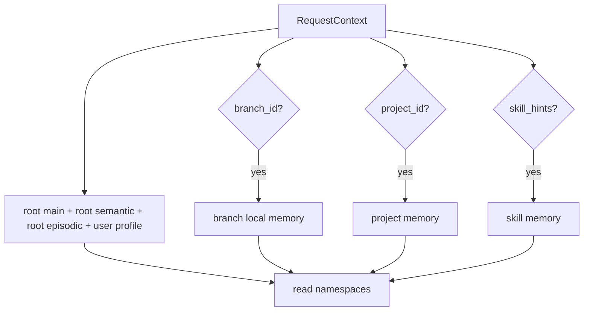

写入 namespace 由 `MemoryWriteRequest.namespace` 明确携带，再由 `MemoryPolicy.should_persist()` 校验。显式 tool 写入可绕过自动链路 policy，但仍进入 `MemoryService`、dedupe、audit 和 redaction。

## 7. Turn 生命周期

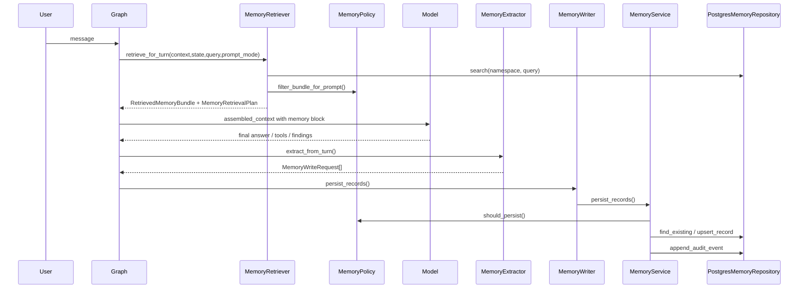

Graph 节点顺序：

```text
bootstrap_turn
-> retrieve_memory
-> assemble_context
-> plan_and_reflect / agent_loop / tool loop
-> summarize_turn
-> extract_memories
-> write_memories
-> maybe_interrupt_for_merge
```

`retrieve_memory` 写入：

- `retrieved_memories`
- `memory_prompt_block`
- `memory_retrieval_plan`
- `prompt_mode`

`extract_memories` 只在稳定 turn 后运行。稳定条件包括：不是 reflection replan，有 messages，最后一条 AIMessage 不带未完成 tool calls，且存在 final assistant 文本。

`write_memories` 调用 `MemoryWriter.persist_records()`。Postgres 模式下 writer 委托 `MemoryService.persist_records()`；local fallback 模式下保留 legacy store upsert。

## 8. 检索与 Prompt 注入

`MemoryRetriever` 不只使用最后一句 user query。它会组合：

- 当前 user query。
- `active_goal`。
- `task_brief`。
- 当前 plan step goal。
- `PromptMode.SYNTHESIZE` 下最多前两条 imported findings。

组合 query 截断到 240 字符。

检索流程：

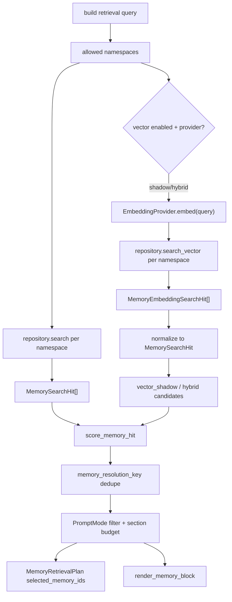

Prompt 过滤：

- 默认只保留 `status=active` 且 `deleted_at is None`。
- `user_preference` / `user_profile` 还会做 query relevance 过滤：
  - 与 query 或 matched terms 有重叠的记忆保留；
  - 称呼、口令、token、secret、API key 等敏感/身份偏好只在 query 明确询问名字、称呼、口令或密钥时保留；
  - 语言、语气、简洁/详细、Markdown/列表/表格等稳定回答格式偏好视为 sticky preference，可跨 query 保留；
  - 其他没有 query overlap 的个人偏好会被挡在 prompt 外，避免旅行、测试口令等无关记忆污染当前任务。
- `SYNTHESIZE` 隐藏未 promoted branch-local finding。
- `PromptMode` 决定 user/project/approved/branch/episodic/other 的 section priority 和 section budget。
- `MemoryRetrievalPlan.selected_memory_ids` 记录 policy/filter/budget 后真正进入 prompt 的 memory ids。
- shadow 模式下，vector candidates 写入 `MemoryRetrievalPlan.vector_shadow`，不改变 FTS 排序和 prompt 注入顺序。
- hybrid 模式下，FTS rank 和 vector rank 使用 RRF 合并；namespace/status/deleted_at 过滤仍在 SQL 层先执行。
- provider 未启用、provider 失败、pgvector schema 不存在或维度不匹配时，retriever 回退到 FTS + `ILIKE`，并在 plan 中记录 `vector_status=disabled/failed/unsupported` 等状态，不暴露 provider 原始敏感错误。
- 当前 production graph turn 的 retriever 在 runtime 注入 embedding provider 后可以走 shadow/hybrid；显式 `memory_search` tool 目前没有注入 embedding provider，Postgres 路径实际仍是 FTS/rerank/dedupe。

`render_memory_block()` 会输出 `<memory-context>` fenced block。`sanitize_memory_text()` 会移除伪造 `<memory-context>` 标签，并过滤常见 prompt injection / secret exfiltration 片段。Memory 是 recalled background context，不是 system/developer/user 指令，不能覆盖当前指令层级。

## 9. 写入治理

### 9.1 自动写入

自动写入入口是 `MemoryWriter.persist_records()`。

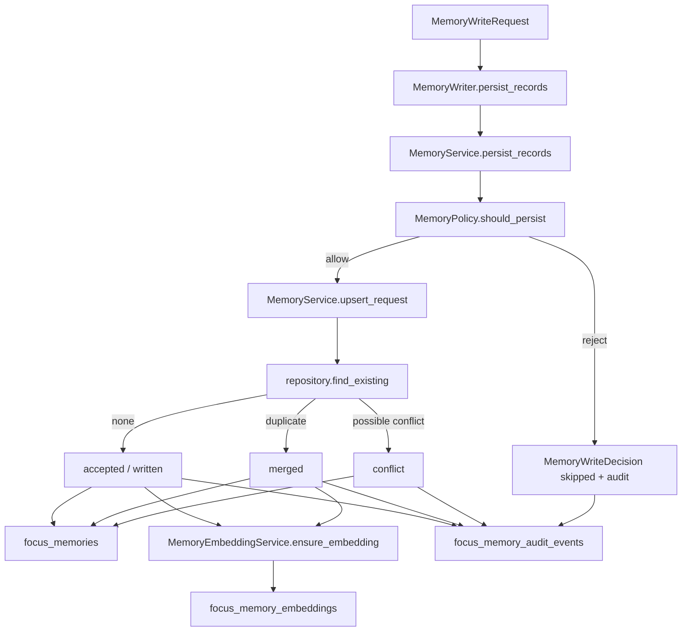

`MemoryPolicy.should_persist()` 当前约束：

- `content` 和 `summary` 不能为空。
- `importance >= 0.5`。
- `content` 不超过 4000 字符。
- turn 必须稳定。
- user scope 只允许 `user_preference/user_profile` 写入当前 user profile namespace。
- project scope 只允许 `project_fact` 写入当前 project namespace。
- root thread scope 只允许 `turn_summary/imported_conclusion` 写入 root episodic 或 conversation main。
- branch scope 只允许 `branch_finding` 写入当前 branch local memory。

Postgres runtime 注入 `MemoryEmbeddingService` 时，`accepted` 和 `merged` 的 write decision 会在 memory upsert 成功后 best-effort 写入或刷新 embedding shadow。Embedding provider 失败不会回滚 `focus_memories` 写入，只会记录日志、audit/metric 线索和 readiness/error 状态；这是为了避免可选语义索引阻断 canonical memory 主流程。

### 9.2 直接写入 Helper

`MemoryWriter.write_records()` 和 `MemoryService.write_records()` 是直接写入 helper。它们不执行 `MemoryPolicy.should_persist()`，但仍会进入 `MemoryService.upsert_request()`，因此保留 redaction、dedupe、merge/conflict 和 audit。

当前直接写入主要用于系统已明确授权的路径：

- turn summary 的 writer helper。
- branch local finding 写入。
- imported conclusion 写入。
- branch finding promotion。

这些路径的前置治理来自 branch/merge/runtime 语义，而不是自动抽取 policy gate。新增产品路径若需要写 shared/root/project memory，应优先走 `persist_records()` 或在调用 `write_records()` 前明确完成权限、审批和 promotion 判断。

### 9.3 显式写入

`memory_save` 是显式 tool 能力。它不经过自动链路的 `persist_records()` policy gate，但 repository 模式下仍调用 `MemoryService.upsert_request()`，因此仍有：

- redaction
- find_existing
- merge/conflict
- audit
- canonical repository write

在 graph 执行路径中，`graph_tool_executor_node` 会先调用 `authorize_memory_tool_args()` 绑定当前 `RequestContext`：

- 未传 `user_id/root_thread_id` 时自动使用当前 context。
- 传入不匹配的 `user_id/root_thread_id` 会返回结构化 ToolMessage error，工具不会执行。
- 显式 `namespace` 只允许当前 user profile、当前 root main/episodic、当前 branch local/promoted、当前 project namespace。
- 无 `project_id` 时不搜索或写入 `project/default`；skill namespace 暂不开放给显式 memory tools。

直接调用 tool 的 legacy/local 测试路径仍保留旧参数形态；生产 graph path 以 runtime context 为准。

如果 tool registry 注入了 `memory_embedding_service`，`memory_save` accepted/merged 后也会走同一条 best-effort embedding 写入链路；没有注入时只写 canonical memory，不把 embedding 作为保存成功的前提。

### 9.4 去重、合并与冲突

匹配依据：

- `memory_fingerprint()`
- `memory_semantic_key()`
- normalized summary/content
- `memory_resolution_key()`

用户偏好同主题倾向 latest wins。项目事实如果同 semantic key 但缺少纠正信号或文本重叠，可能被标记为 `conflict`，避免静默覆盖。

### 9.5 敏感内容脱敏

`MemoryService` 在写入前会对 `content` 和 `summary` 做基础敏感扫描：

- OpenAI/Slack 风格 token 片段。
- `api key`、`token`、`secret`、`password` 等键值片段。
- email address。

命中后替换为 `[redacted]`，并添加 `redacted` tag。Audit 和 `MemoryWriteDecision.redacted_payload` 只记录脱敏 payload。

## 10. Forget 与 Tombstone

`memory_forget` 和 `POST /v1/memory/{memory_id}/forget` 都走 `MemoryService.forget()`。

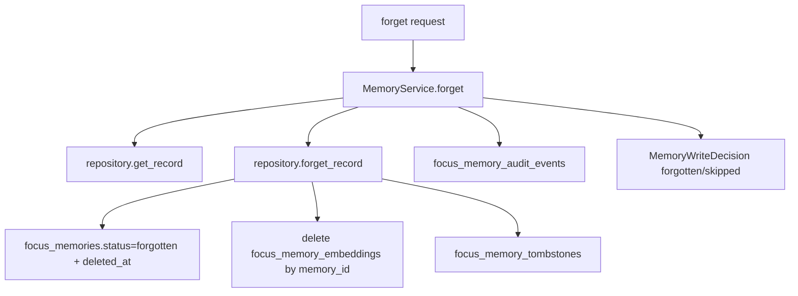

Forget 是 tombstone + payload erasure：

- `focus_memories.status` 改为 `forgotten`。
- `deleted_at` 置为当前时间。
- `content` 清空，`summary` 变为 `[forgotten]`，`data_json.content/summary/status/deleted_at` 同步更新。
- 如果存在 pgvector shadow，`PostgresMemoryRepository.forget_record()` 会在同一 repository 操作中删除对应 `memory_id` 的 `focus_memory_embeddings` rows；旧向量不能继续参与召回，API metadata 也不会再展示 active embedding 状态。
- `focus_memory_tombstones` 写 tombstone。
- audit event 记录 actor/reason/tombstone id，并回填 existing record 的 user/thread/branch metadata。

默认 list/search 不返回 forgotten memory；显式 `status=forgotten` 列表可以看到 tombstone 状态，但 API/SDK/Web 不展示旧正文，`payload_redacted=true`。

## 11. Branch、Promotion 与 Candidate

分支 finding 默认不污染主线。

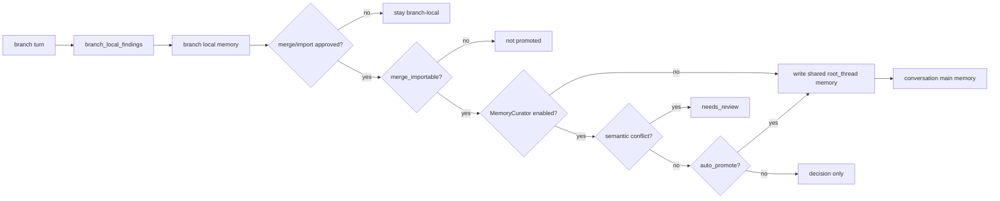

`MemoryCurator` 会在 conversation main namespace 中搜索 existing memory。冲突条件包括：

- semantic key 相同但 summary 不同。
- existing branch finding 与 candidate 文本重叠但归一化内容不同。

`focus_memory_candidates` 是多 agent / branch candidate board。当前 repository、API、SDK、Web 已支持 candidate list 和 status update repository 方法；更完整的 subagent candidate promotion flow 仍是后续扩展点。

## 12. Explicit Memory Tools

三个 agent-visible tools：

| Tool | Side effect | Parallel safe | Postgres 行为 |
| --- | --- | --- | --- |
| `memory_save` | yes | no | `MemoryService.upsert_request` + audit；runtime 注入 embedding service 时 best-effort 写 shadow。 |
| `memory_search` | no | yes | `MemoryRetriever(repository=...)` search/rerank/dedupe；当前 Postgres tool path 不注入 embedding provider，因此实际是 FTS 主路径。 |
| `memory_forget` | yes | no | `MemoryService.forget` + tombstone + audit；Postgres 下同步删除 `focus_memory_embeddings` rows。 |

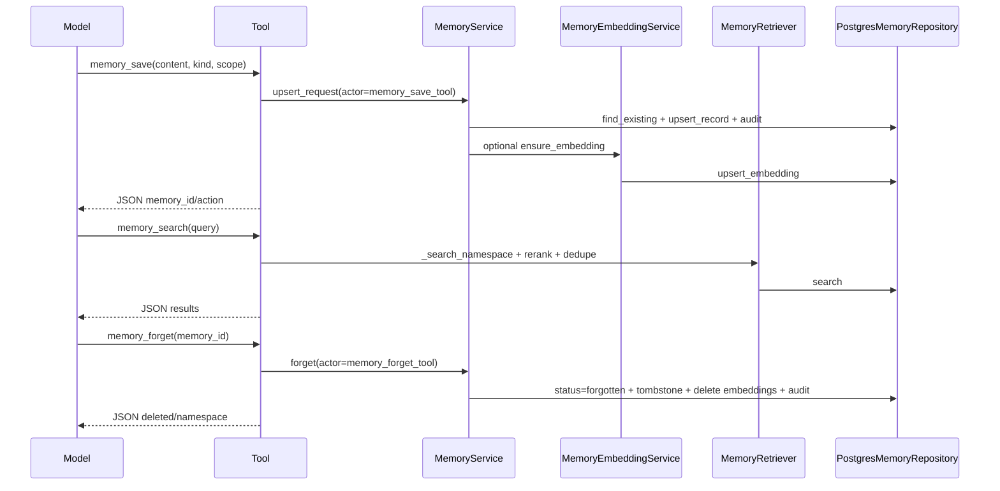

Local fallback 下，这些 tools 保留 legacy LangGraph Store path。

重要边界：

- graph path 的 `memory_save/search/forget` 参数由当前 `RequestContext` 绑定，不允许模型自由跨 user/root/namespace。
- `memory_search` 默认读取当前 user profile 和当前 root main/episodic；只有 context 有 `branch_id/project_id` 时才加入当前 branch/project namespace。
- 当前显式 `memory_search` tool 不会把模型 query 送到 embedding provider。turn-level `retrieve_memory` 才是 pgvector shadow/hybrid 的主要接入点；如果后续要让 tool search 也走 vector，需要给 tool retriever 注入同一 provider 并补权限/成本观测。
- local fallback 的 `memory_forget` 仍是 store delete，没有 Postgres tombstone；生产 canonical 行为以 Postgres 为准。

## 13. API、SDK 与 Web Console

HTTP surface：

- `GET /v1/memory`
- `GET /v1/memory/{memory_id}`
- `GET /v1/memory/audit`
- `GET /v1/memory/{memory_id}/audit`
- `POST /v1/memory/{memory_id}/forget`
- `GET /v1/memory/candidates`

SDK helpers：

- `listMemoryRecords()`
- `getMemoryRecord()`
- `listMemoryAuditEvents()`
- `listMemoryRecordAuditEvents()`
- `forgetMemoryRecord()`
- `listMemoryCandidates()`

Web surface：

- `/agent/memory`
- records list
- record detail
- audit list
- candidates list
- kind/status/visibility/root thread filters
- forget action

真实产品截图（由 `scripts/capture_docs_screenshots.py` 捕获）：

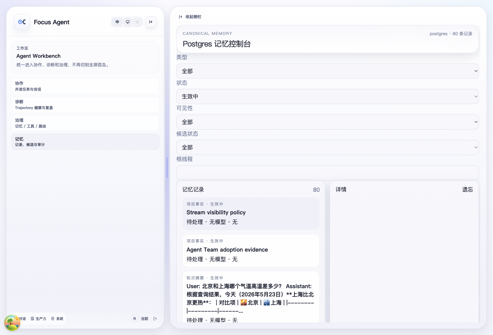

重要边界：

- HTTP/API 是审计和治理 surface，不是普通 memory create/update REST resource。
- `memory_save/search/forget` 仍是 agent tool surface。
- local fallback 时 API list 类 endpoint 返回 `available=false`，forget 返回 503。
- auth enabled 时，普通 principal 只能列出自己的 `user_id` memory；显式查询其他 `user_id` 会返回 403。
- detail、record audit 和 forget 会先按 `memory_id` 读取 record，再校验 user/thread/branch/project ownership；不属于当前 principal 的 record 对外表现为 404。
- global memory/audit/candidate/forget 使用持久化 `AuthContext` role permissions：`memory:read`、`memory:audit`、`memory:forget`。仅 bearer token scope 不授予全局 memory 视图。
- `MemoryRecordResponse.payload_redacted=true` 表示正文不可用；forgotten record 返回 `content=""`、`summary="[forgotten]"`。
- `MemoryRecordResponse` 可选返回 `embedding_status`、`embedding_model_id`、`embedding_updated_at`，Memory Console 在列表和详情中展示这些 metadata。HTTP surface 不返回向量字段，candidate record payload 也应过滤向量 key。
- readiness/health 的 component check 中包含 `memory_embedding_backend` 和 `memory_pgvector`；前者判断 embedding provider，后者判断 extension/table/dimensions/index。它们不代表 canonical memory API 是否可用。

## 14. Migration

`focus-agent-migrate-local-state` 增加了 `focus-memories` step。

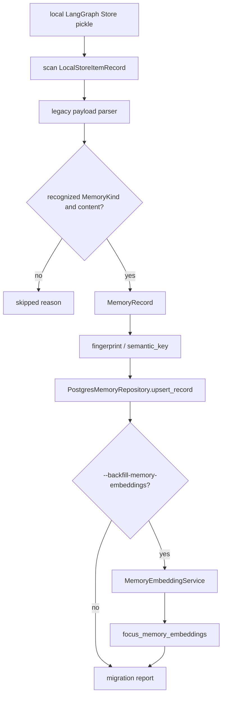

迁移特性：

- deterministic legacy id：没有 explicit `memory_id` 时用 namespace + key 生成稳定 id。
- 幂等：重复迁移走 `upsert_record`。
- dry-run 只解析和计数，不写 Postgres。
- schema v9 会幂等清理历史 forgotten rows，把遗留 `content/summary/data_json` 正文替换为空正文和 `[forgotten]` 摘要。
- `--backfill-memory-embeddings` 会扫描 `status=active` 的 canonical memory，并按当前 env 中的 embedding provider/model/dimensions best-effort 补齐 shadow，报告 `scanned/written/skipped/failed`。
- embedding backfill 会在执行前用当前 provider dimensions 调用 repository setup，确保 fresh database 也能创建 v10 pgvector schema。生产环境仍应先由 DBA/迁移账号预装 `vector` extension，并把应用设为 `AGENT_MEMORY_PGVECTOR_EXTENSION_MODE=required`。当前 backfill 不会把 local fallback 当 embedding 事实源。
- tombstone 防回填仍需在更完整 dual read/backfill 阶段继续补强。

## 14.1 Legacy fallback 与迁移背景

Memory v1 的运行时事实源主要依赖 LangGraph Store payload。当前生产事实源已经迁移到 PostgreSQL 独立业务表，但 legacy path 仍作为开发、测试和离线迁移的兼容边界存在：

- 无 `DATABASE_URI` 的裸跑本地模式下，`runtime.memory_repository=None`，retriever / writer / tools 回退到 store-backed legacy memory path。
- `focus-agent-migrate-local-state` 负责从 legacy LangGraph Store namespace 扫描 memory payload，并幂等写入 `focus_memories`；可选 `--backfill-memory-embeddings` 补齐 pgvector shadow。
- legacy payload 不再作为生产 HTTP / SDK / Web surface 的事实源；list/detail/audit/candidates/forget 的生产语义以 Postgres repository 为准。
- local fallback 的 `memory_forget` 仍是 store delete，不维护 tombstone 或 pgvector shadow；生产 Postgres 路径使用 tombstone/soft forget，并同步清理对应 embedding rows。
- 旧文档中的 v1 抽取、namespace、prompt injection 和 branch promotion 背景只作为理解迁移的语境保留；新增设计应优先修改本文件和 `src/focus_agent/memory/*` 的当前实现。

## 15. Observability 与 AgentState

Memory 相关 AgentState 字段：

| 字段 | 语义 |
| --- | --- |
| `retrieved_memories` | 当前 turn 检索快照。 |
| `memory_prompt_block` | 当前 turn 注入模型的 memory block。 |
| `memory_retrieval_plan` | 检索 query、namespaces、filters、prompt-visible selected ids、source。 |
| `memory_write_requests` | 自动抽取后的临时写入队列。 |
| `memory_write_result` | 写入 outcome；repository 模式包含 decisions。 |
| `memory_curator_decision` | branch promotion curator 的 legacy mirror。 |
| `branch_local_findings` | 分支内 finding 输入。 |
| `imported_findings` | 主线导入 finding。 |
| `rolling_summary` | context 连续性摘要，不是 durable memory。 |

`governance_records` 是更通用的治理/观测 envelope。Memory v2 已把 retrieval plan 和 write decisions 结构化，但还有进一步把 memory metrics/API 投影完全 record-first 的空间。

embedding 相关观测不会记录向量值：

- `MemoryRetrievalPlan.vector_status`：`disabled`、`unsupported`、`completed` 或 `failed`。
- `MemoryRetrievalPlan.vector_shadow`：shadow 模式下的状态、hit_count 和候选 memory ids。
- API/Web metadata：`embedding_status`、`embedding_model_id`、`embedding_updated_at`。
- readiness：`memory_embedding_backend` component check。

这些字段用于判断 pgvector shadow 覆盖率和质量差异，但不应被当作授权结果或 canonical memory 状态。

## 16. 测试覆盖

关键测试：

- `tests/test_memory_models.py`
- `tests/test_memory_pipeline.py`
- `tests/test_memory_retriever.py`
- `tests/test_memory_extractor.py`
- `tests/test_memory_namespace.py`
- `tests/test_memory_service.py`
- `tests/test_memory_api.py`
- `tests/test_postgres_memory_repository.py`
- `tests/test_default_tools.py`
- `tests/test_runtime_backend_selection.py`
- `tests/test_migrate_local_state.py`
- `tests/test_memory_embedding_provider.py`
- `tests/eval/test_memory_suite.py`
- `scripts/memory_context_eval.py`

覆盖主题：

- Pydantic model default 和 `extra=forbid`。
- fingerprint、semantic key、resolution key。
- repository upsert/search/list/forget/audit/candidates。
- service redaction、merge、conflict、tombstone、policy skip decision。
- retriever repository 优先、CJK matched terms、prompt-visible retrieval plan。
- writer/tool runtime Postgres path 和 local fallback。
- runtime 在 Postgres/local 模式下的组件注入。
- legacy store memory backfill。
- embedding provider 配置、deterministic provider、readiness 状态、writer/tool best-effort 写 shadow。
- pgvector repository upsert/search/filter/forget cleanup；vector search 必须保持 namespace/status/deleted_at 权限过滤。
- retriever shadow/hybrid plan、`MemoryEmbeddingSearchHit` normalization、provider failure fallback。
- migration `--backfill-memory-embeddings` 的幂等计数和 failure report。
- memory eval suite 和 context eval trend。

## 17. 编码规范检查结论

当前服务端实现总体符合仓库风格：

- 手写 SQL 使用参数绑定；动态 SQL 只拼接受控字段集合。
- repository protocol 和 Postgres implementation 分离。
- service 层负责业务决策，repository 层负责持久化。
- core memory models 禁止 extra 字段。
- API contract model 与 SDK snapshot 已进入 contract check。
- 宽泛异常捕获只保留在 best-effort embedding、fallback introspection、API projection 容错等边界，不能吞掉 canonical memory upsert/forget 的主路径错误。

已在 v2 检查中收敛的点：

- 删除了无效的 `bypass_policy` 参数。
- `forget_record()` 返回真实 tombstone id。
- `MemoryWriteDecision` 包含 `tombstone_id`。
- `list_records(status="forgotten")` 可审计 forgotten records。
- forget audit 未传 namespace 时记录真实 record namespace。
- `update_candidate_status()` 改为按 candidate id 精确读取。
- retrieval plan 记录 policy filter 后真正 prompt-visible 的 selected memory ids。
- Web visibility filter 改为 `private/promotable/shared`。
- Memory API 接入持久化 role permissions 和 user/thread/branch/project ownership，避免普通 principal 通过 detail/audit/candidate/forget 读取或遗忘其他用户的 memory。
- Memory tools 在 graph path 绑定 `RequestContext`，拒绝跨 user/root/namespace 参数。
- Forget 默认擦除 `focus_memories` 拆列和 `data_json` 中的正文；API/SDK/Web 用 `payload_redacted` 展示 tombstone 状态。
- Postgres forget 同步删除 `focus_memory_embeddings` rows，避免 forgotten memory 通过语义 shadow 被召回。
- pgvector smoke 验证发现并修复了 `MemoryEmbeddingSearchHit` 进入 retriever 后未 normalize 的问题；现在 vector hits 会统一转换成 `MemorySearchHit`。
- runtime 注入 embedding provider 后，turn-level retrieval 可以记录 shadow candidates 或执行 hybrid RRF；显式 `memory_search` tool 当前仍是 FTS 主路径。
- `focus-agent-migrate-local-state` 报告中的 database URI 改为脱敏输出，legacy store 非 dict payload 也不会因 `dict(value)` 崩溃。
- `MemoryCurator` 的 skipped 统计保留非 promotable candidate，不再在冲突检测前丢失 skip reason。

## 18. 当前风险与后续演进

### 18.1 API 权限边界

Memory API 已接入持久化角色权限和 thread/branch ownership；后续还应继续收敛更细的权限模型：

- project membership 尚未实现；当前 project memory 普通视图仍保守依赖 `user_id`，无 owner 的 project memory 仅 admin 可见。
- audit/candidate list 已有 user filter，后续可以继续扩展为 thread/branch ownership filter，减少历史缺失 `user_id` 数据被跳过。
- forget 跨 namespace、shared memory 或 project memory 应接 approval / admin 权限。

### 18.2 配置语义

`AGENT_MEMORY_BACKEND` 和 `AGENT_MEMORY_READ_SOURCE` 已被解析，但 runtime 实际选择仍由 `DATABASE_URI` 决定。后续应把它们正式接线：

- `AGENT_MEMORY_BACKEND=postgres` 且无 `DATABASE_URI` 时是否启动失败。
- `AGENT_MEMORY_BACKEND=local` 时是否允许强制 local fallback。
- `AGENT_MEMORY_READ_SOURCE=dual` 的对比报告和 metrics。

### 18.3 Search Quality

当前基础排序由 PostgreSQL FTS + `ILIKE` 与 pgvector hybrid 共同构成；关键词明确的 memory 仍可由 FTS 命中，同义改写、隐式事实、长距离抽象主要依赖 embedding 候选补足。

pgvector embedding 已默认启用：

- `focus_memory_embeddings` 是独立可重建索引表，`focus_memories` 仍是 canonical truth。
- 默认配置为 `AGENT_MEMORY_EMBEDDING_ENABLED=true`、`AGENT_MEMORY_EMBEDDING_BACKEND=auto`、`AGENT_MEMORY_EMBEDDING_MODEL=embeddinggemma`、`AGENT_MEMORY_EMBEDDING_DIMENSIONS=768`、`AGENT_MEMORY_VECTOR_SEARCH_MODE=hybrid`。
- auto backend 优先本地 Ollama `embeddinggemma`；缺模型时不会自动下载，也不会默认继承 chat provider 凭据，而是在 readiness / doctor 中给出 `ollama pull embeddinggemma`。
- accepted/merged memory 写入会 best-effort 生成 embedding；embedding provider 失败不会回滚 canonical memory 写入，但 readiness 会报告 degraded。
- `AGENT_MEMORY_VECTOR_SEARCH_MODE=hybrid` 会用 RRF 合并 FTS rank 与 vector rank；`shadow` 可用于只观测 vector candidates。
- namespace/read policy 仍是第一层权限边界；forget 会清理对应 shadow embedding；local fallback 不维护 pgvector shadow。
- `AGENT_MEMORY_PGVECTOR_EXTENSION_MODE` 把环境治理显式化：local/test 可 `auto_create`，生产推荐 `required` 并在应用启动前由 DBA/迁移账号预装 extension。
- 显式 `memory_search` tool 当前尚未把 query embedding provider 接入 tool retriever；它能受益于 Postgres FTS、CJK fallback、rerank/dedupe，但不等同于 turn-level `retrieve_memory` 的 pgvector shadow/hybrid 能力。
- 当前已用 `deterministic_test` provider 和真实 Postgres+pgvector smoke 验证过 shadow 写入、vector 召回、hybrid retriever 和 forget cleanup；生产 embedding model 的语义质量、成本、延迟和 hybrid 阈值还需要上线后用 shadow metrics 评估。

后续 search quality 可以继续优先做：

- query expansion。
- semantic key 改进。
- scene-aware rerank。
- 可选 trigram。
- embedding 质量评估、模型切换/重建流程、hybrid 排序阈值和召回监控。
- 显式 tool search 是否接入 vector、接入后如何做成本控制和审批/观测。

### 18.4 Candidate Promotion

`focus_memory_candidates` 已存在，但 subagent candidate 到 lead review/promotion 的完整闭环还没有完全产品化。后续应补：

- candidate submit path。
- lead review API。
- accepted/rejected/discarded 状态转换。
- promotion audit。
- Web candidate board 操作。

### 18.5 Sensitive Memory Governance

当前 sensitive scan 是基础正则。后续应补：

- 更完整的 secret detector。
- shared write approval。
- raw evidence refs 与 redacted summary 分离。
- trajectory/governance 中只保留脱敏 payload。

### 18.6 Local Fallback

Local fallback 是开发/测试便利路径，不应作为生产长期 memory 事实源。后续应在 readiness 和文档里继续强调：

- Postgres 是 production canonical。
- local fallback 可用于裸跑、单测、离线迁移。
- local fallback 不维护 pgvector shadow，不保证 `embedding_*` metadata；缺失 metadata 不应影响本地 search/write/forget 基础路径。
- 离线 embedding backfill 会尝试按当前 provider dimensions 初始化 v10 pgvector schema；生产仍需要提前安装 `vector` extension，避免应用账号在 `required` 模式下创建 extension。
- migration/backfill 完成后应尽量避免 dual truth 长期存在。

## 19. 文件导航

后端核心：

- `src/focus_agent/memory/models.py`
- `src/focus_agent/memory/service.py`
- `src/focus_agent/memory/embedding.py`
- `src/focus_agent/memory/embedding_policy.py`
- `src/focus_agent/memory/embedding_service.py`
- `src/focus_agent/memory/retriever.py`
- `src/focus_agent/memory/writer.py`
- `src/focus_agent/memory/policy.py`
- `src/focus_agent/memory/extractor.py`
- `src/focus_agent/memory/assembler.py`
- `src/focus_agent/memory/curator.py`
- `src/focus_agent/repositories/memory_repository.py`
- `src/focus_agent/repositories/postgres_memory_repository.py`
- `src/focus_agent/repositories/postgres_schema.py`

运行时与 graph：

- `src/focus_agent/engine/runtime.py`
- `src/focus_agent/engine/graph_memory_nodes.py`
- `src/focus_agent/api/route_utils/readiness.py`
- `src/focus_agent/core/state.py`
- `src/focus_agent/services/branch_memory_promotion.py`

工具、API、SDK、Web：

- `src/focus_agent/capabilities/default_tool_modules/memory.py`
- `src/focus_agent/memory_embedding_cli.py`
- `src/focus_agent/api/routers/memory.py`
- `src/focus_agent/api/contract_models/memory.py`
- `frontend-sdk/src/client/memory.ts`
- `frontend-sdk/src/types/memory.ts`
- `apps/web/src/pages/memory/memory-console-page.tsx`

迁移与评估：

- `src/focus_agent/migrate_local_state.py`
- `tests/test_memory_service.py`
- `tests/test_memory_embedding_policy.py`
- `tests/test_memory_embedding_cli.py`
- `tests/test_memory_embedding_provider.py`
- `tests/test_postgres_memory_repository.py`
- `tests/test_memory_retriever.py`
- `tests/test_memory_pipeline.py`
- `tests/test_default_tools.py`
- `tests/test_runtime_backend_selection.py`
- `tests/test_migrate_local_state.py`
- `tests/eval/test_memory_suite.py`
- `scripts/memory_context_eval.py`
