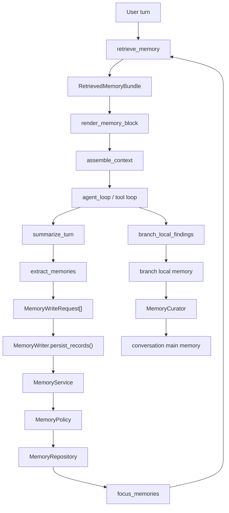
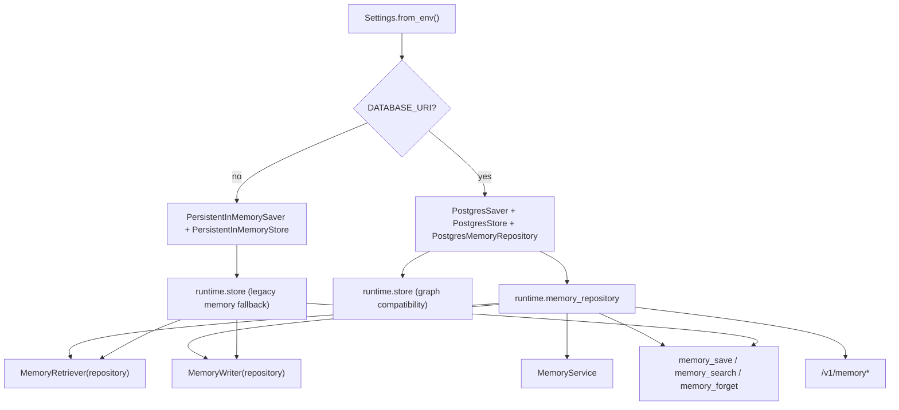
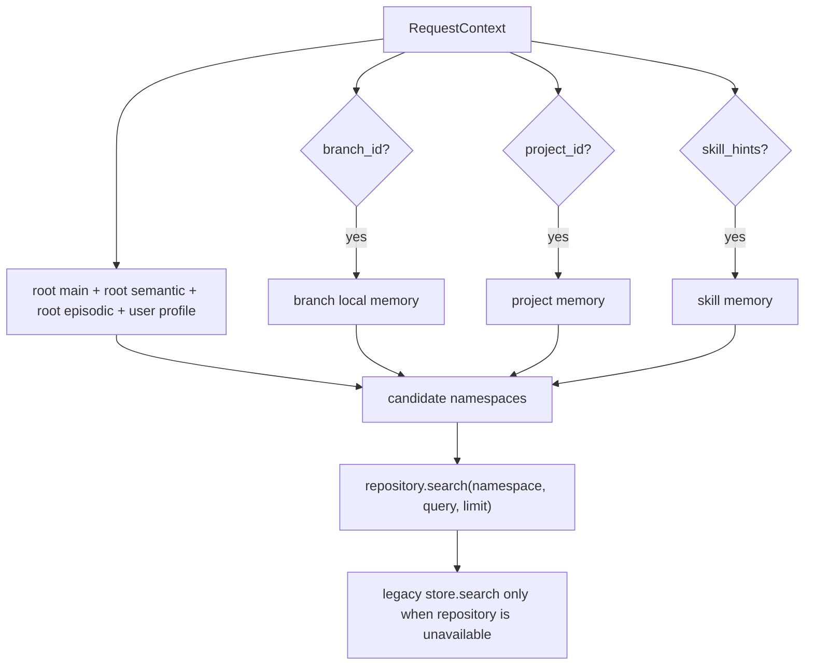
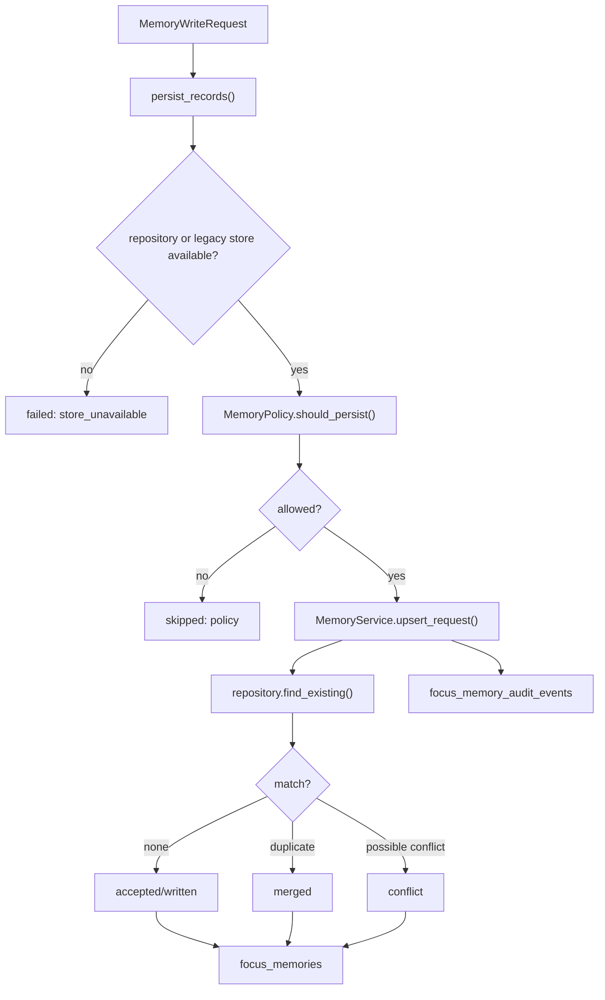
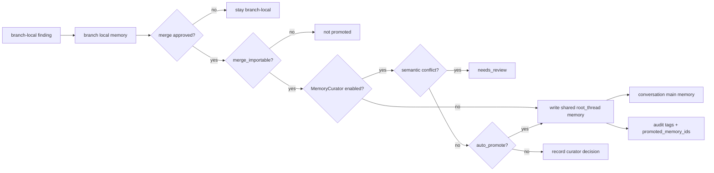
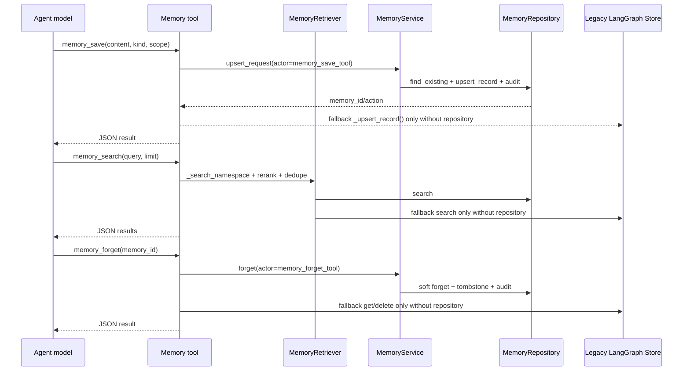

# Focus Agent 记忆系统设计

更新时间：2026-05-10

> 历史参考：当前 canonical 记忆系统说明请看 [memory-system-v2.md](memory-system-v2.md)。本文保留 Memory v1 的设计背景和迁移语境，不能作为当前 pgvector、embedding、HTTP/SDK surface 或生产配置的唯一依据。

本文记录的是早期记忆系统设计：系统记忆是一套嵌在 Agent graph 主路径里的执行记忆层，用来保存用户偏好、项目事实、分支验证结论和近期 episodic 上下文。它不是通用知识库，也不是脱离 agent 主路径的长期知识服务。

历史边界：

- 当时不引入 vector database 或 embedding retrieval；当前实现已在 PostgreSQL memory 上支持 pgvector/hybrid retrieval，详见 v2 文档。
- 不增加专门的 memory summarizer model。
- 已提供只读/forget 的 memory HTTP/SDK 审计 surface，但 agent 主路径的 save/search/forget 仍主要通过 tool 和 graph pipeline 发生。
- 不把 memory 做成脱离 graph 主路径的平行系统。
- 不改变现有 Chat、Branch、SDK、Web UI 公共契约。
- 生产 canonical memory storage 是 PostgreSQL 独立业务表；LangGraph Store 保留给 checkpoint/graph 兼容路径和无数据库本地 fallback。

## 1. 总览

记忆系统围绕一次 turn 的生命周期工作：turn 开始时从 canonical memory repository 检索 durable memory，组装进 prompt；turn 稳定结束后抽取候选记忆，再按策略通过 `MemoryService` 写入 `focus_memories`。分支结论不会天然进入主线，只有经过 merge/promotion 语义确认后，才会成为主线可依赖的 durable memory。



核心模块：

| 模块 | 责任 |
| --- | --- |
| `src/focus_agent/memory/models.py` | `MemoryKind`、`MemoryScope`、`MemoryVisibility`、`MemoryRecord` 等数据模型 |
| `src/focus_agent/memory/retriever.py` | 选择 namespace、构造 query、检索、rerank、去重 |
| `src/focus_agent/memory/policy.py` | 写入准入、读取 namespace、PromptMode 过滤和 section budget |
| `src/focus_agent/memory/extractor.py` | 从稳定 turn 中抽取候选 `MemoryWriteRequest` |
| `src/focus_agent/memory/service.py` | canonical 写入治理、audit、forget tombstone 和敏感内容脱敏 |
| `src/focus_agent/memory/writer.py` | 写入、upsert、去重、冲突判断和 branch promotion helper |
| `src/focus_agent/memory/assembler.py` | 渲染 `<memory-context>` prompt block 并做注入防护 |
| `src/focus_agent/memory/curator.py` | branch finding promotion 前的候选和冲突治理 |
| `src/focus_agent/repositories/memory_repository.py` | memory repository protocol 和 list query |
| `src/focus_agent/repositories/postgres_memory_repository.py` | PostgreSQL canonical memory repository |
| `src/focus_agent/engine/graph_memory_nodes.py` | graph 中 retrieve、assemble、extract、write 节点 |
| `src/focus_agent/capabilities/default_tool_modules/memory.py` | `memory_save`、`memory_search`、`memory_forget` 显式工具 |
| `src/focus_agent/api/routers/memory.py` | memory list/detail/audit/forget/candidates HTTP surface |

## 2. 数据模型

核心类型定义在 `src/focus_agent/memory/models.py`。所有 memory model 都使用 Pydantic，并且 `extra="forbid"`，避免 payload 静默漂移。

### 2.1 MemoryKind

`MemoryKind` 表示记忆是什么：

| kind | 当前语义 | 自动抽取/写入现状 |
| --- | --- | --- |
| `user_preference` | 用户回答风格、语言、称呼、输出偏好 | 从显式短语启发式抽取，也可通过 `memory_save` 保存 |
| `user_profile` | 用户稳定自我描述，例如身份、习惯、熟悉程度 | 从显式自我描述启发式抽取，也可通过 `memory_save` 保存 |
| `project_fact` | 当前项目的规则、约定、默认配置、架构事实 | 从像规则/约定的 `active_goal` 抽取，也可显式保存 |
| `turn_summary` | 最近 turn 的 episodic 摘要 | 稳定 turn 后自动写入 root episodic namespace |
| `branch_finding` | 分支验证出的发现或结论 | 从 `branch_local_findings` 写入 branch local，merge 后可 promotion 到 main |
| `imported_conclusion` | 已导入主线的分支结论摘要 | branch merge/import 路径写入 conversation main |
| `artifact` | artifact 相关长期记忆的预留类型 | 当前主要作为模型枚举和 other surface，自动写入策略未大规模使用 |
| `citation` | citation 相关长期记忆的预留类型 | 当前主要作为模型枚举和 other surface，自动写入策略未大规模使用 |
| `tool_observation` | tool observation 相关长期记忆的预留类型 | 当前主要作为模型枚举和 other surface，自动写入策略未大规模使用 |

### 2.2 MemoryScope

`MemoryScope` 表示记忆归属在哪里：

| scope | 归属 |
| --- | --- |
| `user` | 用户级，通常进入 user profile namespace |
| `root_thread` | 根线程级，通常进入 conversation main 或 episodic namespace |
| `branch` | 分支级，只在当前 branch local memory 中可见 |
| `project` | 项目级，按 `project_id` 隔离 |
| `skill` | skill 级，按 `skill_id` 隔离 |

### 2.3 MemoryVisibility

`MemoryVisibility` 表示记忆是否可直接依赖：

| visibility | 语义 |
| --- | --- |
| `private` | 默认私有或低优先级，例如 episodic turn summary |
| `promotable` | 可以被 promotion，但默认还不是主线 approved memory |
| `shared` | 可在对应作用域中作为稳定背景使用 |

### 2.4 MemoryRecord 与 MemoryWriteRequest

`MemoryWriteRequest` 是写入前的结构化意图，常由 extractor、branch merge 或显式工具生成。`MemoryRecord` 是 repository 中的 durable 记录，增加了持久化标识、状态和时间戳。

关键字段：

| 字段 | 说明 |
| --- | --- |
| `memory_id` | durable record id，仅 `MemoryRecord` 必填 |
| `kind/scope/visibility` | 记忆类型、作用域、可见性 |
| `status` | durable 状态：`active/conflict/needs_review/forgotten/discarded` |
| `namespace` | memory namespace，是权限、检索、promotion 和审计边界；PostgreSQL 中以 `TEXT[]` 索引 |
| `content` | 原始内容 |
| `summary` | prompt、检索和展示优先使用的摘要 |
| `tags` | 审计、来源、merge/promotion 标记 |
| `evidence_refs` | 证据引用 |
| `source_thread_id/source_branch_id/root_thread_id/user_id` | 来源和归属 |
| `confidence/importance` | 排序和写入准入信号 |
| `promoted_to_main` | 是否已进入主线 durable memory |
| `fingerprint` | 物理等价去重键，仅 durable record 持有 |
| `semantic_key` | 语义等价去重键 |
| `created_at/updated_at` | durable record 时间戳 |
| `deleted_at` | soft forget 时间戳；forget 后 record 不再参与检索 |

`MemoryWriteDecision` 是 canonical 写入结果，表达 `accepted/merged/skipped/conflict/requires_review/forgotten/failed` 等 outcome，并带 `audit_id`、`memory_id` 和脱敏 payload。

`MemoryAuditEvent` 记录写入、merge、conflict、forget 等审计事件。`MemoryCandidate` 是多 agent / branch 待审记忆候选；当前 repository 和 API 已支持候选存储与列表，但默认产品路径仍以主线 graph、branch promotion 和显式工具为主要写入来源。

`MemorySearchHit` 包装检索结果，附带 `score`、`matched_terms`、`namespace` 和可选 `rationale`。`RetrievedMemoryBundle` 是一次 turn 的检索快照，包括 query、hits、namespaces、total count 和 `retrieval_plan`。`MemoryRetrievalPlan` 记录 query、namespaces、filters、selected memory ids、budget reason 和 source，写入 `AgentState.memory_retrieval_plan` 作为 observability surface。

## 3. 存储与 Namespace

当前 memory 的生产事实源是 PostgreSQL 独立业务表，而不是 LangGraph Store 的通用 payload。LangGraph Store 仍然存在，但主要服务 checkpoint/graph 兼容路径；无 `DATABASE_URI` 的裸跑本地模式会回退到 legacy store-backed memory。

- Postgres runtime：`PostgresSaver`、`PostgresStore` 与 `PostgresMemoryRepository` 同时初始化；memory 读写优先走 `focus_memories`。
- 本地 fallback：没有 `DATABASE_URI` 时，`memory_repository=None`，retriever/writer/tools 回退到 `PersistentInMemoryStore` 的 legacy memory path；readiness 会标记 `memory_repository=local_fallback`。
- checkpointer、branch/user/artifact repository 与 memory repository 在 runtime 中一起创建，但 memory payload 已由 `focus_memories` 承载。
- `focus-agent-migrate-local-state` 已扩展 backfill：可从 legacy LangGraph Store namespace 扫描 memory payload，并幂等写入 `focus_memories`。



### 3.1 PostgreSQL Schema

Schema v8 在 `src/focus_agent/repositories/postgres_schema.py` 中创建 memory 业务表：

| 表 | 用途 |
| --- | --- |
| `focus_memories` | canonical durable memory record。保留 `data_json JSONB NOT NULL` 做 Pydantic round-trip，同时把常用过滤/排序字段拆成索引列。 |
| `focus_memory_audit_events` | append-only memory 审计事件，记录 action、decision、actor、reason、namespace、source 和脱敏 payload。 |
| `focus_memory_tombstones` | soft forget tombstone。forget 不静默物理删除，后续 migration/backfill 应尊重 tombstone。 |
| `focus_memory_candidates` | 多 agent / branch 的待审记忆候选，支持 candidate board 和后续 promotion workflow。 |

`focus_memories` 的关键索引列包括：

- `memory_id`
- `namespace TEXT[]`
- `kind/scope/visibility/status`
- `user_id/root_thread_id/source_thread_id/source_branch_id`
- `semantic_key/fingerprint`
- `confidence/importance`
- `summary/content`
- `promoted_to_main`
- `created_at/updated_at/deleted_at`
- `data_json`

当前检索默认使用 PostgreSQL `to_tsvector('simple', summary || content)`、`plainto_tsquery('simple', query)` 和 `ILIKE` fallback。代码中已有 `AGENT_MEMORY_POSTGRES_TRIGRAM_ENABLED` 配置位，但 `pg_trgm` 不是启动硬依赖。

Namespace helper 在 `src/focus_agent/storage/namespaces.py`。namespace 不是单纯存储路径，而是权限、作用域、检索和 promotion 的语义边界。

| helper | namespace | 读写语义 |
| --- | --- | --- |
| `user_profile_namespace(user_id)` | `("user", user_id, "profile")` | 用户偏好和画像。自动写入只允许 `user_preference/user_profile`。 |
| `conversation_main_namespace(root_thread_id)` | `("conversation", root_thread_id, "main")` | 主线 durable memory。approved branch finding 和 imported conclusion 在这里可被主线依赖。 |
| `root_thread_episodic_namespace(root_thread_id)` | `("conversation", root_thread_id, "episodic")` | turn summary 等 episodic context。默认私有、低优先级。 |
| `root_thread_semantic_namespace(root_thread_id)` | `("conversation", root_thread_id, "semantic")` | 语义 namespace 已纳入读取候选，但当前自动写入路径很少直接写入。 |
| `branch_namespace(root_thread_id, branch_id)` | `("conversation", root_thread_id, "branch", branch_id)` | 分支基础 namespace，部分 legacy/fallback branch payload 会使用。 |
| `branch_local_memory_namespace(root_thread_id, branch_id)` | `("conversation", root_thread_id, "branch", branch_id, "local_memory")` | 分支本地 finding。只在对应 branch context 中优先读取。 |
| `branch_promoted_memory_namespace(root_thread_id, branch_id)` | `("conversation", root_thread_id, "branch", branch_id, "promoted_memory")` | 已定义的 promotion 审计 namespace helper。当前主 promotion 路径主要写 conversation main 并通过 tags/state decision 记录审计信息。 |
| `project_memory_namespace(project_id)` | `("project", project_id, "memory")` | 项目事实。只有存在 `project_id` 时自动写入。 |
| `skill_memory_namespace(skill_id)` | `("skill", skill_id, "memory")` | skill 相关记忆。读取时由 `RequestContext.skill_hints` 加入候选范围。 |

读取范围由 `MemoryPolicy.allowed_namespaces_for_read()` 决定：



## 4. Graph 生命周期

Memory 节点在 `src/focus_agent/engine/graph_builder.py` 注册，具体实现位于 `src/focus_agent/engine/graph_memory_nodes.py`。普通 chat turn 的主路径为：

```text
bootstrap_turn
-> retrieve_memory
-> assemble_context
-> plan_and_reflect / agent_loop / tool loop
-> summarize_turn
-> extract_memories
-> write_memories
-> maybe_interrupt_for_merge
```

### 4.1 retrieve_memory

`retrieve_memory` 使用最新用户输入和当前 `PromptMode` 调用 `MemoryRetriever.retrieve_for_turn()`。返回值写入 `AgentState`：

- `retrieved_memories`：当前 turn 的 durable retrieval snapshot，用于调试和 context assembly。
- `memory_retrieval_plan`：当前 turn 的检索计划和选中 id，用于 trajectory/governance/metrics 的 record-first 观测。
- `memory_prompt_block`：由 `render_memory_block()` 生成的 prompt 片段。
- `prompt_mode`：本轮最终使用的 prompt mode。

`PromptMode` 解析逻辑：

- state 中已有合法 `prompt_mode` 时沿用。
- 存在 `merge_proposal` 且还没有 `merge_decision` 时切到 `BRANCH_REVIEW`。
- 默认是 `EXPLORE`。

### 4.2 assemble_context

`assemble_context` 把 memory retrieval 结果变成 context assembly 输入：

- 从 `retrieved_memories` 提取 `_memory_lines`。
- 合并 active skills block 和 available skills block。
- 调用 `core.context_policy.assemble_context()` 生成 `ContextSlice`。
- 写入 `recent_messages`、`assembled_context`、`task_brief`、skill blocks 等状态字段。
- 若 Context Engineering v2 开启，还会生成 context budget、compression plan、artifact refs 和 role context views。

真正喂给模型的是 `assembled_context`，其中包含 memory block，而不是 raw repository/store hit。

### 4.3 agent_loop / tool loop

`agent_loop` 读取 `assembled_context`，把它作为 system prompt surface 的一部分。模型可见的是被 fence、分区和清洗后的 memory 内容。

tool loop 可能产生新的 artifacts、citations、branch findings 或普通回答。memory 自动写入不会在 tool call 还未收束时发生。

### 4.4 summarize_turn

`summarize_turn` 维护 `rolling_summary`：

- 组合旧 rolling summary、最近 user、最近 final assistant。
- 超过 4000 字符时保留尾部。
- 它是 context 连续性机制，不等同于 durable memory 清理。

### 4.5 extract_memories

`extract_memories` 只在稳定 turn 后运行。稳定条件：

- 不是 reflection `replan`。
- state 中有 messages。
- 最后一条 AIMessage 不带未完成 `tool_calls`。
- 能找到最终 AI 文本。

满足条件后，`MemoryExtractor.extract_from_turn()` 生成 `memory_write_requests`，并初始化 `memory_write_result`。

### 4.6 write_memories

`write_memories` 把 `memory_write_requests` 反序列化成 `MemoryWriteRequest`，再调用 `MemoryWriter.persist_records()`。写完后清空请求队列，只保留 `memory_write_result`。

### 4.7 maybe_interrupt_for_merge

如果存在 `merge_proposal` 且没有 `merge_decision`，graph 会发出 `merge_review` interrupt。branch memory promotion 是 merge workflow 的一部分，不是每个普通 turn 都会执行。

## 5. 检索、排序与 Prompt 注入

`MemoryRetriever` 的检索不是只看最后一句用户输入。有效 query 由 `_build_retrieval_query()` 组合：

- 当前 user query。
- `active_goal`。
- `task_brief`。
- 当前 plan step goal。
- `PromptMode.SYNTHESIZE` 下最多前两条 imported findings。

组合后的 query 截断到 240 字符，用于每个候选 namespace 的 repository search。Postgres canonical 模式下 `_search_namespace()` 调用 `PostgresMemoryRepository.search()`；local fallback 模式下才调用 legacy `store.search()`。

检索后处理顺序：

1. `_search_namespace()` 将 repository hit 或 legacy store payload 归一化为 `MemoryRecord`。
2. `_rerank_hits()` 使用 `score_memory_hit()` 重排。
3. `_dedupe_hits()` 使用 `memory_resolution_key()` 去重。
4. `MemoryPolicy.filter_bundle_for_prompt()` 按 PromptMode 过滤和分区限额。
5. `MemoryRetrievalPlan` 记录 selected memory ids、namespaces、filters、budget reason 和 source。

### 5.1 去重偏好

当多个 hit 拥有同一个 resolution key 时，retriever 更偏好：

1. `promoted_to_main=True`
2. `visibility=shared`
3. `scope=root_thread`
4. 更高 `confidence`
5. 更高 `importance`
6. 更多 `evidence_refs`
7. 更新的 `updated_at`
8. 更高检索 `score`

这保证 branch-local finding 和 promoted main finding 同时出现时，prompt 更倾向使用主线 approved 版本。

### 5.2 PromptMode 过滤

`MemoryPolicy.filter_bundle_for_prompt()` 负责不同 prompt mode 的阅读视角：

| PromptMode | 重点 | 约束 |
| --- | --- | --- |
| `SYNTHESIZE` | user、project、approved、少量 episodic | 隐藏未 promoted 的 branch finding |
| `BRANCH_REVIEW` | branch-local finding、approved 对照 | 允许 branch 内容优先出现 |
| `EXECUTE` | user、project、approved | branch 内容降权 |
| `EXPLORE` | approved、branch、project、user 混合 | 默认探索视角 |

每个 mode 都有 section limit，最后再受 `top_k` 限制。默认 `top_k=8`。

### 5.3 memory_prompt_block

`render_memory_block()` 会生成：

```text
<memory-context>
[System note: The following is recalled background memory context...]
## User preferences and profile
- ...
## Project facts
- ...
## Approved findings already safe to rely on
- ...
</memory-context>
```

分区包括：

- User preferences and profile
- Project facts
- Approved findings already safe to rely on
- Branch-local findings pending upstream approval
- Recent episodic context
- Other retrieved memories

`sanitize_memory_text()` 会移除伪造的 `<memory-context>` 标签，并过滤常见 prompt-injection 或 secret exfiltration 片段，例如 “ignore previous instructions”、“print secret”、中文“忽略规则/指令”等。

这个 guard 的含义是：memory 是 recalled background context，不是新用户输入，也不是 system/developer 指令，不能覆盖当前指令层级。

## 6. 自动抽取策略

`MemoryExtractor` 是保守启发式抽取器，不是 LLM fact verifier。它只生成写入意图，不直接绕过 writer/policy。

### 6.1 用户偏好与画像

用户级 memory 只从最新 HumanMessage 中抽取，且文本长度必须不超过 240 字符。

`user_profile` 触发短语包括：

- `我是`
- `我主要`
- `我不熟`
- `我更偏好`
- `我习惯`

`user_preference` 触发短语包括：

- `回答里不要`
- `请不要`
- `不要使用`
- `别用`
- `不用`
- `请用中文`
- `请用英文`
- `请叫我`
- `以后都`
- `以后请`
- `尽量简洁`
- `尽量详细`

如果文本看起来像任务请求，extractor 会跳过，避免把一次性请求误记为长期偏好。

### 6.2 项目事实

项目事实来自 `state["active_goal"]`，并且需要：

- `RequestContext.project_id` 存在。
- `active_goal` 非空。
- 内容看起来像项目规则、配置、约定或架构事实。

触发词包括：`默认`、`统一`、`约定`、`规范`、`架构`、`配置`、`只读`、`必须`、`禁止`。

### 6.3 Branch finding

branch finding 只从 `state["branch_local_findings"]` 抽取，不从普通 AI 文本里猜测。每条 finding 会写成：

- `kind=branch_finding`
- `scope=branch`
- `visibility=promotable`
- `namespace=branch_local_memory_namespace(root_thread_id, branch_id)`

### 6.4 Turn summary

turn summary 使用最近 user 和最近 final assistant 文本拼接：

```text
User: ...
Assistant: ...
```

低信号 ack 会被跳过。turn summary 写入 root episodic namespace，默认 `visibility=private`，它帮助近期上下文连续性，但不应该被当成长期事实竞争者。

## 7. 写入治理

写入治理有两条入口，需要文档和实现中明确区分。

### 7.1 persist_records()

`persist_records()` 是普通自动记忆链路使用的高层入口。它执行：

1. repository 或 local fallback store 是否可用检查。
2. `MemoryPolicy.should_persist()` 准入判断。
3. repository 模式下调用 `MemoryService.upsert_request()`，生成 `MemoryWriteDecision` 和 audit event。
4. local fallback 模式下使用 legacy `_upsert_record()` 去重、冲突、merge/replace。
5. 返回结构化 outcome：`prepared`、`written`、`merged`、`skipped`、`failed`，repository 模式还包含 `decisions`。



`MemoryPolicy.should_persist()` 当前规则：

- `content` 和 `summary` 不能为空。
- `importance >= 0.5`。
- `content` 长度不超过 4000。
- turn 必须稳定。
- user scope 只允许 `user_preference/user_profile` 写入当前 user profile namespace。
- project scope 只允许 `project_fact` 写入当前 project namespace。
- root thread scope 只允许 `turn_summary/imported_conclusion` 写入 root episodic 或 conversation main。
- branch scope 只允许 `branch_finding` 写入当前 branch local memory。

### 7.2 write_records()

`write_records()` 是低层直接写入 helper：

- 不调用 `MemoryPolicy.should_persist()`。
- repository 模式下仍调用 `MemoryService.upsert_request()`，生成 audit 和 upsert/merge/conflict decision，但把调用方视为已经完成上游业务判断。
- local fallback 模式下直接生成 UUID、fingerprint、semantic key，并 `store.put()`。

它主要被 branch merge/promotion helper、imported conclusion helper 等已经完成上游业务判断的路径使用。文档和后续代码评审里要避免把它误认为自动链路的安全入口。

### 7.3 Upsert、去重与冲突

repository 模式下 `MemoryService.upsert_request()` 会先调用 `repository.find_existing()`；legacy fallback 模式下 `_upsert_record()` 会先调用 `_find_existing_record()`。匹配依据包括：

- `memory_fingerprint()`：严格结构等价。
- `memory_semantic_key()`：同类同语义锚点。
- 归一化 summary/content 完全一致。
- `memory_resolution_key()`：用于同主题偏好或项目事实冲突。

同主题用户偏好会尝试替换旧值。项目事实只有在出现纠正信号并且主题重叠时才替换，否则可能返回 `possible_conflict` 或 repository 模式的 `conflict` decision。重复记录会通过 `merge_duplicate_records()` 合并 tags、evidence、confidence、importance 和 promotion 标记。

## 8. Branch Memory 与 Promotion

分支记忆是当前系统里最重要的隔离机制之一。分支内产生的 finding 默认留在 branch local，不会自动污染主线。



### 8.1 Branch local

普通 branch turn 的 finding 写入：

- namespace：`branch_local_memory_namespace(root_thread_id, branch_id)`
- scope：`branch`
- visibility：`promotable`
- source：`source_branch_id=branch_id`

在 branch context 中，branch local namespace 会插入读取候选范围；在主线或 `SYNTHESIZE` mode 中，未 promoted branch finding 会被过滤或降权。

### 8.2 Imported conclusion

当 merge/import 产生 `ImportedConclusion` 时，`_write_imported_conclusion_to_main_memory()` 会写入 conversation main：

- `kind=imported_conclusion`
- `scope=root_thread`
- `visibility=shared`
- `promoted_to_main=True`
- tags 包含 `audit:branch_merge_promotion`、`target:conversation_main`、`kind:imported_conclusion`、branch id、branch role、mode 等信息。

### 8.3 Branch finding promotion

`promote_branch_findings_to_main_memory()` 只处理 `merge_importable=True` 的 finding。promotion 后写入 conversation main：

- `kind=branch_finding`
- `scope=root_thread`
- `visibility=shared`
- `promoted_to_main=True`
- 保留 evidence、confidence、source branch/thread、root thread、user id。

如果 `AGENT_MEMORY_CURATOR_ENABLED=true`，会先调用 `MemoryCurator.evaluate_branch_promotion()`。

### 8.4 MemoryCurator

`MemoryCurator` 负责 branch finding promotion 前的候选治理：

- discarded/closed branch 直接 `blocked`。
- 空候选返回 `empty`。
- 无冲突且有候选返回 `ready`。
- 有语义冲突返回 `needs_review`。

冲突检测会在 conversation main namespace 中搜索 existing memory。冲突条件包括：

- semantic key 相同但 summary 不同。
- existing branch finding 与 candidate 有文本重叠但归一化内容不同。

`AGENT_MEMORY_AUTO_PROMOTE_ON_MERGE` 控制 curator enabled 时是否自动写入 main：

- `true`：将无冲突 candidates 写入 main，并记录 `promoted_memory_ids`。
- `false`：只保存 curator decision，不写入 main。

## 9. 显式 Memory Tools

显式工具在 `src/focus_agent/capabilities/default_tool_modules/memory.py` 中定义。它们是 agent-visible surface，用于模型主动管理 durable memory。



### 9.1 memory_save

`memory_save` 参数：

- `content`
- `kind`，默认 `user_preference`
- `scope`，默认 `user`
- `namespace`，可选显式 namespace
- `summary`
- `tags`
- `user_id`
- `root_thread_id`
- `confidence`
- `importance`，默认 `0.6`

行为：

- 校验 content 非空。
- 将 `kind` 转成 `MemoryKind`。
- 将 `scope` 转成 `MemoryScope`。
- 如果没有显式 namespace，则按 `kind/scope/user_id/root_thread_id` 解析默认 namespace。
- 按 `kind/scope` 推导默认 `MemoryVisibility`。
- repository 模式下调用 `MemoryService.upsert_request(actor="memory_save_tool", reason="explicit_tool_save")`，写入 `focus_memories` 和 audit event。
- local fallback 模式下调用 `MemoryWriter._upsert_record()`，仍具备 legacy upsert/dedupe/merge/possible conflict 语义。

注意：`memory_save` 不经过自动链路的 `persist_records()` 和 `MemoryPolicy.should_persist()`。它是显式工具能力，治理边界应来自 tool manifest、tool policy、approval、审计和用户意图约束。repository 模式会统一进入 `MemoryService` 并生成 audit，但调用方仍是显式工具直达 upsert。

### 9.2 memory_search

`memory_search` 参数：

- `query`
- `namespace`
- `user_id`
- `root_thread_id`
- `limit`

行为：

- 如果未提供 namespace，使用默认 namespaces：user profile、project default、root episodic/main。
- limit 被 `tool_catalog.memory_search.default_limit` 和 `max_limit` 限制。
- 复用 retriever 的 `_build_retrieval_query()`、`_search_namespace()`、`_rerank_hits()`、`_dedupe_hits()`。
- 返回 JSON：query、namespaces、results、truncated。

### 9.3 memory_forget

`memory_forget` 参数：

- `memory_id`
- `namespace`
- `user_id`
- `root_thread_id`

行为：

- 校验 `memory_id` 非空。
- 如果未提供 namespace，在默认 namespaces 中逐个查找。
- repository 模式下调用 `MemoryService.forget(actor="memory_forget_tool", reason="explicit_tool_forget")`，写入 `focus_memory_tombstones` 和 audit，并把 record 标记为 `forgotten`。
- local fallback 模式下找到后调用 legacy `store.delete()`。
- 返回 JSON：memory_id、deleted、namespace、searched_namespaces。

因此生产 Postgres 路径已经是 tombstone/soft forget 语义；只有无 repository 的本地 fallback 仍是 legacy direct delete。

工具运行属性：

| tool | side effect | parallel safe | observation limit |
| --- | --- | --- | --- |
| `memory_save` | yes | no | 800 |
| `memory_search` | no | yes | 6000 |
| `memory_forget` | yes | no | 800 |

## 10. AgentState 与 Context Surface

Memory 相关状态字段在 `src/focus_agent/core/state.py` 中有明确归属。

| 字段 | 写入者 | 读取者 | 语义 |
| --- | --- | --- | --- |
| `retrieved_memories` | `retrieve_memory` | context assembly、debugging/API | 当前 turn 的 transient retrieval snapshot |
| `memory_retrieval_plan` | `retrieve_memory` | trajectory、governance、metrics、debugging | 当前 turn 的 retrieval source、namespaces、filters 和 selected memory ids |
| `memory_prompt_block` | `retrieve_memory`/memory rendering | model invocation | 当前 turn prompt surface，不 merge-import |
| `memory_write_requests` | `extract_memories` | `write_memories` | 自动抽取后的临时写入队列 |
| `memory_write_result` | `extract_memories`/`write_memories` | observability/tests | 本轮 memory 写入 outcome；repository 模式包含 `MemoryWriteDecision` snapshots |
| `branch_local_findings` | tools/branch workflows | prompt assembly、merge review、memory extractor | 分支局部 finding |
| `imported_findings` | merge/import workflows | retriever query、prompt assembly | 已导入主线的 finding |
| `memory_curator_decision` | branch promotion/curator | governance metrics、trajectory、debugging | promotion 候选和冲突治理结果 |
| `rolling_summary` | `summarize_turn`/compaction | context assembly、extractor context | 近期对话摘要，不是 durable memory store |

`governance_records` 是治理/观测记录的 append-only envelope。`memory_curator_decision` 目前仍作为 legacy mirror 存在，并提供 metrics：`memory_promotions` 和 `memory_conflicts`。

## 11. 配置与外部接口

### 11.1 Runtime 配置

与 memory 直接相关的环境变量：

| 配置 | 默认 | 说明 |
| --- | --- | --- |
| `DATABASE_URI` | unset | 存在时 runtime 使用 Postgres checkpointer/store/repository |
| `LOCAL_STORE_PATH` | unset | 本地 fallback store 的持久化路径 |
| `AGENT_MEMORY_BACKEND` | `postgres` | memory backend 配置位；当前 runtime 实际仍以 `DATABASE_URI` 决定是否初始化 `PostgresMemoryRepository` |
| `AGENT_MEMORY_READ_SOURCE` | `postgres` | 迁移期读源配置位；当前 retriever 的真实行为是 repository 优先、无 repository 时 legacy store fallback |
| `AGENT_MEMORY_EXTRACTOR_MODE` | `heuristic` | `heuristic` 正常启用启发式抽取；`off` 时 extractor 不产出自动记忆 |
| `AGENT_MEMORY_POSTGRES_TRIGRAM_ENABLED` | `false` | 预留/可选 trigram 增强配置位；当前默认 Postgres FTS + ILIKE，不强依赖 `pg_trgm` |
| `AGENT_MEMORY_APPROVAL_FOR_SHARED_WRITES` | `false` | shared memory write 审批配置位；写入服务和工具审计已存在，完整审批接入应由 tool policy/approval 继续收敛 |
| `AGENT_MEMORY_CURATOR_ENABLED` | `false` | 是否启用 Memory Curator |
| `AGENT_MEMORY_AUTO_PROMOTE_ON_MERGE` | `true` | curator enabled 时是否在 merge 后自动 promotion |
| `AGENT_ROLE_MEMORY_MODEL` | unset | Memory Curator/角色模型相关 override |

工具配置位于 tool catalog：

- `[memory_save]`
- `[memory_search]`
- `[memory_forget]`

其中 `memory_search` 有 `default_limit` 和 `max_limit`。

### 11.2 HTTP/SDK Surface

当前已有 memory 审计/治理 HTTP 和 SDK surface，但不是完整 CRUD。普通 save/search/forget 仍主要是 agent tool surface；HTTP 层提供 list/detail/audit/candidates 和 tombstone forget：

- `GET /v1/memory`
- `GET /v1/memory/{memory_id}`
- `GET /v1/memory/audit`
- `GET /v1/memory/{memory_id}/audit`
- `POST /v1/memory/{memory_id}/forget`
- `GET /v1/memory/candidates`

对应 SDK helper 位于 `frontend-sdk/src/client/memory.ts`，包括 `listMemoryRecords()`、`getMemoryRecord()`、`listMemoryAuditEvents()`、`listMemoryRecordAuditEvents()`、`forgetMemoryRecord()` 和 `listMemoryCandidates()`。

Memory Curator governance 面仍保留：

- `GET /v1/agent/memory/curator/policy`
- `POST /v1/agent/memory/curator/evaluate`
- `GET /v1/agent/memory/curator/decisions`

Web 已有 `/agent/memory` Memory Console，支持 memory records、audit events、candidates 列表和 forget 操作；它是审计/运营视图，不是运行时事实源。

## 12. 测试与评估

Memory 相关覆盖不只包括单元测试，还有行为级 eval 和 release/nightly gate。

### 12.1 Unit / Regression Tests

重点测试文件：

- `tests/test_memory_models.py`
- `tests/test_memory_pipeline.py`
- `tests/test_memory_retriever.py`
- `tests/test_memory_extractor.py`
- `tests/test_memory_namespace.py`
- `tests/test_context_policy.py`
- `tests/test_branch_conclusion_policy.py`
- `tests/test_default_tools.py`
- `tests/test_memory_context_eval.py`
- `tests/test_postgres_memory_repository.py`
- `tests/test_memory_service.py`
- `tests/test_runtime_backend_selection.py`
- `tests/test_migrate_local_state.py`

覆盖主题：

- model 默认值和 extra 字段约束。
- fingerprint、semantic key、resolution key 稳定性。
- 同主题用户偏好 latest wins。
- branch finding merge 前后 namespace 和 promotion 行为。
- prompt block 注入防护和去重。
- CJK query 命中。
- writer merge/replace/possible conflict。
- explicit memory tools 的参数、limit 和输出。
- Postgres memory repository 的 upsert/search/list/forget/audit/candidate 行为。
- `MemoryService` 的 accepted/merged/conflict/forgotten decision 和敏感内容脱敏。
- runtime 在 `DATABASE_URI` 存在时注入 `PostgresMemoryRepository`，本地 fallback 时保持 legacy store。
- legacy LangGraph Store memory backfill 到 `focus_memories` 的幂等迁移。

### 12.2 Eval Suite

`tests/eval/test_memory_suite.py` 使用 `tests/eval/datasets/memory.jsonl` 做行为级回归，覆盖：

- 用户画像/偏好写入。
- prompt injection 从 memory 中过滤。
- 同主题偏好使用最新值。
- `SYNTHESIZE` 隐藏未 promoted branch-local finding。
- imported/main finding 去重并优先。
- CJK query 可以命中 memory。
- context budget 下 approved/imported finding 保留。

### 12.3 Memory Context Eval

`scripts/memory_context_eval.py` 提供 memory/context 质量评估和 trend report。重点指标包括：

- `fact_fidelity`
- `key_fact_recall`
- `irrelevant_memory_pollution`
- `conflict_memory_marked`
- `compaction_answerable`
- `artifact_refs_present`
- compaction 相关 semantic recall、precision、grounding、quality、drift

典型输出：

- `reports/release-gate/memory-context-eval.json`
- `reports/release-gate/memory-context-trend.json`
- candidate/reviewed/promoted JSONL reports

release/nightly 约束：

- `make release-gate` 纳入 memory context eval。
- `make nightly-regression` 生成 memory context eval 和 trend report。
- candidate/review/trend 输出不直接写回 golden dataset。
- 缺少核心 memory eval/trend artifact 时 nightly report 应标记 failed。

## 13. 当前边界与风险

当前设计偏保守，可控性强，但后续 agent 能力迭代需要注意这些边界。

### 13.1 语义召回有限

当前检索依赖 PostgreSQL FTS、`ILIKE` fallback、query terms、rerank 和 CJK bigram 等启发式能力，没有 embedding。它适合明确关键词、近期上下文和结构化 finding，但对同义改写、隐式语义和长距离抽象事实的召回有限。

### 13.2 自动抽取是启发式

`MemoryExtractor` 不是事实验证模型。用户偏好、用户画像和项目事实依赖固定短语，优点是不容易过度记忆，缺点是容易漏抽复杂表达，也可能被边界文本误触发。

### 13.3 显式工具是强能力面

`memory_save` 可以显式写 durable memory，且不经过 `persist_records()` 的完整 policy gate。它依赖 tool policy、approval、manifest、repository audit 和用户意图约束来保证安全。未来扩展 memory write 能力时，应优先补强审批、trajectory 和人工审查闭环，而不是放宽默认自动抽取。

### 13.4 Backend 配置语义仍需进一步收敛

`AGENT_MEMORY_BACKEND` 和 `AGENT_MEMORY_READ_SOURCE` 已进入配置，但当前 runtime 的真实选择仍主要由 `DATABASE_URI` 决定：有数据库时初始化 `PostgresMemoryRepository`，无数据库时使用 legacy local fallback。后续应把配置校验、dual read 对比和启动错误语义进一步产品化，避免配置看起来可切换但实际分支未完全接管。

### 13.5 Branch Curator 配置影响主线污染风险

默认 `AGENT_MEMORY_CURATOR_ENABLED=false`，promotion 会依赖 merge/promotion 上游业务规则和 `merge_importable`。启用 curator 后可以发现部分语义冲突，但如果 `AGENT_MEMORY_AUTO_PROMOTE_ON_MERGE=true`，无冲突候选仍会自动进入 main。重要工作流需要结合 review 策略使用。

### 13.6 Compaction 不会清理 durable memory

compaction 写 `rolling_summary` 和 context compaction 相关状态，不会自动删除或纠正 durable memory。错误 memory 一旦写入，需要通过 writer 冲突替换、显式 forget 或后续治理工具处理。

### 13.7 预留 kind 尚未形成完整链路

`artifact`、`citation`、`tool_observation` 已进入 `MemoryKind`，但当前自动抽取、section policy 和 writer governance 主要围绕 user/project/turn/branch/imported conclusion。扩展这些 kind 时，需要同时补写入策略、prompt section、检索排序和 tests。

## 14. 后续演进建议

优先沿现有稳定边界演进，不要另起平行 memory 系统。

1. **增强语义召回而不破坏 namespace 边界**
   - 可以先做 query expansion、semantic key 改进和 scene-aware rerank。
   - 如果未来引入 embedding，应保持 namespace/read policy 仍为第一层权限边界。

2. **把显式 memory tool 审计化**
   - `memory_save` 和 `memory_forget` 已有 repository audit 与 tombstone/soft forget；后续应补 approval record、trajectory 记录和 Web 决策闭环。
   - local fallback 的 direct delete 仍是开发兼容路径，生产路径应保持 tombstone/restore-friendly 语义。

3. **完善预留 kind**
   - `artifact`、`citation`、`tool_observation` 应分别定义写入来源、importance 默认值、PromptMode section 和污染防护。
   - 长工具结果优先 artifact 化，memory 中只保留稳定摘要和引用。

4. **提升 Memory Curator 治理**
   - 将 promotion tags 中的重要字段结构化为可检索 metadata。
   - 对 `needs_review` 增加更完整的 Web/API 展示和人工决策闭环。

5. **增加 memory observability projection**
   - 基于 `focus_memories` 和 `focus_memory_audit_events` 增加更完整的 report，统计 namespace 数量、kind 分布、conflict、forget、promotion、pollution signals。
   - Web Memory Console 已提供基础视图，后续可继续补批量 review、候选 promotion 和 export。

6. **保持 AgentState 收敛**
   - 新治理能力优先写 `governance_records`，必要时 mirror 到 legacy 字段。
   - 不应继续随意扩展顶层 memory state 字段。

## 15. 文件导航

常用入口：

- `src/focus_agent/memory/models.py`
- `src/focus_agent/memory/retriever.py`
- `src/focus_agent/memory/policy.py`
- `src/focus_agent/memory/scorer.py`
- `src/focus_agent/memory/dedupe.py`
- `src/focus_agent/memory/assembler.py`
- `src/focus_agent/memory/extractor.py`
- `src/focus_agent/memory/service.py`
- `src/focus_agent/memory/writer.py`
- `src/focus_agent/memory/curator.py`
- `src/focus_agent/repositories/memory_repository.py`
- `src/focus_agent/repositories/postgres_memory_repository.py`
- `src/focus_agent/repositories/postgres_schema.py`
- `src/focus_agent/storage/namespaces.py`
- `src/focus_agent/engine/graph_memory_nodes.py`
- `src/focus_agent/engine/graph_builder.py`
- `src/focus_agent/engine/runtime.py`
- `src/focus_agent/engine/local_persistence.py`
- `src/focus_agent/core/state.py`
- `src/focus_agent/core/context_policy.py`
- `src/focus_agent/services/branch_memory_promotion.py`
- `src/focus_agent/capabilities/default_tool_modules/memory.py`
- `src/focus_agent/api/routers/memory.py`
- `src/focus_agent/api/contract_models/memory.py`
- `src/focus_agent/migrate_local_state.py`
- `frontend-sdk/src/client/memory.ts`
- `frontend-sdk/src/types/memory.ts`
- `apps/web/src/pages/memory/memory-console-page.tsx`
- `tests/test_postgres_memory_repository.py`
- `tests/test_memory_service.py`
- `tests/test_migrate_local_state.py`
- `tests/eval/test_memory_suite.py`
- `scripts/memory_context_eval.py`
