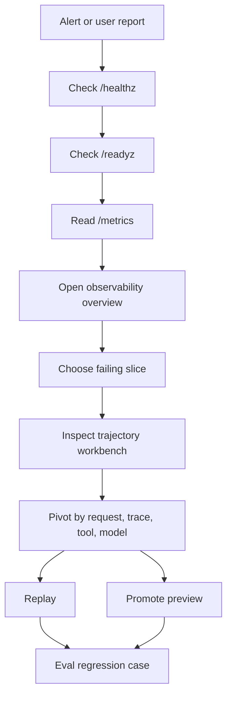
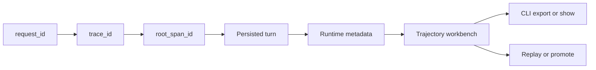
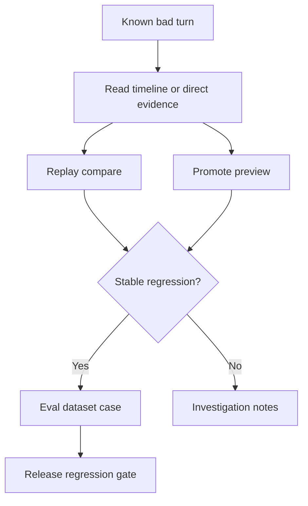

# Observability Runbook

Updated: 2026-04-24

This runbook is for diagnosing live Focus Agent issues with the built-in runtime endpoints, `/metrics`, trajectory storage, Web observability pages, and the `focus-agent-trajectory` CLI.



## 1. Confirm Liveness Versus Readiness

Use the runtime endpoints in this order:

- `/healthz` tells you the process is up.
- `/readyz` tells you whether the runtime is actually ready to serve traffic.
- `/metrics` exposes Prometheus text metrics for runtime state, component readiness, and trajectory aggregates.

Examples:

```bash
curl http://127.0.0.1:8000/healthz
curl http://127.0.0.1:8000/readyz
curl http://127.0.0.1:8000/metrics
```

`/readyz` is the primary readiness signal. It returns:

- `status` and `ready`
- `app_version`, `environment`, and `deployment`
- per-component `checks`, including trajectory recorder status when trajectory persistence is expected

Typical interpretation:

- `/healthz` is `200` but `/readyz` is `503`: the process is alive but one or more runtime checks are degraded.
- `/readyz` is `200` and `trajectory_recorder.ready=false`: runtime is serving, but trajectory persistence is not available.

Alert guidance should use the existing `/metrics` scrape. Start with these signals before adding custom exporters:

- `focus_agent_runtime_ready == 0`: page immediately; traffic readiness is degraded.
- `focus_agent_runtime_component_ready{component="trajectory_recorder"} == 0`: trajectory persistence is unavailable.
- `focus_agent_trajectory_metrics_available == 0`: the runtime is up but trajectory aggregates cannot be read.
- `focus_agent_trajectory_non_succeeded_count / focus_agent_trajectory_turn_count`: alert on a sustained failure-rate increase, not a single failed turn.
- `focus_agent_trajectory_avg_latency_ms`, `focus_agent_trajectory_max_latency_ms`, and `focus_agent_trajectory_total_fallback_uses`: use warning alerts for sustained latency or fallback growth, then pivot into `/app/observability/overview`.

Keep alert labels aligned with `app_version`, `environment`, `deployment`, `component`, and trajectory `status` so release regressions can be separated from general traffic noise.

## 2. Read The Current Slice

Use the aggregated observability surface before drilling into one turn:

- Web: `/app/observability/overview`
- API: `GET /v1/observability/overview`

The overview endpoint returns:

- runtime readiness payload
- trajectory aggregate stats
- optional `trajectory_error` if the runtime is up but the stats query failed

Example:

```bash
curl 'http://127.0.0.1:8000/v1/observability/overview?status=failed&has_error=true&min_latency_ms=500'
```

Useful filters:

- `request_id`
- `trace_id`
- `thread_id`
- `root_thread_id`
- `branch_id`
- `status`
- `scene`
- `tool`
- `model`
- `fallback_used`
- `cache_hit`
- `has_error`
- `started_after`
- `started_before`
- `min_latency_ms`
- `max_latency_ms`

Use the overview page first when you need to answer:

- Is this a broad outage or a narrow slice?
- Which scene, branch role, model, or tool is hot right now?
- Is latency, failure rate, or fallback density moving first?

The overview page is intentionally limited to issue discovery. It should tell you which slice deserves a deeper review, not replace the single-turn workbench.

## 3. Drill Into A Failing Sample

After the overview tells you where to look, move to:

- Web: `/app/observability/trajectory`
- API: `GET /v1/observability/trajectory`
- API detail: `GET /v1/observability/trajectory/{turn_id}`

Examples:

```bash
curl 'http://127.0.0.1:8000/v1/observability/trajectory?status=failed&tool=web_search&limit=20'
curl 'http://127.0.0.1:8000/v1/observability/trajectory/turn-id-here'
```

The trajectory workbench is optimized for this sequence:

1. Narrow the sample list with filters or presets.
2. Select one turn.
3. Read the summary card first so you know whether the sample is failing, slow, zero-step, or detail-degraded.
4. Inspect the evidence panel in the active mode.
5. Read the input/output narrative and runtime context below the evidence block.
6. Use the right rail to pivot into the same request, trace, thread, tool, or model, or run replay/promote.

Evidence modes:

- `timeline`: normal path when step data exists; use it to isolate the exact step, runtime, fallback, cache, or error pivot.
- `zero_step`: compact fallback when the turn has no recorded trajectory steps; the workbench switches to direct evidence instead of leaving an empty timeline shell.
- `missing_detail`: explicit degraded state when the detail payload is unavailable; treat this as an observability gap and verify API/runtime readiness before drawing conclusions.

## 4. Correlate By Request And Trace

The current observability model carries these correlation fields through persisted trajectory records and runtime metadata:

- `request_id`
- `trace_id`
- `root_span_id`
- `environment`
- `deployment`
- `app_version`

The fields form a small handoff chain. Start from whichever identifier you already have, then pivot toward the persisted turn record before choosing the next diagnostic surface.



Use them for handoff and root-cause isolation:

- `request_id` is best when you start from a single HTTP request.
- `trace_id` is best when you want to follow the same traced flow across spans and tool runtime payloads.
- `root_span_id` anchors the top-level turn span for a persisted turn.

Examples:

```bash
curl 'http://127.0.0.1:8000/v1/observability/overview?request_id=req-123'
curl 'http://127.0.0.1:8000/v1/observability/trajectory?trace_id=abc123&limit=50'
focus-agent-trajectory list --request-id req-123 --trace-id abc123 --limit 20
```

The Web workbench also supports:

- request and trace deep links
- production pivots from the selected turn
- correlation hooks collected from trajectory runtime metadata
- a persistent right rail for copy/download actions, replay, and eval-sample promotion

## 5. Use The CLI For Fast Terminal Inspection

`focus-agent-trajectory` reads persisted trajectory data directly from PostgreSQL.

Examples:

```bash
focus-agent-trajectory stats --has-error --fallback-used
focus-agent-trajectory list --request-id req-123 --trace-id abc123 --status failed --limit 20
focus-agent-trajectory show turn-42
focus-agent-trajectory export --scene long_dialog_research --output /tmp/focus-agent-trajectory.jsonl
```

`DATABASE_URI` must point at the same database used by the API. If you are using the managed local PostgreSQL helper, source the runtime file first:

```bash
source .focus_agent/postgres/runtime.env
```

## 6. Replay Or Promote A Known Bad Turn

Once you identify a useful trajectory turn, you can:

- replay it through `POST /v1/observability/trajectory/{turn_id}/replay`
- promote it into an eval-ready dataset payload through `POST /v1/observability/trajectory/{turn_id}/promote`

The Web trajectory page surfaces these actions from the selected turn so you can move from diagnosis into regression capture without leaving the console. The right rail is designed to stay visible while you keep reading the selected sample.

The safest loop is preview-first: diagnose one representative turn, compare replay behavior, then promote only stable evidence into an eval artifact.



Use a preview-first workflow:

```bash
curl -X POST 'http://127.0.0.1:8000/v1/observability/trajectory/turn-id-here/promote' \
  -H 'Content-Type: application/json' \
  -d '{"copy_tool_trajectory":true}'
```

The API response is a dataset preview. Review the generated expectations before committing it to a suite.

For batch failure promotion and replay:

```bash
curl -X POST 'http://127.0.0.1:8000/v1/observability/trajectory/batch/promote-preview' \
  -H 'Content-Type: application/json' \
  -d '{"status":["failed"],"has_error":true,"limit":20,"copy_tool_trajectory":true}'

curl -X POST 'http://127.0.0.1:8000/v1/observability/trajectory/batch/replay-compare' \
  -H 'Content-Type: application/json' \
  -d '{"status":["failed"],"has_error":true,"limit":20,"copy_tool_trajectory":true}'

source .focus_agent/postgres/runtime.env
focus-agent-trajectory export --status failed --has-error --output /tmp/focus-agent-failed.jsonl

uv run python -m tests.eval promote \
  --from /tmp/focus-agent-failed.jsonl \
  --failed-only \
  --copy-tool-trajectory \
  --out tests/eval/datasets/promoted-trajectory.jsonl

uv run python -m tests.eval replay \
  --from /tmp/focus-agent-failed.jsonl \
  --trajectory-input \
  --failed-only \
  --copy-tool-trajectory \
  --run \
  --report-json reports/trajectory-replay.json \
  --fail-if-regression
```

Use `--copy-answer-substring` only when the source answer is stable enough to become an assertion. Otherwise keep the promoted case focused on tool path, failure status, and runtime metrics.

## 7. Release Health Gates

The release-health helper turns readiness, trajectory, and replay signals into deterministic gate results that can be used by `make release-gate` or a future CI job:

- `runtime_not_ready`: fails when `/readyz` reports the runtime as not ready.
- `trajectory_recorder_unavailable`: fails when the trajectory recorder readiness check is present and unhealthy.
- `chat_failure_rate`: fails when the non-succeeded turn rate crosses the configured threshold after the minimum sample size.
- `tool_fallback_spike`: fails when fallback usage is high or has grown sharply versus a baseline.
- `eval_replay_regression`: fails when replay comparison rows contain failed replays or replay errors.

Memory/context quality probes use the same signal shape for deterministic checks such as required markers, forbidden stale markers, and maximum rendered context size.

The release gate runs the helper after the smoke and observability eval suites have written JSON reports:

```bash
uv run python scripts/release_health_check.py \
  --mode local \
  --ready-url http://127.0.0.1:8000/readyz \
  --trajectory-stats-url http://127.0.0.1:8000/v1/observability/trajectory/stats \
  --allow-self-check-fallback \
  --eval-report-json reports/release-gate/eval-smoke.json \
  --eval-report-json reports/release-gate/eval-observability.json \
  --eval-report-json reports/release-gate/memory-context-eval.json \
  --report-json reports/release-gate/release-health.json
```

For a live deployment, switch to `--mode live` or `--mode production`, remove `--allow-self-check-fallback`, and pass captured deployment signals. The helper accepts `/readyz` from `--readyz-json` or `--runtime-status-json`, trajectory stats from `--trajectory-stats-json`, optional trajectory baselines from `--baseline-trajectory-stats-json`, replay comparison rows from `--replay-comparisons-json`, eval reports from repeated `--eval-report-json` arguments, and optional baseline eval reports from repeated `--baseline-eval-report-json` arguments. In live/production mode, missing readyz, trajectory stats, replay comparison, or eval report inputs are release-blocking and return exit code 1.

Production jobs can also probe the live service directly with `--ready-url` and `--trajectory-stats-url`, but those probes are still fail-closed: an unavailable endpoint writes a failed release-health report instead of silently using local self-check samples.

Production release review should archive an evidence pack after the live signals are captured:

```bash
make release-evidence RELEASE_EVIDENCE_ARGS="--release-id <release-id> --readyz-json reports/release-gate/readyz.json --trajectory-stats-json reports/release-gate/trajectory-stats.json --replay-comparisons-json reports/release-gate/replay-comparisons.json --eval-report-json reports/release-gate/eval-smoke.json --baseline-eval-report-json reports/release-gate/baseline-eval-smoke.json"
```

The resulting `reports/release-gate/<release-id>/manifest.json` records artifact paths, hashes, command summaries, release-health status, and missing required artifacts. Missing readyz, trajectory stats, replay comparison, eval report, or baseline eval report artifacts should block production release review.

## 8. Recommended Oncall Flow

Use this order when responding to production issues:

1. Check `/readyz` to separate runtime readiness from simple process liveness.
2. Check `/metrics` or `/v1/observability/overview` to see whether the issue is broad or scoped.
3. Open `/app/observability/overview` and identify the hottest scene, tool, branch role, or model slice.
4. Open `/app/observability/trajectory` and pivot into the exact request, trace, thread, or model.
5. Read the summary card and note which evidence mode you are in: `timeline`, `zero_step`, or `missing_detail`.
6. Inspect the selected turn's error text, fallback steps, cache behavior, input/output narrative, and runtime metadata.
7. Preview promotion for a representative failed turn.
8. Batch replay or promote the slice if it should become a regression artifact.

## 9. Local Verification Commands

These are the repo-local checks that currently validate the observability stack and release regression gate:

```bash
make lint
make contract-check
make ci-test
make sdk-check
make sdk-build
make web-check
make web-build
uv run python scripts/observability_ui_smoke.py --scenario all
pnpm --dir apps/web smoke:observability
uv run python -m tests.eval --suite smoke --concurrency 1 --fail-if-regression
uv run python -m tests.eval --suite observability --concurrency 1
```

`make ui-smoke-observability` remains the short local target. For release verification, prefer the explicit browser smoke command with `--scenario all` so overview, trajectory, replay, and promotion surfaces are exercised under one scenario set.

If your local `.venv` cannot import `psycopg` because `libpq` is missing, use the focused test workaround already documented in [architecture.md](architecture.md).

## 10. Current Boundaries

- Trajectory observability depends on PostgreSQL-backed persistence or another initialized trajectory recorder.
- `/metrics` currently includes trajectory aggregate metrics when they are available; high-frequency scrape behavior should still be reviewed alongside your global API rate-limit settings.
- OpenTelemetry exporter wiring is implemented with standard `OTEL_TRACES_EXPORTER` and `OTEL_EXPORTER_OTLP_*` settings, but collector reachability and desktop-browser automation still depend on the current deployment and execution environment.
