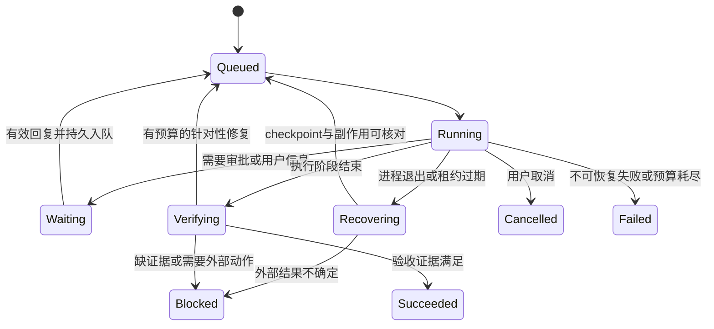

# Agent 能力补全设计草案

日期：2026-09-28；现状基线：`718be87`。状态：**待实施的设计草案**，不代表已批准 API、已执行迁移或已启用功能。

依据：[调研](research.md)、[现状能力地图](../../architecture/agent-capability-map.md)。拆解与验收：[实施规划](plan.md)。

## 1. 目标、范围与非目标

目标：让一次明确的任务委托能在预算和权限内执行，在中断后安全恢复，并用可核查证据说明完成情况。

本轮仅修改文档。后续实现优先补现有调用路径，不替换 LangGraph，不另建通用工作流平台，不同时实现浏览器、桌面控制、所有业务连接器，也不自动修改线上提示词或记忆策略。

## 2. 复用边界

| 责任 | 优先复用 | 需要补的连接 |
| --- | --- | --- |
| 当前任务与运行状态 | [RunManager / RunRequest](../../../src/focus_agent/harness/runtime/runs.py)、现有 run journal | 可恢复请求、恢复入口、任务与运行尝试的稳定关联 |
| 通用后台工作 | [PostgresBackgroundJobDeduperBackend](../../../src/focus_agent/services/coordination_postgres.py)、`focus_background_jobs`、现有 durable worker 装配 | 普通 run 与 job、执行尝试、checkpoint、claim token 的稳定关联和恢复 handler |
| Team 后台工作 | [v19 Team jobs / checkpoints / leases / receipts](../../../src/focus_agent/repositories/postgres_schema.py) | 保留 session/task 归属，接通 Team 认领、取消、审批续跑和副作用核对 |
| 完成判断 | [execution contract](../../../src/focus_agent/engine/graph_execution_contract.py)、现有 evidence/ledger | 普通实施任务的验收器及证据失效规则 |
| 调用约束 | [工具策略](../../../src/focus_agent/capabilities/tool_router.py)、[AgentBudget](../../../src/focus_agent/delegation/delegation_models.py) | 调用前授权/预算校验、调用后实耗与副作用记录 |
| 长期改进 | MemoryRecord、trajectory、feedback、replay/promotion | 可撤销记忆修订、任务级反馈关联和候选回归流程 |

具体是否扩展现有字段/表，必须在实现时核对仓储接口；本设计不宣称所有表已经被统一执行器使用，也不预先要求新建重复表。

两套 job 的作用域必须保留：通用 worker 使用 `focus_background_jobs`，而
`focus_agent_team_jobs` 要求 Team `session_id`，不能直接接收普通 harness run。
首个普通 run 剖面选择前者，Team 审批仍在后者的任务归属中处理；复用恢复语义不等于强行合表。

## 3. C01：持续执行、恢复和人类协作

### 3.1 任务与尝试

任务保留稳定目标、约束、验收项、权限范围、预算和证据引用；一次执行是一个 attempt。恢复或返工创建/续接明确的 attempt，不把重复请求当成新目标。

复用现有任务字段并补齐缺失关联。概念状态如下，**不是要求直接替换当前 API enum**：

实现时将其映射到既有 task/run/job 状态；公开契约需要扩展时同步 OpenAPI、SDK 和兼容说明。

### 3.2 恢复协议

1. 入口先校验 owner 和任务范围，再读取可能触发回填的状态；提交去重键限定在对应用户/任务命名空间。
2. 持久 job 与执行目标关联后才确认受理；worker 使用现有认领/租约机制，不靠进程内 asyncio.Queue 作为唯一记录。
3. checkpoint 保存可恢复位置及目标/约束/未完成项/证据引用；原会话事件保留原有存储职责，摘要不是唯一事实来源。
4. 重启扫描可恢复 job；重新检查取消、superseded revision、权限、预算和外部副作用，再恢复。
5. follow-up、审批回复、需要用户补充的信息遵循同一恢复协议，按普通 run/Team 作用域路由；重复事件不创建额外的 canonical job，允许有界、可追踪的重试 attempt。

首个交付建议限定 PostgreSQL 可恢复剖面；内存/SQLite 路径继续明确说明其实际保障，不静默承诺同等级恢复。

### 3.3 副作用与审批

已有 side-effect receipt 应记录意图、幂等键、外部引用及结果。支持幂等键的外部系统沿用同一键；支持回读的系统先核对；无法判断是否执行成功的操作进入人工处理状态，不盲目重试。

现有 v19 receipt 属于 Team session/task。普通 run 先使用对应工具可持久核对的回执和外部幂等键；没有此类证据的非幂等操作在恢复时阻塞。若需要扩展回执归属，单独审查最小数据变更，不为适配表结构伪造 Team session。

逻辑 job 去重不保证外部副作用 exactly-once。外部调用可能已经成功但响应丢失，必须有
`unknown` / `reconciliation_required` 等明确的待核对语义（具体字段在实现时映射既有模型），不能据一次队列认领或审批去重直接宣称外部操作只发生一次。

审批必须绑定用户、任务、attempt/revision、工具与参数范围；批准与后续入队应使用现有持久事务能力形成一致的决定记录。执行前再次检查审批仍适用、任务未取消、凭据和权限有效。批准不是长期通行证；拒绝或过期不产生工具副作用。

客户端断开与取消应作为不同语义处理；仅显式启用后台持续执行的任务在断开后继续。服务升级/崩溃恢复和正常退出分别验证。

## 4. C02：完成标准与环境证据

在任务开始时将用户目标转成少量可检查的验收项，保存于已有 task/contract。普通解释性回答不强制创建实施任务或调用工具。

| 类型 | 最小证据 | 不能替代它的内容 |
| --- | --- | --- |
| 代码修改 | 受影响路径的测试/构建/可重复行为检查，关联当前代码版本 | 模型说“测试通过”、无关测试绿色 |
| 页面修改 | 对应页面操作、状态断言，必要时截图 | 页面存在、静态 HTML 或仅截图文件名 |
| 外部数据写入 | 对应对象的回读或可信外部回执 | 工具被调用、初始数据已经满足条件 |
| 调研 | 支撑关键结论的来源与证据引用 | 调用了搜索但来源不支持结论 |

证据至少关联任务、attempt、检查对象/版本、检查方法、结果与引用。代码或对象改变后，相关旧证据失效；不要全量重复无关检查。

执行结束与验收通过分开表达；未验证应显示未验证，失败显示失败，缺少外部条件显示阻塞。缺失 final state 不允许回退初始状态后判定环境改变成功。

先使用确定性 verifier；主观质量或高风险变更才考虑独立评审。修复循环复用现有 loop detection 和预算，不能无限生成“再审查”任务。

## 5. C04：统一任务预算

将现有 max_llm_calls、max_tool_calls、timeout 和费用字段接入真实调用边界；先明确既有零值语义，再兼容扩展，不擅自改变已发布请求含义。

- 调用前检查剩余次数/期限；调用后记录真实 usage、耗时与可得费用，覆盖重试和子任务。
- 子任务额度从父任务预算分配，不能每个子任务各获得一整份父预算；并行认领额度需要原子性。
- 无费用数据时标记 unknown；有硬费用上限且无法可靠计量时，不声称已执行精确费用限制。可先交付可靠的次数/时间上限。
- 超限中止后续调用并保存已有成果；取消正在进行的调用是否支持，需要按 provider 明确说明。

## 6. C03：受控工具与交付

先选一个用例：开发助手优先页面验收，业务助手优先一个有明确权限边界的连接器。

- 复用工具 registry/policy，适配器声明风险、网络/写入需求和审批要求，不绕开既有策略。
- 浏览器会话限定来源/权限，返回可引用的页面状态；网页内容按不可信输入处理，不能改写系统权限或取得连接凭据。
- MCP 连接先实现用户授权、凭据引用、工具发现和最小调用链；工具数量实际造成上下文压力后再做按需发现优化。
- 图片/附件需贯通上传、owner 校验、content parts、模型适配和展示；设置类型/大小边界，不仅给 UI 增加上传按钮。
- artifact 下载通过授权对象标识提供，不把任意服务端路径当作可下载接口。优先复用现有 artifact metadata，不重造文件平台。

不把 CI 中可运行 Chrome 等同于 Agent 已有浏览器工具；不同模型是否支持图片输入需要明确 capability，不静默丢弃附件。

## 7. C05：有限协作与针对性返工

保留单 Agent 为对照。可独立执行的任务才委派，子任务带明确目标、写入范围、预算和验收项；有共享写冲突时隔离 workspace 或串行。

接通已有 revision/attempt 数据到实际命令：返工引用原失败证据与父 revision，只重做受影响任务。主 Agent 整合结果并检查证据，不只拼接回答；子任务自称完成不直接将父任务标记完成。

对同一任务集记录单/多 Agent 的完成率、误报完成、用户干预、耗时和成本。模型选择来自当前配置和可用性，不将某个模型永久绑定到某个角色。

## 8. C06：可纠错记忆

先覆盖用户明确偏好与项目规则，复用已有 evidence_refs、namespace、status 与 tombstone。

- 内容变更保留必要的前后修订及来源事件；检索只使用当前有效版本。
- 用户明确陈述与模型推断分开标识；存在冲突时保留待解决信息，不自动把更高置信度当作真相。
- 撤销修订时同步使旧 embedding/index 失效并重建有效版本，沿用现有 anti-resurrection 条件更新。
- “撤销”“停止检索”和“删除数据”分别定义；历史记录的保留和删除策略应覆盖内容、索引与可追踪副本，不能无限保存敏感旧值。

## 9. C07：反馈到回归

扩展现有反馈事件，使其能关联 turn/request、trajectory、相关模型/提示词版本、证据与记忆引用。缺失信息标记缺失，不补造版本。

负反馈产生 candidate，不直接改线上行为。人工确认失败场景后运行 before/after replay；仅适合确定性检查且通过相关回归的用例进入 golden。模型质量评测使用真实 provider 的证据，fake model 仅证明执行和评测框架行为。

最小观测面复用现有 trajectory/observability：任务结果、完成证据、恢复次数、预算耗用与阻塞原因。不要为此先建设新的监控平台。

## 10. 发布与兼容

以小范围 feature profile 灰度，每个阶段保留明确关闭方式。功能 flag 关闭不删除未完成任务或审计记录；回滚前停止新认领，核对在途副作用，再切换执行路径。

不以文档更新改变默认配置，不把所有任务都迁入新协议。新能力达到 [plan.md](plan.md) 的对应验收后，再更新 canonical 文档中的现状描述。
