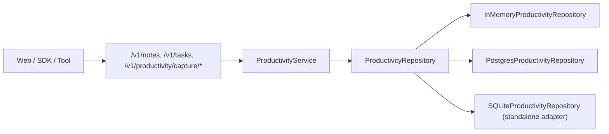
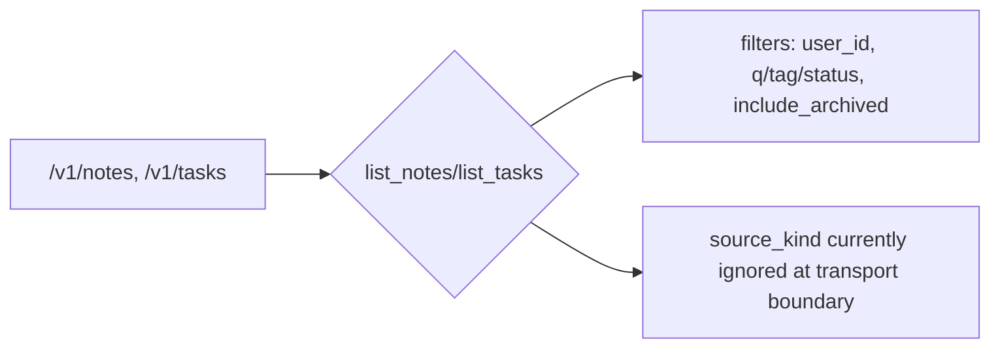
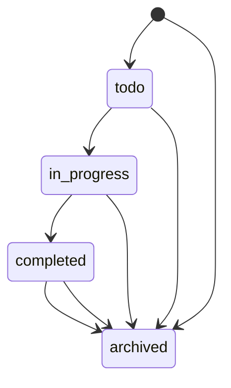
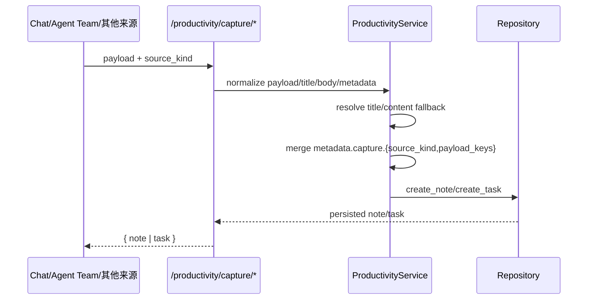
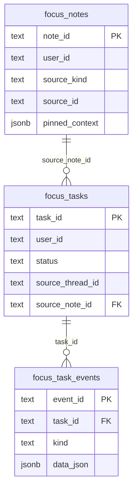
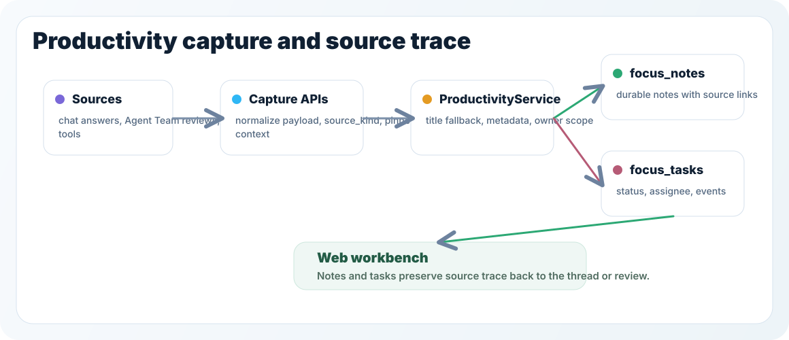
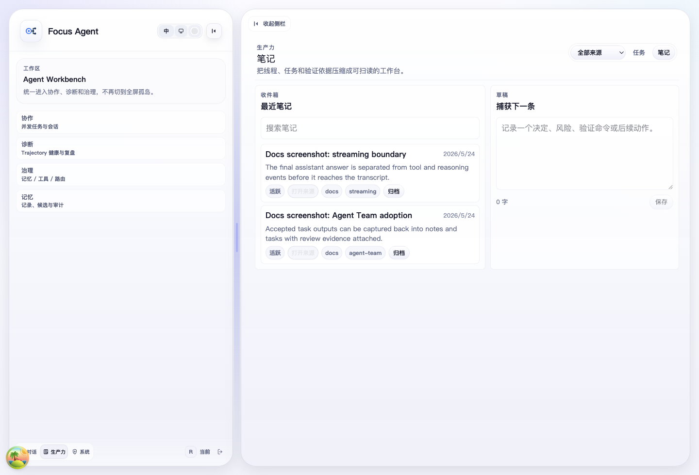
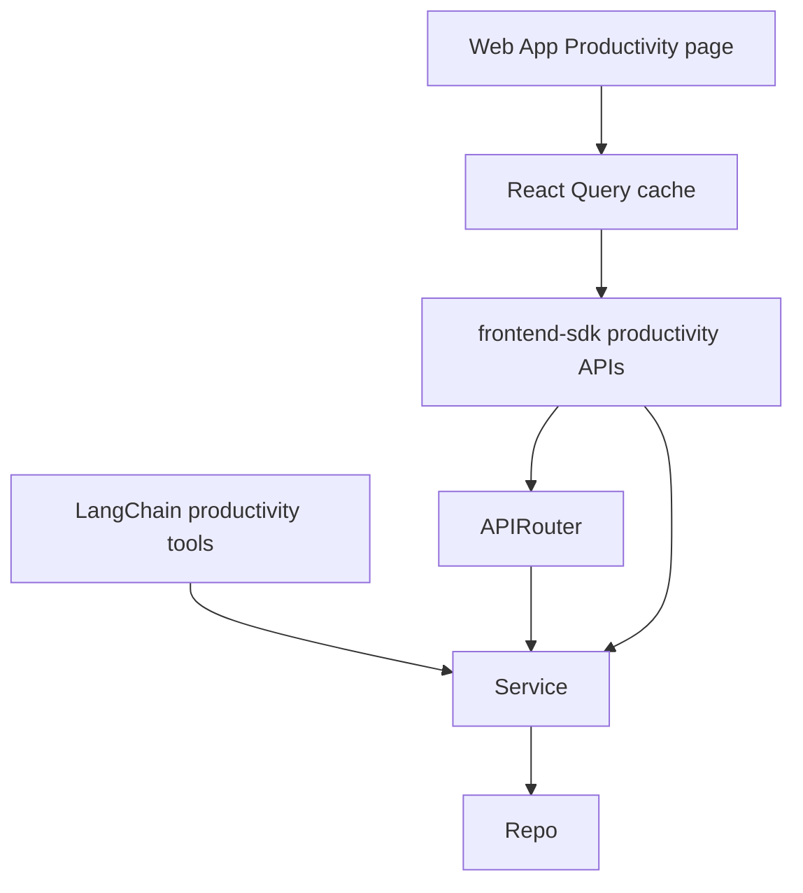

# Productivity System

更新时间：2026-05-18

这份文档是 Focus Agent 生产力模块的专题说明：笔记/任务的数据模型、路由与服务边界、事件与持久化，以及 Web SDK / Web App 的接入口径。

## 1. 模块范围

生产力模块提供 owner-scoped 的独立工作台能力，覆盖两类可持久化对象：

- 笔记（`FocusNote`）
- 任务（`FocusTask`）及其事件（`FocusTaskEvent`）

它不依赖对话历史生命周期，也不改变主聊天上下文；它通过独立 API 和 repo/service 边界与主业务协同。

支持入口：

- API：`src/focus_agent/api/routers/productivity.py`
- Service：`src/focus_agent/services/productivity.py`
- Repository 接口：`src/focus_agent/repositories/productivity_repository.py`
- 数据库实现：`InMemoryProductivityRepository`（`productivity_repository.py` 内）、
  `PostgresProductivityRepository`（默认持久化运行时）、
  `SQLiteProductivityRepository`（本地离线适配/测试用）
- 工具侧接入：`src/focus_agent/capabilities/default_tool_modules/productivity.py`
- Web App：`apps/web/src/pages/productivity/productivity-page.tsx`
- SDK：`frontend-sdk/src/client/productivity.ts`



## 2. API 入口与行为边界

| Method | Path | 语义 |
|---|---|---|
| `GET` | `/v1/notes` | 按 owner-scoped 查询笔记；支持 `q`（标题/正文文本）、`tag`、`include_archived`、`limit/offset` |
| `POST` | `/v1/notes` | 创建笔记（`title` 为必填） |
| `GET` | `/v1/notes/{note_id}` | 按 owner-scoped note_id 读取 |
| `PATCH` | `/v1/notes/{note_id}` | 更新笔记字段 |
| `GET` | `/v1/tasks/{task_id}` | 按 owner-scoped task_id 读取 |
| `GET` | `/v1/tasks` | 按 owner-scoped 查询任务；支持 `status`、`include_archived`、`limit/offset` |
| `POST` | `/v1/tasks` | 创建任务（`title` 为必填） |
| `PATCH` | `/v1/tasks/{task_id}` | 更新任务字段 |
| `POST` | `/v1/tasks/{task_id}/complete` | 快速标记任务完成 |
| `POST` | `/v1/tasks/{task_id}/archive` | 快速归档任务 |
| `GET` | `/v1/tasks/{task_id}/events` | 拉取任务事件列表 |
| `POST` | `/v1/productivity/capture/note` | 从 `payload`  capture 成 note |
| `POST` | `/v1/productivity/capture/task` | 从 `payload`  capture 成 task |

返回码边界：

- `200`：查询与读取成功
- `201`：创建成功
- `400`：标题为空等参数验证失败
- `404`：越权或不存在的 owner-scoped 资源
- `500`：runtime 缺少 `productivity_repository/service`

### 2.1 所有权和跨用户隔离

所有读写都通过 `principal.user_id` 与 `user_id` 锁定。没有匹配 owner 的笔记/任务会返回 404，不会返回数据；同一条数据在另外用户上下文下也不可更新。

### 2.2 列表查询注意项（重要）

SDK 和 Web page 会向列表接口附带 `source_kind`，用于 UI 侧来源筛选与展示（`source_kind` 来源于筛选 tab）。

当前实现行为为：当前 API 路由不声明 `source_kind`，因此该参数会被 FastAPI 级别忽略；列表仍按 `user_id` + 基础过滤/查询返回，不进行来源维度过滤。
如果你需要服务端层面过滤，请在路由中显式接收 `source_kind`，并同步更新 repository 与测试契约。



## 3. 模型与状态约束

`FocusNote` 字段：

- `note_id`、`user_id`、`title`、`body`
- `status`（`active` / `archived`）与 `is_archived` 双向同步
- `tags`（笔记侧）
- 来源字段：`source_thread_id`、`source_artifact_id`、`source_kind`、`source_id`、`source_url`
- `captured_from`、`pinned_context`、`metadata`
- 时间戳：`created_at`、`updated_at`、`archived_at`

`FocusTask` 字段：

- `task_id`、`user_id`、`title`、`description`
- 状态：`todo` / `in_progress` / `completed` / `archived`
- 计划字段：`due_at`、`priority`、`assignee_user_id`
- 标签与来源追踪：`tags`、`source_*`、`source_note_id`、`captured_from`
- 时间戳：`created_at`、`updated_at`、`completed_at`、`archived_at`

`FocusTaskEvent` 用于记录任务生命周期更新：

- `created`
- `updated`
- `completed`
- `archived`



`update_task()` 会根据 `status` 直接写入状态；`complete_task()` 与 `archive_task()` 是语义化 helper，分别设置 `completed_at` / `archived_at`。

## 4. Capture 流程

Capture API 是面向工具链/前端来源录入的收口。



Capture 的关键规则：

- `source_kind` 必填，空字符串会被拒绝；
- `title`、`body`/`description` 会从 payload 自动推断（如 `title/summary/headline/task_title`）；
- 若调用端未显式传 `source_thread_id`，会尝试从 payload 的 `thread_id` 补齐；
- `metadata.capture` 会记录 `source_kind` 与 `payload_keys`，便于回溯。

## 5. 持久化与数据库

`runtime` 在有/无 `DATABASE_URI` 时会创建对应 repository：

- Postgres：`PostgresProductivityRepository`
- 无数据库时：`InMemoryProductivityRepository`
- SQLite：`SQLiteProductivityRepository`（本地临时文件路径；通常用于独立适配验证，不是默认运行时主路径）

路由层还会按注入边界创建并复用 `ProductivityService`。

`PostgreSQL` schema 在 `src/focus_agent/repositories/postgres_schema.py` 中作为应用级主 schema 的一部分：

- v13：新增 `focus_notes` / `focus_tasks` / `focus_task_events`
- v14：索引与来源追踪列（`source_*`、`pinned_context`、`captured_from`）增强
- v17：整体 schema 当前版本（与主 `postgres_schema` 同步）

`SQLite` / `Postgres` 都会在 note/task 写入时保留 `data_json` 的完整对象，并按结构化列保留主过滤字段与索引。



## 6. Web App / SDK / Tool 接入

- SDK 已提供 `listNotes/listTasks/listTaskEvents/createNote/createTask/updateNote/updateTask/completeTask/archiveTask/captureNote/captureTask`。
- Web App 的生产力入口：`/app/productivity/notes`、`/app/productivity/tasks`。
- 任务/笔记详情与来源跳转可通过 `task.source_*`、`note.source_*` 回传到线程页。
- 工具侧也可直接通过 `notes_create / notes_search / tasks_create / notes_update / tasks_update / tasks_list / productivity_capture` 进行读写。



真实产品截图（由 `scripts/capture_docs_screenshots.py` 捕获）：





## 7. 验证与回归

与生产力相关的最小回归建议：

```bash
uv run pytest tests/test_productivity_api.py tests/test_productivity_repository.py tests/test_default_tools.py -k productivity
```

Web source-level smoke 与脚本覆盖：

```bash
make ui-smoke-productivity
```

可观测/回放相关覆盖（按项目整体链路）：

```bash
make ui-smoke-observability
uv run pytest tests/test_ui_smoke_script.py
```

> 注：`tests/test_ui_smoke_script.py` 覆盖了可重复运行的 browser smoke 脚本契约，`make ui-smoke-productivity` 覆盖前端源代码层面的生产力页面接入扫描（`apps/web/scripts/productivity-smoke.mjs`）。

## 8. 变更引导（给开发者）

改动该模块时建议同步更新：

- `docs/architecture.md`（尤其是 6.1 / 21 / 22）
- `docs/development.md` 与 `docs/development.zh-CN.md`（验证命令）
- `frontend-sdk/README.md`（Client API / flow diagram）
- `tests/test_productivity_api.py`、`tests/test_productivity_repository.py`
- `apps/web/scripts/productivity-smoke.mjs`（UI source-of-truth 视图检查）
