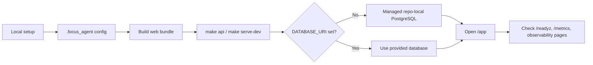

# Quick Start

This guide expands on the shortest startup path from the root README.



## 1. Local Setup

```bash
uv venv
source .venv/bin/activate
uv pip install -e '.[openai,dev]'
cp .env.example .env
make setup-local
pnpm install --registry=https://registry.npmjs.org
```

`make setup-local` creates the default local config files under `.focus_agent/` if they are missing:

- `.focus_agent/local.env`
- `.focus_agent/models.toml`
- `.focus_agent/tools.toml`

Keep provider credentials in `.focus_agent/local.env` or other untracked local configuration.

## 2. Start The API

```bash
pnpm web:build
make api
```

Open:

- `http://127.0.0.1:8000/app`
- `http://127.0.0.1:8000/app/observability/overview`
- `http://127.0.0.1:8000/app/observability/trajectory`
- `http://127.0.0.1:8000/healthz`
- `http://127.0.0.1:8000/readyz`
- `http://127.0.0.1:8000/metrics`

For observability, `/healthz` is a simple liveness check, `/readyz` reports runtime component readiness, and `/metrics` exposes Prometheus text metrics. The Web observability pages support request/trace correlation through the trajectory data captured in Postgres.

## 3. Managed Local PostgreSQL

If `DATABASE_URI` is not already set, the local startup commands (`make api`, `make dev`, `make serve`, `make serve-dev`, and `make serve-prod`) manage a repo-local PostgreSQL for you and inject `DATABASE_URI` into the API process automatically.

That managed path:

- requires PostgreSQL CLI/server tools such as `initdb`, `pg_ctl`, `createdb`, and `psql`
- stops the managed database together with the service
- cleans up temporary runtime files
- keeps the repo-local Postgres data directory for reuse on the next run

If you explicitly export `DATABASE_URI` before startup, that value is preserved and the local-Postgres bootstrap is skipped.

If you prefer to launch `.venv/bin/focus-agent-api` directly, export `DATABASE_URI` yourself first. The raw binary does not start the managed local PostgreSQL helper for you.

The startup scripts also persist the runtime settings to `.focus_agent/postgres/runtime.env` so ad-hoc commands can inspect the same database:

```bash
source .focus_agent/postgres/runtime.env
psql "$DATABASE_URI"
```

## 4. Frontend Development

To develop the frontend against the local API:

```bash
make web-dev
```

Then set this in `.focus_agent/local.env` when you want `/app` to redirect to the Vite dev server:

```env
WEB_APP_DEV_SERVER_URL=http://127.0.0.1:5173/app
```

In that mode:

- frontend: `http://127.0.0.1:5173/app/`
- API: `http://127.0.0.1:8000`

## 5. One-Command Local Modes

- `make serve` / `make serve-dev`: frontend Vite dev server + backend API with reload
- `make serve-prod`: build the static frontend bundle first, then start only the backend without reload
- `make dev`: backend only with `API_RELOAD=1`

## 6. Local Auth

For local development, you can create a demo token:

```bash
curl -X POST http://127.0.0.1:8000/v1/auth/demo-token \
  -H 'content-type: application/json' \
  -d '{"user_id": "researcher-1"}'
```

## 7. Next Docs

- [Observability Runbook](observability-runbook.md)
- [Development Guide](development.md)
- [Docker Deployment](docker-deployment.md)
- [Architecture](architecture.md)
