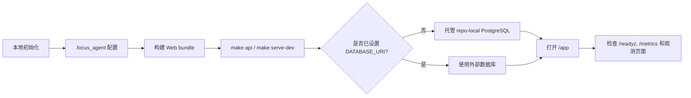

# 快速开始

这份文档承接根目录 README 里的最短启动路径，补充完整的本地运行说明。



## 1. 本地初始化

```bash
uv venv
source .venv/bin/activate
uv pip install -e '.[openai,dev]'
cp .env.example .env
make setup-local
pnpm install --registry=https://registry.npmjs.org
```

`make setup-local` 会在缺失时创建 `.focus_agent/` 下的默认本地配置：

- `.focus_agent/local.env`
- `.focus_agent/models.toml`
- `.focus_agent/tools.toml`

Provider 凭据请放在 `.focus_agent/local.env` 或其他未跟踪的本地配置文件里。

## 2. 启动 API

```bash
pnpm web:build
make api
```

启动后可访问：

- `http://127.0.0.1:8000/app`
- `http://127.0.0.1:8000/app/observability/overview`
- `http://127.0.0.1:8000/app/observability/trajectory`
- `http://127.0.0.1:8000/healthz`
- `http://127.0.0.1:8000/readyz`
- `http://127.0.0.1:8000/metrics`

其中 `/healthz` 是简单存活检查，`/readyz` 返回运行态组件 readiness，`/metrics` 输出 Prometheus 文本指标。Web observability 页面会基于 Postgres 中的 trajectory 数据支持 request/trace 关联排障。

## 3. 本地托管 PostgreSQL

如果启动前没有设置 `DATABASE_URI`，本地启动命令（`make api`、`make dev`、`make serve`、`make serve-dev`、`make serve-prod`）会自动管理一个 repo 内本地 PostgreSQL，并把生成的 `DATABASE_URI` 注入到 API 进程里。

这条托管路径：

- 需要本机可用的 PostgreSQL CLI/服务端工具，例如 `initdb`、`pg_ctl`、`createdb`、`psql`
- 会随着服务一起停止并清理临时运行态
- 会保留 repo-local Postgres 数据目录，方便下次继续复用

如果你在启动前已经显式设置了 `DATABASE_URI`，启动命令会保留该值，不再覆盖，也不会再做托管本地 Postgres 的注入。

如果你更希望直接运行 `.venv/bin/focus-agent-api`，请先自行准备并导出 `DATABASE_URI`。裸跑二进制不会帮你启动这套托管本地 PostgreSQL。

启动脚本会把运行态写入 `.focus_agent/postgres/runtime.env`，方便另一条 shell 连接同一套数据库：

```bash
source .focus_agent/postgres/runtime.env
psql "$DATABASE_URI"
```

## 4. 前端开发模式

如果你要本地联调前端：

```bash
make web-dev
```

然后在 `.focus_agent/local.env` 里设置：

```env
WEB_APP_DEV_SERVER_URL=http://127.0.0.1:5173/app
```

此时：

- 前端：`http://127.0.0.1:5173/app/`
- API：`http://127.0.0.1:8000`

## 5. 一键本地模式

- `make serve` / `make serve-dev`：启动前端 Vite dev server 和带热重载的后端 API
- `make serve-prod`：先构建静态前端，再以非 reload 模式启动后端
- `make dev`：只启动后端，并启用 `API_RELOAD=1`

## 6. 本地鉴权

内置 `/app` 会把未登录用户引导到 `/app/auth/login`，并通过 `return_to` 保留原本要访问的受保护页面。本地开发最快的浏览器路径是：

1. Vite 模式打开 `http://127.0.0.1:5173/app/`，或打开后端托管 bundle 的 `http://127.0.0.1:8000/app/`。
2. 点击 `Demo 登录` 创建默认本地 demo 用户，并回到原目标页面。
3. 用左侧栏账号区域的 `退出登录` 回到未登录态。
4. 切换账号时先退出，再用用户名密码、`Demo 登录` 或 Bearer Token 面板重新登录。

如果要测试 token 登录，可先创建本地 demo access token：

```bash
curl -X POST http://127.0.0.1:8000/v1/auth/demo-token \
  -H 'content-type: application/json' \
  -d '{"user_id": "researcher-1"}'
```

把返回的 `access_token` 粘贴到登录页 `使用 Bearer Token` 面板，并点击 `继续`。`清空` 会移除本地保存的 token。注册用户名密码会创建持久化本地账号，只在明确需要验证账号密码流程时使用。

注册和测试账号注意点：

- 用户名会先 trim 并转小写，再做唯一性校验。
- 密码至少 8 位，并且必须同时包含字母和数字。
- 自助注册会创建 active `member`，不会自动成为 admin。
- `AUTH_DEMO_TOKENS_ENABLED=true` 是本地默认值；非开发部署必须关闭 demo token。
- 本地/开发模式下，首个非匿名用户可以 bootstrap 为 admin。也可以用 `AUTH_BOOTSTRAP_ADMIN_USER_IDS` 显式指定本地 admin ID。生产数据库部署应显式配置管理员。
- 在 `/app/admin/users` 创建用户只会创建用户记录；验证用户名密码登录前，需要先为该用户 reset password。
- 退出登录会清掉 Web App 本地 token、清掉 auth cookie，并撤销 refresh session。Access token 和 demo token 是无状态 token，已经复制出去的 token 在过期或密钥轮换前仍可再次粘贴使用。

## 7. 浏览器 Smoke 测试

`make ui-smoke` 默认使用 `scripts/ui_smoke_test.py` 中配置的 app URL，通常对应 Vite dev server。当你想验证后端托管的静态 bundle，或本地调试时临时关闭鉴权，可以显式启动 API 并传入页面地址：

```bash
AUTH_ENABLED=false WEB_APP_DEV_SERVER_URL= API_PORT=8001 ./scripts/run-api.sh
uv run python scripts/ui_smoke_test.py \
  --app-url http://127.0.0.1:8001/app/ \
  --health-url http://127.0.0.1:8001/healthz \
  --message '最近一周华钰矿业这只A股股票的表现怎么样？请联网查询并用中文简要说明。'
```

如果改动涉及 streaming、transport validation 或 web search，不要只用默认 OK 消息；应使用真实工具调用问题。Smoke 脚本会等待流式 assistant 回复稳定后再断言最终文本。

## 8. 下一步文档

- [Observability Runbook](observability-runbook.md)
- [开发指南](development.zh-CN.md)
- [Docker 部署说明](docker-deployment.md)
- [架构说明](architecture.md)
