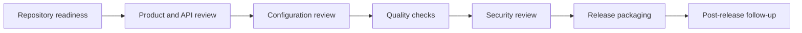

# Release Checklist

This checklist is intended for maintainers preparing Focus Agent for a public release or a tagged internal milestone.



## Repository Readiness

- Confirm `README.md` reflects the current project scope and setup flow
- Confirm `README.zh-CN.md` is still aligned with the English README
- Confirm `CONTRIBUTING.md` reflects the expected contribution workflow
- Confirm `SECURITY.md` has a real private reporting path before public release
- Confirm `.github` issue templates and PR template still match repository conventions
- Remove internal-only references, examples, or wording from docs
- Review tracked files for secrets, tokens, internal hosts, or private organization details

## Licensing and Governance

- Confirm MIT license references still match the root `LICENSE` file
- Ensure README and other docs reference the final license correctly
- Decide whether a `NOTICE`, CLA, or DCO process is required

## Product and API Review

- Confirm the documented API routes still exist and match current behavior
- Confirm SSE event names and payload expectations are still accurate
- Confirm branch lifecycle behavior is still reflected correctly in docs
- Confirm auth behavior and ownership rules are documented accurately
- Confirm the frontend SDK examples still match the live contract
- Confirm trajectory observability docs match the live API, CLI, and `/app/observability/trajectory` console
- Confirm trajectory failure promotion preview and batch replay workflow still match the API and eval CLI
- Confirm OTel exporter env vars and runtime readiness docs still match the live tracing behavior
- Confirm alert guidance uses the existing `/metrics` endpoint and current metric names
- Confirm Agent governance expectations still match `docs/agent-role-routing.md`, `/v1/agent/*`, and `/app/agent/governance`
- If Agent governance changed, confirm `/v1/agent/capabilities`, `/v1/agent/tool-router/*`, `/v1/agent/memory/curator/*`, and `/app/agent/governance`
- If Context Engineering changed, confirm `/v1/agent/context/*`, `/app/agent/governance`, and `tests/eval/datasets/agent_context.jsonl`
- If Task Ledger changed, confirm `/v1/agent/task-ledger/*`, `/v1/agent/artifacts`, `/v1/agent/critic/*`, `/app/agent/governance`, and `tests/eval/datasets/agent_task_ledger.jsonl`

## Configuration Review

- Review `.env.example` for completeness and safe defaults
- Review local config instructions under `.focus_agent/`
- Decide which settings are development-only versus production-ready
- Confirm non-development startup fails when auth is disabled, `AUTH_JWT_SECRET` is missing/default, demo tokens are enabled, or rate limiting is disabled
- Review persistence-related settings such as `DATABASE_URI`, managed local Postgres runtime files, trajectory settings, and artifact paths

## Quality Checks

Required release gate:

```bash
make release-gate
```

This writes `reports/release-gate/latest.json` with per-command labels, status, duration, exit code, skip reason, and captured stdout/stderr summaries. For local iteration, pass CLI options such as `--dry-run`, `--only`, `--skip`, `--report-json`, and `--keep-going` through `RELEASE_GATE_ARGS`, for example:

```bash
make release-gate RELEASE_GATE_ARGS="--dry-run --only lint"
```

For a fast API/SDK compatibility check before the full gate, run:

```bash
make contract-check
```

The orchestrated command plan is:

```bash
make lint
make ci-test
make sdk-check
make sdk-build
make web-check
make web-build
uv run python scripts/observability_ui_smoke.py --scenario all
pnpm --dir apps/web smoke:observability
uv run python scripts/ui_smoke_test.py
uv run python -m tests.eval --suite smoke --concurrency 1 --report-json reports/release-gate/eval-smoke.json
uv run python -m tests.eval --suite observability --concurrency 1 --report-json reports/release-gate/eval-observability.json
uv run python scripts/memory_context_eval.py --report-json reports/release-gate/memory-context-eval.json
uv run python scripts/release_health_check.py --ready-url http://127.0.0.1:8000/readyz --trajectory-stats-url http://127.0.0.1:8000/v1/observability/trajectory/stats --allow-self-check-fallback --eval-report-json reports/release-gate/eval-smoke.json --eval-report-json reports/release-gate/eval-observability.json --eval-report-json reports/release-gate/memory-context-eval.json --report-json reports/release-gate/release-health.json
```

- `scripts/ui_smoke_test.py` covers the main chat, branch, and review routes; keep `make ui-smoke` as the shorthand local target.
- `scripts/memory_context_eval.py` covers the P7 memory/context quality probes: fact fidelity, key fact recall, irrelevant memory pollution, conflict memory marking, compaction answerability, and artifact refs.
- `scripts/release_health_check.py` converts readiness, trajectory stats, replay comparison rows, and eval JSON reports into release-blocking health signals. Local release-gate runs allow an explicit self-check fallback when no API is available; production release jobs should pass real `--runtime-status-json`/`--ready-url`, `--trajectory-stats-json`/`--trajectory-stats-url`, and replay comparison inputs without the fallback.
- API/router, tool split, state-slice, and branch-service refactors must keep their focused compatibility tests green before the full gate.
- 2026-04-26 P0-P3 multi-agent engineering gate completed: security config, API/router split, default tool split, state slice helpers, branch-service facade split, SDK/Web checks, UI smoke, observability smoke, and eval smoke all passed.
- If deployment or persistence changed, run the targeted Postgres / containerization tests referenced in `docs/architecture.md`
- If production trajectory failures were promoted, replay the exported slice before tagging:

```bash
uv run python -m tests.eval replay \
  --from /tmp/focus-agent-failed.jsonl \
  --trajectory-input \
  --failed-only \
  --copy-tool-trajectory \
  --run \
  --report-json reports/trajectory-replay.json
```

- If a stored eval baseline is available, add `--baseline <baseline.json> --fail-if-regression` to the eval smoke or trajectory replay command

- Review recent changes for accidental breaking API or SDK changes
- Ensure docs were updated for any behavior changes

## Security Review

- Review authentication defaults
- Review token creation and validation behavior
- Review thread ownership enforcement paths
- Review any filesystem write locations used by tools or examples
- Review dependency versions and known advisories
- Confirm no sensitive values are present in tracked docs or examples

## Release Packaging

- Decide on the release version
- Update version references if needed
- Prepare release notes or changelog entries
- Identify any breaking changes and migration notes
- Tag the release according to repository conventions

## Post-Release Follow-Up

- Monitor issues and security reports after release
- Triage documentation gaps discovered by first external users
- Capture follow-up tasks for onboarding, deployment, and production hardening
