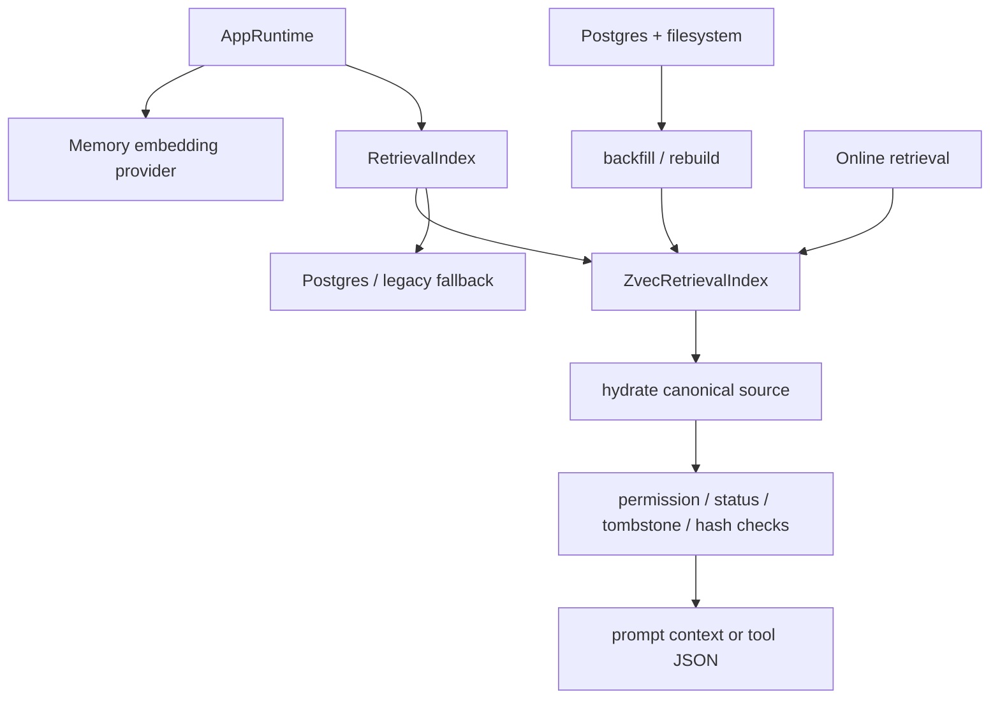

# Zvec Retrieval Index

Updated: 2026-06-25

This is the canonical guide for Focus Agent retrieval indexing. PostgreSQL and
the filesystem remain the canonical stores. Zvec is a rebuildable, embedded
retrieval index used for memory search, artifact RAG, Skill semantic matching,
trajectory reuse, branch context, Agent Team plan reuse, failure recovery,
governance feedback, and workspace semantic search.

## Runtime Model



Rules:

- Zvec never owns canonical data.
- Every online hit must be hydrated from PostgreSQL or the current filesystem
  before it can enter prompt context or tool output.
- Stale Zvec documents are expected and harmless; rebuild/backfill can recreate
  the index from canonical stores.
- Online failures fall back to PostgreSQL, legacy scorers, or an empty shadow
  signal depending on the feature.
- API, SDK, and Web surfaces do not expose raw embeddings or vectors.

## Configuration

Default local config:

```env
AGENT_RETRIEVAL_BACKEND=zvec
AGENT_RETRIEVAL_FALLBACK_BACKEND=postgres
AGENT_ZVEC_ENABLED=true
AGENT_ZVEC_DATA_DIR=.focus_agent/zvec
```

Embedding settings still control vector dimensions and provider selection:

```env
AGENT_MEMORY_EMBEDDING_ENABLED=true
AGENT_MEMORY_EMBEDDING_BACKEND=auto
AGENT_MEMORY_EMBEDDING_MODEL=embeddinggemma
AGENT_MEMORY_EMBEDDING_DIMENSIONS=768
```

`pgvector` settings are compatibility and fallback settings. They do not replace
Zvec as the default retrieval backend.

## Collections

| Collection | Source | Purpose |
| --- | --- | --- |
| `focus_memory` | `focus_memories` | durable memory semantic retrieval and `memory_search` |
| `focus_artifact_chunks` | artifact metadata + artifact body store | artifact chunk RAG via `artifact_search` |
| `focus_skills` | Skill registry | semantic Skill matching with token scorer fallback |
| `focus_trajectory` | trajectory recorder | similar turns and tool-observation reuse |
| `focus_branch_context` | branch decision events | pre-turn branch recommendation shadow signal |
| `focus_agent_team_plans` | Agent Team sessions/tasks/outputs | similar plan context refs during planning |
| `focus_failure_cases` | failed/error trajectory turns | recovery case lookup |
| `focus_governance_feedback` | context evidence, Skill feedback, feedback events | shadow rerank/quality evidence |
| `focus_workspace_chunks` | current workspace filesystem | semantic code/docs search via `workspace_search` |

## Online Surfaces

- `memory_search` uses the shared retrieval index when an embedding provider is
  injected; PostgreSQL memory remains canonical and tombstone checks still win.
- `artifact_search` searches indexed artifact chunks and returns artifact id,
  chunk text, score, and metadata.
- Skill selection indexes installed Skill descriptions and falls back to the
  existing token scorer.
- Trajectory retrieval indexes turn and step summaries. Failed/error turns also
  enter `focus_failure_cases`.
- Branch recommendation records `zvec_branch_context` as a weight-zero shadow
  signal. It does not change branch action selection.
- Agent Team planning records similar plans as `agent_team_plan_reuse` shadow
  `context_refs`. It does not change task count, roles, or dependencies.
- Governance feedback indexing is best-effort after context evidence, Skill
  selection, and feedback writes.
- `workspace_search` is read-only and restricted to `workspace_root`; it skips
  `.git`, virtualenvs, caches, binaries, and large files.

## Operations CLI

Use `focus-agent-retrieval-index` for the embedded retrieval index:

```bash
focus-agent-retrieval-index doctor
focus-agent-retrieval-index stats
focus-agent-retrieval-index rebuild
focus-agent-retrieval-index backfill --target all --limit 1000
```

Supported backfill targets:

```text
memory artifact skill trajectory branch-context agent-team-plans
failure-cases governance-feedback workspace
```

`rebuild` is intentionally non-destructive. To rebuild Zvec, stop writers,
remove `AGENT_ZVEC_DATA_DIR`, start the app, and run backfill. Keep
`focus-agent-memory-embedding` for PostgreSQL memory embedding diagnostics and
pgvector compatibility work only.

## Deployment Notes

- v1 assumes one writer per Zvec data dir.
- Multi-replica deployments should either run a single indexing worker or use
  per-replica local indexes rebuilt from PostgreSQL/filesystem canonical data.
- Shared Zvec data dirs across concurrent writers are not supported.
- `retrieval_zvec` readiness reports embedded index availability. A degraded
  Zvec check should not imply canonical memory/artifact data loss.

## Validation

Focused checks:

```bash
uv run pytest tests/test_retrieval_index.py tests/test_retrieval_expansion.py
uv run pytest tests/test_memory_retriever.py tests/test_skill_registry.py
uv run pytest tests/test_default_tools.py
```

Broad checks:

```bash
uv run ruff check .
uv run pytest -q
```
