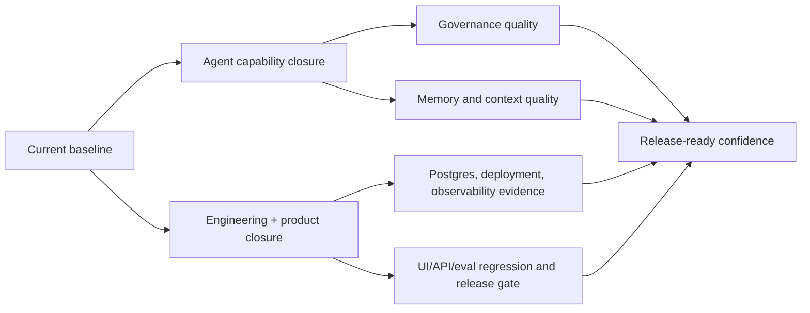

# Focus Agent 当前路线图

更新时间：2026-04-26

这份文档只回答两个问题：

1. 现在仓库已经完成到了哪一步。
2. 下一阶段还应该优先收口什么。

## 1. 当前基线

截至 2026-04-26，以下能力已经应视为默认基线，而不是待启动事项：

- `apps/web` React Web App 已接管 `/app` 主入口，FastAPI 负责托管构建产物，并可在开发模式下跳转到 Vite dev server
- `frontend-sdk` 已覆盖 conversation、branch tree、branch action、merge review、agent governance、observability 等核心 typed client 能力
- merged branch 在前后端都被视为只读，合并后不能继续追加 turn 或继续 fork
- 当前上下文窗口已经独立于累计 `token_usage`：发送栏展示 `context_usage`，支持草稿预览、手动压缩、发送前自动压缩和回合后后台压缩，默认预算为 128k
- 第一轮工程化加固已落地：CORS、限流、请求 ID、统一错误信封、前端 bundle 分割
- 本机启动链已统一到 `make api` / `make dev` / `make serve-dev` / `make serve-prod`，在 `DATABASE_URI` 未显式设置时会自动管理 repo-local PostgreSQL
- Docker 部署已分层：`compose.yaml` 用于本地 Docker 联调（`focus-agent + postgres`），`compose.prod.yaml` 用于生产/预发模板（外部 PostgreSQL）
- Agent 主路径已具备评测框架、Plan-Act-Reflect、记忆读写闭环、上下文预算与 Context Engineering v2、工具运行时并行/缓存/降级/参数校验/取消超时/side-effect 串行策略、role/memory/tool/delegation/task-ledger 治理、Postgres trajectory 写入、request/trace correlation、release evidence / release-health 门禁，以及按职责拆分的 Web observability overview / trajectory workbench

这意味着接下来不再把“前端接管”“基础 Docker 路径”“记忆闭环接图”“Plan-Act-Reflect 起步版”当成主任务，而是围绕这些基线继续收口质量、运维和产品语义。

## 2. 两条主线

### 2.1 工程与产品主线

近期重点按优先级收敛为四组：

1. **核心语义收口**
   - merge review / conclusion policy 继续做一致性和审计补强
   - README、SDK 类型、前端文案、服务端 contract 持续对齐
2. **存储与运维收口**
   - Postgres 主持久化已覆盖 conversation / branch / checkpoint / store 的主读写路径；trajectory 查询、导出、review console 已落地，迁移验证报告已可接入 release-health，下一步重点是把报告绑定到真实 CI/CD 和长期运维演练
   - 本机启动、本地 Docker、生产模板三条路径保持边界清晰
3. **生产化治理**
   - Auth / Access Model 继续完善外部登录和令牌分发体验
   - Ownership audit 已有 allow/deny 聚合与 dashboard export；readiness / metrics 运行态接口已补齐，并且 executable alert report 可作为 release-health 阻断信号
4. **回归与发布**
   - UI smoke、API smoke、eval 回归样本继续扩充；release gate 已覆盖 memory/context eval、release-health、本地 dry-run 与 production evidence pack 输入
   - 发布文档、迁移文档、运维清单保持可执行，下一步把 evidence pack 的 storage / approval 绑定到真实 CI 平台

### 2.2 Agent 能力主线

Agent 侧当前不再是从零设计，而是进入“已落地基础之上的二次收口”。

当前优先级从高到低建议为：

| 模块 | 当前状态 | 主要入口 | 下一步重点 |
|------|----------|----------|------------|
| Plan-Act-Reflect | 已落地并默认开启 | `src/focus_agent/engine/graph_builder.py` | 优化 replan 质量、接模型角色分工 |
| Memory | 读写闭环、Memory Curator 分支提升保护、candidate review/promotion、regression trend report 已接入 | `src/focus_agent/memory/` `scripts/memory_context_eval.py` `/app/agent/governance` | 继续扩 golden cases，把真实失败样本稳定接入 nightly |
| Context Engineering | v2 已接入长上下文压缩决策、artifact refs、角色上下文视图与治理台预览；当前线程 `context_usage` 与非破坏式 compaction 已进入 ChatService / Web composer；compaction semantic quality / drift 已进入 report | `src/focus_agent/core/context_policy.py` `src/focus_agent/context_usage.py` `src/focus_agent/agent_context_engineering.py` `scripts/memory_context_eval.py` `/app/agent/governance` `/app` | tokenizer 精算、artifact 生命周期治理、真实线上摘要漂移样本沉淀 |
| Tool Runtime | 并行/缓存/降级、参数校验失败短路、取消/超时不走 fallback、side-effect 串行边界已落地 | `src/focus_agent/capabilities/tool_runtime.py` | 增加更多 validator 覆盖和真实高风险工具策略样本 |
| Eval / Regression | 已有 `tests/eval/` 基线，支持 baseline 对比、trajectory replay/promotion、memory/context trend 与 contract drift 检查 | `tests/eval/` `scripts/check_contracts.py` `scripts/memory_context_eval.py` | 扩 golden cases、补失败 trajectory 回放样本、接入 nightly 趋势报表 |
| Observability | trajectory 写入、request/trace correlation、查询/导出 CLI、单条 replay/promotion、批量 promote-preview/replay-compare、`/readyz`、`/metrics`、overview route、三栏 trajectory workbench、`timeline` / `zero_step` / `missing_detail` 证据态、executable alert report、release-health 发布阻断信号，以及浏览器 smoke 发布口径已落地 | `src/focus_agent/observability/trajectory.py` `src/focus_agent/observability/tracing.py` `src/focus_agent/observability/release_health.py` `apps/web/src/pages/observability/trajectory-page.tsx` | OpenTelemetry 部署联通、告警落盘、长时浏览器回归 |
| Agent Governance | role routing、Memory Curator、Tool Router、Delegation Runtime、Model Router、Self Repair、Review Queue、Task Ledger、Delegated Artifact Synthesis、observe-first autonomy 契约与 eval gate 已补 | [agent-role-routing.md](agent-role-routing.md) `tests/eval/datasets/agent_delegation.jsonl` `tests/eval/datasets/agent_task_ledger.jsonl` `/app/agent/governance` | 继续提升真实子任务执行质量、成本画像、critic gate 质量和人工 review 队列体验 |
| Autonomy | 技能自选、分支建议、风险感知式工作流已采用 observe-first 边界 | `/app/agent/governance` [agent-role-routing.md](agent-role-routing.md) | 接入更多证据源和人工确认工作流，不默认自动执行高风险动作 |

## 3. 当前进展判断

### 已完成并进入维护期

- 前端主入口切换与 `/app` 托管
- 基础分支能力与 merged-branch 只读约束
- 第一轮安全与工程化加固
- repo-local PostgreSQL 启动链
- 本地 Docker / 生产模板分层
- Plan-Act-Reflect
- 记忆读写闭环第一版
- 上下文预算与工具观察裁剪一期
- 当前上下文窗口计量、发送栏 Context Meter、手动压缩、发送前和回合后自动压缩
- 工具运行时并行/缓存/降级基础
- 工具运行时参数校验失败短路、取消/超时不走 fallback、side-effect 串行边界
- Postgres trajectory 落库
- request id / trace id / root span id correlation 写入 trajectory 并支持 API 过滤
- trajectory 查询/导出 CLI 与 replay/promote 闭环
- `/readyz` runtime readiness 与 `/metrics` Prometheus 文本指标
- 基于 `/metrics` 的 runtime readiness、component readiness、trajectory availability、失败率、延迟和 fallback 告警建议
- `/v1/observability/overview` 与 `/app/observability/overview` 的问题发现入口
- `/app/observability/trajectory` 三栏复盘工作台、右栏常驻动作区与零步骤/缺详情证据态
- trajectory Web review workbench 与前端 SDK/API contract
- observability regression gate 口径：`make lint`、`make ci-test`、SDK/Web 检查、`python scripts/observability_ui_smoke.py --scenario all`、`pnpm --dir apps/web smoke:observability`、eval smoke/baseline 回归
- Agent governance console、Context Engineering v2、Delegation Runtime、Task Ledger、Artifact Synthesis、Critic Gate 及对应 eval gate
- release evidence / release-health：production evidence pack、approval、artifact storage、retention、alert report、Postgres migration report、baseline eval report、storage verification
- Memory / Context regression dashboard：candidate / reviewed / promoted / golden trend、promotion history、污染告警、compaction semantic quality / drift
- Ownership Audit Dashboard：allow / deny 聚合、deny reason、resource/action/principal 维度统计、deny trend export
- SDK / E2E drift guard：frontend SDK barrel exports 与 Web App `@focus-agent/web-sdk` import surface contract snapshot
- P27-P35 运维闭环首轮：GitHub Actions release gate、nightly regression workflow、production smoke、Postgres ops report、OTel smoke report、Agent governance quality report
- P0-P3 多 Agent 工程治理已落地：非开发环境安全 fail-fast、API router 拆分、default tools 按域拆分、发布门禁固化、`AgentState` 分域 helper、`BranchService` facade 内部解耦

### 正在继续收口

- Postgres 运维链：迁移验证与 ops report 已能阻断 release-health，继续补真实 `pg_dump` / `pg_restore` round-trip、RPO/RTO 和长期保留策略
- observability 治理体验：告警报告和 OTel smoke report 已能阻断发布，继续把真实告警系统、collector round-trip 和长时浏览器回归接入 nightly
- Auth / Access Model：生产安全启动基线已强制检查 `AUTH_ENABLED`、JWT secret、JWT issuer、token TTL、demo token 与 rate limit；JWT issuer/audience/TTL/rotation 文档和 expired/wrong issuer/wrong audience/missing audience 回归已补齐，`tenant_id` / `scope` 仍不能绕过 ownership
- 文档与 contract 对齐：README、SDK、Web UI 文案、部署说明、CI artifact/approval 示例
- eval 数据集扩充与 nightly 回归报表覆盖面
- branch / merge / memory 之间的语义一致性

### 后续仍需真实环境落地

- 真实 CI provider 深化：当前已有 GitHub Actions / Buildkite 示例、artifact retention、approval job 和 release evidence 上传；后续接企业实际部署平台变量与审批记录
- nightly regression ops 深化：当前已有 `reports/nightly/latest.json` 与 GitHub scheduled workflow；后续接真实 trajectory replay、alert report 和历史 trend storage
- production E2E / load smoke 深化：当前已有 API/SDK/Web/graph/security/rate-limit 分类 smoke report；后续接 typed SDK stream、真实 graph turn 和轻量压测阈值
- Auth token lifecycle 后续只剩真实外部登录/签发方接入：当前服务端仍是单 HS256 secret 校验，rotation 依赖短 TTL、签发方灰度和服务端 secret 同步切换

## 4. 下一阶段重点

未来一段时间建议优先做下面五件事：

1. 把 GitHub Actions / Buildkite 示例接到实际部署平台变量、真实审批记录和长期 artifact storage。
2. 把 nightly report 接到历史 trend storage，补真实 trajectory replay、alert report 和长时浏览器回归。
3. 扩 memory / eval / UI smoke 的真实失败样本，确保已落地的 agent 基线不会回退。
4. 将 production smoke 从轻量 HTTP 分类探针升级为 typed SDK stream、真实 graph turn 和 rate-limit 阈值报告。
5. 将 Auth token lifecycle 从内部 HS256 验证推进到真实外部登录、签发、刷新和 rotation 运维演练。

### Agent 主路径验证口径

每次动到 Agent 主路径，至少关注下面几类回归：

- `tests/eval/test_plan_act_reflect.py`
- `tests/eval/test_context_budget.py`
- `tests/test_memory_pipeline.py`
- `tests/test_tool_runtime.py`
- `tests/test_trajectory_observability.py`
- `tests/test_trajectory_cli.py`
- `tests/test_eval_framework.py`
- `tests/test_runtime_backend_selection.py`

如果改动影响运行主链，再补一轮：

- `make ci-test`
- `uv run python -m tests.eval --suite smoke --concurrency 1`
- `uv run python -m tests.eval --suite agent_arch --concurrency 1`
- `uv run python -m tests.eval --suite agent_governance --concurrency 1`
- `uv run python -m tests.eval --suite agent_delegation --concurrency 1`
- `uv run python -m tests.eval --suite agent_context --concurrency 1`
- `uv run python -m tests.eval --suite agent_task_ledger --concurrency 1`

如果改动影响 observability 或发布门禁，再补一轮：

- `uv run python scripts/observability_ui_smoke.py --scenario all`
- `pnpm --dir apps/web smoke:observability`
- `uv run python -m tests.eval --suite observability --concurrency 1`
- `uv run python -m tests.eval replay --from /tmp/focus-agent-failed.jsonl --trajectory-input --failed-only --copy-tool-trajectory --run`

## 5. 文档分工

- [architecture.md](architecture.md)：描述整体架构、核心链路、持久化边界和跨模块验证口径
- [docker-deployment.md](docker-deployment.md)：描述本机启动、本地 Docker、生产模板和迁移方式
- 本文：保留统一的路线图视角，只维护“现状 + 下一步”

## 6. 维护原则

- `docs/` 中同一主题只保留一个当前入口文档
- 阶段性拆解和执行细节放到 issue、PR 或项目管理工具里，不长期堆在路线图里
- 当架构现状变化时优先更新 `architecture.md` / `docker-deployment.md`
- 当优先级变化时优先更新本文，而不是再新增一份平行 roadmap
