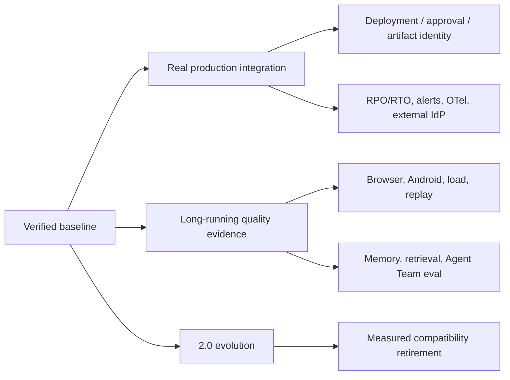

# Focus Agent 当前路线图

更新时间：2026-07-12

这份文档只回答两个问题：

1. 现在仓库已经完成到了哪一步。
2. 已验证基线之外，还存在哪些真实风险和下一阶段工作。

专题设计、操作命令和验收细节由 [文档索引](README.md) 指向各 canonical
文档；本文不重复维护平行实施清单。

```mermaid
flowchart LR
    Baseline["Verified baseline"] --> Production["Real production integration"]
    Baseline --> Quality["Long-running quality evidence"]
    Baseline --> Evolution["2.0 evolution"]
    Production --> Identity["Deployment / approval / artifact identity"]
    Production --> Operations["RPO/RTO, alerts, OTel, external IdP"]
    Quality --> Runtime["Browser, Android, load, replay"]
    Quality --> Agent["Memory, retrieval, Agent Team eval"]
    Evolution --> Compat["Measured compatibility retirement"]
```

## 1. 当前基线

截至 2026-07-12，以下能力已经进入维护和回归阶段，不再列为未来建设项。

### 1.1 产品与 Agent 主路径

- React Web App、typed frontend SDK、branch tree、Branch Action、merge review、
  context compaction、Productivity、Admin、Observability、Agent Governance 和
  Agent Team Mission Runner 已形成可运行产品面。
- merged branch 只读、用户确认后才执行的 branch recommendation、thread
  resolution、owner-scoped 数据访问和 audit 语义已有 contract 与回归保护。
- Plan-Act-Reflect、tool runtime、Memory v2、Context Engineering、Zvec
  retrieval、trajectory replay/promotion、governance feedback 和 eval 基线已
  接入主路径；Zvec 仍是可重建索引，命中必须回查 canonical source。
- memory forget/tombstone 与 embedding worker 已使用条件更新保护，不允许
  forgotten/deleted memory 被异步任务复活。

### 1.2 持久化与迁移

- Docker 部署已分层：`compose.yaml` 提供 app + Postgres 的本地 Docker 联调，
  `compose.prod.yaml` 要求外部 PostgreSQL 和生产安全配置；sandbox execution
  image 与应用镜像保持独立。
- 维护中的 `make api` / `make dev` / `make serve*` 在未显式设置
  `DATABASE_URI` 时继续托管 repo-local PostgreSQL。
- 直接运行 API 且没有 `DATABASE_URI` 时，不再退回纯 InMemory app-state：
  branch、conversation、thread access、user 和 productivity 共用本地 SQLite；
  LangGraph checkpoint/store 也默认使用 SQLite 并可跨重启恢复。
- local-state migration 同时支持 canonical SQLite 和 legacy pickle。未知或歧义
  格式、活动 WAL sidecar、pickle owner/HMAC 不匹配会 fail closed；导入
  PostgreSQL 时以事务和 owner guard 防止跨 owner 重绑定。
- PostgreSQL 仍是生产 canonical store；本地 SQLite fallback 不替代生产迁移、
  backup/restore 和高可用设计。

### 1.3 安全边界

- Cookie-authenticated `POST` / `PUT` / `PATCH` / `DELETE` 校验
  Fetch Metadata / Origin / Referer 同源；非开发环境缺少这些元数据时才要求
  `X-CSRF-Token` + `focus_agent_csrf` double-submit。有效 Bearer 请求不走该
  Cookie 防护路径。
- 非开发环境要求 Secure Cookie，SameSite 仅允许 `lax` 或 `strict`。每个
  protected request 都会确认用户仍 active；禁用用户会立即失去访问并撤销其
  refresh sessions。
- governance trajectory 默认 owner-scoped；全局读取要求
  `governance:read:global` 或 `governance:trajectories:read:global`。
- `web_fetch` 对解析结果做 SSRF 校验，并通过固定 IP transport 保持 Host/SNI，
  防止校验后的 DNS rebinding。

### 1.4 Release、浏览器和 Android

- production evidence manifest 已升级为 schema v2。commit SHA 必须 resolve 且
  等于 HEAD；deployment ID/version 必填；environment 必须为 production；输入
  JSON 必须带完整 `release_binding` 和带时区时间戳，默认 freshness 窗口为
  21600 秒。
- production 报告通过 `RELEASE_COMMIT_SHA`、`RELEASE_DEPLOYMENT_ID`、
  `RELEASE_DEPLOYMENT_VERSION`、`RELEASE_ENVIRONMENT` 做内生 identity
  attestation；缺失部分 identity 时在写盘前阻断。
- `.github/workflows/browser-smoke.yml` 使用真实 Chrome 执行 chat、
  branch/review 和 observability 交互，不再只依赖 source smoke。
- Android CI 已执行 debug sync/build/lint/unit test。原生 HTTP 限制为 4 个
  worker、4 个排队任务、最多 8 个 active call 和 2 MiB UTF-8 response，并
  支持 cancel/shutdown；cold/hot deep link 单次消费，Capacitor bridge logging
  关闭，provider key 保持在 native secure storage。

### 1.5 Stream 与工程治理

- memory stream bridge 在 run 结束后保留可配置 replay 窗口，随后回收 stream、
  counter 和 cleanup task；shutdown 会取消 timer 并唤醒订阅者。
- frontend SDK 在 reconnect 之间按 event ID 去重；EOF 前没有 terminal event
  时抛出 `FocusAgentIncompleteStreamError`，不再把不完整流当作成功。
- architecture gate 对非生成文件执行 800 行上限，当前
  [baseline](architecture-debt-baseline.json) 没有 grandfathered large file。
- compatibility gate 按稳定 item ID 而不是模糊计数管理库存。当前
  [baseline](compat-debt-baseline.json) 为 169 项；1.x public facade、旧路由和
  legacy reader 仍按兼容承诺保留，满足 telemetry、迁移说明和 2.0 exit
  criteria 前不得直接删除。

## 2. 剩余真实风险

| 风险域 | 当前已有基线 | 仍需完成 |
|---|---|---|
| 生产发布身份 | schema v2、identity/freshness binding、production environment guard | 对接企业真实 deployment/approval/artifact 系统，保证四个 `RELEASE_*` 值来自部署控制面而不是人工拼装 |
| PostgreSQL 运维 | migration/ops report、backup/restore evidence、transactional import | 在目标规模数据上演练 RPO/RTO、跨版本 restore、长期 retention 和故障切换 |
| Observability | `/readyz`、`/metrics`、OTel smoke、alert report、真实 Chrome observability smoke | 接真实 collector、trace backend、pager/alert 平台，并增加长时间窗口与多实例验证 |
| Auth lifecycle | active-user check、session revocation、HS256 active key set、Cookie CSRF | 接企业 IdP/JWKS、refresh/rotation runbook、跨服务 logout/revocation 和安全审计 |
| Agent 质量 | eval、nightly、trajectory replay、memory/retrieval/governance trends | 扩真实失败 golden cases、长期 trend storage、成本/延迟画像和多 Agent 结果质量门槛 |
| Web/stream 可靠性 | real Chrome workflow、reconnect dedupe、incomplete-stream error、bridge cleanup | 增加断网/恢复、代理超时、多实例 replay、长会话和轻量负载阈值 |
| Android 发布 | debug CI、native HTTP/deep-link hardening、instrumentation coverage | 增加 release signing pipeline、真实设备/Android 版本矩阵、弱网/后台恢复和商店发布检查 |
| 兼容债务 | 169 个 item-ID baseline 与逐类 exit criteria | 收集 import/route/state telemetry，停止新写入，提供迁移窗口，再在 2.0 中按项退场；不能用批量删除 facade 代替迁移 |

## 3. 下一阶段优先级

1. **绑定真实生产控制面。** 将 release identity、审批记录、制品 digest、部署
   版本和 evidence retention 接到同一个不可伪造的 deployment lifecycle。
2. **完成可恢复性演练。** 在接近生产规模的数据上执行 PostgreSQL
   backup/restore、local SQLite migration、RPO/RTO 和 rollback drills，并保存
   可审计结果。
3. **扩大长时真实交互验证。** 将 Chrome、typed SDK stream、Android
   emulator/device、断网重连和轻量 load 纳入定时回归，而不是只在短 smoke 中
   验证。
4. **接外部身份与观测平台。** 完成 IdP/JWKS、key rotation、collector、trace
   query 和 alert/pager 的真实环境闭环。
5. **用证据降低 Agent 与兼容风险。** 扩充失败 trajectory 和 golden cases；
   同时用 telemetry 驱动 169 项 compatibility inventory 的逐项退场，不在 1.x
   破坏已有 facade。

## 4. 验证与文档入口

- 全面验证：[validation-runbook.md](validation-runbook.md)
- 架构与持久化：[architecture.md](architecture.md)
- 本地启动与迁移：[quick-start.md](quick-start.md)
- 安全与账号：[auth-access.md](auth-access.md) / [../SECURITY.md](../SECURITY.md)
- SSE 与 SDK：[streaming-contract.md](streaming-contract.md) /
  [../frontend-sdk/README.md](../frontend-sdk/README.md)
- Android：[android.md](android.md)
- Production evidence：[release-checklist.md](release-checklist.md) /
  [ci/github-actions-release-gate.md](ci/github-actions-release-gate.md)

## 5. 维护原则

- 已完成并有回归保护的能力留在“当前基线”，不再反复写成未来计划。
- 未来项必须描述尚缺的真实环境、规模、时长或治理证据，不能只写“继续优化”。
- `docs/` 同一主题只保留一个 canonical 文档；阶段性拆解放到 issue、PR 或项目
  管理工具。
- 架构、兼容库存或优先级变化时，同步更新对应 baseline、canonical 文档和本文。
- 1.x public import surface 仍受支持；只有满足
  [compat baseline](compat-debt-baseline.json) 中的 2.0 exit criteria 后才进入
  移除计划。
