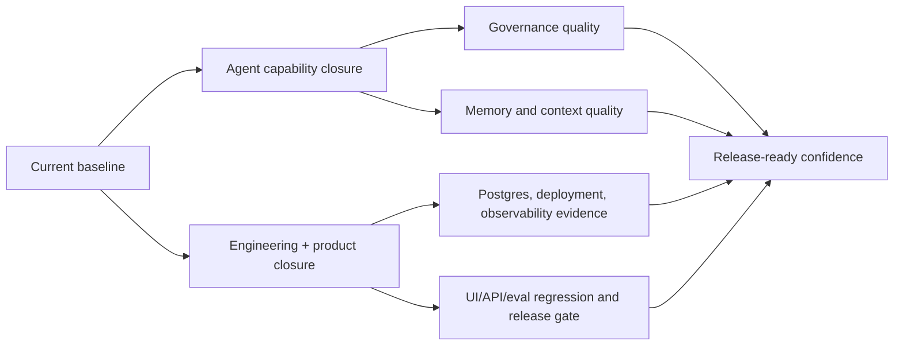

# Focus Agent 当前路线图

更新时间：2026-06-25

这份文档只回答两个问题：

1. 现在仓库已经完成到了哪一步。
2. 下一阶段还应该优先收口什么。

```mermaid
flowchart LR
    Baseline["Current baseline"] --> Product["Engineering + product closure"]
    Baseline --> Agent["Agent capability closure"]
    Product --> Ops["Postgres, deployment, observability evidence"]
    Product --> Regression["UI/API/eval regression and release gate"]
    Agent --> Governance["Governance quality"]
    Agent --> Memory["Memory and context quality"]
    Governance --> Release["Release-ready confidence"]
    Memory --> Release
    Ops --> Release
    Regression --> Release
```

## 1. 当前基线

截至 2026-06-25，以下能力已经应视为默认基线，而不是待启动事项：

- `apps/web` React Web App 已接管 `/app` 主入口，FastAPI 负责托管构建产物，并可在开发模式下跳转到 Vite dev server
- `frontend-sdk` 已覆盖 conversation、thread resolution、branch tree、branch action、merge review、Agent Team、Admin、productivity、agent governance、observability 等核心 typed client 能力
- merged branch 在前后端都被视为只读，合并后不能继续追加 turn 或继续 fork
- 聊天里的分支意图已通过 Branch Action 结构化收口：模型只能生成可确认 proposal，用户确认后才执行 fork/open/return，成功返回 navigation 并刷新分支树，失败回写 action error 与 audit event
- Branch Decision / Recommendation 已进入可验证基线：post-turn decision 可记录 split/conclude/merge-candidate 证据；pre-turn recommendation 可在 `suggest` 模式下生成用户确认的 child/sibling Branch Action，但不会静默 fork
- Thread resolution 已成为 branch/tree/cache 边界：root/child thread id 都可解析到 canonical root，child-only branch 操作会对 root id 返回明确诊断，分支树可从 child route 打开
- 生产力工作台已落地：owner-scoped notes/tasks/capture API、SDK、默认工具、Web 路由和 source-level smoke 均已接入
- 当前上下文窗口已经独立于累计 `token_usage`：发送栏展示 `context_usage`，支持草稿预览、手动压缩、发送前自动压缩和回合后后台压缩，默认预算为 128k
- Agent Team Mission Runner 已从 legacy dispatch 升级为目标驱动的动态 Mission DAG：支持 standalone session、可选来源对话、模型优先规划、fallback contract defaults、task retry/cancel、执行证据汇总、Cockpit UI 和 `final_answer` synthesis
- Agent Team Adoption / Governance Suite 已进入建设期：多 worktree 结果采纳、Notes/Tasks capture、Context/Memory evidence、Skill selection events、multi-agent coordination、Postgres-backed rate limit、branch decision events 和 feedback regression 统一进入 schema v17 与 nightly 证据链
- Agent Governance 反馈趋势已接入：`GET /v1/agent/feedback/trend` 和 SDK `getAgentFeedbackTrend()` 会聚合负反馈、merge review 成功/冲突、skill 低置信/override、context drift、Notes/Tasks capture 与失败 trajectory 样本，供 Web governance console 和 Android local runtime smoke 使用
- Zvec retrieval/RAG 已进入默认基线：`RetrievalIndex` 统一 memory、artifact chunk、Skill、trajectory 检索；branch context、Agent Team plan reuse、failure recovery、governance feedback 和 workspace semantic search 默认 shadow-first，所有命中都必须回查 Postgres 或文件系统 canonical source
- Admin Console 已落地：`/app/admin/config` 以设置中心方式管理连接、能力、Skill、工具、Agent 行为、安全/运行时和高级配置，`/app/admin/users` 管理用户、状态、角色、会话和密码，`/app/admin/audit-events` 浏览管理员审计事件；admin 权限来自持久化用户角色，不来自 token scope
- 第一轮工程化加固已落地：CORS、限流、请求 ID、统一错误信封、前端 bundle 分割
- 本机启动链已统一到 `make api` / `make dev` / `make serve-dev` / `make serve-prod`，在 `DATABASE_URI` 未显式设置时会自动管理 repo-local PostgreSQL
- Android target 已具备 App 内本地 Focus Agent runtime，`apps/web/src/android-local-runtime/` 已按 auth/conversation、thread/branch、agent governance、memory/observability、admin、model provider、stream、web search 和 workspace/tool execution 拆分，并由 `make frontend-android-runtime-smoke` 守护
- Docker 部署已分层：`compose.yaml` 用于本地 Docker 联调（`focus-agent + postgres`），`compose.prod.yaml` 用于生产/预发模板（外部 PostgreSQL）
- Agent 主路径已具备评测框架、Plan-Act-Reflect、记忆读写闭环、上下文预算与 Context Engineering v2、live-web 时间锚定/证据校验/一次修复边界、工具运行时并行/缓存/降级/参数校验/取消超时/side-effect 串行策略、role/memory/tool/delegation/task-ledger 治理、Postgres trajectory 写入、request/trace correlation、release evidence / release-health 门禁，以及按职责拆分的 Web observability overview / trajectory workbench
- 模型 provider 路径已收口到 TOML catalog：包内默认数据在 `src/focus_agent/defaults/models.toml`，本地/容器部署通过 `.focus_agent/models.toml` 或 `/data/models.toml` 覆盖，`/v1/models` 向 Web/SDK 暴露 provider label、logo metadata 和 thinking capability；MiMo V2.5 Pro 已作为内置 OpenAI-compatible provider/model 支持

这意味着接下来不再把“前端接管”“基础 Docker 路径”“记忆闭环接图”“Plan-Act-Reflect 起步版”当成主任务，而是围绕这些基线继续收口质量、运维和产品语义。

## 2. 两条主线

### 2.1 工程与产品主线

近期重点按优先级收敛为四组：

1. **核心语义收口**
   - merge review / conclusion policy 继续做一致性和审计补强
   - Branch Action 已修复“文本声称切换但页面未进入新分支”的断层；pre-turn recommendation 已接入 v2 harness stream/non-stream，后续重点是覆盖更多 open-existing / return-parent 语义、更友好的分支名展示和更多真实浏览器回归
   - README、SDK 类型、前端文案、服务端 contract 持续对齐
2. **存储与运维收口**
   - Postgres 主持久化已覆盖 conversation / branch / checkpoint / store 的主读写路径；trajectory 查询、导出、review console 已落地，迁移验证报告已可接入 release-health，下一步重点是把报告绑定到真实 CI/CD 和长期运维演练
   - 本机启动、本地 Docker、生产模板三条路径保持边界清晰
3. **生产化治理**
   - Auth / Access Model 已具备本地 demo、用户名密码、refresh session、管理员角色保护和 Admin Console；后续继续完善外部登录和令牌分发体验
   - Ownership audit 已有 allow/deny 聚合与 dashboard export；readiness / metrics 运行态接口已补齐，并且 executable alert report 可作为 release-health 阻断信号
4. **回归与发布**
   - UI smoke、API smoke、eval 回归样本继续扩充；release gate 已覆盖 memory/context eval、release-health、本地 dry-run 与 production evidence pack 输入
   - 发布文档、迁移文档、运维清单保持可执行，下一步把 evidence pack 的 storage / approval 绑定到真实 CI 平台

### 2.2 Agent 能力主线

Agent 侧当前不再是从零设计，而是进入“已落地基础之上的二次收口”。

当前优先级从高到低建议为：

| 模块 | 当前状态 | 主要入口 | 下一步重点 |
|------|----------|----------|------------|
| Plan-Act-Reflect | 已落地并默认开启；`graph_builder.py` 保持图注册 facade，plan/reflect、agent loop、memory、tool executor、repair/policy 已按 `graph_*` 模块拆分 | `src/focus_agent/engine/graph_builder.py` `src/focus_agent/engine/graph_plan_nodes.py` | 优化 replan 质量、接模型角色分工 |
| Memory | 读写闭环、Memory Curator 分支提升保护、candidate review/promotion、Zvec-first retrieval、regression trend report 已接入 | `src/focus_agent/memory/` [memory-system-v2.md](memory-system-v2.md) `scripts/memory_context_eval.py` `/app/agent/governance` | 继续扩 golden cases，把真实失败样本稳定接入 nightly |
| Retrieval / RAG | Zvec 作为默认可重建检索索引，覆盖 memory、artifact chunks、Skill、trajectory；branch/team/failure/governance/workspace 扩展项 shadow-first | [retrieval-zvec.md](retrieval-zvec.md) `src/focus_agent/retrieval/` `src/focus_agent/capabilities/default_tool_modules/` | 补长期 eval/benchmark、观测 fallback rate 和 hydrate failure、逐项把达标 shadow signal 切 Zvec-first |
| Context Engineering | v2 已接入长上下文压缩决策、artifact refs、角色上下文视图与治理台预览；当前线程 `context_usage` 与非破坏式 compaction 已进入 ChatService / Web composer；context assembly、budget guard、tool observation compaction 已从 `context_policy.py` facade 拆出 | `src/focus_agent/core/context_policy.py` `src/focus_agent/core/context_assembly.py` `src/focus_agent/context_usage.py` `src/focus_agent/agent_context_engineering.py` `scripts/memory_context_eval.py` `/app/agent/governance` `/app` | tokenizer 精算、artifact 生命周期治理、真实线上摘要漂移样本沉淀 |
| Tool Runtime | 并行/缓存/降级、参数校验失败短路、取消/超时不走 fallback、side-effect 串行边界已落地；runtime facade 下沉到 cache、execution、invocation、messages、parallel helpers | `src/focus_agent/capabilities/tool_runtime.py` `src/focus_agent/capabilities/tool_execution.py` | 增加更多 validator 覆盖和真实高风险工具策略样本 |
| Agent Team | 目标驱动 dynamic Mission DAG、standalone mission、任务契约、fallback contract defaults、bounded ready-task scheduler、Cockpit UI、final-answer synthesis、retry/cancel、merge bundle 和 Zvec shadow plan reuse 已落地；Workbench view-model 已按 focus / phase / decision / derived state helper 收口 | [agent-team-workbench.md](agent-team-workbench.md) `src/focus_agent/services/agent_team*.py` `apps/web/src/features/agent-team/` `apps/web/src/pages/agent-team/team-workbench-page.tsx` | 提升真实子任务执行质量、更多浏览器回归、接入更强执行隔离 |
| Eval / Regression | 已有 `tests/eval/` 基线，支持 baseline 对比、trajectory replay/promotion、memory/context trend、feedback regression 与 contract drift 检查 | `tests/eval/` `scripts/check_contracts.py` `scripts/memory_context_eval.py` `scripts/feedback_regression.py` | 扩 golden cases、补失败 trajectory 回放样本、接入长期 trend storage |
| Observability | trajectory 写入、request/trace correlation、查询/导出 CLI、单条 replay/promotion、批量 promote-preview/replay-compare、`/readyz`、`/metrics`、overview route、三栏 trajectory workbench、`timeline` / `zero_step` / `missing_detail` 证据态、executable alert report、release-health 发布阻断信号，以及浏览器 smoke 发布口径已落地；release health 已按 alerts/context/governance/otel/postgres/runtime/trajectory 模块拆分 | `src/focus_agent/observability/trajectory.py` `src/focus_agent/observability/tracing.py` `src/focus_agent/observability/release_health.py` `apps/web/src/pages/observability/trajectory-page.tsx` | OpenTelemetry 部署联通、告警落盘、长时浏览器回归 |
| Agent Governance | role routing、Memory Curator、Tool Router、Delegation Runtime、Model Router、Self Repair、Review Queue、Task Ledger、Delegated Artifact Synthesis、observe-first autonomy 契约与 eval gate 已补 | [agent-role-routing.md](agent-role-routing.md) `tests/eval/datasets/agent_delegation.jsonl` `tests/eval/datasets/agent_task_ledger.jsonl` `/app/agent/governance` | 继续提升真实子任务执行质量、成本画像、critic gate 质量和人工 review 队列体验 |
| Autonomy | 技能自选、分支决策/推荐、风险感知式工作流已采用 observe-first 或 user-confirmed 边界 | `/app/agent/governance` [agent-role-routing.md](agent-role-routing.md) [branch-decisions.md](branch-decisions.md) | 接入更多证据源和人工确认工作流，不默认自动执行高风险动作 |

## 3. 当前进展判断

### 已完成并进入维护期

- 前端主入口切换与 `/app` 托管
- 基础分支能力与 merged-branch 只读约束
- Branch Action：聊天分支意图的 proposal / confirm / execute / dismiss / failed / navigation / audit 闭环
- Branch Decision / Recommendation：post-turn decision 证据、pre-turn child/sibling recommendation、pending Branch Action 卡片、confirm/dismiss/retry/cancel 保护和 Postgres idempotency
- 第一轮安全与工程化加固
- repo-local PostgreSQL 启动链
- 本地 Docker / 生产模板分层
- Plan-Act-Reflect
- 记忆读写闭环第一版
- 上下文预算与工具观察裁剪一期
- 当前上下文窗口计量、发送栏 Context Meter、手动压缩、发送前和回合后自动压缩
- Agent Team dynamic planning、任务契约、Cockpit UI、final answer synthesis、task retry/cancel 和 contract snapshot
- Admin Console 用户目录、详情抽屉、状态/角色/会话/密码操作、审计事件列表和管理员路由保护
- 设置中心：模型连接、MCP 预留入口、工具配置、Skill 全局/单项启停、Agent 行为、安全运行和高级配置来源已按意图分区
- 工具运行时并行/缓存/降级基础
- 工具运行时参数校验失败短路、取消/超时不走 fallback、side-effect 串行边界
- Postgres trajectory 落库
- request id / trace id / root span id correlation 写入 trajectory 并支持 API 过滤
- trajectory 查询/导出 CLI 与 replay/promote 闭环
- `/readyz` runtime readiness 与 `/metrics` Prometheus 文本指标
- 基于 `/metrics` 的 runtime readiness、component readiness、trajectory availability、失败率、延迟和 fallback 告警建议
- `/v1/observability/overview` 与 `/app/observability/overview` 的问题发现入口
- `/app/observability/trajectory` 三栏复盘工作台、右栏常驻动作区与零步骤/缺详情证据态
- trajectory Web review workbench 与前端 SDK/API contract
- observability regression gate 口径：`make lint`、`make ci-test`、SDK/Web 检查、`python scripts/observability_ui_smoke.py --scenario all`、`pnpm --dir apps/web smoke:observability`、eval smoke/baseline 回归
- Agent governance console、Context Engineering v2、Delegation Runtime、Task Ledger、Artifact Synthesis、Critic Gate 及对应 eval gate
- Zvec Retrieval Index：默认 memory/artifact/Skill/trajectory 检索、`artifact_search`、`workspace_search`、backfill/doctor/stats CLI、readiness 和 shadow-first 扩展 collection
- release evidence / release-health：production evidence pack、approval、artifact storage、retention、alert report、Postgres migration report、baseline eval report、storage verification
- Memory / Context regression dashboard：candidate / reviewed / promoted / golden trend、promotion history、污染告警、compaction semantic quality / drift
- Ownership Audit Dashboard：allow / deny 聚合、deny reason、resource/action/principal 维度统计、deny trend export
- SDK / E2E drift guard：frontend SDK barrel exports 与 Web App `@focus-agent/web-sdk` import surface contract snapshot
- OpenAPI / generated SDK types drift guard：GitHub CI 会重新生成 `docs/api/openapi.json` 和 `frontend-sdk/src/types/__generated__.ts`；API route 或 response model 改动必须提交生成物并保持 `make sdk-openapi-types-check` 绿色
- 前端质量门禁已扩展为 `make frontend-qa`：full Web/SDK checks、style governance、Android local runtime smoke、bundle budget、architecture report 和 compatibility inventory 合并为宽口径前端验证链
- 运维闭环首轮已落地：GitHub Actions release gate、nightly regression workflow、production smoke、Postgres ops report、OTel smoke report、Agent governance quality report
- 多 Agent 工程治理已落地：非开发环境安全 fail-fast、API router 拆分、default tools 按域拆分、发布门禁固化、`AgentState` 分域 helper、`BranchService` facade 内部解耦
- 平台边界瘦身首轮已落地：README/architecture 定位改为平台化应用骨架，Agent Team view-model 拆成纯 selector helper，harness run 非流式生命周期 helper 化，release report I/O 样板收敛到 `scripts/_report_io.py`

### 正在继续收口

- Postgres 运维链：迁移验证与 ops report 已能阻断 release-health，backup / restore / restore verification / retention cleanup drill 已加入发布证据链，并让 production workflow 禁止用 dry-run ops report 替代真实证据；下一步绑定 RPO/RTO 和长期保留平台
- observability 治理体验：告警报告和 OTel smoke report 已能阻断发布，synthetic span export / collector health / trace query round-trip 已加入发布证据链，并让 production workflow 禁止用 dry-run OTel report 替代真实证据；下一步接真实告警系统和长时浏览器回归
- Auth / Access Model：生产安全启动基线已强制检查 `AUTH_ENABLED`、JWT secret/key set、JWT issuer、token TTL、demo token 与 rate limit；JWT 已支持 `kid`、active key set 和 rotation overlap，配置 key set 时 current `kid` 必须匹配 active key，`tenant_id` / `scope` 仍不能绕过 ownership；[auth-access.md](auth-access.md) 已收口登录、注册、账号自助和 token/session 边界，Admin Console 已把持久化用户角色、最后 active admin 保护、reasoned admin actions 和 audit events 纳入默认治理面
- 文档与 contract 对齐：README、SDK、Web UI 文案、部署说明、CI artifact/approval 示例、OpenAPI/generated SDK artifacts 和 frontend QA 口径
- eval 数据集扩充与 nightly 回归报表覆盖面
- branch / branch decision / merge / memory / retrieval shadow signal 之间的语义一致性

### 后续仍需真实环境落地

- 真实 CI provider 深化：当前已有 GitHub Actions / Buildkite 示例、deployment binding metadata、artifact retention、approval job 和 release evidence 上传；后续接企业实际部署平台变量、审批记录和制品留存系统
- nightly regression ops 深化：当前已有 `reports/nightly/latest.json`、`reports/nightly/feedback-regression.json`、GitHub scheduled workflow、history append 与 delta；后续接真实 trajectory replay、alert report、长时浏览器回归和长期 trend storage
- production E2E / load smoke 深化：当前已有 API/SDK/Web/graph/security/rate-limit 分类 smoke report，并补了 stream event contract、graph turn 与 rate-limit threshold；live 模式缺 stream input 或 graph auth 失败会阻断，后续接真实 typed SDK stream token 和轻量压测阈值
- Auth token lifecycle 后续重点转向真实外部登录/签发方接入：服务端已支持 HS256 single secret 与 active key set rotation，下一步接刷新、JWKS 拉取和签发方 rotation runbook

## 4. 下一阶段重点

未来一段时间建议优先做下面五件事：

1. 把 GitHub Actions / Buildkite 示例接到企业实际部署平台、审批记录和长期 artifact storage。
2. 把 nightly history / delta / feedback regression 接到长期 trend storage，补真实 trajectory replay、alert report 和长时浏览器回归。
3. 扩 memory / retrieval / eval / Agent Team / Admin UI smoke 的真实失败样本，确保已落地的 agent 和治理基线不会回退。
4. 将 production smoke v2 接到真实 typed SDK stream token、真实 graph turn 和轻量压测阈值报告。
5. 将 Auth token lifecycle 从 HS256 active key set 推进到真实外部登录、签发、刷新、JWKS 和 rotation 运维演练。

### Agent 主路径验证口径

每次动到 Agent 主路径，至少关注下面几类回归：

- `tests/eval/test_plan_act_reflect.py`
- `tests/eval/test_context_budget.py`
- `tests/test_memory_pipeline.py`
- `tests/test_tool_runtime.py`
- `tests/test_trajectory_observability.py`
- `tests/test_trajectory_cli.py`
- `tests/test_eval_framework.py`
- `tests/test_runtime_backend_selection.py`

如果改动影响运行主链，再补一轮：

- `make ci-test`
- `uv run python -m tests.eval --suite smoke --concurrency 1`
- `uv run python -m tests.eval --suite agent_arch --concurrency 1`
- `uv run python -m tests.eval --suite agent_governance --concurrency 1`
- `uv run python -m tests.eval --suite agent_delegation --concurrency 1`
- `uv run python -m tests.eval --suite agent_context --concurrency 1`
- `uv run python -m tests.eval --suite agent_task_ledger --concurrency 1`

如果改动影响 observability 或发布门禁，再补一轮：

- `uv run python scripts/observability_ui_smoke.py --scenario all`
- `pnpm --dir apps/web smoke:observability`
- `uv run python -m tests.eval --suite observability --concurrency 1`
- `uv run python -m tests.eval replay --from /tmp/focus-agent-failed.jsonl --trajectory-input --failed-only --copy-tool-trajectory --run`

## 5. 文档分工

- [architecture.md](architecture.md)：描述整体架构、平台维护边界、核心链路、持久化边界和跨模块验证口径
- [auth-access.md](auth-access.md)：描述登录、注册、账号自助、token/session、ownership 和生产鉴权边界
- [agent-team-workbench.md](agent-team-workbench.md)：描述 Agent Team Mission Runner、动态 DAG、Cockpit UI、任务契约和验收口径
- [admin-console.md](admin-console.md)：描述设置中心、能力管理、管理员用户、角色、会话、密码、审计事件和权限边界
- [branch-decisions.md](branch-decisions.md)：描述 branch decision event、发送前推荐、Branch Action 确认卡、配置、API/SDK 和验证口径
- [retrieval-zvec.md](retrieval-zvec.md)：描述 Zvec collection、canonical hydrate、安全边界、CLI、readiness 和多副本约束
- [docker-deployment.md](docker-deployment.md)：描述本机启动、本地 Docker、生产模板和迁移方式
- 本文：保留统一的路线图视角，只维护“现状 + 下一步”

## 6. 维护原则

- `docs/` 中同一主题只保留一个当前入口文档
- 阶段性拆解和执行细节放到 issue、PR 或项目管理工具里，不长期堆在路线图里
- 当架构现状变化时优先更新 `architecture.md` / `docker-deployment.md`
- 当优先级变化时优先更新本文，而不是再新增一份平行 roadmap
