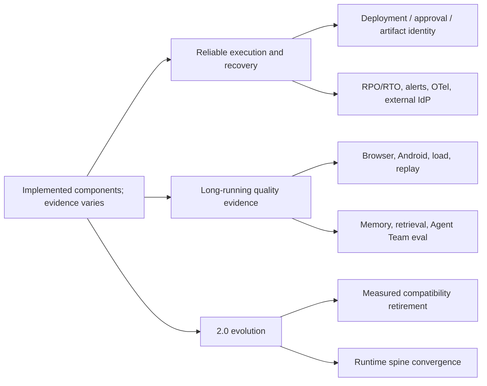

# Focus Agent 当前路线图

源码核对日期：2026-09-28；基线：`718be87`。本轮只更新文档，未完成下列功能修复或生产验收。

这份文档只回答两个问题：

1. 现在仓库已经完成到了哪一步。
2. 已有实现之外，还缺哪些调用接线、真实验证和下一阶段工作。

产品定位与体量见 [project-overview.md](project-overview.md)。
专题设计、操作命令和验收细节由 [文档索引](README.md) 指向各 canonical
文档。能力状态见 [能力地图](architecture/agent-capability-map.md)；新增能力的依据、设计和验收分别见
[调研](plans/2026-09-28-agent-capabilities/research.md)、[设计草案](plans/2026-09-28-agent-capabilities/design.md)、[实施规划](plans/2026-09-28-agent-capabilities/plan.md)。

```mermaid
flowchart LR
    Baseline["Implemented components; evidence varies"] --> Production["Reliable execution and recovery"]
    Baseline --> Quality["Long-running quality evidence"]
    Baseline --> Evolution["2.0 evolution"]
    Production --> Identity["Deployment / approval / artifact identity"]
    Production --> Operations["RPO/RTO, alerts, OTel, external IdP"]
    Quality --> Runtime["Browser, Android, load, replay"]
    Quality --> Agent["Memory, retrieval, Agent Team eval"]
    Evolution --> Compat["Measured compatibility retirement"]
    Evolution --> Spine["Runtime spine convergence"]
```

## 1. 当前基线

截至上述源码基线，以下模块和接口已存在，不应重复从零建设；默认启用、运行环境可用和端到端验收需分别核对。已有测试入口或历史通过记录不代表本轮重新验证。

### 1.1 产品与 Agent 主路径

- React Web App、typed frontend SDK、branch tree、Branch Action、merge review、
  context compaction、Productivity、Admin、Observability、Agent Governance 和
  Agent Team Mission Runner 已形成可运行产品面。
- 默认聊天入口为 V2 harness runs（`/v2/threads/.../runs[/stream]`），SSE
  contract 与 SDK reducer 受 contract / smoke 保护。
- merged branch 写入限制、用户确认的 branch recommendation、thread
  resolution、owner-scoped 数据访问和 audit 均有实现与相关检查；授权前状态回填和前端 audit-only 操作边界仍有待修问题，不能据此宣称全链路副作用隔离已完成。
- Plan-Act-Reflect、tool runtime、Memory v2、Context Engineering、Zvec
  retrieval、trajectory replay/promotion、governance feedback 和 eval 均有实现；部分受配置、后端依赖或手工流程限制，并非全部默认启用或自动闭环。Zvec 是可重建索引，命中必须回查 canonical source。
- memory forget/tombstone 与 embedding worker 已使用条件更新保护，不允许
  forgotten/deleted memory 被异步任务复活；schema v18 增加
  `embedding_status` 列。
- Agent Team v2 schema（Postgres **v19**）与 workbench/safeguards 已落地；
  **真实 v2 执行默认 feature flag 关闭**，灰度口径见
  [agent-team-v2-rollout.md](agent-team-v2-rollout.md)。

### 1.2 持久化与迁移

- Docker 部署已分层：`compose.yaml` 提供 app + Postgres 的本地 Docker 联调，
  `compose.prod.yaml` 要求外部 PostgreSQL 和生产安全配置；sandbox execution
  image 与应用镜像保持独立。
- 维护中的 `make api` / `make dev` / `make serve*` 在未显式设置
  `DATABASE_URI` 时继续托管 repo-local PostgreSQL。
- 直接运行 API 且没有 `DATABASE_URI` 时，不再退回纯 InMemory app-state：
  branch、conversation、thread access、user 和 productivity 共用本地 SQLite；
  LangGraph checkpoint/store 也默认使用 SQLite，可跨重启读取持久状态；这不等于普通 harness run 的 producer 自动恢复、follow-up 自动续跑或审批后自动执行。
- local-state migration 同时支持 canonical SQLite 和 legacy pickle。未知或歧义
  格式、活动 WAL sidecar、pickle owner/HMAC 不匹配会 fail closed；导入
  PostgreSQL 时以事务和 owner guard 防止跨 owner 重绑定。
- PostgreSQL 仍是生产 canonical store（app schema **v19**）；本地 SQLite
  fallback 不替代生产迁移、backup/restore 和高可用设计。

### 1.3 安全边界

- Cookie-authenticated `POST` / `PUT` / `PATCH` / `DELETE` 校验
  Fetch Metadata / Origin / Referer 同源；非开发环境缺少这些元数据时才要求
  `X-CSRF-Token` + `focus_agent_csrf` double-submit。有效 Bearer 请求不走该
  Cookie 防护路径。
- 非开发环境要求 Secure Cookie，SameSite 仅允许 `lax` 或 `strict`。每个
  protected request 都会确认用户仍 active；禁用用户会立即失去访问并撤销其
  refresh sessions。
- governance trajectory 默认 owner-scoped；全局读取要求
  `governance:read:global` 或 `governance:trajectories:read:global`。
- `web_fetch` 对解析结果做 SSRF 校验，并通过固定 IP transport 保持 Host/SNI，
  防止校验后的 DNS rebinding。

### 1.4 Release、浏览器和 Android

- production evidence manifest 已升级为 schema v2。commit SHA 必须 resolve 且
  等于 HEAD；deployment ID/version 必填；environment 必须为 production；输入
  JSON 必须带完整 `release_binding` 和带时区时间戳，默认 freshness 窗口为
  21600 秒。
- production 报告通过 `RELEASE_COMMIT_SHA`、`RELEASE_DEPLOYMENT_ID`、
  `RELEASE_DEPLOYMENT_VERSION`、`RELEASE_ENVIRONMENT` 做内生 identity
  attestation；缺失部分 identity 时在写盘前阻断。
- `.github/workflows/browser-smoke.yml` 使用真实 Chrome 执行 chat、
  branch/review 和 observability 交互，不再只依赖 source smoke。
- Android CI 已执行 debug sync/build/lint/unit test。原生 HTTP 限制为 4 个
  worker、4 个排队任务、最多 8 个 active call 和 2 MiB UTF-8 response，并
  支持 cancel/shutdown；cold/hot deep link 单次消费，Capacitor bridge logging
  关闭，provider key 保持在 native secure storage。

### 1.5 Stream 与工程治理

- memory stream bridge 在 run 结束后保留可配置 replay 窗口，随后回收 stream、
  counter 和 cleanup task；shutdown 会取消 timer 并唤醒订阅者。
- frontend SDK 在 reconnect 之间按 event ID 去重；EOF 前没有 terminal event
  时抛出 `FocusAgentIncompleteStreamError`，不再把不完整流当作成功。
- architecture gate 对非生成文件执行 800 行上限，当前
  [baseline](architecture-debt-baseline.json) 没有 grandfathered large file。
- compatibility gate 按稳定 item ID 而不是模糊计数管理库存。当前
  [baseline](compat-debt-baseline.json) 为 **169** 项；1.x public facade、旧路由和
  legacy reader 仍按兼容承诺保留，满足 telemetry、迁移说明和 2.0 exit
  criteria 前不得直接删除。

## 2. 剩余真实风险

| 风险域 | 当前已有基线 | 仍需完成 |
|---|---|---|
| 持久任务 | journal/checkpoint、v19 job/lease/receipt、后台执行组件 | 接通 run 启动恢复、持久 follow-up、审批续跑、请求去重与不确定副作用核对；详见规划 C01 |
| 可信验收 | live-web/Skill execution contract、evidence、eval judge | 修复初始状态回退造成的环境断言假阳性；补普通实施任务验收与真实用量/成本语义；C02/C04 |
| 外部操作与交付 | workspace/Git/web 文本工具、Skill、artifact 基础 | 一个受控浏览器或业务连接器场景、原生附件输入和授权成果交付；C03 |
| 多 Agent 闭环 | DAG、任务表、隔离执行、feature flags | 接通 revision 返工、实际预算与证据整合，再用单 Agent 对照证明收益；C05 |
| 记忆与反馈 | namespace/evidence/tombstone、trajectory/replay/promotion | 可撤销记忆修订，任务级反馈到候选和回归的关联；C06/C07 |
| 生产发布身份 | schema v2、identity/freshness binding、production environment guard | 对接企业真实 deployment/approval/artifact 系统，保证四个 `RELEASE_*` 值来自部署控制面而不是人工拼装 |
| PostgreSQL 运维 | migration/ops report、backup/restore evidence、transactional import、schema v19 | 在目标规模数据上演练 RPO/RTO、跨版本 restore、长期 retention 和故障切换 |
| Observability | `/readyz`、`/metrics`、OTel smoke、alert report、真实 Chrome observability smoke | 接真实 collector、trace backend、pager/alert 平台，并增加长时间窗口与多实例验证 |
| Auth lifecycle | active-user check、session revocation、HS256 active key set、Cookie CSRF | 接企业 IdP/JWKS、refresh/rotation runbook、跨服务 logout/revocation 和安全审计 |
| Agent 质量 | eval、nightly、trajectory replay、memory/retrieval/governance trends | 扩真实失败 golden cases、长期 trend storage、成本/延迟画像和多 Agent 结果质量门槛；用证据证明 branch 工作流的任务 ROI |
| Runtime 一致性 | contract tests、stream quarantine、architecture gate | 收敛 Chat / Harness / Agent Team / Android local-runtime 的共享 stream 与 tool 语义，降低并行路径漂移 |
| Web/stream 可靠性 | real Chrome workflow、reconnect dedupe、incomplete-stream error、bridge cleanup | 增加断网/恢复、代理超时、多实例 replay、长会话和轻量负载阈值 |
| Android 发布 | debug CI、native HTTP/deep-link hardening、instrumentation coverage | 增加 release signing pipeline、真实设备/Android 版本矩阵、弱网/后台恢复和商店发布检查 |
| 兼容债务 | 169 个 item-ID baseline 与逐类 exit criteria | 收集 import/route/state telemetry，停止新写入，提供迁移窗口，再在 2.0 中按项退场；不能用批量删除 facade 代替迁移 |
| 产品面裁剪 | monorepo 全量能力默认可见 | 提供更清晰的 thin-core / feature 剖面文档与构建开关，降低“只要分支能力”采用方的心智负担 |

## 3. 下一阶段优先级

1. **校准现状文档并建立实施依据。** 本轮仅做此项；计划中的功能不写成已完成。
2. **修复可靠性交付的前置问题。** 按规划 B01–B08 处理授权前写入、退出信号、readiness、eval 可信度、只读 UI/handoff、SDK 构建顺序和部署恢复证据。
3. **可靠完成一个任务。** 阶段 A 接通持久恢复、审批续跑、真实预算和代码任务验收；优先复用已有表与运行时。
4. **扩展一个真实操作场景。** 阶段 B 在浏览器验收与业务连接器中选择首个用例，同时补必要的输入/成果交付能力，不并行建设所有集成。
5. **形成可测量的长期改进。** 阶段 C 补针对性返工、记忆纠错和反馈回归；用相同任务与预算比较单/多 Agent，而不是默认增加角色。
6. **按部署需求推进生产集成。** 企业 IdP、collector/pager、release 控制面、RPO/RTO、Android 发布和兼容退场继续保留，但不取代 Agent 核心可靠性工作。需要真实账号、环境或数据规模时另行确认范围与证据。

## 4. 验证与文档入口

- 项目定位：[project-overview.md](project-overview.md)
- 全面验证：[validation-runbook.md](validation-runbook.md)
- 架构与持久化：[architecture.md](architecture.md)
- 本地启动与迁移：[quick-start.md](quick-start.md)
- 安全与账号：[auth-access.md](auth-access.md) / [../SECURITY.md](../SECURITY.md)
- SSE 与 SDK：[streaming-contract.md](streaming-contract.md) /
  [../frontend-sdk/README.md](../frontend-sdk/README.md)
- Agent Team：[agent-team-workbench.md](agent-team-workbench.md) /
  [agent-team-v2-rollout.md](agent-team-v2-rollout.md)
- Android：[android.md](android.md)
- Production evidence：[release-checklist.md](release-checklist.md) /
  [ci/github-actions-release-gate.md](ci/github-actions-release-gate.md)

## 5. 维护原则

- 已有实现留在“当前基线”，同时说明开关、接线和验证边界，不再重复从零建设。
- 未来项必须描述尚缺的执行行为或真实环境证据，并有具体验收，不能只写“继续优化”。
- `docs/` 同一主题只保留一个 canonical 文档；阶段性拆解放到 issue、PR 或项目
  管理工具；本轮明确请求的调研/设计/规划集中维护于带日期和状态的 `plans/` 子目录。
- 架构、兼容库存或优先级变化时，同步更新对应 baseline、canonical 文档和本文。
- schema 版本以代码 `SCHEMA_VERSION` 为准，变更时同步 architecture / overview。
- 1.x public import surface 仍受支持；只有满足
  [compat baseline](compat-debt-baseline.json) 中的 2.0 exit criteria 后才进入
  移除计划。
