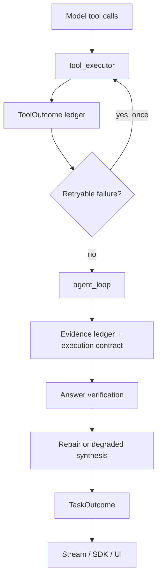

# Runtime Outcomes

更新时间：2026-06-18

Runtime Outcome is the graph-level source of truth for tool and task completion. It replaces answer paths that previously summarized raw tool metadata such as `run_id`, `command`, or `stdout_truncated` as the main assistant response.

## Model

`ToolOutcome` is emitted by the tool executor after tool messages are aggregated. Status values are fixed:

- `succeeded`
- `failed`
- `recovered`
- `blocked`
- `skipped`

Each record carries the tool call lineage: `tool_call_id`, `tool_name`, `attempt_index`, `max_attempts`, `retryable`, fallback metadata, recovery source, error category/message, evidence role, duration, and cache hit.

`TaskOutcome` is emitted by `agent_loop` only after evidence ledger, execution contract, answer verification, and repair/degraded synthesis complete. Status values are fixed:

- `answered`
- `degraded_answer`
- `blocked`
- `failed`

The task record captures `user_goal`, `policy`, `answer_basis`, `repair_action_taken`, `degradation_reason`, `evidence_count`, related `tool_outcome_ids`, and warnings.

## Runtime Flow



The graph, not stream consumers or UI reducers, decides whether a tool failed, recovered, blocked, or whether the task is answered/degraded/blocked. Stream, API, SDK, trajectory, and UI surfaces only transport and render these outcomes.

## Recovery Policy

- Retryable tool failures are retried at most once in the tool executor. The message history keeps the final tool result only; the outcome ledger records both failed and recovered attempts.
- Blocked, validation, approval-denied, duplicate, and side-effect tool results are not silently retried.
- Skill primary tool failures can be repaired through a graph repair pass or alternative evidence such as recommended supporting tools and web evidence.
- If evidence remains insufficient, the final answer must be a conservative degraded synthesis or an explicit blocked/failed reason.
- Financial answers may degrade, but they must name missing evidence and must not fabricate unconfirmed price or performance figures.

## Contract Surfaces

- `tool.result` and `tool.error` events include `runtime` and `tool_outcome`.
- `message.completed`, `run.completed.thread_state`, and `run.failed.thread_state` include `task_outcome`.
- Thread state includes `tool_outcomes` and `task_outcome`.
- Trajectory steps include `runtime.tool_outcome` and a top-level `tool_outcome`; turn summary/detail include `tool_outcomes` and `task_outcome`.
- Observability stats aggregate outcome counters such as tool failures, recovered tools, fallback uses, degraded answers, and blocked task outcomes.

## Validation

When changing runtime outcome behavior, run:

```bash
uv run ruff check src tests
uv run pytest tests/test_runtime_outcome.py tests/test_execution_contract.py tests/test_streaming.py tests/test_trajectory_observability.py tests/test_api_trajectory_observability.py tests/test_graph_builder.py -q
make sdk-openapi-types-check
pnpm --filter @focus-agent/web-sdk check
pnpm --filter @focus-agent/web-app check
pnpm --filter @focus-agent/web-app format:check
pnpm --filter @focus-agent/web-app lint
pnpm test:thread-stream-frontend-regressions
```

For browser validation, use a real tool/Skill failure scenario and confirm:

- failed attempts and recovered attempts are visible in the processing timeline and trajectory detail,
- the final answer does not expose raw tool metadata as the main answer,
- the Outcome panel shows the final task status and degradation reason when applicable,
- `/v1/threads/{thread_id}` and `/v1/observability/trajectory/{turn_id}` return matching outcome records.
