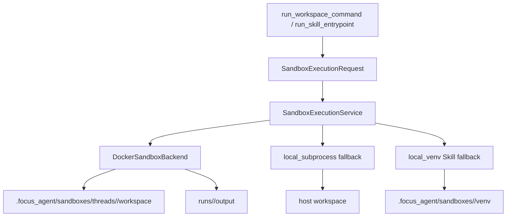

# Sandbox Execution

Updated: 2026-06-18

This document is the canonical reference for Focus Agent code execution. It covers
`run_workspace_command`, `run_skill_entrypoint`, Docker image preparation, local
fallback behavior, thread-level workspace lifecycle, and the verification matrix.

## Summary

Focus Agent routes code and command execution through `SandboxExecutionService`.
The service gives every execution request a structured contract and a visible
backend result:

- `sandbox_backend`: `docker`, `local_subprocess`, or `local_venv`
- `sandbox_id`: stable thread or branch sandbox identifier
- `run_id`: one command execution id for audit and output collection
- `workspace_mode`: normally `thread_persistent_copy`
- `fallback_used` / `fallback_reason`: explicit downgrade signal
- `network_policy` and `resource_limits`: effective execution policy

The desired security model is Docker-first. Local backends exist so development
and trusted local Skill workflows can still run when Docker is unavailable or the
sandbox image has not been built. A local fallback is never treated as equivalent
to a Docker sandbox.

## Execution Topology



`sandbox_id` is derived from the active `branch_id` when present, then
`thread_id`, then the single-run `run_id`. This keeps branch and thread
execution state separate while preserving a stable location for repeated tool
calls in the same thread.

## Workspace Lifecycle

Default mode is `thread_persistent_copy`:

- The real repository is mounted read-only into Docker as `/workspace_input`.
- The sandbox workspace lives at `.focus_agent/sandboxes/threads/<sandbox_id>/workspace`.
- Before each Docker run, the host workspace snapshot is refreshed into the sandbox workspace. This prevents Docker from running stale code after the real repository changes while still keeping sandbox-only outputs and cache directories separate.
- Command output is per run: `.focus_agent/sandboxes/threads/<sandbox_id>/runs/<run_id>/output`.
- Docker cache and dependency venvs live under the thread sandbox cache.
- Writes inside the sandbox do not automatically modify the real repository.

`copy_discard` is kept for compatibility with earlier run-level behavior. Host
editing still uses explicit patch/write tools; general command execution should
not directly mutate tracked files.

## Docker Backend

Docker execution uses the local image `focus-agent-sandbox:latest` by default.
The image is built from [../docker/sandbox.Dockerfile](../docker/sandbox.Dockerfile).

Prepare or check the image:

```bash
make sandbox-image
# or:
uv run python scripts/ensure_sandbox_image.py --image focus-agent-sandbox:latest
```

The image defaults to `node:20-bookworm-slim` instead of the larger devcontainer
base image. When a local mirror is more reliable, pass:

```bash
uv run python scripts/ensure_sandbox_image.py \
  --image focus-agent-sandbox:latest \
  --apt-mirror http://mirror.example/debian \
  --apt-security-mirror http://mirror.example/debian-security
```

The preflight script checks Docker server version and image presence before it
builds. Docker `18.09.0` is the minimum supported server version for the current
local backend target.

Docker runs use these defaults:

- `--network none` unless the Skill entrypoint declares network access
- non-root host uid/gid
- read-only container root filesystem
- memory limit from request metadata, defaulting to 1024 MB
- pids limit of 512
- no Docker socket, host home directory, SSH agent, or provider secrets mounted
- stdout/stderr truncation and output file enumeration in the structured result

The current implementation reuses thread-level workspace/cache, but starts a
fresh Docker container per command. Long-lived container reuse is a future
optimization; callers must rely on `sandbox_id` and `workspace_mode`, not
container identity.

## Local Fallbacks

There are two local fallback paths:

- `local_subprocess`: used by `run_workspace_command` when Docker is unavailable
  and fallback is allowed.
- `local_venv`: used by declared Skill entrypoints as a development fallback.

Both return structured output and always mark:

- `fallback_used: true`
- `workspace_mode: host`
- `network_policy: host`
- `fallback_reason` when Docker was the attempted primary backend
- `degraded_reason: local_host_execution`

These fallbacks are useful for local development and trusted Skill smoke tests,
but they are not a strong sandbox. They do not provide Docker-level filesystem,
network, or process isolation.

Fallback results may be used by the Agent as degraded evidence, but they must not
satisfy assertions that require secure Docker execution. In particular,
`run_skill_entrypoint` fallback payloads do not satisfy the strong Skill
execution contract; the Agent should report the degraded path or continue with
safe alternative evidence.

## Tool Integration

### `run_workspace_command`

`run_workspace_command` keeps the existing allowlist and approval behavior, then
sends the normalized argv into `SandboxExecutionService`.

It passes the current LangGraph `thread_id` and optional `branch_id`, so repeated
commands in the same thread share the same sandbox workspace. By default the
tool disables network access.

### `run_skill_entrypoint`

`run_skill_entrypoint(skill_id, entrypoint, arguments)` executes only declared
Skill entrypoints. The runner validates:

- skill trust and enablement
- entrypoint name exists in the Skill metadata
- script path stays inside the Skill directory
- unsafe dependency declarations are rejected
- declared `network`, `timeout_seconds`, `memory_mb`, and dependencies map into
  the sandbox request

Successful Docker entrypoint results satisfy the Skill execution contract.
Dependency errors, timeouts, non-zero exits, and local fallback results are
returned as observations, not silently counted as secure Docker success.

Project Skills are not trusted merely because they live under a scanned path.
The runner still checks the declared entrypoint, Skill enablement/trust metadata,
relative script path boundaries, and dependency declarations before execution.

## Multi-Agent Coordination

Agent Team planning attaches `sandbox:<root_thread_id>` resource claims to
execution, build, test, and code-modification tasks. The existing resource-lock
manager serializes conflicting tasks in the same Agent Team session. This keeps
parallel workers from writing the same persistent thread sandbox at the same
time.

During long task execution, Agent Team periodically heartbeats both the task
claim and acquired sandbox/resource locks. If enqueue or lease maintenance fails,
the task is moved back to a retryable pending state or marked with a clear
blocked/failed status instead of remaining orphaned in `queued`.

The current lock scope is per Agent Team session. It is not a global host-level
Docker capacity controller.

## Configuration

Important environment variables:

| Variable | Purpose |
| --- | --- |
| `FOCUS_AGENT_SANDBOX_BACKEND` | `auto`, `docker`, or `local` |
| `FOCUS_AGENT_SANDBOX_IMAGE` | Docker image tag, default `focus-agent-sandbox:latest` |
| `FOCUS_AGENT_SANDBOX_ALLOW_LOCAL_FALLBACK` | `1` allows dev fallback in `auto`; `0` fails closed |

`FOCUS_AGENT_SANDBOX_BACKEND=docker` disables local fallback. Use it when you
need to prove Docker execution is available.

## Verification

Focused sandbox checks:

```bash
uv run pytest tests/test_sandbox_image_cli.py tests/test_sandbox_execution.py -q
```

Tool and Skill integration checks:

```bash
uv run pytest \
  tests/test_default_tools.py \
  tests/test_skill_registry.py \
  tests/test_execution_contract.py \
  -q
```

Broader regression set used for the thread-level sandbox merge:

```bash
uv run pytest \
  tests/test_containerization_scaffold.py \
  tests/test_sandbox_image_cli.py \
  tests/test_sandbox_execution.py \
  tests/test_agent_team_planning_dag_contracts.py \
  tests/test_default_tools.py \
  tests/test_skill_registry.py \
  tests/test_execution_contract.py \
  tests/test_agent_team_multi_agent.py \
  -q
```

Real Docker smoke, when the image is already available:

```bash
FOCUS_AGENT_SANDBOX_BACKEND=docker \
uv run python scripts/ensure_sandbox_image.py --check-only --image focus-agent-sandbox:latest
```

If the image is missing, build it with `make sandbox-image` first. Do not treat
`local_subprocess` or `local_venv` smoke output as Docker security evidence.

## Troubleshooting

### `docker image is not available`

Run:

```bash
uv run python scripts/ensure_sandbox_image.py --image focus-agent-sandbox:latest
```

If your network cannot reliably pull the base image, use a mirror or pass
`--base-image` to point at a trusted internal image.

### Docker exists but execution falls back locally

Check `fallback_reason`, `sandbox_backend`, and `fallback_used` in the tool
result. Common causes are a missing image, Docker daemon unavailability, or
explicit `FOCUS_AGENT_SANDBOX_BACKEND=auto` with fallback enabled.

### A Skill script cannot run

Verify the Skill has a declared entrypoint and that the script path is relative
to the Skill directory. `python -c`, absolute host script paths, and undeclared
entrypoints are intentionally rejected.

### Workspace changes are not in git

Sandbox writes stay inside `.focus_agent/sandboxes/threads/<sandbox_id>/workspace`.
Use explicit repository edit tools for real tracked-file changes. Future
versions may add an approval-gated sync flow from sandbox outputs to the real
workspace.

## Known Gaps

- Docker containers are not long-lived yet; workspace/cache persistence is
  thread-level, container lifecycle is still per command.
- Local fallbacks are best-effort development paths, not strong isolation.
- Network control is Docker-level only in v1. Host-local fallback cannot provide
  reliable network isolation.
- Host-control skills, such as Docker management, should use dedicated broker
  tools instead of mounting host sockets into the general sandbox.
