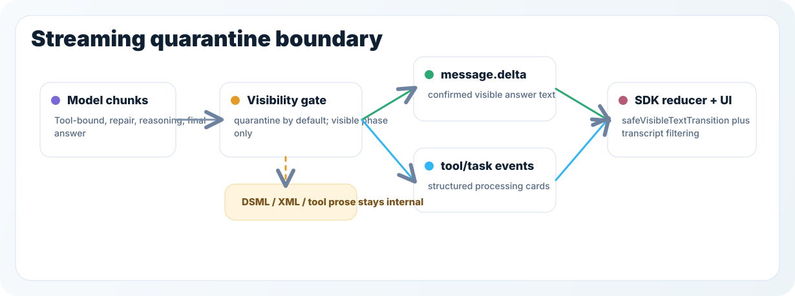

# Streaming Contract

更新时间：2026-06-18

This document is the canonical contract for Focus Agent streaming. It covers the server-side SSE event model, visible-text isolation, tool protocol quarantine, and the frontend SDK reducer boundary.



## 1. Stream Shape

Focus Agent uses authenticated POST requests that return Server-Sent Events:

```text
POST /v2/threads/{thread_id}/runs/stream
POST /v2/threads/{thread_id}/runs/resume/stream
POST /v2/runs/{run_id}/stream
```

Cancellation is JSON, not SSE:

```text
POST /v2/runs/{run_id}/cancel
POST /v2/threads/{thread_id}/runs/cancel
```

The thread-level cancel endpoint is for UI/client cleanup when the caller only
has the active thread context. It cancels active runs for that thread and is
exposed as `FocusAgentClient.cancelThreadHarnessRuns()`.

The public event names are stable. Do not introduce a new public event for internal stream visibility state.

```text
run.metadata
run.status
run.completed
run.failed
run.interrupt
run.rollback.started
run.rollback.succeeded
run.rollback.failed
run.closed
server_shutdown
heartbeat
state.update
message.delta
message.completed
reasoning.delta
tool.call.delta
tool.requested
tool.error
tool.result
task.update
```

Clients should treat `run.completed`, `run.failed`, `run.closed`,
`run.rollback.failed`, and
`server_shutdown` as terminal or reconnect-relevant turn signals. `heartbeat` is
transport liveness only. `server_shutdown` is emitted during graceful shutdown so
clients can stop reading the current stream and resume or reconnect according to
their own policy.

When pre-turn branch recommendation short-circuits a stream, the server may
publish `message.completed` with `source="branch_recommendation"` and then
`run.completed` with `thread_state`, `branch_action`, and an extra
`branch_decision` payload field. That path intentionally has no `message.delta`
chunks and does not invoke the normal graph turn. Clients should render the
returned pending Branch Action from the same reducer/state path used for
ordinary thread payloads.

## 2. Visible Text Boundary

`message.delta` and `message.completed` are the only events that may carry user-visible assistant answer text.

Server producers must enforce this rule:

- Model streams are `quarantine` by default.
- Only chunks explicitly marked with internal `stream_phase=visible` may become `message.delta`.
- Tool-bound model calls, repair calls, tool planning, and missing phase metadata stay quarantined.
- Internal graph nodes such as `plan` and `reflect` never publish `message.delta`.
- Tool calls continue to publish `tool.call.delta`, tool lifecycle events, `reasoning.delta`, `task.update`, and `state.update` while visible text is quarantined.
- `message.completed` prefers the final graph-state assistant answer. A dirty stream buffer must not overwrite a safe final answer.

The internal phase can be carried as `stream_phase` / `focus_agent_stream_phase` metadata or as `stream_phase:*` / `focus_agent_stream_phase:*` tags. These fields are internal only and must be stripped from public event metadata.

## 3. Tool Protocol Isolation

Real tool calls must use the model/tool-call interface and public tool events. DSML, XML-ish function-call text, bracket tool markers, bare tool references such as `websearch` / `webfetch`, and internal process narration are not valid visible assistant text.

Filtering is intentionally layered:

- Graph repair prompts try to convert textual tool-call artifacts into structured tool calls or tool-free final answers.
- The harness stream producer gates visible text by phase and filters textual artifacts from visible, reasoning, and completed content.
- The frontend SDK reducer applies `safeVisibleTextTransition()` as a defensive layer for replayed events, older servers, and split deltas.
- Web transcript filtering still protects historical messages that were persisted before the current contract.
- Chinese tool-deliberation fragments are treated as internal process text, including split prefixes such as `我因为` and visible-looking fragments that describe retrying or directly invoking web tools.

This layered filtering is not redundant. Each layer protects a different failure mode.

## 4. Tool And Processing Events

Tool activity should be rendered from structured events, not from assistant text:

- `tool.call.delta` carries streamed call arguments in `args_delta`; optional `id` / `tool_call_id` and `name` / `tool_name` are included when known.
- `tool.requested`, `tool.result`, and `tool.error` represent tool lifecycle state. `tool.result` / `tool.error` payloads carry `runtime` and graph-authored `tool_outcome` when available. If a custom payload lacks a call id, it is downgraded to `state.update`.
- `task.update` carries process-level progress and may be shown in processing cards.
- `state.update` is for raw state/debug panels and should not be rendered as assistant answer text.

`message.completed`, `run.completed`, and `run.failed` must carry graph-authored `task_outcome` when one is available. `run.failed` should include the latest sanitized `thread_state` whenever the thread is known, so the UI can render the non-empty failure state and avoid reusing an old assistant answer. `task_outcome` is canonical; `runtime_outcome` / `runtimeOutcome` are legacy compatibility fields only, and clients must prefer `task_outcome` when both are present. Clients should render these fields as status metadata and must not infer final task success from raw tool payload shape. The canonical outcome state machine is documented in [runtime-outcomes.md](runtime-outcomes.md).

The SDK reducer derives `processingSteps` from reasoning, tool call, tool lifecycle, and task events. New UI should use `processingSteps` as the canonical processing-card input. `toolCalls`, `toolEvents`, and `reasoningText` remain available as raw/debug/backcompat state.

Tool step identity is resolved in this order:

```text
tool_call_id or id
namespace + tool name
tool name
namespace
"tool"
```

Tool lifecycle status maps as:

```text
tool.requested -> pending
tool.call.delta -> running
tool.result -> completed
tool.error -> failed
```

When a tool fails and later recovers, reducers should preserve `toolOutcomeHistory` on the processing step. The UI may summarize the final state as completed, but the failed observation remains part of the current turn audit trail.

`task.update` only accepts `pending`, `running`, `completed`, and `failed`; unknown statuses are treated as `running`.

## 5. Validation

When stream behavior, tool protocol filtering, frontend SDK reducers, or processing cards change, run:

```bash
.venv/bin/pytest tests/test_streaming.py tests/test_harness_api.py tests/test_graph_builder.py tests/test_execution_contract.py -q
pnpm test:thread-stream-frontend-regressions
pnpm sdk:check
pnpm web:check
```

If the streamed turn uses `live_web_research`, also verify relative-time
queries anchor through `current_utc_time`, evidence is relevant to the latest
user query, and stale evidence triggers at most one repair search before a
supported answer or explicit uncertainty answer.

When branch recommendation or Branch Action streaming behavior changes, include:

```bash
uv run pytest tests/test_branch_decision_service.py tests/test_branch_decision_repository.py tests/test_chat_service.py tests/test_harness_api.py
make sdk-openapi-types-check
```

For browser-level regressions, run a tool-using prompt through `make ui-smoke` or `scripts/ui_smoke_test.py` and confirm:

- no DSML/XML/function-call text appears in the assistant bubble,
- tool and task cards still appear before final text,
- final `message.completed` replaces any temporary stream buffer,
- public metadata does not expose `stream_phase`.
