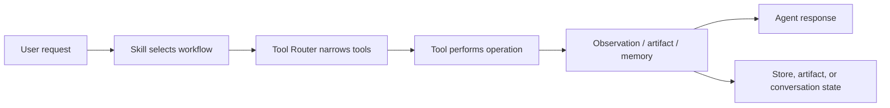
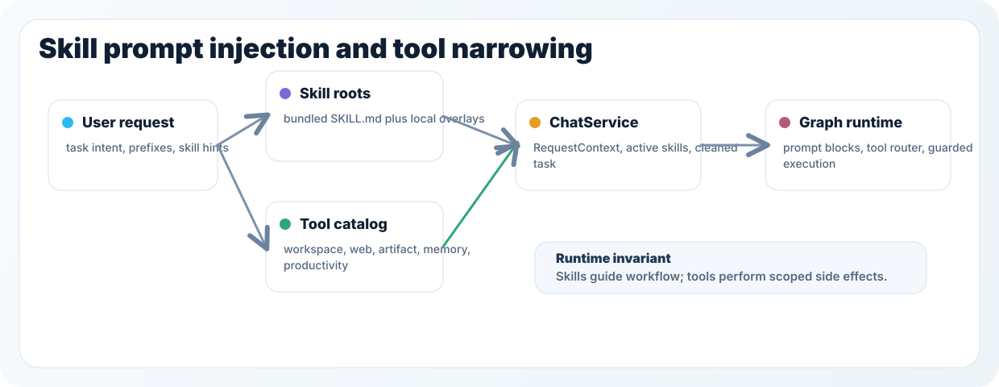
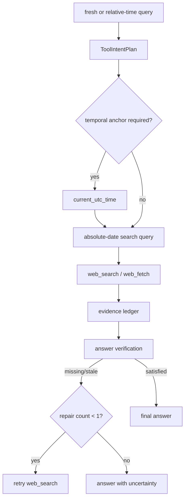
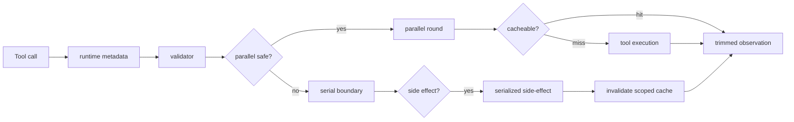
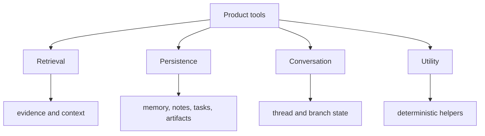
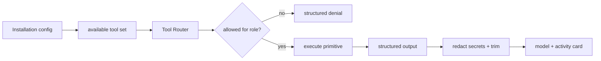

# Tool and Skill System Design

更新时间：2026-06-25

This document defines the current boundary between low-level tools and higher-level skills in Focus Agent, the runtime shape of the skill system, and the remaining product-tool backlog.

## Goals

- Keep tools small, safe, auditable, and easy to test.
- Let skills describe reusable workflows instead of hardcoding workflows into tools.
- Let administrators manage Skill availability from the settings surface instead of editing code or deleting local files.
- Add product capabilities that make the agent useful in normal conversations, not only codebase work.
- Preserve Focus Agent's branch-aware conversation model while expanding beyond developer-only tools.

## Non-goals

- Do not add an unrestricted shell tool as a general escape hatch.
- Do not make every common prompt pattern into a tool.
- Do not put personal account integrations such as calendar, mail, Notion, or Lark into the default builtin tool set.
- Do not make provider-specific details part of public tool or skill names when a stable abstraction is possible.

## Core Distinction

Tools are capabilities. Skills are workflows.

A tool should answer: "What concrete operation can the agent perform?"

A skill should answer: "How should the agent approach this kind of task?"

The intended flow is:



## Tool Boundary

A tool is a narrow primitive that touches the outside world or persistent state.

Good tools:

- perform one clear operation
- have explicit inputs and structured outputs
- are scoped by workspace, user, thread, or configured provider
- can be enabled, disabled, renamed, and tested independently
- expose product capability without encoding a full business workflow

Examples:

- `web_search`: search the live web
- `web_fetch`: fetch and extract content from one URL
- `memory_save`: save an explicit memory
- `memory_search`: retrieve relevant memories
- `artifact_read`: read a saved artifact
- `tasks_create`: create a task

Poor tools:

- `competitor_analysis_tool`
- `meeting_summary_tool`
- `release_strategy_tool`
- `write_my_weekly_report_tool`

Those are workflows and should usually be skills that combine primitives.

## Reference Notes

The nearby Hermes agent and DeerFlow projects point in the same direction:

- Hermes organizes capabilities into toolsets such as web, file, skills, memory, todo, browser, and terminal. The useful lesson for Focus Agent is tool grouping and explicit toolset boundaries, not adopting every high-power tool by default.
- DeerFlow describes its core toolset as web search, web fetch, file operations, and bash execution, while skills remain structured Markdown workflows. The useful lesson is that web fetch is a first-class primitive and skills should stay progressively loaded.

Focus Agent should stay smaller by default: no unrestricted bash, no browser/computer control, and no account-backed connectors in the builtin baseline.

The concrete borrowing from Hermes is the toolset boundary itself. Focus Agent now
derives a toolset catalog from runtime metadata and exposes it through
`/v1/agent/toolsets`, so UI and governance code can inspect groups such as
`workspace`, `web`, `artifact`, `memory`, `productivity`, and `skill` without
duplicating a parallel registry. The catalog summarizes tool names, providers,
risk levels, roles, policies, network use, and write/side-effect flags.

## Skill Boundary

A skill is prompt-level guidance for a repeatable task pattern. It can decide when and how to combine tools, but it should not claim hidden capabilities that the runtime cannot provide.

Good skills:

- define a workflow, decision standard, or output format
- reference real tools exposed by the runtime
- stay concise because active skill text is injected into the system prompt
- work across projects when placed in builtin skills
- capture personal or team-specific conventions when placed in local skills

Examples:

- `research`: use `web_search`, `web_fetch`, and artifacts to answer evidence-dependent questions
- `meeting-notes`: save meeting notes and create tasks from action items
- `personal-assistant`: decide whether information belongs in memory, notes, tasks, or an artifact
- `writing-plans`: create and update implementation plans as artifacts
- `release-readiness`: apply the repository's release checklist and produce a readiness report

## Skill Runtime

Focus Agent's skill runtime is prompt-first and local-first. It supports discovery, activation, prompt injection, and basic inspection tools without introducing a remote skills marketplace or hidden multi-agent orchestration.

### Directory layout

- Python runtime: `src/focus_agent/skills/`
- Bundled skills: `src/focus_agent/skills/builtin/<skill>/SKILL.md`
- Optional local overlays: `FOCUS_AGENT_SKILLS_DIRS` or the default `.focus_agent/skills`
- Admin-managed local settings: `.focus_agent/local.env`

Bundled skills are versioned with the repo so the agent has a stable baseline even when no local skills exist. Local overlays are intended for per-user or per-maintainer workflows and are typically kept out of git.

### Skill document format

Each skill is a directory containing `SKILL.md` with simple YAML-like frontmatter:

```md
---
name: plan
description: Planning-only mode for decomposition and sequencing
triggers: plan:
when_to_use: The user wants a plan first, The work has multiple phases
prompt_mode: explore
---
```

Supported metadata in this iteration:

- `name`
- `description`
- `triggers`
- `when_to_use`
- `prompt_mode`
- `primary_tools`
- `recommended_tools`
- `aliases`
- `domains`
- `entrypoints`

The parser is intentionally minimal and optimized for bundled skills plus straightforward local overrides.

### Runtime flow

1. `SkillRegistry` scans configured roots plus bundled skills and builds an in-memory index.
2. The registry keeps the full catalog visible but marks globally disabled or individually disabled skills as inactive.
3. Skills activate through API `skill_hints`, semantic matching, or prefix triggers such as `plan:` and `review:` only when the Skill system and the target skill are enabled.
4. `ChatService` resolves active skills, writes skill hints into `RequestContext`, persists `active_skill_ids`, and uses the cleaned task as `task_brief`.
5. `graph_builder` asks the registry for available-skill and active-skill prompt blocks.
6. `context_policy` renders those blocks into the final system prompt alongside scene, branch scope, memory, and findings.



### Executable Skill entrypoints

Skills can opt into declared execution through `run_skill_entrypoint`. This is
the only Skill path that should run a local script automatically. A Skill
entrypoint declares command, dependencies, network need, timeout, memory, and
output directory behavior in the Skill metadata:

```yaml
prompt_mode: execute
primary_tools: [run_skill_entrypoint]
recommended_tools: [run_skill_entrypoint, read_file, write_text_artifact]
entrypoints:
  analyze:
    command: ["python3", "scripts/run_analysis.py"]
    dependencies: ["pandas", "numpy"]
    network: false
    timeout_seconds: 300
    memory_mb: 1024
    output_dir_arg: --output-dir
```

Runtime rules:

- `run_skill_entrypoint` only accepts declared entrypoints on trusted, enabled Skills.
- Script paths must stay inside the Skill directory; absolute host paths, `python -c`, and undeclared entrypoints are rejected.
- Declared dependencies are installed inside the sandbox cache or the local development fallback venv, not into the real repository.
- The normal workspace mode is `thread_persistent_copy`: the sandbox sees a copied workspace that persists across turns for the same `sandbox_id`; writes do not automatically sync back to git.
- Docker success can satisfy the Skill execution contract. `local_venv`, dependency errors, timeouts, and non-zero exits are observations and must not be counted as secure Docker success.
- The local Skill execution inventory is tracked in [skill-execution-matrix.md](skill-execution-matrix.md). Script-backed Skills must have declared entrypoints; host-control Skills must use a broker or explicit high-risk approval instead of the general sandbox.

The detailed execution contract is maintained in [sandbox-execution.md](sandbox-execution.md).

### Built-in skills

Current bundled skills:

- `autopilot`
- `codebase-inspection`
- `code-documentation`
- `eco`
- `node-inspect-debugger`
- `one-three-one-rule`
- `plan`
- `python-debugpy`
- `research`
- `ralph`
- `rest-graphql-debug`
- `review`
- `security-review`
- `spike`
- `systematic-debugging`
- `tavily-search`
- `tdd`
- `ultrawork`
- `writing-plans`

These skills intentionally steer behavior that the current runtime can already support. For example, `ultrawork` encourages workstream decomposition, but it does not claim hidden sub-agent execution.

### Admin configuration surface

Skill availability is intentionally managed through Admin settings rather than by deleting files:

- `GET /v1/admin/config` returns a `skills` section with global enablement, source settings, disabled ids, semantic-match settings, catalog entries, and summary counts.
- `PATCH /v1/admin/config/skills` updates the global Skill switch, directories, install directory, disabled ids, per-skill enabled state, and semantic-match controls.
- `POST /v1/admin/config/skills/refresh` rebuilds the runtime Skill index and returns the refreshed catalog.
- `.focus_agent/local.env` is the local persistence target for `FOCUS_AGENT_SKILLS_ENABLED`, `FOCUS_AGENT_SKILLS_DIRS`, `SKILL_INSTALL_DIRECTORY`, `SKILL_DISABLED_IDS`, `SKILL_SEMANTIC_MATCH_ENABLED`, and `SKILL_SEMANTIC_MATCH_THRESHOLD`.

Disabled skills remain visible in the catalog for auditing and re-enablement, but they are skipped by search, prefix activation, semantic matching, available-skill prompt rendering, and active-skill prompt injection.

MCP-related workflows are represented as skills and tools today, for example FastMCP or mcporter workflows when installed. MCP Server lifecycle management is a reserved Admin connection surface until a first-class backend configuration contract exists.

### Current limitations

- The frontmatter parser is deliberately simple and not a full YAML implementation.
- Skill prompts are injected as plain text blocks; there is no scoring/ranking stage yet.
- The system does not yet persist skill metadata snapshots or support linked reference files.
- Semantic matching is configurable but intentionally conservative; prefix and explicit hint selection remain the most predictable activation path.
- General Skill execution is declared-entrypoint only. The runtime does not expose arbitrary shell or host socket access through the Skill system.

## Connector Boundary

Connectors are account-backed integrations. They should generally be optional and user-local.

Examples:

- calendar
- email
- cloud drive
- Notion
- Lark
- GitHub write operations

Connector-backed tools can follow the same tool rules, but they should not be enabled by default for every user because they depend on identity, permissions, and organization policy.

## Storage Boundary

Product tools should write to explicit product stores rather than hiding state in prompt text.

Recommended stores:

- Memory: small durable facts, user preferences, and reusable context.
- Notes: structured long-form records such as decisions, meeting notes, discoveries, and project context.
- Tasks: actionable items with status, due date, and optional source thread.
- Artifacts: generated documents or drafts that can be listed, read, and revised.
- Conversation state: thread, branch, merge, and summary data owned by Focus Agent.

## Builtin vs User-Local Placement

Builtin tools should be general, safe, and useful for most installations.

User-local tools or connector tools should cover personal accounts, company workflows, private systems, or high-risk permissions.

Builtin skills should describe cross-user workflows.

User-local skills should describe personal preferences, team templates, or organization-specific operating procedures.

## Current Baseline

Focus Agent already has these default tools:

- `current_utc_time`
- `write_text_artifact`
- `artifact_list`
- `artifact_read`
- `artifact_update`
- `list_files`
- `read_file`
- `search_code`
- `codebase_stats`
- `apply_patch`
- `run_workspace_command`
- `git_status`
- `git_diff`
- `git_log`
- `web_fetch`
- `memory_save`
- `memory_search`
- `memory_forget`
- `conversation_summary`
- `web_search`
- `skills_list`
- `skill_view`
- `skill_sources`
- `skills_search`
- `skills_refresh_index`
- `skill_install`
- `notes_create`
- `notes_search`
- `notes_update`
- `tasks_create`
- `tasks_list`
- `tasks_update`
- `productivity_capture`

The newer product primitives make the agent useful beyond repository work:
explicit memory control, URL reading, artifact iteration, conversation
summarization, and owner-scoped notes/tasks capture.

The runtime also exposes a grouped view of those primitives:

- `workspace`: repository file, code search, code editing, command execution, and git inspection tools
- `web`: live search and URL retrieval tools
- `artifact`: generated document and draft iteration tools
- `memory`: durable memory and conversation recovery tools
- `productivity`: owner-scoped notes/tasks/capture tools
- `skill`: bundled and local workflow inspection tools

Web retrieval keeps a separate access-policy boundary. `web_fetch` only accepts
HTTP(S), always blocks localhost, private, reserved, link-local, and `.local`
hosts, and can be narrowed further with `blocked_domains` and `allowed_domains`
in `.focus_agent/tools.toml`. Blocked fetches emit structured policy metadata
such as category, host, and matching rule so trajectory and UI surfaces can
explain the denial.

### Live Web Research Contract

Fresh external questions are handled as an execution contract, not only as a
tool availability hint. When the graph classifies a turn as `live_web_research`,
it requires `web_search` evidence and uses `current_utc_time` first when the
query contains relative time.



Current rules:

- Relative markers such as "today", "tomorrow", "yesterday", "this week",
  "今天", "明天", "昨天", and "本周" require a time anchor when
  `current_utc_time` is available.
- The search query is rewritten with the original query, current UTC timestamp,
  absolute date/range, and detected location/scope so providers do not guess the
  time window from their own clock.
- Evidence normalization only keeps web tool results relevant to the latest
  user query when multiple web searches happen in the same turn.
- Missing evidence maps to `call_missing_tool`; stale dated evidence maps to
  `refresh_stale_evidence`; simple contradictions map to
  `revise_answer_from_evidence`.
- The graph retries a stale/missing live-web answer once with `web_search`.
  If repair cannot produce reliable evidence, it returns an explicit
  uncertainty answer instead of unsupported realtime claims.

## Tool Runtime Policy

Tool execution is mediated by runtime metadata rather than ad hoc logic in each graph node.

The runtime policy keeps scheduling, cache reuse, side effects, and observation trimming outside individual tool implementations. Tools describe their behavior; the runtime applies the common execution rules.



- `parallel_safe` read-only tools can run in the same tool round concurrently.
- `cacheable` tools may reuse deterministic observations within their declared scope.
- `validator` failures return a `validation_error` tool result and do not invoke the tool, use fallback, or write cache.
- `side_effect` tools keep a serial boundary even if marked `parallel_safe`; successful writes invalidate the current turn/thread/branch namespaces and runtime metadata records `side_effect_serialized`.
- `fallback_group` and `fallback_handler` keep provider fallback behind the stable public tool name.
- Timeout and upstream cancellation bypass fallback and cache, and runtime metadata records `timeout_seconds` or `cancelled`.
- Runtime observations are trimmed by per-tool limits before being returned to the model.

Cache scopes are intentionally conservative:

- `turn` is for values that should only survive within one user turn. The namespace includes the root thread and turn id, so parallel conversations do not clear each other.
- `thread` is the default for workspace read tools such as `list_files`, `read_file`, `search_code`, and `codebase_stats`. Focus Agent conversation branches do not imply separate filesystem or git worktrees, so these reads should not become branch-local by default.
- `branch` is reserved for future tools that read or write branch-local product state.

Productivity tools do not introduce a separate cache scope. They are grouped by
the `productivity` toolset and operate on owner-scoped notes/tasks state; reads
are parallel-safe, while writes are side-effecting and serialized by the
runtime.

Execution control is enforced by the runtime, not by individual tools. Hard deadlines and upstream cancellation are treated as release-sensitive behavior: they fail the tool call without fallback so a slow or cancelled side-effect cannot be hidden behind a secondary provider.

## Tool Protocol Isolation

Structured tool calls are the only supported way for a model to invoke tools. Textual DSML, XML-ish function-call snippets, bracketed tool markers, or internal process narration must not be rendered as assistant answer text.

The isolation boundary is shared across backend and frontend:

- `src/focus_agent/core/tool_protocol.py` identifies textual tool-call artifacts and split prefixes.
- `src/focus_agent/transport/stream_events.py` extracts structured visible, reasoning, and tool-call payloads from provider chunks.
- `src/focus_agent/api/routers/harness_runs.py` gates `message.delta` by internal stream phase and keeps missing phase metadata quarantined.
- `frontend-sdk/src/toolProtocol.ts` and `frontend-sdk/src/reducers.ts` provide the SDK defensive layer for replayed streams and older servers.

For the full public event contract and validation commands, see [streaming-contract.md](streaming-contract.md).

## Product Tool Taxonomy

Product tools should be grouped by the kind of user-visible state or evidence they handle. This taxonomy keeps primitive operations separate from skills that decide when to combine them.



### Retrieval Tools

Retrieval tools gather information from external or local sources.

- `web_search`
- `web_fetch`
- `knowledge_search`
- `memory_search`
- `notes_search`
- `tasks_list`
- `artifact_search`
- `workspace_search`

`memory_search`, `artifact_search`, and `workspace_search` use the shared
`RetrievalIndex` by default. Zvec provides candidate retrieval only; each
tool hydrates canonical memory rows, artifact metadata/body, or workspace file
hashes before returning content to the model.

### Persistence Tools

Persistence tools save or update user-visible state.

- `memory_save`
- `memory_forget`
- `notes_create`
- `notes_update`
- `tasks_create`
- `tasks_update`
- `productivity_capture`
- `artifact_write`
- `artifact_update`
- `apply_patch`
- `run_workspace_command`

### Conversation Tools

Conversation tools operate on Focus Agent's own thread and branch model.

- `conversation_summary`
- `conversation_export`
- `branch_tree_inspect`
- `merge_proposal_inspect`

### Utility Tools

Utility tools provide deterministic helper capabilities.

- `current_utc_time`
- `structured_compute`
- `template_apply`

## Implemented Product Primitives

The first general-agent batch is now part of the baseline:

- Artifact iteration: `write_text_artifact`, `artifact_list`, `artifact_read`, `artifact_update`
- Workspace code work: `list_files`, `read_file`, `search_code`, `codebase_stats`, `apply_patch`, `run_workspace_command`, `git_status`, `git_diff`, `git_log`
- Web retrieval: `web_search`, `web_fetch`
- Zvec-backed retrieval: `memory_search`, `artifact_search`, `workspace_search`
- Explicit memory control: `memory_save`, `memory_forget`
- Productivity workbench: `notes_create`, `notes_search`, `notes_update`, `tasks_create`, `tasks_list`, `tasks_update`, `productivity_capture`
- Conversation recovery: `conversation_summary`
- Skill discovery and installation: `skills_list`, `skill_view`, `skill_sources`, `skills_search`, `skills_refresh_index`, `skill_install`

These capabilities are still primitives. For example, `research` decides how to gather and synthesize evidence, while `web_search`, `web_fetch`, and artifact tools perform the concrete operations.

Current bundled skills already consume these primitives:

- `research` uses `web_search`, `web_fetch`, and artifacts for evidence-backed answers.
- `writing-plans` uses artifact list/read/update for iterative plans.
- `autopilot` may save durable deliverables as artifacts and use memory for explicit durable facts.
- future assistant workflows can combine notes/tasks primitives without hiding
  product state in prompt text.

## Backlog

Notes and tasks are now first-class product data with explicit storage, API,
tests, UI affordances, SDK methods, and tool primitives. The remaining backlog
is workflow quality on top of those stores:

- richer task event summarization and task filters,
- note/task backlinks from conversations, Agent Team outputs, and artifacts,
- skills that decide when to save to memory versus notes/tasks/artifacts,
- user-configurable retention and archive policies.

Potential future skills:

- `personal-assistant`: route requests to memory, notes, tasks, or artifacts.
- `meeting-notes`: turn notes into action items using notes and tasks tools.
- `project-catchup`: summarize a conversation and save follow-up tasks or notes.

## Permission and Safety Rules

Tool safety is enforced at multiple boundaries: configuration controls whether a tool exists, routing controls whether the current role can see it, and the tool output controls what is exposed back to the model and UI.



- Read tools should be explicit about scope and truncation.
- Write tools should return stable ids or paths for follow-up turns.
- Code-modifying and workspace-command tools should require approval, stay inside the workspace root, avoid shell execution, and use allowlists for local commands.
- Destructive tools should either be explicit privacy controls, such as `memory_forget`, or use reversible and soft-delete behavior first.
- Connector tools should default off and require user configuration.
- Tools should emit structured tool events so the frontend can show clear activity cards.
- Sensitive configuration should report presence or absence, never raw secrets.

## Design Checklist for New Tools

Before adding a tool, answer:

- Is this a primitive capability rather than a workflow?
- Can a skill combine existing tools to achieve the same result?
- What persistent store does it read or write?
- What permission boundary limits the operation?
- What structured output will the model and UI consume?
- How is truncation handled?
- How is the tool disabled or configured?
- What tests prove the boundary?
