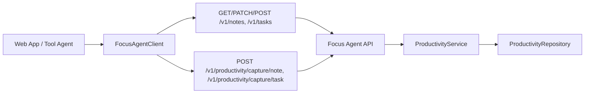

# Focus Agent Web SDK

The Focus Agent Web SDK is a typed TypeScript client for consuming the Focus Agent HTTP and SSE streaming protocol from browser or Node environments.

It is meant for teams that want a small integration surface instead of re-implementing POST-based SSE parsing, event typing, and stream state accumulation in every frontend.

- Main project README: [`../README.md`](../README.md)
- Chinese README: [`../README.zh-CN.md`](../README.zh-CN.md)
- Streaming contract: [`../docs/streaming-contract.md`](../docs/streaming-contract.md)

## Why This SDK Exists

Focus Agent streams more than a final assistant message. A real client often needs to deal with:

- token-by-token visible text updates
- separate reasoning and tool-call channels
- tool lifecycle events
- terminal turn states
- authenticated POST requests that return SSE streams

This SDK packages those concerns into a small, typed client layer.

## Features

- `FocusAgentClient` for authenticated JSON requests and POST-based SSE streaming
- Conversation, branch tree, branch action, and merge review request helpers
- Admin settings helpers for model, tool, policy, and Skill configuration
- Branch decision config/list/promote/dismiss helpers for AI-assisted branch recommendations
- Agent governance helpers for skill selection, preference feedback, feedback trend summaries, role/tool/model routing, context, task ledger, critic, and review queue surfaces
- Productivity request helpers for notes/tasks/capture, including task lifecycle actions and event list
- Trajectory observability helpers for overview/list/detail/stats/replay/promote plus batch promote-preview and replay-compare flows
- Agent role-routing helpers for policy inspection, dry-run decisions, and trajectory decision review
- Strongly typed event names and payloads
- SSE parser for `fetch(..., { method: "POST" })` response bodies
- Reducer helpers for accumulating stream state
- Type guards for common event routing paths
- `FocusAgentRequestError` for structured HTTP failure handling

## Package Layout

- `src/client.ts` - `FocusAgentClient` facade and endpoint mixin registration
- `src/client/` - domain endpoint modules for auth, admin, agent-team, agent-governance, thread/branch, productivity, observability, and streaming
- `src/transport.ts` - shared HTTP/SSE transport, token resolution, `fetchImpl`, and abort handling
- `src/errors.ts` - structured request error type
- `src/types.ts` - public type barrel
- `src/types/` - domain request, response, event, branch, and stream state types
- `src/types/__generated__.ts` - OpenAPI-generated schema types produced from `docs/api/openapi.json`; this is a drift guard and not the primary public barrel today
- `src/toolProtocol.ts` - shared filtering for textual tool-call and internal process artifacts
- `src/parser.ts` - low-level SSE frame parsing and event decoding
- `src/reducers.ts` - stream state helpers for UI state accumulation
- `src/guards.ts` - convenient event type guards
- `src/transport.validation.ts` - compile-time and runtime validation checks for the transport surface
- `src/index.ts` - public exports
- `tsconfig.validation.json` - validation-only TypeScript project for transport checks

## Install And Build

This package currently lives inside the main repository and is built locally:

```bash
pnpm install --registry=https://registry.npmjs.org
make sdk-check
make sdk-build
make sdk-openapi-types-check
pnpm --dir frontend-sdk validate:transport
```

When working only inside `frontend-sdk/`, `pnpm --dir frontend-sdk check` and `pnpm --dir frontend-sdk build` are still valid package-local commands. Repository changes should prefer the root `make sdk-*` targets so the same checks run as CI and release gates.

When API routes or backend Pydantic contract models change, regenerate and check the OpenAPI-derived types:

```bash
make sdk-generate-types
make sdk-openapi-types-check
```

The generated files are part of the repository contract. Commit
`docs/api/openapi.json` and `frontend-sdk/src/types/__generated__.ts` whenever
this check produces a diff; if the public SDK barrel or Web SDK imports changed,
also update `tests/contracts/frontend_sdk.json` through
`uv run python scripts/check_contracts.py --update`.

Requirements:

- Node.js 20+
- A Focus Agent server to connect to

## Quick Start

```ts
import { FocusAgentClient } from "@focus-agent/web-sdk";

const client = new FocusAgentClient({
  baseUrl: "http://127.0.0.1:8000",
});

const token = await client.createDemoToken({ user_id: "researcher-1" });
client.setToken(token.access_token);

const stream = await client.streamTurn({
  thread_id: "main-1",
  message: "Research this topic and branch only if needed.",
});

const finalState = await client.collectStream(stream, {
  onMessageDelta(event) {
    console.log("message", event.data.delta);
  },
  onReasoningDelta(event) {
    console.log("reasoning", event.data.delta);
  },
  onToolCallDelta(event) {
    console.log("tool-call", event.data.name, event.data.args_delta);
  },
  onToolEvent(event) {
    console.log("tool", event.event, event.data.tool_name);
  },
  onCompleted(event) {
    console.log("completed", event.data.thread_state);
  },
});

console.log(finalState.visibleText);
```



## Client API

`FocusAgentClient` currently exposes these main methods:

- `register()`, `login()`, `logout()`, `refresh()`, and `changePassword()` - manage authenticated user sessions
- `createDemoToken()` and `getPrincipal()` - request a local development token and inspect the authenticated principal
- `listMySessions()` and `revokeSession()` - inspect or revoke the current user's sessions
- `getAdminConfig()`, `updateAdminModelConfig()`, `updateAdminToolConfig()`, `updateAdminPolicyConfig()`, `updateAdminSkillConfig()`, and `refreshAdminSkillConfig()` - administer model connections, tools, policies, and Skill enablement
- `listUsers()`, `createUser()`, `getUser()`, `updateUser()`, `updateUserStatus()`, `updateUserRoles()`, `listUserSessions()`, `revokeUserSession()`, `resetUserPassword()`, and `listAuditEvents()` - administer users, sessions, passwords, and audit events
- `listModels()` - fetch the current model catalog
- `getAgentRolePolicy()`, `dryRunAgentRoleRoute()`, `listAgentRoleDecisions()`, `selectAgentSkills()`, `listAgentSkillSelections()`, `sendAgentSkillSelectionFeedback()`, `getAgentSkillCatalog()`, `updateAgentSkillPreference()`, and `getAgentFeedbackTrend()` - inspect role routing policy, preview orchestrator decisions, review persisted role_route_plan records, manage skill selection evidence, and read governance feedback trend summaries
- `listAgentCapabilities()`, `routeAgentTools()`, `listAgentToolRouteDecisions()`, `getAgentMemoryCuratorPolicy()`, `evaluateAgentMemoryCurator()`, and `listAgentMemoryCuratorDecisions()` - inspect governance capabilities, tool routing, and memory curator decisions
- `getAgentDelegationPolicy()`, `planAgentDelegation()`, `listAgentDelegationRuns()`, `getAgentModelRouterPolicy()`, `routeAgentModel()`, `listAgentModelRouterDecisions()`, `listAgentSelfRepairFailures()`, `previewAgentSelfRepairPromotion()`, `listAgentReviewQueue()`, `approveAgentReviewQueueItem()`, and `rejectAgentReviewQueueItem()` - inspect delegated role runs, model routing, failure candidates, and human-review queue items
- `getAgentContextPolicy()`, `previewAgentContext()`, `listAgentContextDecisions()`, and `listAgentContextArtifacts()` - inspect Context Engineering v2 budget decisions, compression previews, and artifact refs
- `getAgentTaskLedgerPolicy()`, `planAgentTaskLedger()`, `listAgentTaskLedgerRuns()`, `listAgentArtifacts()`, `synthesizeAgentArtifacts()`, `listAgentCriticVerdicts()`, and `evaluateAgentCriticGate()` - inspect task ledger runs, delegated artifacts, synthesis previews, and critic gate verdicts
- `createAgentTeamSession()`, `listAgentTeamSessions()`, `getAgentTeamSession()`, `getAgentTeamSessionView()`, `planAgentTeamSession()`, `runAgentTeamSession()`, `cancelAgentTeamSession()`, `dispatchAgentTeamSession()`, `createAgentTeamTask()`, `listAgentTeamTasks()`, `getAgentTeamTaskStatus()`, `updateAgentTeamTask()`, `runAgentTeamTask()`, `retryAgentTeamTask()`, `cancelAgentTeamTask()`, `recordAgentTeamTaskOutput()`, `prepareAgentTeamMergeBundle()`, and `recordAgentTeamMergeDecision()` - manage Agent Team sessions, tasks, outputs, execution, cancellation, retry, and merge decisions
- `listConversations()`, `createConversation()`, `renameConversation()`, `archiveConversation()`, `activateConversation()` - manage conversation shells
- `getThreadState()` - fetch the current thread payload used by the app, including optional `context_usage`
- `getThreadResolution()` - resolve a root or child thread id to its canonical root, source thread, branch id, and branch status
- `previewThreadContext()` and `compactThreadContext()` - estimate the current thread context window with an optional draft message, or trigger non-destructive compaction for the active branch
- `getBranchDecisionConfig()`, `listThreadBranchDecisions()`, `promoteBranchDecision()`, and `dismissBranchDecision()` - inspect and manage persisted branch decision/recommendation events
- `executeBranchAction()` and `dismissBranchAction()` - accept or dismiss proposed branch actions
- `getBranchTree()` - fetch the branch tree for a root or child thread id; the server resolves child ids to the canonical root
- `forkBranch()`, `renameBranch()`, `archiveBranch()`, `activateBranch()` - manage branch records
- `prepareMergeProposal()` and `applyMergeDecision()` - drive merge review workflows
- `listNotes()`, `createNote()`, `getNote()`, and `updateNote()` - notes CRUD/ownership operations
- `listTasks()`, `createTask()`, `updateTask()`, `completeTask()`, and `archiveTask()` - tasks lifecycle CRUD
- `listTaskEvents()` - inspect task event timeline
- `captureNote()` and `captureTask()` - capture note/task payload from chat/tool contexts
- `getObservabilityOverview()`, `listTrajectoryTurns()`, `getTrajectoryTurn()`, and `getTrajectoryStats()` - inspect runtime readiness and Postgres-backed trajectory observability data
- `replayTrajectoryTurn()` and `promoteTrajectoryTurn()` - preview replay and dataset promotion payloads for a trajectory turn
- `batchPromoteTrajectoryTurnsPreview()` and `batchReplayCompareTrajectoryTurns()` - run non-writing batch promotion previews and replay comparisons for selected trajectory turns
- `streamTurn()` - stream a new chat turn
- `streamResume()` - continue from an interrupt or resume payload
- `streamHarnessRun()`, `streamHarnessRunEvents()`, `cancelHarnessRun()`, and `cancelThreadHarnessRuns()` - work with harness run streams and cancel either one run or the active runs for a thread
- `collectStream()` - iterate a stream and accumulate a final derived state
- `setToken()` - update the bearer token in memory

Authentication can be provided either by:

- passing `token` in the constructor
- calling `setToken(...)`
- providing `getToken()` for lazy or async token resolution

You can also override `fetch` with `fetchImpl` when integrating in custom runtimes or tests.

`streamTurn()` and `streamResume()` also accept an optional `AbortSignal` wrapper so UI code can cancel in-flight streams cleanly.

## Event Model

Common event families:

- `message.*`
- `reasoning.*`
- `tool.call.delta`
- `tool.requested`
- `tool.result`
- `tool.error`
- `task.update`
- `state.update`
- `run.*`

When a pre-turn branch recommendation creates a pending Branch Action, a stream
may complete without visible deltas: `message.completed` can use
`source="branch_recommendation"`, and `run.completed` can carry
`branch_action` and an extra `branch_decision` payload field. Treat that as a
terminal turn and render the returned Branch Action through the same state path
as `getThreadState()`.

Branch decision and Branch Action payloads may include `diagnostic`,
`metadata.reason`, `source_decision_status`, `source_decision_mode`, and
`recommendation_user_visible`. A value of `recommendation_user_visible=false`
means the event is audit-only; UI code should show the diagnostic if helpful but
not expose a confirm button for that event.

Recommended usage:

- Normal chat UI: render `message.delta` and `message.completed`
- Debug panels: also render `reasoning.*`
- Tooling consoles: consume `tool.call.delta`, `tool.requested`, `tool.result`, `tool.error`, and `task.update`
- State panels: watch `state.update` during streamed turns
- Completion handling: watch `run.completed`, `run.failed`, and `run.closed`
- Shutdown handling: watch `server_shutdown` and reconnect or resume according
  to the caller's policy

Canonical event names:

```text
run.metadata
run.status
run.completed
run.failed
run.interrupt
run.closed
server_shutdown
heartbeat
state.update
message.delta
message.completed
reasoning.delta
tool.call.delta
tool.requested
tool.error
tool.result
task.update
```

`message.delta` and `message.completed` are the only assistant-answer text events. Tool planning, tool calls, task progress, and internal graph state should be rendered from `tool.*`, `task.update`, `reasoning.delta`, and `state.update` rather than mixed into visible text. `tool.call.delta` uses `args_delta` for streamed arguments and omits optional `id` / `name` fields when they are unknown.

## Reducers And Guards

The package includes lightweight helpers for common UI wiring.

Reducer helpers:

- `createInitialStreamState()`
- `reduceStreamEvent()`

The derived stream state tracks:

- `visibleText`
- `reasoningText`
- `toolCalls`
- `toolEvents`
- `processingSteps`
- `activePhase`
- `interrupts`
- `branchActions`
- `latestTurnState`
- `isClosed`
- `failed`

`processingSteps` is the canonical derived input for processing cards. `branchActions`
is the stream-derived branch action list; the current Web app merges it with
`ThreadStateResponse.branch_actions` before rendering transcript cards.
`toolCalls`, `toolEvents`, and `reasoningText` are retained as raw/debug/backcompat
state. New UI code should not rebuild processing cards from raw tool events when
`processingSteps` is available.

Visible text is filtered through `safeVisibleTextTransition()` so DSML, XML-ish function-call text, bracketed tool markers, and internal process narration do not flash in normal chat UI. This frontend filtering is defensive; the backend remains responsible for not publishing dirty `message.delta` events.

Type guards:

- `isMessageDeltaEvent()`
- `isReasoningDeltaEvent()`
- `isToolCallDeltaEvent()`
- `isToolLifecycleEvent()`
- `isTerminalEvent()`

## Low-Level Streaming

If you want to build your own state store, you can work directly with the lower-level parser utilities:

- `parseSSEFrames()` - split raw SSE text into parsed frames
- `decodeEvent()` - decode a parsed frame into a typed event
- `iterSSEEvents()` - iterate `ReadableStream<Uint8Array>` as Focus Agent events

This is useful when you want custom buffering, tracing, analytics, or framework-specific adapters.

## Example Integration Pattern

```ts
import {
  FocusAgentClient,
  createInitialStreamState,
  reduceStreamEvent,
  isTerminalEvent,
} from "@focus-agent/web-sdk";

const client = new FocusAgentClient({
  baseUrl: "http://127.0.0.1:8000",
  getToken: async () => localStorage.getItem("focus-agent-token"),
});

const stream = await client.streamTurn({
  thread_id: "main-1",
  message: "Summarize the current branch state.",
});

let state = createInitialStreamState();

for await (const event of stream) {
  state = reduceStreamEvent(state, event);

  if (isTerminalEvent(event)) {
    break;
  }
}
```

## Development

Common local commands:

```bash
pnpm --dir frontend-sdk install
pnpm --dir frontend-sdk check
pnpm --dir frontend-sdk build
pnpm --dir frontend-sdk validate:transport
```

From the repository root:

```bash
make sdk-install
make sdk-check
make sdk-build
make sdk-validate-transport
make contract-check
make sdk-openapi-types-check
```

`pnpm --dir frontend-sdk validate:transport` uses `tsconfig.validation.json` and `src/transport.validation.ts` to exercise the transport surface outside the production build project.

## Notes

- This SDK is intentionally small and focused on the current Focus Agent protocol.
- Branch, conversation, merge proposal, imported-conclusion, Agent Team, productivity, agent role-routing, and trajectory observability types are exported from `src/types.ts` for frontend consumers.
- HTTP request failures throw `FocusAgentRequestError`, which includes `status` and `statusText`.
- `make contract-check` tracks the SDK public surface, package exports, stream event names, and Web App imports from `@focus-agent/web-sdk`; intentional SDK/API drift should include the contract snapshot diff in review.
- `make sdk-openapi-types-check` tracks `docs/api/openapi.json` and `src/types/__generated__.ts`; intentional backend schema drift should include the regenerated OpenAPI and generated-type diff in review.
